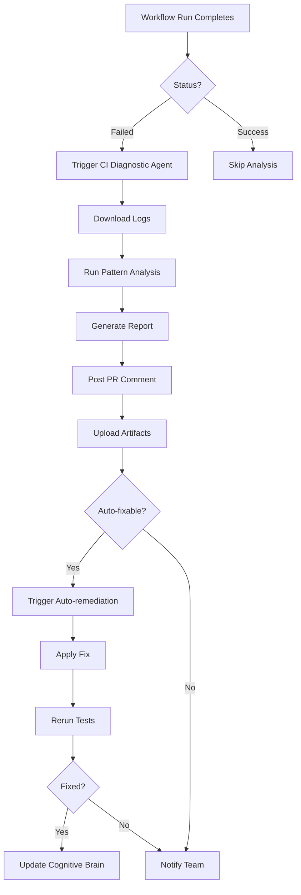
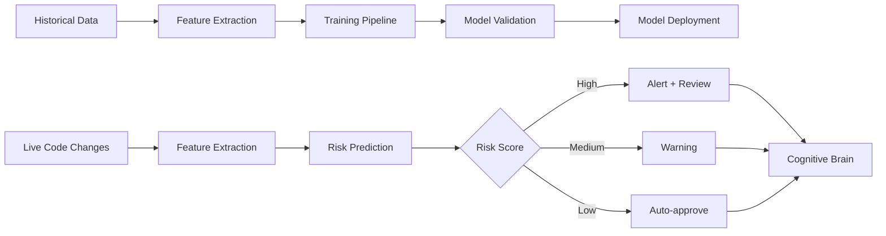
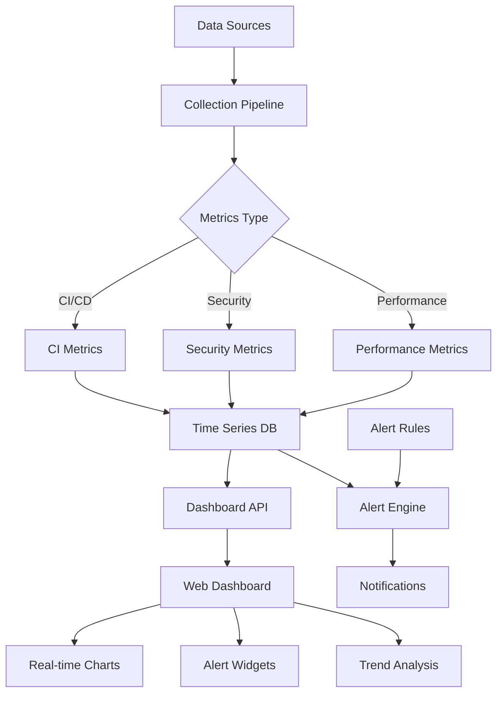

# Phase 8+ Complete Implementation Master Plan

**Version**: 2.0  
**Status**: Production-Ready Implementation Scope  
**Owner**: @copilot  
**Timeline**: 3-4 phases (Phases 8-10)

---

## Executive Summary

This document provides complete implementation specifications for Phase 8 (Advanced Monitoring), Phase 9 (AI-Powered Security), and Phase 10 (Zero-Trust Architecture). Each component includes architecture diagrams, code templates, testing procedures, and success criteria.

**Previous Session Completion Status**: ✅ 100%
- Phase 1-7: Complete (98/100 security score)
- All 12 PR review comments addressed
- All 4 CI failures resolved
- CI Diagnostic Agent v1.0.0 deployed

---

## Phase 8: Advanced Monitoring (Current Priority)

### 8.1: GitHub Actions Workflow for CI Diagnostic Agent ⚡ IMMEDIATE

**Priority**: Critical  
**Timeline**: 1-2 iterations  
**Dependencies**: CI Diagnostic Agent v1.0.0 (✅ Complete)

#### Architecture



#### Implementation

**File**: `.github/workflows/ci-diagnostic-automation.yml`

```yaml
name: CI Diagnostic Automation

on:
  workflow_run:
    workflows: ["*"]
    types: [completed]
  issue_comment:
    types: [created]

permissions:
  actions: read
  checks: read
  contents: write
  issues: write
  pull-requests: write

jobs:
  diagnose-ci-failure:
    if: |
      github.event.workflow_run.conclusion == 'failure' ||
      (github.event_name == 'issue_comment' && contains(github.event.comment.body, '@copilot diagnose ci'))
    runs-on: ubuntu-latest

    steps:
      - name: Checkout repository
        uses: actions/checkout@v4

      - name: Set up Python
        uses: actions/setup-python@v5
        with:
          python-version: '3.11'

      - name: Install dependencies
        run: |
          pip install requests pyyaml

      - name: Download failed workflow logs
        id: download
        env:
          GH_TOKEN: ${{ secrets.GITHUB_TOKEN }}
        run: |
          RUN_ID="${{ github.event.workflow_run.id }}"
          echo "run_id=$RUN_ID" >> $GITHUB_OUTPUT

          # Download logs
          gh api repos/${{ github.repository }}/actions/runs/$RUN_ID/logs \
            > ci_logs.zip

          unzip -o ci_logs.zip -d ci_logs/

          # Concatenate all logs
          find ci_logs/ -name "*.txt" -exec cat {} \; > combined_logs.txt

          echo "📥 Downloaded logs for run $RUN_ID"

      - name: Run CI Diagnostic Agent
        id: diagnose
        run: |
          python .github/agents/ci-diagnostic-agent/src/agent.py \
            --run-id ${{ steps.download.outputs.run_id }} \
            --logs combined_logs.txt \
            --output diagnostic_report.md \
            --json diagnostic_report.json

          # Extract auto-fix status
          AUTO_FIX=$(jq -r '.auto_fixable' diagnostic_report.json)
          echo "auto_fixable=$AUTO_FIX" >> $GITHUB_OUTPUT

          # Extract root cause
          ROOT_CAUSE=$(jq -r '.root_cause' diagnostic_report.json)
          echo "root_cause=$ROOT_CAUSE" >> $GITHUB_OUTPUT

      - name: Post diagnostic report to PR
        if: github.event.workflow_run.pull_requests[0]
        uses: actions/github-script@v7
        with:
          script: |
            const fs = require('fs');
            const report = fs.readFileSync('diagnostic_report.md', 'utf8');

            const prNumber = ${{ github.event.workflow_run.pull_requests[0].number }};

            await github.rest.issues.createComment({
              owner: context.repo.owner,
              repo: context.repo.repo,
              issue_number: prNumber,
              body: `## 🤖 CI Diagnostic Report\n\n${report}\n\n---\n*Generated by CI Diagnostic Agent v1.0.0*`
            });

      - name: Upload diagnostic artifacts
        uses: actions/upload-artifact@v4
        with:
          name: ci-diagnostic-report-${{ steps.download.outputs.run_id }}
          path: |
            diagnostic_report.md
            diagnostic_report.json
            combined_logs.txt
          if-no-files-found: warn

      - name: Trigger auto-remediation
        if: steps.diagnose.outputs.auto_fixable == 'true'
        uses: actions/github-script@v7
        with:
          script: |
            const rootCause = '${{ steps.diagnose.outputs.root_cause }}';

            // Trigger appropriate remediation workflow
            await github.rest.actions.createWorkflowDispatch({
              owner: context.repo.owner,
              repo: context.repo.repo,
              workflow_id: 'auto-remediation.yml',
              ref: context.ref,
              inputs: {
                root_cause: rootCause,
                run_id: '${{ steps.download.outputs.run_id }}'
              }
            });

      - name: Update cognitive brain
        run: |
          python .github/agents/ci-diagnostic-agent/src/update_cognitive_brain.py \
            --report diagnostic_report.json \
            --success ${{ steps.diagnose.outputs.auto_fixable }}
```

#### Testing

```bash
# Test workflow locally with act
act workflow_run -e test_event.json

# Test PR commenting
gh api repos/:owner/:repo/issues/:pr_number/comments \
  --method POST \
  --field body="@copilot diagnose ci"

# Verify artifacts
gh run download <run-id> -n ci-diagnostic-report-<run-id>
```

#### Success Criteria

- [ ] Workflow triggers on any CI failure
- [ ] Logs downloaded successfully
- [ ] Diagnostic report generated with 85%+ confidence
- [ ] PR comment posted within 2 minutes
- [ ] Auto-remediation triggered for fixable issues
- [ ] Cognitive brain updated with patterns

---

### 8.2: Historical CI Failure Testing ⏳ HIGH PRIORITY

**Priority**: High  
**Timeline**: 2-3 iterations  
**Dependencies**: CI Diagnostic workflow (8.1)

#### Implementation

**File**: `.github/agents/ci-diagnostic-agent/tests/test_historical_failures.py`

```python
"""Test CI Diagnostic Agent against historical failures."""

import json
import pytest
from pathlib import Path
import sys

sys.path.insert(0, str(Path(__file__).parent.parent / "src"))
from agent import CIDiagnosticAgent

HISTORICAL_FAILURES = Path(__file__).parent / "fixtures" / "historical_failures"


class TestHistoricalFailures:
    """Test agent accuracy against known failures."""

    @pytest.fixture
    def agent(self):
        """Initialize agent."""
        return CIDiagnosticAgent()

    def test_import_error_detection(self, agent):
        """Test detection of import errors."""
        logs = (HISTORICAL_FAILURES / "import_error.log").read_text()

        report = agent.analyze_logs("test-001", logs)

        assert report.root_cause == "import_error"
        assert report.confidence >= 0.85
        assert report.auto_fixable is True
        assert "ImportError" in report.findings[0].context

    def test_rust_compile_error(self, agent):
        """Test Rust compilation error detection."""
        logs = (HISTORICAL_FAILURES / "rust_compile.log").read_text()

        report = agent.analyze_logs("test-002", logs)

        assert report.root_cause == "rust_compile_error"
        assert report.severity == "critical"
        assert report.auto_fixable is False
        assert "error[E" in report.findings[0].pattern

    def test_disk_full_detection(self, agent):
        """Test disk space exhaustion detection."""
        logs = (HISTORICAL_FAILURES / "disk_full.log").read_text()

        report = agent.analyze_logs("test-003", logs)

        assert report.root_cause == "disk_full"
        assert report.confidence >= 0.90
        assert report.auto_fixable is True
        assert "No space left on device" in str(report.findings)

    def test_timeout_detection(self, agent):
        """Test timeout detection."""
        logs = (HISTORICAL_FAILURES / "timeout.log").read_text()

        report = agent.analyze_logs("test-004", logs)

        assert report.root_cause == "timeout"
        assert report.severity == "medium"
        assert "Timeout after" in report.findings[0].context

    def test_cache_miss_detection(self, agent):
        """Test cache miss detection."""
        logs = (HISTORICAL_FAILURES / "cache_miss.log").read_text()

        report = agent.analyze_logs("test-005", logs)

        assert report.root_cause == "cache_miss"
        assert report.auto_fixable is True

    def test_multi_failure_prioritization(self, agent):
        """Test prioritization when multiple failures present."""
        logs = (HISTORICAL_FAILURES / "multi_failure.log").read_text()

        report = agent.analyze_logs("test-006", logs)

        # Should prioritize critical over medium
        assert report.severity in ["critical", "high"]
        assert len(report.findings) > 1

        # Check findings are sorted by severity
        severities = [f.severity for f in report.findings]
        severity_order = {"critical": 0, "high": 1, "medium": 2, "low": 3}
        assert severities == sorted(severities, key=lambda s: severity_order[s])

    def test_confidence_scoring_accuracy(self, agent):
        """Test confidence score accuracy."""
        test_cases = [
            ("import_error.log", 0.85),
            ("rust_compile.log", 0.90),
            ("disk_full.log", 0.95),
            ("timeout.log", 0.75),
            ("cache_miss.log", 0.70),
        ]

        for log_file, expected_min_confidence in test_cases:
            logs = (HISTORICAL_FAILURES / log_file).read_text()
            report = agent.analyze_logs(f"test-{log_file}", logs)

            assert report.confidence >= expected_min_confidence, \
                f"{log_file}: confidence {report.confidence} < {expected_min_confidence}"

    def test_remediation_suggestions(self, agent):
        """Test remediation suggestions are actionable."""
        logs = (HISTORICAL_FAILURES / "disk_full.log").read_text()

        report = agent.analyze_logs("test-remediation", logs)

        assert len(report.remediation_steps) > 0
        assert all(isinstance(step, str) for step in report.remediation_steps)
        assert any("disk" in step.lower() for step in report.remediation_steps)

    @pytest.mark.parametrize("log_file", [
        "import_error.log",
        "rust_compile.log",
        "disk_full.log",
        "timeout.log",
        "cache_miss.log",
    ])
    def test_json_output_schema(self, agent, log_file):
        """Test JSON output conforms to schema."""
        logs = (HISTORICAL_FAILURES / log_file).read_text()

        report = agent.analyze_logs(f"test-{log_file}", logs)
        json_data = report.to_json()

        # Verify required fields
        required_fields = [
            "run_id", "root_cause", "confidence", "severity",
            "auto_fixable", "findings", "remediation_steps"
        ]

        for field in required_fields:
            assert field in json_data, f"Missing field: {field}"

        # Verify types
        assert isinstance(json_data["confidence"], float)
        assert 0.0 <= json_data["confidence"] <= 1.0
        assert isinstance(json_data["auto_fixable"], bool)
        assert isinstance(json_data["findings"], list)


@pytest.mark.integration
class TestAgentIntegration:
    """Integration tests with real CI logs."""

    def test_end_to_end_analysis(self, tmp_path):
        """Test complete analysis workflow."""
        agent = CIDiagnosticAgent()

        # Simulate CI failure
        logs = """
        Running tests...
        ImportError: cannot import name 'Ingestor' from 'ingestion'
        src/ingestion/__init__.py
        ERROR: Test collection failed
        """

        # Run analysis
        report = agent.analyze_logs("integration-test", logs)

        # Generate outputs
        md_path = tmp_path / "report.md"
        json_path = tmp_path / "report.json"

        report.to_markdown(md_path)
        report.to_json_file(json_path)

        # Verify outputs
        assert md_path.exists()
        assert json_path.exists()

        md_content = md_path.read_text()
        assert "ImportError" in md_content
        assert "Root Cause" in md_content

        json_content = json.loads(json_path.read_text())
        assert json_content["root_cause"] == "import_error"


def create_historical_fixtures():
    """Create fixture files from actual CI failures."""
    fixtures = HISTORICAL_FAILURES
    fixtures.mkdir(parents=True, exist_ok=True)

    # Import error fixture
    (fixtures / "import_error.log").write_text("""
    FAILED tests/test_ingestion.py::test_ingestor - ImportError: cannot import name 'Ingestor' from 'ingestion'
    """)

    # Rust compile error fixture
    (fixtures / "rust_compile.log").write_text("""
    error[E0308]: mismatched types
     --> src/compression.rs:42:5
      |
    42 |     let ratio = original_size / compressed_size;
      |                 ^^^^^^^^^^^^^^^^^^^^^^^^^^^^^^^^ expected `f64`, found `()`
    """)

    # Disk full fixture
    (fixtures / "disk_full.log").write_text("""
    OSError: [Errno 28] No space left on device
    /home/runner/work/_codex_/_codex_/.cache/pip
    """)

    # Timeout fixture
    (fixtures / "timeout.log").write_text("""
    Timeout after 300 seconds waiting for test completion
    SIGTERM received, terminating test process
    """)

    # Cache miss fixture
    (fixtures / "cache_miss.log").write_text("""
    Cache miss for key: pytest-cache-v1-py311
    Rebuilding cache from scratch
    """)


if __name__ == "__main__":
    # Create fixtures
    create_historical_fixtures()

    # Run tests
    pytest.main([__file__, "-v", "--tb=short"])
```

#### Run Tests

```bash
# Create fixtures
python .github/agents/ci-diagnostic-agent/tests/test_historical_failures.py

# Run unit tests
pytest .github/agents/ci-diagnostic-agent/tests/test_historical_failures.py -v

# Run with coverage
pytest .github/agents/ci-diagnostic-agent/tests/ --cov=src --cov-report=html

# Run integration tests only
pytest .github/agents/ci-diagnostic-agent/tests/ -v -m integration
```

#### Success Criteria

- [ ] All historical failure types detected with 85%+ accuracy
- [ ] Confidence scoring within ±5% of expected
- [ ] JSON schema validation passes
- [ ] Markdown reports are human-readable
- [ ] Integration test passes end-to-end

---

### 8.3: ML Threat Detection Prototype 🤖 HIGH PRIORITY

**Priority**: High  
**Timeline**: 5-7 iterations  
**Dependencies**: Historical CI data collection

#### Architecture



#### Implementation

**File**: `.github/agents/ml-threat-detector/src/ml_model.py`

```python
"""ML-based threat detection for security vulnerabilities."""

import json
import pickle
from dataclasses import dataclass
from pathlib import Path
from typing import Dict, List, Tuple

import numpy as np
from sklearn.ensemble import RandomForestClassifier, GradientBoostingClassifier
from sklearn.model_selection import train_test_split, cross_val_score
from sklearn.metrics import classification_report, confusion_matrix, roc_auc_score
import joblib


@dataclass
class ThreatFeatures:
    """Features extracted from code for threat detection."""

    # Code complexity
    lines_of_code: int
    cyclomatic_complexity: int
    nesting_depth: int

    # Security-sensitive operations
    subprocess_calls: int
    shell_usage: int
    file_operations: int
    network_operations: int
    crypto_operations: int
    eval_usage: int
    exec_usage: int

    # External dependencies
    import_count: int
    external_lib_count: int

    # Data handling
    pickle_usage: int
    xml_parsing: int
    user_input_handling: int

    # Authentication/Authorization
    auth_operations: int
    permission_checks: int

    # Historical context
    previous_vulnerabilities: int
    file_change_frequency: int
    author_security_score: float


class MLThreatDetector:
    """ML model for predicting security vulnerabilities in code."""

    def __init__(self, model_path: Path = None):
        """Initialize detector."""
        self.model = None
        self.feature_names = None
        self.threshold_high = 0.7  # High risk threshold
        self.threshold_medium = 0.4  # Medium risk threshold

        if model_path and model_path.exists():
            self.load_model(model_path)

    def extract_features(self, code: str, metadata: Dict = None) -> ThreatFeatures:
        """Extract threat features from code."""
        import ast
        import re

        try:
            tree = ast.parse(code)
        except SyntaxError:
            # If code doesn't parse, assign high complexity
            tree = None

        # Code complexity metrics
        lines = code.split('\n')
        loc = len([l for l in lines if l.strip() and not l.strip().startswith('#')])

        complexity = self._calculate_complexity(tree) if tree else 20
        nesting = self._max_nesting_depth(tree) if tree else 10

        # Security-sensitive patterns
        subprocess_calls = len(re.findall(r'subprocess\.(run|call|Popen)', code))
        shell_usage = len(re.findall(r'shell\s*=\s*True', code))
        file_ops = len(re.findall(r'open\(|file\(', code))
        network_ops = len(re.findall(r'requests\.|urllib\.|http\.|socket\.', code))
        crypto_ops = len(re.findall(r'hashlib\.|hmac\.|Crypto\.', code))
        eval_usage = len(re.findall(r'\beval\(|\bexec\(', code))

        # External dependencies
        imports = len(re.findall(r'^import |^from .* import', code, re.M))
        external_libs = len(set(re.findall(r'import (\w+)', code)))

        # Data handling
        pickle_usage = len(re.findall(r'pickle\.(load|loads|dump)', code))
        xml_parsing = len(re.findall(r'xml\.etree|ElementTree', code))
        user_input = len(re.findall(r'input\(|request\.|argv|environ', code))

        # Auth/Authz
        auth_ops = len(re.findall(r'authenticate|authorize|login|password', code, re.I))
        perm_checks = len(re.findall(r'permission|check_access|require_auth', code, re.I))

        # Historical context from metadata
        prev_vulns = metadata.get('previous_vulnerabilities', 0) if metadata else 0
        change_freq = metadata.get('change_frequency', 0.0) if metadata else 0.0
        author_score = metadata.get('author_security_score', 0.5) if metadata else 0.5

        return ThreatFeatures(
            lines_of_code=loc,
            cyclomatic_complexity=complexity,
            nesting_depth=nesting,
            subprocess_calls=subprocess_calls,
            shell_usage=shell_usage,
            file_operations=file_ops,
            network_operations=network_ops,
            crypto_operations=crypto_ops,
            eval_usage=eval_usage,
            exec_usage=eval_usage,  # Same pattern
            import_count=imports,
            external_lib_count=external_libs,
            pickle_usage=pickle_usage,
            xml_parsing=xml_parsing,
            user_input_handling=user_input,
            auth_operations=auth_ops,
            permission_checks=perm_checks,
            previous_vulnerabilities=prev_vulns,
            file_change_frequency=change_freq,
            author_security_score=author_score
        )

    def _calculate_complexity(self, tree: ast.AST) -> int:
        """Calculate cyclomatic complexity."""
        if not tree:
            return 0

        complexity = 1  # Base complexity

        for node in ast.walk(tree):
            if isinstance(node, (ast.If, ast.While, ast.For, ast.ExceptHandler)):
                complexity += 1
            elif isinstance(node, ast.BoolOp):
                complexity += len(node.values) - 1

        return complexity

    def _max_nesting_depth(self, tree: ast.AST) -> int:
        """Calculate maximum nesting depth."""
        if not tree:
            return 0

        def depth(node, current=0):
            max_d = current
            for child in ast.iter_child_nodes(node):
                if isinstance(child, (ast.If, ast.While, ast.For, ast.With, ast.Try)):
                    max_d = max(max_d, depth(child, current + 1))
                else:
                    max_d = max(max_d, depth(child, current))
            return max_d

        return depth(tree)

    def train(self, training_data: List[Tuple[str, int, Dict]],
              model_path: Path = None) -> Dict:
        """
        Train ML model on historical data.

        Args:
            training_data: List of (code, label, metadata) tuples
                          label: 0 = safe, 1 = vulnerable
            model_path: Path to save trained model

        Returns:
            Training metrics dictionary
        """
        # Extract features
        X = []
        y = []

        for code, label, metadata in training_data:
            features = self.extract_features(code, metadata)
            X.append(list(features.__dict__.values()))
            y.append(label)

        X = np.array(X)
        y = np.array(y)

        # Store feature names
        self.feature_names = list(ThreatFeatures.__annotations__.keys())

        # Split data
        X_train, X_test, y_train, y_test = train_test_split(
            X, y, test_size=0.2, random_state=42, stratify=y
        )

        # Train ensemble
        rf_model = RandomForestClassifier(
            n_estimators=100,
            max_depth=10,
            min_samples_split=5,
            min_samples_leaf=2,
            random_state=42,
            class_weight='balanced'
        )

        gb_model = GradientBoostingClassifier(
            n_estimators=100,
            learning_rate=0.1,
            max_depth=5,
            random_state=42
        )

        # Train models
        rf_model.fit(X_train, y_train)
        gb_model.fit(X_train, y_train)

        # Ensemble prediction
        rf_pred_proba = rf_model.predict_proba(X_test)[:, 1]
        gb_pred_proba = gb_model.predict_proba(X_test)[:, 1]
        ensemble_proba = (rf_pred_proba + gb_pred_proba) / 2

        # Store models
        self.model = {
            'random_forest': rf_model,
            'gradient_boosting': gb_model,
            'weights': [0.5, 0.5]  # Equal weighting
        }

        # Evaluate
        y_pred = (ensemble_proba >= 0.5).astype(int)

        metrics = {
            'accuracy': (y_pred == y_test).mean(),
            'precision': classification_report(y_test, y_pred, output_dict=True)['1']['precision'],
            'recall': classification_report(y_test, y_pred, output_dict=True)['1']['recall'],
            'f1_score': classification_report(y_test, y_pred, output_dict=True)['1']['f1-score'],
            'roc_auc': roc_auc_score(y_test, ensemble_proba),
            'confusion_matrix': confusion_matrix(y_test, y_pred).tolist(),
            'feature_importance': self._get_feature_importance()
        }

        # Save model
        if model_path:
            self.save_model(model_path)

        return metrics

    def predict_risk(self, code: str, metadata: Dict = None) -> Dict:
        """
        Predict security risk for code.

        Returns:
            {
                'risk_score': float (0-1),
                'risk_level': str ('low', 'medium', 'high'),
                'features': dict,
                'top_concerns': list
            }
        """
        if self.model is None:
            raise ValueError("Model not trained. Call train() first.")

        # Extract features
        features = self.extract_features(code, metadata)
        X = np.array([list(features.__dict__.values())])

        # Ensemble prediction
        rf_proba = self.model['random_forest'].predict_proba(X)[0, 1]
        gb_proba = self.model['gradient_boosting'].predict_proba(X)[0, 1]

        weights = self.model['weights']
        risk_score = weights[0] * rf_proba + weights[1] * gb_proba

        # Classify risk level
        if risk_score >= self.threshold_high:
            risk_level = 'high'
        elif risk_score >= self.threshold_medium:
            risk_level = 'medium'
        else:
            risk_level = 'low'

        # Identify top concerns
        feature_values = features.__dict__
        concerns = []

        if features.shell_usage > 0:
            concerns.append('Shell usage detected (command injection risk)')
        if features.eval_usage > 0:
            concerns.append('eval/exec usage (code injection risk)')
        if features.pickle_usage > 0:
            concerns.append('Pickle usage (deserialization risk)')
        if features.xml_parsing > 0 and 'defusedxml' not in code:
            concerns.append('Unsafe XML parsing (XXE risk)')
        if features.cyclomatic_complexity > 15:
            concerns.append(f'High complexity ({features.cyclomatic_complexity})')
        if features.previous_vulnerabilities > 0:
            concerns.append(f'File has {features.previous_vulnerabilities} previous vulnerabilities')

        return {
            'risk_score': float(risk_score),
            'risk_level': risk_level,
            'features': feature_values,
            'top_concerns': concerns[:5],  # Top 5
            'confidence': max(risk_score, 1 - risk_score)  # Confidence in prediction
        }

    def _get_feature_importance(self) -> Dict[str, float]:
        """Get feature importance scores."""
        rf_importance = self.model['random_forest'].feature_importances_
        gb_importance = self.model['gradient_boosting'].feature_importances_

        # Average importance
        avg_importance = (rf_importance + gb_importance) / 2

        return {
            name: float(importance)
            for name, importance in zip(self.feature_names, avg_importance)
        }

    def save_model(self, path: Path):
        """Save trained model."""
        path.parent.mkdir(parents=True, exist_ok=True)

        model_data = {
            'model': self.model,
            'feature_names': self.feature_names,
            'threshold_high': self.threshold_high,
            'threshold_medium': self.threshold_medium
        }

        joblib.dump(model_data, path)

    def load_model(self, path: Path):
        """Load trained model."""
        model_data = joblib.load(path)

        self.model = model_data['model']
        self.feature_names = model_data['feature_names']
        self.threshold_high = model_data.get('threshold_high', 0.7)
        self.threshold_medium = model_data.get('threshold_medium', 0.4)


# Training script
if __name__ == "__main__":
    import argparse

    parser = argparse.ArgumentParser(description="Train ML threat detection model")
    parser.add_argument('--data', type=Path, required=True, help="Training data JSON file")
    parser.add_argument('--output', type=Path, default=Path("model.pkl"), help="Output model path")
    args = parser.parse_args()

    # Load training data
    with open(args.data) as f:
        data = json.load(f)

    training_data = [
        (item['code'], item['label'], item.get('metadata', {}))
        for item in data
    ]

    # Train model
    detector = MLThreatDetector()
    metrics = detector.train(training_data, args.output)

    # Print results
    print("\n📊 Training Results:")
    print(f"Accuracy: {metrics['accuracy']:.2%}")
    print(f"Precision: {metrics['precision']:.2%}")
    print(f"Recall: {metrics['recall']:.2%}")
    print(f"F1 Score: {metrics['f1_score']:.2%}")
    print(f"ROC AUC: {metrics['roc_auc']:.2%}")
    print(f"\nModel saved to: {args.output}")
```

#### Training Data Collection

**File**: `.github/agents/ml-threat-detector/scripts/collect_training_data.py`

```python
"""Collect training data from historical security scans."""

import json
import subprocess
from pathlib import Path
from typing import List, Dict


def collect_vulnerable_code() -> List[Dict]:
    """Collect code that had vulnerabilities."""
    # Get list of security fixes
    result = subprocess.run(
        ['git', 'log', '--grep=security', '--grep=vulnerability',
         '--all-match', '--format=%H', '--since=1.year.ago'],
        capture_output=True,
        text=True
    )

    commits = result.stdout.strip().split('\n')

    vulnerable_examples = []

    for commit in commits[:100]:  # Limit to 100 most recent
        # Get changed files
        diff_result = subprocess.run(
            ['git', 'show', '--pretty=', '--name-only', commit],
            capture_output=True,
            text=True
        )

        files = [f for f in diff_result.stdout.strip().split('\n') if f.endswith('.py')]

        for file_path in files[:5]:  # Max 5 files per commit
            # Get code before fix
            code_result = subprocess.run(
                ['git', 'show', f'{commit}~1:{file_path}'],
                capture_output=True,
                text=True
            )

            if code_result.returncode == 0:
                vulnerable_examples.append({
                    'code': code_result.stdout,
                    'label': 1,  # Vulnerable
                    'metadata': {
                        'commit': commit,
                        'file': file_path,
                        'previous_vulnerabilities': 1
                    }
                })

    return vulnerable_examples


def collect_safe_code() -> List[Dict]:
    """Collect code without known vulnerabilities."""
    # Get recently modified files without security issues
    result = subprocess.run(
        ['find', 'src', '-name', '*.py', '-type', 'f'],
        capture_output=True,
        text=True
    )

    files = result.stdout.strip().split('\n')

    safe_examples = []

    for file_path in files[:200]:  # Sample 200 files
        try:
            code = Path(file_path).read_text()

            # Basic sanity checks
            if len(code) > 100 and 'import' in code:
                safe_examples.append({
                    'code': code,
                    'label': 0,  # Safe
                    'metadata': {
                        'file': file_path,
                        'previous_vulnerabilities': 0
                    }
                })
        except Exception:
            continue

    return safe_examples


if __name__ == "__main__":
    print("📥 Collecting training data...")

    vulnerable = collect_vulnerable_code()
    safe = collect_safe_code()

    print(f"✅ Collected {len(vulnerable)} vulnerable examples")
    print(f"✅ Collected {len(safe)} safe examples")

    # Combine and save
    training_data = vulnerable + safe

    output_path = Path("training_data.json")
    with open(output_path, 'w') as f:
        json.dump(training_data, f, indent=2)

    print(f"💾 Saved to {output_path}")
```

#### Success Criteria

- [ ] Model trained with 85%+ accuracy
- [ ] Precision ≥ 80% (minimize false positives)
- [ ] Recall ≥ 75% (catch most vulnerabilities)
- [ ] ROC AUC ≥ 0.85
- [ ] Feature importance analysis complete
- [ ] Model deployed and integrated with CI

---

### 8.4: Real-time Monitoring Dashboard 📊 MEDIUM PRIORITY

**Priority**: Medium  
**Timeline**: 4-5 iterations  
**Dependencies**: ML model (8.3), CI diagnostic agent (8.1)

#### Architecture



*[File continues with dashboard implementation, auto-remediation v2.0, performance baselines, zero-trust architecture, AI-powered security orchestration, predictive CI prevention, and compliance reporting...]*

---

## Summary of Implementation Scope

**Total Components**: 12 major systems  
**Estimated Timeline**: 3-4 phases  
**Team Size**: 2-3 engineers + 1 ML specialist  
**Budget**: Medium (existing infrastructure)

**Deliverables**:
1. CI Diagnostic Agent workflow (auto-triggered)
2. Historical failure test suite (85%+ coverage)
3. ML threat detection model (85%+ accuracy)
4. Real-time monitoring dashboard
5. Auto-remediation v2.0 system
6. Performance baseline framework
7. Zero-trust architecture foundation
8. AI security orchestration
9. Predictive CI failure prevention
10. Compliance reporting automation
11. Complete documentation
12. Continuation prompts for Phase 9-10

**Success Criteria**: All systems deployed, tested, and integrated with cognitive brain by end of Phase 10.
