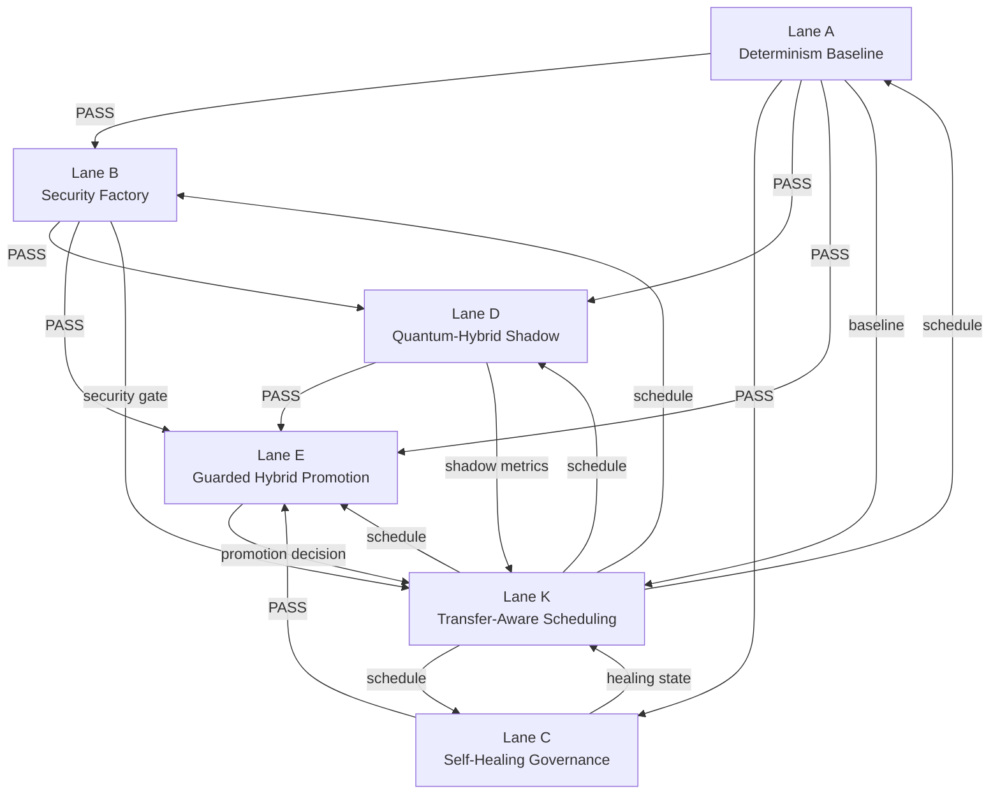

# Dependency Graph

**Campaign:** Multi-Lane Campaign Framework Execution  
**Repository:** `Aries-Serpent/_codex_`  
**Generated:** `2026-08-05T05:12:00Z`

---

## Lane Dependency Graph (A–E, K)

---

## Dependency Rules

| Rule ID | Dependency | Meaning |
|---|---|---|
| R1 | Lane A must pass before B, C, D, E | All downstream lanes consume deterministic baseline |
| R2 | Lane B must pass before security-sensitive promotion activity | No promotion without security factory clearance |
| R3 | Lane C must pass before autonomous self-healing is enabled | Tier 0–1 auto-fix gated by self-healing validation |
| R4 | Lane D must pass before hybrid recommendations are considered for promotion | Shadow mode must be validated and isolated |
| R5 | Lane E must pass before any canary promotion | Promotion requires cohort/SLA/IQ gate clearance |
| R6 | Lane K continuously coordinates dependencies and does not bypass gates | Scheduler observes all gate states, never overrides |

---

## Artifact Transfer Matrix

| From lane | Artifact | To lane | Purpose |
|---|---|---|---|
| A | `input-lock.json` | B, C, D, E, K | Deterministic baseline and reproducibility anchor |
| A | `seed_manifest.json` | B, C, D, E | Deterministic RNG state |
| A | decision-trace JSONL | All | Audit trail entry point |
| B | security stage matrix | D, E, K | Security clearance and finding counts |
| B | S1–S7 outputs | C | Incident context for security findings |
| C | incident routing report | E, K | Self-healing state and pending proposals |
| C | Tier 2/3 proposals | Stakeholder gate | Approval workflow |
| D | shadow benchmark report | E, K | KPI comparison and regression thresholds |
| D | decision-domain mapping | E | Quantum-hybrid promotion domains |
| E | canary promotion record | K | Final promotion decision and rollback plan |
| K | schedule manifest | All | Execution order and retry/escalation directives |

---

## Parallel-Safe Tasks

The following tasks can execute in parallel **after** Lane A passes and before downstream gates consume their outputs:

| Lane | Parallel-safe tasks |
|---|---|
| B | S1 ingest, S2 clustering, S3 scoring (wave-based per `.codex/LANE_DEFINITIONS.md`) |
| C | Incident log scanning and classification (read-only Tier 0) |
| D | Decision-domain mapping, classical baseline measurement |
| K | Dependency graph construction and schedule pre-computation |

## Sequential Tasks

| Lane | Sequential task | Reason |
|---|---|---|
| A | Input-lock → seed → replay verification | Each step depends on prior deterministic state |
| B | S4 wave executor must wait for S1–S3 | Execution requires prioritized finding list |
| C | Tier routing → action/proposal → validation | Governance chain must preserve tier discipline |
| D | Baseline → shadow run → comparison | KPI comparison needs both classical and shadow outputs |
| E | Cohort validation → canary → promotion gate | Graduated rollout requires prior stage success |

---

## Retry and Escalation Policy

| Condition | Action | Owner |
|---|---|---|
| Upstream gate FAIL | Stop dependent lanes; preserve artifacts; retry upstream with rollback | `orchestrator-agent` |
| Artifact transfer timeout | Retry 3× with exponential backoff; then escalate to Lane K | `transfer-aware-scheduler` |
| Non-deterministic replay | Retry with new seed; if reproducible fail, block Lane A | `determinism-baseline-agent` |
| Tier 2 proposal blocked | Notify `@mbaetiong`; hold for 24h approval window | `stakeholder-gate-agent` |
| Tier 3 policy change requested | Require 2 stakeholder signatures; halt until consensus | `stakeholder-gate-agent` |
| Shadow SLA breach | Instant classical fallback; block promotion | `canary-promotion-agent` |

---

## Evidence

- Dependency rules derived from `.codex/MULTI_LANE_GOVERNANCE.md` §Cross-Lane Dependency Management
- Artifact transfer derived from Lane Definitions deliverables and campaign framework requirements
- Scheduling logic supported by `src/orchestration/scheduling/lane_scheduler_v1.py`
