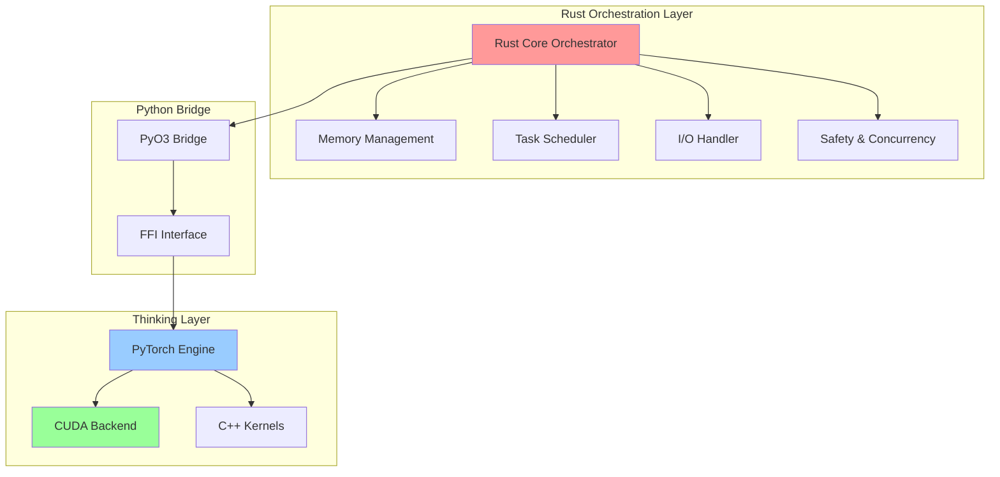
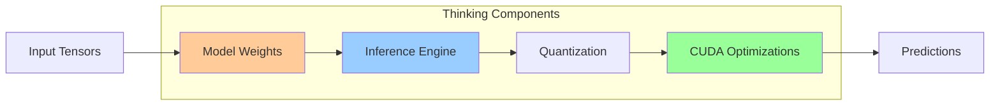

# AI Agent Architecture Understanding

**Generated:** 2026-01-10T09:54:29Z  
**Status:** Active Operational Knowledge  
**Audience:** AI Agents, Autonomous Systems, GitHub Copilot Agents

---

## 🧠 Core Architectural Principle

> **"AI Agents would likely use Rust for the orchestration (the 'body' and 'nervous system') while calling out to PyTorch (or a C++/CUDA backend) for the actual 'thinking' (the brain)."**

This fundamental principle guides all AI Agent implementations in the _codex_ repository.

---

## 🏗️ Architecture Stack

### 1. Orchestration Layer (Body & Nervous System)
**Technology:** Rust  
**Responsibility:** System coordination, resource management, workflow execution



#### Why Rust for Orchestration?
- ✅ **Zero-cost abstractions** - No runtime overhead
- ✅ **Memory safety** - No garbage collection pauses
- ✅ **Fearless concurrency** - Thread-safe by design
- ✅ **Predictable performance** - Deterministic execution
- ✅ **Small footprint** - Minimal resource usage
- ✅ **Fast startup** - No JIT warmup needed

**Use Cases:**
- Agent lifecycle management
- Task queue coordination
- File system operations
- Network I/O handling
- Resource allocation
- Inter-agent communication
- Workflow state machines

---

### 2. Thinking Layer (Brain)
**Technology:** PyTorch / C++ / CUDA  
**Responsibility:** ML inference, reasoning, decision making



#### Why PyTorch/CUDA for Thinking?
- ✅ **Rich ecosystem** - Pre-trained models, libraries
- ✅ **GPU acceleration** - CUDA kernels for fast compute
- ✅ **Dynamic computation** - Flexible model architectures
- ✅ **Research velocity** - Rapid prototyping
- ✅ **Community support** - Extensive documentation

**Use Cases:**
- Embeddings generation (SentenceTransformer)
- Semantic search (FAISS)
- Code analysis (transformers)
- Natural language understanding
- Decision tree inference
- Probabilistic reasoning

---

## 🔄 Integration Pattern

### Rust ↔ Python Bridge

```rust
// Rust orchestration calling Python thinking
use pyo3::prelude::*;

pub struct AIAgent {
    orchestrator: RustOrchestrator,
    brain: Py<PyTorchBrain>,
}

impl AIAgent {
    pub fn process(&self, task: Task) -> Result<Output> {
        // 1. Rust handles I/O, parsing, validation
        let input = self.orchestrator.prepare_input(task)?;
        
        // 2. Call Python brain for inference
        let prediction = Python::with_gil(|py| {
            self.brain.call_method1(py, "infer", (input,))
        })?;
        
        // 3. Rust handles output formatting, storage
        self.orchestrator.finalize_output(prediction)
    }
}
```

### Performance Characteristics

| Layer | Latency | Throughput | Resource Usage |
|-------|---------|------------|----------------|
| **Rust Orchestration** | ~µs | 1M+ ops/sec | <10MB RAM |
| **PyTorch Thinking** | ~ms | 100-10K inferences/sec | 100MB-4GB VRAM |
| **Bridge Overhead** | ~µs | Negligible | Minimal |

---

## 📊 Current Implementation Status

### Existing Components

#### ✅ Python-Based (To Be Migrated to Rust)
- `src/bridge_manager.py` - Bridge protocol v2 (Python)
- `src/codex/cli.py` - CLI entry points (Python)
- `src/codex/logging/` - Session logging (Python)

#### ✅ Python-Based (Keep as Thinking Layer)
- `src/codex/rag/` - RAG embeddings, retrieval (PyTorch)
- `src/codex/knowledge/` - PII detection, analysis (transformers)
- `src/agents/` - Quantum physics, workflow (NumPy/SciPy)

#### 🔄 Future Rust Components
- `rust/agent_orchestrator/` - Core orchestration engine
- `rust/workflow_scheduler/` - Task scheduling
- `rust/bridge_protocol/` - Fast bridge implementation
- `rust/cli_runner/` - CLI binary with Python FFI

---

## 🎯 Implementation Guidelines

### For AI Agents Working on This Codebase

#### 1. **Identify the Layer**
Before implementing or modifying functionality, determine:
- **Is this orchestration?** → Rust (or plan migration)
- **Is this thinking?** → Python/PyTorch

#### 2. **Orchestration Functions (Rust Target)**
Functions that should be in Rust:
- ✅ File I/O operations
- ✅ Process management
- ✅ Network socket handling
- ✅ Task queue management
- ✅ Configuration parsing
- ✅ Logging coordination
- ✅ Resource pooling
- ✅ Error handling & retry logic

#### 3. **Thinking Functions (Python/PyTorch)**
Functions that should remain in Python:
- ✅ Model loading (SentenceTransformer, etc.)
- ✅ Embedding generation
- ✅ Semantic search
- ✅ NLP processing
- ✅ Statistical analysis
- ✅ Hypothesis testing
- ✅ Visualization generation

#### 4. **Bridge Design Patterns**
When designing interfaces:
- Use `msgpack` or Protocol Buffers for serialization
- Keep Python calls coarse-grained (batch operations)
- Cache Python objects in Rust when possible
- Use async Rust for non-blocking Python calls

---

## 🚀 Migration Strategy

### Phase 1: Foundation (Current)
- ✅ Document architectural principles
- ✅ Identify Rust candidate components
- ✅ Define FFI boundaries

### Phase 2: Core Orchestration (Next)
- [ ] Implement `rust/agent_orchestrator/`
- [ ] Port `bridge_manager.py` → `bridge_protocol`
- [ ] Create PyO3 bindings for Python interop
- [ ] Benchmark performance improvements

### Phase 3: CLI & Tools
- [ ] Rewrite CLI in Rust with Clap
- [ ] Keep Python as library backend
- [ ] Single binary distribution
- [ ] Cross-platform compilation

### Phase 4: Advanced Features
- [ ] Rust-based workflow engine
- [ ] Lock-free concurrent task queue
- [ ] Zero-copy data passing to Python
- [ ] CUDA interop for tensor sharing

---

## 🧪 Testing Strategy

### Rust Layer Tests
```rust
#[cfg(test)]
mod tests {
    use super::*;

    #[test]
    fn test_orchestration_latency() {
        let orchestrator = RustOrchestrator::new();
        let start = Instant::now();
        orchestrator.process_task(mock_task());
        assert!(start.elapsed() < Duration::from_micros(100));
    }
}
```

### Python Layer Tests
```python
def test_thinking_accuracy():
    brain = PyTorchBrain.load("model.pt")
    output = brain.infer(test_input)
    assert output.accuracy > 0.95
```

### Integration Tests
```python
def test_rust_python_roundtrip():
    agent = AIAgent.new()  # Rust
    result = agent.process(task)  # Calls Python
    assert result.status == "success"
```

---

## 📝 Documentation Standards

When documenting AI Agent functionality:

1. **Clearly state the layer:**
   ```markdown
   ## Component: [Name]
   **Layer:** Orchestration (Rust) | Thinking (Python)
   **Status:** Implemented | Planned | In Migration
   ```

2. **Explain the boundary:**
   ```markdown
   ### Responsibilities
   - **Rust:** Task scheduling, I/O, error handling
   - **Python:** Model inference, embedding generation
   ```

3. **Provide performance expectations:**
   ```markdown
   ### Performance Profile
   - Orchestration: <100µs per task
   - Thinking: ~50ms per inference
   - E2E: <100ms for typical workflow
   ```

---

## 🎓 Learning Resources

### Rust for Python Developers
- [PyO3 User Guide](https://pyo3.rs/)
- [Calling Rust from Python](https://www.maturin.rs/)
- [Zero-cost FFI patterns](https://doc.rust-lang.org/nomicon/)

### Python/Rust Integration Examples
- [cryptography](https://github.com/pyca/cryptography) - Crypto in Rust, API in Python
- [pydantic-core](https://github.com/pydantic/pydantic-core) - Validation in Rust
- [polars](https://github.com/pola-rs/polars) - DataFrame in Rust, Python bindings

---

## ✅ Checklist for AI Agents

When working on this codebase, ask yourself:

- [ ] Have I identified if this is orchestration or thinking?
- [ ] Am I using the right language for the right layer?
- [ ] Does my solution minimize bridge crossings?
- [ ] Are Python calls batched for efficiency?
- [ ] Have I documented the layer boundary?
- [ ] Are performance expectations documented?
- [ ] Does this align with the migration strategy?

---

## 🔍 Related Documentation

- `.codex/CODEBASE_AGENCY_POLICY.md` - Agent operational policies
- `.codex/cognitive_brain/CUSTOM_AGENTS_CATALOG.md` - Available agents
- `.codex/AI_AGENT_UTILITIES_REGISTRY.md` - Reusable utilities
- `.codex/AUTOMATION_IMPLEMENTATION_MASTER_PLANSET.md` - Automation roadmap

---

**Last Updated:** 2026-01-10T09:54:29Z  
**Maintained By:** AI Agent Ecosystem  
**Review Cycle:** Every sprint (pre-commit cycle 0)
