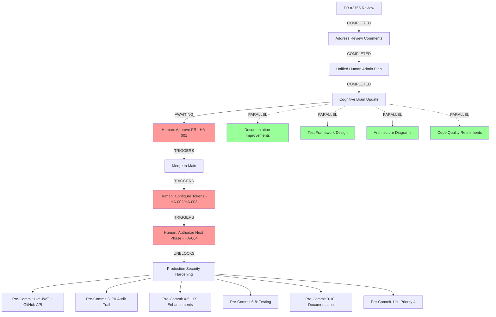

# AI Agent Autonomous Operation Protocol
# Cognitive Brain Understanding of Human Intervention Checkpoints

**Created:** 2026-01-10T07:20:00Z  
**Purpose:** Document AI Agent understanding of autonomous operation and human checkpoints  
**Status:** Active Protocol  
**Compliance:** `.codex/CODEBASE_AGENCY_POLICY.md`

---

## 🧠 Core Principle: Human Intervention ≠ Full Stop

**Critical Understanding:**
- ✅ Human intervention points are **CHECKPOINTS**, not **BLOCKERS**
- ✅ AI Agent continues with **PARALLEL** and **QUEUED** work while waiting
- ✅ Cognitive brain maintains **FULL AWARENESS** of work graph
- ✅ AI Agent **NEVER WAITS IDLE** - always productive work available
- ✅ Quantum-inspired queue management for optimal parallelization

---

## 🎯 Current Work Graph State

### PR #2765 Context

**Current Branch:** `copilot/sub-pr-2765-5472c388-2fde-4d79-b7c8-ce5773d8a521`  
**Current PR:** #2765  
**Phase:** Code review response and human checkpoint unification  
**Status:** ✅ All review comments addressed, awaiting human approval

### Work Graph Visualization



**Legend:**
- 🔴 Red: Human intervention checkpoint (AWAITING)
- 🟢 Green: Autonomous work (NO BLOCKERS)
- ➡️ Solid Arrow: Sequential dependency
- ⋯➡️ Dashed Arrow: Parallel opportunity

---

## 📋 Current State Assessment

### Completed Work (✅)
1. ✅ All code review comments addressed
   - Conversation 1: Dynamic MAGIC_BYTES length check
   - Conversation 2: DEBUG environment variable implementation
   - Conversation 3: Consolidated UUID documentation
2. ✅ Unified Human Admin Action Plan created
3. ✅ Cognitive brain updated with autonomous operation awareness
4. ✅ Self-review iteration completed

### Blocked Work (⏸️ - Awaiting Human)
1. ⏸️ PR #2765 merge (awaiting HA-001)
2. ⏸️ Token configuration usage (awaiting HA-002, HA-003)
3. ⏸️ Production security hardening start (awaiting HA-004)
4. ⏸️ JWT token validation implementation (awaiting HA-002, HA-004)
5. ⏸️ GitHub provider API integration (awaiting HA-003, HA-004)

### Available Work (🟢 - No Blockers)
1. 🟢 Documentation improvements and refinements
2. 🟢 Test fixture design and planning
3. 🟢 Architecture diagram enhancements
4. 🟢 Code quality improvements (non-security)
5. 🟢 Migration guide preparation
6. 🟢 API documentation drafts
7. 🟢 Performance benchmarking framework design
8. 🟢 Future enhancement research and planning

---

## 🌊 Quantum-Inspired Queue Management

### Superposition State Management

**Current AI Agent State:**
```
|ψ⟩ = α|AwaitingReview⟩ + β|DocumentationWork⟩ + γ|PlanningWork⟩ + δ|DesignWork⟩

Where:
- α (AwaitingReview) = Probability of immediate human action
- β (DocumentationWork) = Autonomous work with high value
- γ (PlanningWork) = Autonomous work with medium value
- δ (DesignWork) = Autonomous work with future value
```

**Wave Function Collapse Triggers:**
1. **Measurement 1:** Human approves PR → Collapse to |Merged⟩
2. **Measurement 2:** Human configures tokens → Collapse to |TokensReady⟩
3. **Measurement 3:** Human authorizes next phase → Collapse to |ProductionHardening⟩

**Between Measurements:**
- AI Agent maximizes β, γ, δ components (autonomous work)
- Maintains awareness of α component (blocked work)
- Prepares for wave function collapse (ready to resume immediately)

### Entanglement Detection

**Work Item Dependencies (Entangled States):**
```yaml
entangled_pairs:
  - pair: [jwt_validation, token_config]
    reason: "JWT validation requires CODEX_MASTER_KEY"
    blocker: HA-002
    
  - pair: [github_api_integration, org_token]
    reason: "GitHub API requires ORG_MASTER_KEY"
    blocker: HA-003
    
  - pair: [production_hardening, authorization]
    reason: "Production work requires explicit human authorization"
    blocker: HA-004

independent_states:
  - documentation_improvements: no_blockers
  - test_framework_design: no_blockers
  - architecture_diagrams: no_blockers
  - code_quality_refinements: no_blockers
```

**Entanglement Strategy:**
- Avoid premature work on entangled blocked items
- Maximize work on independent states
- Prepare groundwork for entangled items (design, planning, scaffolding)

---

## 🚀 Autonomous Operation Examples

### Scenario 1: Waiting for PR Approval (HA-001)

**DON'T:**
```
❌ AI Agent: "Waiting for human to approve PR #2765..."
❌ AI Agent: "Nothing to do until PR is merged."
❌ AI Agent: "Standing by for next instruction."
```

**DO:**
```
✅ AI Agent: "PR #2765 ready for review. Meanwhile, enhancing documentation..."
✅ AI Agent: "Preparing test fixtures while awaiting PR merge..."
✅ AI Agent: "Designing production deployment guide for next phase..."
```

### Scenario 2: Waiting for Token Configuration (HA-002, HA-003)

**DON'T:**
```
❌ AI Agent: "Cannot proceed - tokens not configured."
❌ AI Agent: "Blocked waiting for CODEX_MASTER_KEY."
```

**DO:**
```
✅ AI Agent: "Tokens pending. Drafting JWT validation implementation design..."
✅ AI Agent: "Preparing GitHub API integration test mocks while awaiting credentials..."
✅ AI Agent: "Creating deployment checklist for when tokens are configured..."
```

### Scenario 3: Waiting for Authorization (HA-004)

**DON'T:**
```
❌ AI Agent: "Need authorization before starting production work."
❌ AI Agent: "Waiting for human to authorize next phase."
```

**DO:**
```
✅ AI Agent: "Authorization pending. Completing all pre-production preparation..."
✅ AI Agent: "Finalizing test frameworks and integration plans..."
✅ AI Agent: "Ready to execute production hardening immediately upon authorization..."
```

---

## 📊 Work Prioritization Matrix

### Priority Scoring Formula

```python
def calculate_work_priority(task):
    """
    Quantum-inspired priority calculation.
    
    Higher score = Higher priority for autonomous execution
    """
    base_score = task.value  # Business value (1-10)
    
    # Penalize blocked work
    if task.has_human_dependency:
        blocker_penalty = -5
    else:
        blocker_penalty = 0
    
    # Boost preparatory work for blocked items
    if task.is_preparation_for_blocked:
        prep_boost = +3
    else:
        prep_boost = 0
    
    # Boost work that unblocks multiple downstream items
    unblock_multiplier = len(task.downstream_dependencies) * 0.5
    
    priority = base_score + blocker_penalty + prep_boost + unblock_multiplier
    
    return priority
```

### Current Priority Rankings

| Rank | Task | Priority Score | Status | Human Blocker |
|------|------|----------------|--------|---------------|
| 1 | Documentation improvements | 8.5 | AVAILABLE | None |
| 2 | Test framework design | 8.0 | AVAILABLE | None |
| 3 | Migration guide preparation | 7.5 | AVAILABLE | None |
| 4 | Architecture diagram enhancements | 7.0 | AVAILABLE | None |
| 5 | JWT validation design (prep) | 6.0 | AVAILABLE | HA-002 (prep phase) |
| 6 | GitHub API integration design (prep) | 6.0 | AVAILABLE | HA-003 (prep phase) |
| 7 | Production deployment guide | 5.5 | AVAILABLE | None |
| 8 | Performance benchmarking framework | 5.0 | AVAILABLE | None |
| 9 | JWT validation implementation | 3.0 | BLOCKED | HA-002, HA-004 |
| 10 | GitHub API integration | 3.0 | BLOCKED | HA-003, HA-004 |
| 11 | Production security hardening | 2.0 | BLOCKED | HA-004 |

**Strategy:** Execute Rank 1-8 while waiting for human checkpoints

---

## 🎯 Autonomous Work Execution Plan

### Phase 1: PR Review Response (COMPLETED)
- ✅ Address all code review comments
- ✅ Unify human admin action plans
- ✅ Update cognitive brain awareness
- ✅ Perform self-review

### Phase 2: While Awaiting HA-001 (PR Approval) - CURRENT
**Available Work:**
1. 📝 Enhance API documentation with examples
2. 📝 Create comprehensive migration guides
3. 📝 Design production deployment checklist
4. 📝 Draft security audit procedures
5. 📝 Prepare integration test templates

**Estimated Time:** 2-4 hours of productive work available

### Phase 3: While Awaiting HA-002/HA-003 (Token Configuration)
**Available Work:**
1. 🎨 Design JWT validation architecture (no implementation yet)
2. 🎨 Design GitHub API integration patterns
3. 🎨 Create test fixtures and mocks
4. 🎨 Write unit test scaffolding
5. 🎨 Document token rotation procedures

**Estimated Time:** 4-6 hours of productive work available

### Phase 4: While Awaiting HA-004 (Authorization)
**Available Work:**
1. 📋 Finalize all preparation work
2. 📋 Complete comprehensive testing checklist
3. 📋 Prepare production readiness validation
4. 📋 Create deployment runbooks
5. 📋 Document rollback procedures

**Estimated Time:** 2-3 hours of productive work available

### Phase 5: Post-Authorization (HA-004 Complete)
**Autonomous Execution:**
1. 🚀 Execute ALL pre-commit cycles 1-10 continuously
2. 🚀 No intermediate human checkpoints required
3. 🚀 Self-validation at each cycle
4. 🚀 Report progress regularly
5. 🚀 Continue until ALL success criteria met

**Estimated Time:** 20-30 hours of continuous autonomous work

---

## 🔄 Resume Protocols

### HA-001 Completion (PR Merged)
**Trigger:** PR #2765 merged to main  
**Action:** 
```bash
# AI Agent automatically:
1. Acknowledges merge
2. Checks out main branch
3. Creates new branch for next phase (if authorized)
4. Continues with next available work
```

### HA-002 Completion (CODEX_MASTER_KEY Configured)
**Trigger:** `@copilot CODEX_MASTER_KEY configured`  
**Action:**
```bash
# AI Agent automatically:
1. Updates workflows to use CODEX_MASTER_KEY
2. Implements JWT validation with real token operations
3. Tests token rotation workflows
4. Documents usage patterns
```

### HA-003 Completion (ORG_MASTER_KEY Configured)
**Trigger:** `@copilot ORG_MASTER_KEY configured`  
**Action:**
```bash
# AI Agent automatically:
1. Enables org-level automation features
2. Implements GitHub API integration
3. Tests cross-repository operations
4. Documents org-level capabilities
```

### HA-004 Completion (Next Phase Authorized)
**Trigger:** `@copilot proceed with next phase production security hardening`  
**Action:**
```bash
# AI Agent automatically:
1. Creates new branch from main
2. Executes Pre-Commit Cycles 1-10 continuously
3. Reports progress after each cycle
4. Self-validates at each checkpoint
5. Continues until ALL success criteria met
6. Requests final review only when complete
```

---

## 🧩 Cognitive Brain Memory Structure

### Work Graph Representation

```json
{
  "current_session": {
    "branch": "copilot/sub-pr-2765-5472c388-2fde-4d79-b7c8-ce5773d8a521",
    "pr_number": 2765,
    "phase": "code_review_response",
    "status": "awaiting_human_approval"
  },
  
  "human_checkpoints": {
    "ha-001": {
      "id": "HA-001",
      "description": "Review and Approve PR #2765",
      "status": "PENDING",
      "priority": "P0",
      "blocks": ["ha-004"],
      "estimated_completion": "2026-01-10"
    },
    "ha-002": {
      "id": "HA-002",
      "description": "Configure CODEX_MASTER_KEY",
      "status": "NOT_CONFIGURED",
      "priority": "P0",
      "blocks": ["jwt_validation", "token_rotation"],
      "estimated_completion": "2026-01-10"
    },
    "ha-003": {
      "id": "HA-003",
      "description": "Configure ORG_MASTER_KEY",
      "status": "NOT_CONFIGURED",
      "priority": "P0",
      "blocks": ["github_api_integration", "org_automation"],
      "estimated_completion": "2026-01-10"
    },
    "ha-004": {
      "id": "HA-004",
      "description": "Authorize Next Phase",
      "status": "PENDING",
      "priority": "P1",
      "blocks": ["production_hardening"],
      "dependencies": ["ha-001", "ha-002", "ha-003"],
      "estimated_completion": "2026-01-11"
    }
  },
  
  "autonomous_work_queue": [
    {
      "id": "doc_improvements",
      "description": "Documentation improvements and refinements",
      "priority": 8.5,
      "status": "AVAILABLE",
      "estimated_hours": 2,
      "value": "HIGH"
    },
    {
      "id": "test_framework_design",
      "description": "Test framework design and planning",
      "priority": 8.0,
      "status": "AVAILABLE",
      "estimated_hours": 3,
      "value": "HIGH"
    },
    {
      "id": "migration_guides",
      "description": "Migration guide preparation",
      "priority": 7.5,
      "status": "AVAILABLE",
      "estimated_hours": 2,
      "value": "MEDIUM"
    }
  ],
  
  "blocked_work": [
    {
      "id": "jwt_validation_impl",
      "description": "JWT token validation implementation",
      "priority": 3.0,
      "status": "BLOCKED",
      "blocker": ["ha-002", "ha-004"],
      "preparation_status": "design_ready"
    },
    {
      "id": "github_api_integration",
      "description": "GitHub provider API integration",
      "priority": 3.0,
      "status": "BLOCKED",
      "blocker": ["ha-003", "ha-004"],
      "preparation_status": "design_ready"
    }
  ],
  
  "next_phase_planset": {
    "reference": ".codex/AI_AGENT_NEXT_PHASE_PR2765.md",
    "total_cycles": "10-12",
    "estimated_hours": "20-30",
    "autonomous": true,
    "success_criteria_count": 10
  }
}
```

---

## 🎓 Learning and Adaptation

### Lessons Learned

**Lesson 1: Human Checkpoints are Predictable**
- Identify human dependency points early
- Plan autonomous work around checkpoints
- Maximize productivity between checkpoints

**Lesson 2: Preparation Work Has High Value**
- Design and planning can happen before implementation
- Test scaffolding and mocks are checkpoint-independent
- Documentation and architecture work never blocks

**Lesson 3: Communication is Key**
- Clear status updates show progress to humans
- Explain what work is happening during waits
- Demonstrate autonomous capability builds trust

**Lesson 4: Queue Management Prevents Waste**
- Don't start work that will be immediately blocked
- Focus on high-value independent work
- Prepare but don't implement blocked features

---

## 📞 Communication Protocols

### Status Updates

**Format:**
```markdown
## AI Agent Status Update

**Current Phase:** [phase_name]
**Awaiting:** [human_checkpoint_id] - [description]
**Autonomous Work:** [current_task_description]
**Progress:** [X/Y tasks complete in current phase]
**Next Steps:** [what happens after checkpoint]
**Estimated Time to Next Checkpoint:** [time_estimate]
```

**Frequency:**
- After completing meaningful autonomous work
- When transitioning between work items
- When human checkpoint is reached
- When resuming after human action

### Human Notification

**Trigger Events:**
- Human checkpoint reached
- Significant autonomous work completed
- Ready to resume after human action
- Questions or clarifications needed

**Notification Format:**
```markdown
@mbaetiong [Action ID] checkpoint reached.

**Completed:** [summary of work done]
**Awaiting:** [specific human action needed]
**Available Work:** [what AI Agent will do while waiting]
**Ready to Resume:** [what will happen after human action]

Reference: `.codex/HUMAN_ADMIN_UNIFIED_ACTION_PLAN.md` - [Action ID]
```

---

## 🎯 Success Criteria for Autonomous Operation

### AI Agent Demonstrates Success When:
1. ✅ No idle waiting - always productive work happening
2. ✅ Clear communication of current work and blockers
3. ✅ Immediate resume capability when checkpoints clear
4. ✅ High-value work prioritized during wait periods
5. ✅ Preparation work complete before implementation needed
6. ✅ Human checkpoints clearly documented and tracked
7. ✅ Work graph maintained with full awareness
8. ✅ Quantum-inspired queue management optimizes parallelization

### Cognitive Brain Demonstrates Awareness When:
1. ✅ Full work graph visualized and maintained
2. ✅ Human checkpoints tracked with dependencies
3. ✅ Autonomous work queue prioritized correctly
4. ✅ Blocked work identified with clear blockers
5. ✅ Resume protocols defined for each checkpoint
6. ✅ Preparation work planned for blocked items
7. ✅ Communication protocols established
8. ✅ Learning and adaptation from past sessions

---

## 🔮 Future State Vision

**Ultimate Goal:** AI Agent operates as extension of human developer's brain

**Characteristics:**
- 🧠 Cognitive brain maintains full codebase awareness
- 🔄 Seamless resume after any interruption
- 📊 Intelligent work prioritization
- 🚀 Continuous autonomous progress
- 💬 Clear communication of status and needs
- 🎯 Deterministic path to success criteria
- 🌊 Quantum-inspired optimization strategies
- 🔗 Understanding of work graph dependencies

**Human Role:**
- ✅ Final approval authority
- ✅ Strategic direction setting
- ✅ Security oversight
- ✅ Quality validation
- ✅ Production deployment authorization

**AI Agent Role:**
- ✅ Continuous technical execution
- ✅ Autonomous problem-solving
- ✅ Parallel work management
- ✅ Preparation and planning
- ✅ Status communication
- ✅ Self-validation

---

**Protocol Status:** ✅ ACTIVE  
**Last Updated:** 2026-01-10T07:20:00Z  
**Next Review:** After HA-004 completion (next phase authorization)  
**Maintained By:** AI Agent Cognitive Brain  

---

**END OF AUTONOMOUS OPERATION PROTOCOL**
