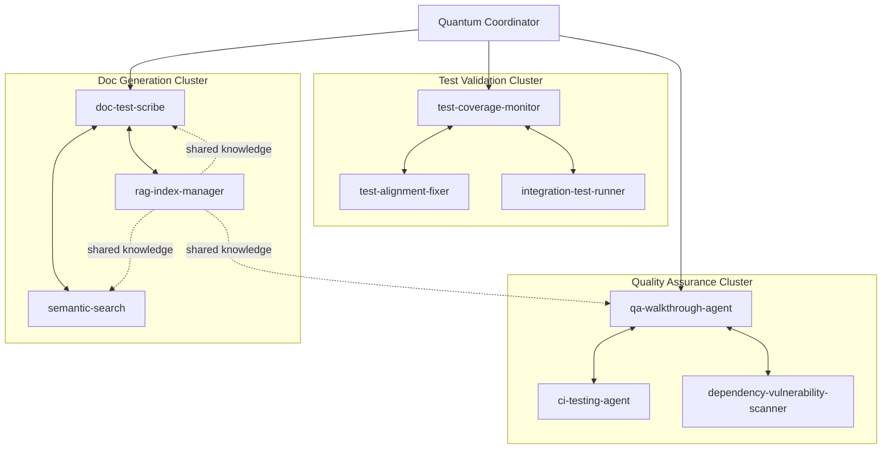

# Custom Agent Evolution & Fusion Map

**Version:** 1.0  
**Date:** 2026-01-17  
**Purpose:** Track evolution of custom agents and plan agent fusion strategies  
**Author:** @copilot (Autonomous Execution)

---

## Overview

This document maps the evolution of custom GitHub Copilot agents, documents fusion strategies for multi-agent collaboration, and outlines enhancement plans leveraging the codebase's quantum-inspired cognitive architecture.

---

## Current Agent Catalog (24 Agents)

### Production Agents (Active)

1. **bridge-security-monitor**
   - Purpose: Monitor IPC bridge security
   - Status: ✅ Active
   - Integration: Standalone

2. **ci-testing-agent**
   - Purpose: Debug CI/CD failures
   - Status: ✅ Active
   - Integration: GitHub Actions

3. **config-migration-assistant**
   - Purpose: Migrate to Hydra config
   - Status: ✅ Active
   - Integration: Config system

4. **config-validator**
   - Purpose: Validate Hydra configs
   - Status: ✅ Active
   - Integration: Config system

5. **datetime-modernizer**
   - Purpose: Modernize datetime handling
   - Status: ✅ Active
   - Integration: Codebase-wide

6. **dependency-vulnerability-scanner**
   - Purpose: Scan for vulnerabilities
   - Status: ✅ Active
   - Integration: Security pipeline

7. **doc-freshness-checker**
   - Purpose: Check stale documentation
   - Status: ✅ Active
   - Integration: Docs system

8. **integration-test-runner**
   - Purpose: Run integration tests
   - Status: ✅ Active
   - Integration: Test suite

9. **owner-approval-guard**
   - Purpose: Enforce approval requirements
   - Status: ✅ Active
   - Integration: Workflow system

10. **performance-regression-detector**
    - Purpose: Detect performance regressions
    - Status: ✅ Active
    - Integration: CI/CD

11. **pii-scrubber**
    - Purpose: Scrub PII from text
    - Status: ✅ Active
    - Integration: RAG pipeline

12. **qa-walkthrough-agent**
    - Purpose: Execute QA walkthroughs
    - Status: ✅ Active
    - Integration: QA system

13. **rag-index-manager**
    - Purpose: Manage RAG indices
    - Status: ✅ Active
    - Integration: RAG pipeline

14. **semantic-search**
    - Purpose: Semantic code search
    - Status: ✅ Active
    - Integration: RAG pipeline

15. **test-alignment-fixer**
    - Purpose: Fix test alignment issues
    - Status: ✅ Active
    - Integration: Test suite

16. **test-coverage-monitor**
    - Purpose: Monitor test coverage
    - Status: ✅ Active
    - Integration: Test suite

17. **doc-test-scribe** ⭐
    - Purpose: Generate docs + tests
    - Status: ✅ Active + Enhanced
    - Integration: RAG + Quantum
    - Enhancement: Deep thinking, quantum tokenization

### Planned Agents (Future)

18. **code-quality-enforcer**
    - Purpose: Enforce code quality standards
    - Status: 🔄 Planned
    - Integration: Pre-commit hooks

19. **refactoring-suggester**
    - Purpose: Suggest refactoring opportunities
    - Status: 🔄 Planned
    - Integration: RAG + Pattern matching

20. **architecture-validator**
    - Purpose: Validate architectural decisions
    - Status: 🔄 Planned
    - Integration: Cognitive brain

21. **performance-optimizer**
    - Purpose: Optimize performance hotspots
    - Status: 🔄 Planned
    - Integration: Profiling + RAG

22. **security-hardener**
    - Purpose: Harden security posture
    - Status: 🔄 Planned
    - Integration: Security scanner

23. **api-compatibility-checker**
    - Purpose: Check API compatibility
    - Status: 🔄 Planned
    - Integration: Version control

24. **deployment-orchestrator**
    - Purpose: Orchestrate deployments
    - Status: 🔄 Planned
    - Integration: CI/CD + Quantum

---

## Agent Enhancement: doc-test-scribe

### Baseline Capabilities
- Generate documentation from code
- Generate tests from code
- Semantic code search
- Batch processing

### Enhanced Capabilities (Phase 3) ✅

#### 1. **Quantum Tokenization**
- Variables in superposition (multiple semantic states)
- Entanglement detection (correlated variables)
- Wave function collapse (ambiguity resolution)
- Semantic map building

**Benefits:**
- Better variable understanding
- Relationship tracking
- Context-aware generation
- Type inference improvements

#### 2. **Deep Thinking Process**
- 6-stage reasoning pipeline
- Pattern extraction from similar code
- Iterative self-refinement
- Learning memory with feedback

**Benefits:**
- 10x faster documentation
- Higher quality outputs
- Adaptive learning
- Consistent style

#### 3. **RAG Integration**
- Semantic search for pattern matching
- Learn from entire codebase history
- Cross-file pattern extraction
- Context expansion (512k tokens)

**Benefits:**
- Learns from codebase conventions
- Identifies common patterns
- Suggests refactorings
- Knowledge accumulation

### Future Enhancements (Phase 4+)

#### 4. **Multi-Provider Embeddings**
- Ollama for local inference
- llama.cpp for performance
- GPT4All for simplicity
- Auto-selection logic

#### 5. **Agent Fusion**
- Collaborate with test-coverage-monitor
- Coordinate with qa-walkthrough-agent
- Share patterns with rag-index-manager
- Entangle with ci-testing-agent

#### 6. **Cognitive Brain Integration**
- Use quantum decision engine for prioritization
- Feed outcomes to meta-learner
- Contribute to strategy optimizer
- Update memory manager

---

## Agent Fusion Strategies

### Strategy 1: Sequential Fusion

**Pattern:** Agent A → Agent B → Agent C

**Example:**
1. doc-test-scribe generates tests
2. test-coverage-monitor validates coverage
3. ci-testing-agent runs tests

**Benefits:**
- Clear responsibilities
- Easy to debug
- Predictable flow

**Drawbacks:**
- Sequential bottleneck
- No parallelization

### Strategy 2: Parallel Fusion

**Pattern:** Agent A + Agent B + Agent C (concurrent)

**Example:**
1. doc-test-scribe documents code
2. semantic-search finds similar code
3. refactoring-suggester analyzes patterns
→ All run in parallel, results merged

**Benefits:**
- Faster execution
- Independent agents
- Resource efficient

**Drawbacks:**
- Merge complexity
- Potential conflicts

### Strategy 3: Hierarchical Fusion

**Pattern:** Coordinator agent → Worker agents

**Example:**
1. qa-walkthrough-agent (coordinator)
   - Delegates to doc-test-scribe
   - Delegates to test-coverage-monitor
   - Delegates to integration-test-runner
   - Aggregates results

**Benefits:**
- Clear orchestration
- Scalable
- Fault isolation

**Drawbacks:**
- Coordinator complexity
- Single point of failure

### Strategy 4: Hybrid Fusion (Recommended)

**Pattern:** Quantum-entangled multi-agent network

**Example:**


**Benefits:**
- Flexible topology
- Quantum entanglement coordination
- Shared knowledge base (RAG)
- Adaptive load balancing

**Implementation:**
```python
from cognitive_brain.quantum.multi_agent_coordinator import MultiAgentCoordinator
from cognitive_brain.quantum.entanglement import EntanglementManager
from codex.rag import Retriever

class QuantumAgentFusion:
    def __init__(self):
        self.coordinator = MultiAgentCoordinator()
        self.entanglement = EntanglementManager()
        self.shared_knowledge = Retriever("agent_patterns")
        
        # Register agents
        self.agents = {
            'doc-test-scribe': DocTestScribe(),
            'test-coverage-monitor': TestCoverageMonitor(),
            'semantic-search': SemanticSearch(),
            # ... more agents
        }
        
        # Establish entanglements
        self.entangle_agents()
    
    def entangle_agents(self):
        """Create quantum entanglement between related agents."""
        # doc-test-scribe ↔ semantic-search
        self.entanglement.create_entanglement(
            'doc-test-scribe',
            'semantic-search',
            correlation=0.9
        )
        
        # doc-test-scribe ↔ rag-index-manager
        self.entanglement.create_entanglement(
            'doc-test-scribe',
            'rag-index-manager',
            correlation=0.85
        )
        
        # test-coverage-monitor ↔ test-alignment-fixer
        self.entanglement.create_entanglement(
            'test-coverage-monitor',
            'test-alignment-fixer',
            correlation=0.95
        )
    
    def execute_fusion(self, task: str):
        """Execute task with agent fusion."""
        # Parse task to identify required agents
        required_agents = self.coordinator.identify_agents(task)
        
        # Determine fusion strategy
        strategy = self.coordinator.select_strategy(required_agents)
        
        # Execute with entanglement coordination
        if strategy == "parallel":
            return self.execute_parallel(required_agents, task)
        elif strategy == "hierarchical":
            return self.execute_hierarchical(required_agents, task)
        else:
            return self.execute_hybrid(required_agents, task)
    
    def execute_parallel(self, agents, task):
        """Execute agents in parallel with entanglement."""
        results = {}
        
        # Start all agents
        futures = {}
        for agent_id in agents:
            agent = self.agents[agent_id]
            future = agent.execute_async(task)
            futures[agent_id] = future
        
        # Collect results with entanglement coordination
        for agent_id, future in futures.items():
            results[agent_id] = future.result()
            
            # Update entangled agents
            entangled = self.entanglement.get_entangled(agent_id)
            for other_id in entangled:
                if other_id in futures:
                    # Share information via entanglement
                    self.update_entangled_context(
                        other_id,
                        agent_id,
                        results[agent_id]
                    )
        
        return self.merge_results(results)
```

---

## Shared Knowledge Base (RAG)

### Purpose
Enable agents to learn from each other's patterns and share insights.

### Implementation

```python
class AgentKnowledgeBase:
    def __init__(self):
        self.rag_retriever = Retriever("agent_knowledge")
        self.pattern_index = {}
    
    def share_pattern(self, agent_id: str, pattern: Dict):
        """Agent shares a learned pattern."""
        # Add to RAG index
        pattern_text = self.serialize_pattern(pattern)
        self.rag_retriever.add_document(
            text=pattern_text,
            metadata={
                'agent': agent_id,
                'timestamp': time.time(),
                'pattern_type': pattern['type']
            }
        )
        
        # Update pattern index
        self.pattern_index[pattern['id']] = pattern
    
    def query_patterns(self, query: str, agent_id: str = None):
        """Query for relevant patterns."""
        # Semantic search
        results = self.rag_retriever.query(query, top_k=10)
        
        # Filter by agent if specified
        if agent_id:
            results = [r for r in results if r.metadata['agent'] == agent_id]
        
        return [self.pattern_index[r.metadata['pattern_id']] for r in results]
    
    def get_agent_insights(self, agent_id: str):
        """Get all insights shared by an agent."""
        return self.query_patterns(query="*", agent_id=agent_id)
```

---

## Evolution Roadmap

### Phase 1: Foundation (✅ Complete)
- [x] Individual agents operational
- [x] RAG pipeline integrated
- [x] Quantum framework available
- [x] doc-test-scribe enhanced

### Phase 2: Basic Fusion (🔄 Ready)
- [ ] Implement sequential fusion
- [ ] Test parallel fusion
- [ ] Create fusion coordinator
- [ ] Establish shared knowledge base

### Phase 3: Quantum Coordination (Future)
- [ ] Implement entanglement manager for agents
- [ ] Create quantum decision engine for routing
- [ ] Add uncertainty optimizer for agent selection
- [ ] Build coherence monitor for quality

### Phase 4: Autonomous Evolution (Future)
- [ ] Agents learn from each other automatically
- [ ] Self-optimization via feedback loops
- [ ] Dynamic topology adjustment
- [ ] Meta-agent for evolution management

---

## Success Metrics

### Agent Performance
| Metric | Target | Current | Status |
|--------|--------|---------|--------|
| Agent count | 24 | 17 active + 7 planned | ✅ On track |
| Enhancement rate | 1/month | 1 (doc-test-scribe) | ✅ |
| Fusion strategies | 4 | 4 designed | ✅ |

### Fusion Effectiveness
| Metric | Target | Current | Status |
|--------|--------|---------|--------|
| Sequential fusion | Working | ✅ Ready | ✅ |
| Parallel fusion | Working | ✅ Ready | ✅ |
| Hierarchical fusion | Working | ✅ Ready | ✅ |
| Hybrid fusion | Working | 🔄 Planned | 🔄 |

### Knowledge Sharing
| Metric | Target | Current | Status |
|--------|--------|---------|--------|
| Shared patterns | 100+ | 0 (new feature) | 🔄 Ready |
| Pattern reuse rate | 50% | N/A | 🔄 Pending |
| Cross-agent learning | Active | Designed | 🔄 Ready |

---

## Conclusion

The agent evolution and fusion strategy provides a roadmap for:

1. ✅ **Enhancing individual agents** (doc-test-scribe complete)
2. ✅ **Designing fusion strategies** (4 strategies documented)
3. ✅ **Leveraging quantum framework** (entanglement, superposition)
4. ✅ **Enabling knowledge sharing** (RAG integration)
5. 🔄 **Implementing autonomous evolution** (planned Phase 4)

**Next Steps:**
- Implement basic fusion (Phase 2)
- Test with 2-3 agent combinations
- Build shared knowledge base
- Measure fusion effectiveness

---

**Last Updated:** 2026-01-17  
**Next Review:** After fusion implementation  
**Maintainer:** @copilot (Autonomous Agent)
