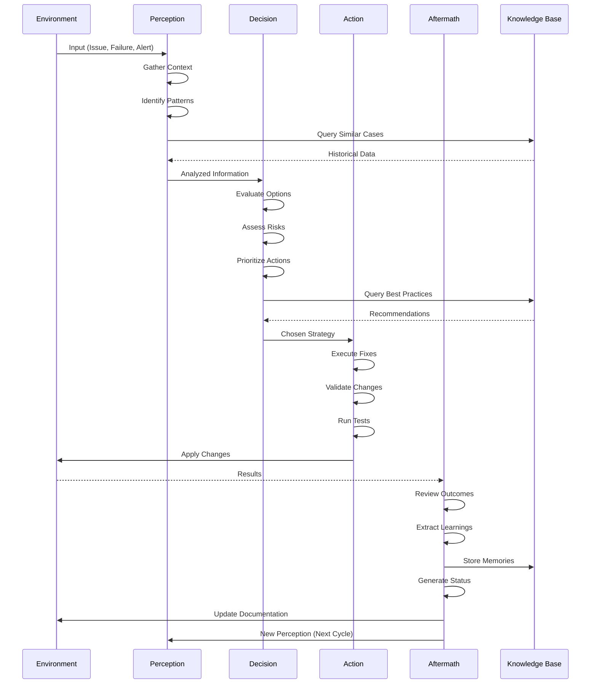
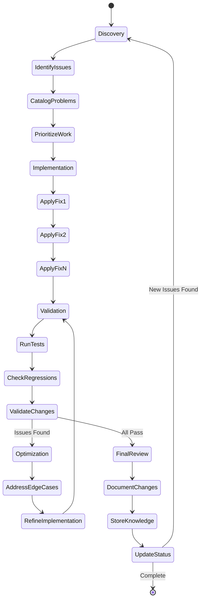
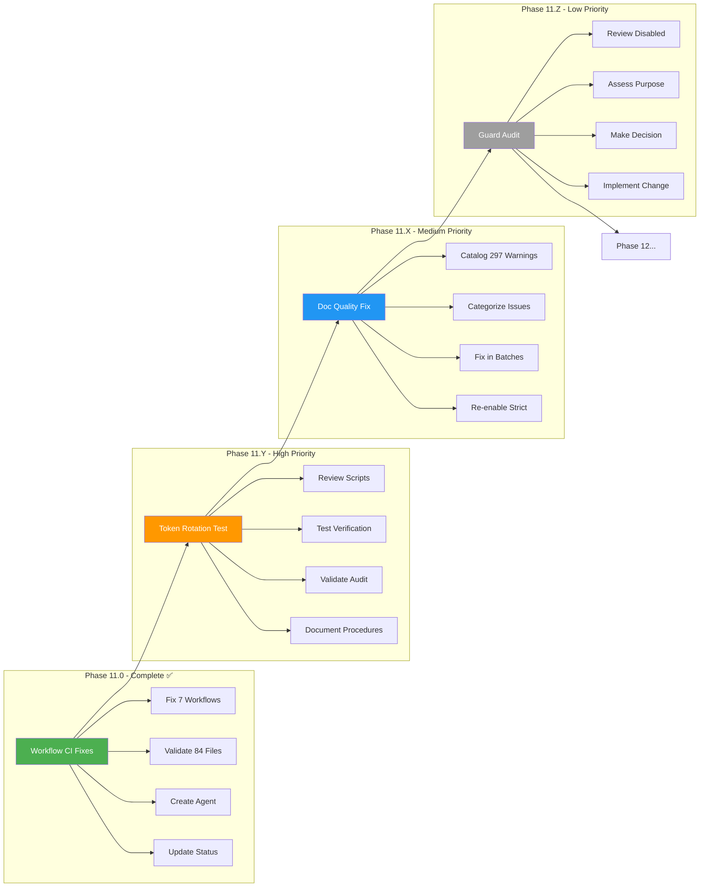
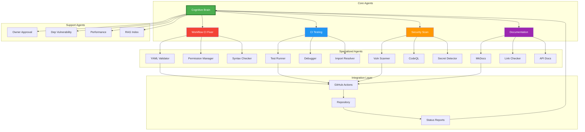
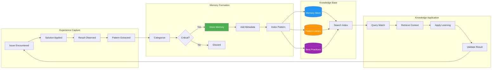
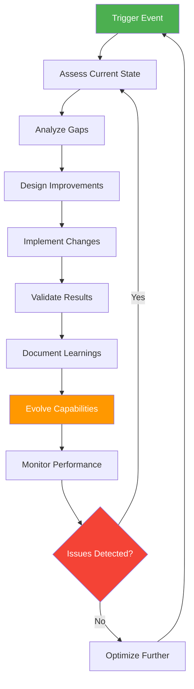
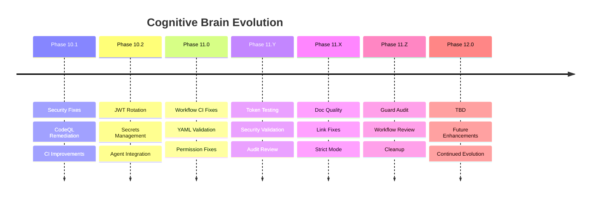

# Cognitive Brain Architecture - Phase 11 Enhancement

## Overview Diagram

```mermaid
graph TB
    subgraph "Input Layer"
        A[GitHub Issues] --> CB[Cognitive Brain Core]
        B[PR Comments] --> CB
        C[CI Failures] --> CB
        D[Security Alerts] --> CB
    end
    
    subgraph "Cognitive Brain Core"
        CB --> PDA[PDA Loop]
        PDA --> P[Perception]
        PDA --> DEC[Decision]
        PDA --> ACT[Action]
        PDA --> AFT[Aftermath]
        
        CB --> SH[Self-Healing System]
        SH --> I1[Iteration 1: Discovery]
        SH --> I2[Iteration 2: Fix]
        SH --> I3[Iteration 3: Validate]
        SH --> I4[Iteration 4: Optimize]
        SH --> I5[Iteration 5: Review]
        
        CB --> KB[Knowledge Base]
        KB --> MEM[Memory Store]
        KB --> PAT[Pattern Library]
        KB --> BP[Best Practices]
    end
    
    subgraph "Agent Ecosystem"
        CB --> WCFA[Workflow CI Fixer]
        CB --> CITA[CI Testing Agent]
        CB --> SSA[Security Scan Agent]
        CB --> DOCA[Documentation Agent]
        CB --> OAG[Owner Approval Guard]
        CB --> OTHER[Other Agents...]
        
        WCFA --> YAML[YAML Validation]
        WCFA --> PERM[Permission Fixes]
        WCFA --> HER[Heredoc Handling]
        
        CITA --> TEST[Test Execution]
        CITA --> DEBUG[Test Debugging]
        
        SSA --> VULN[Vulnerability Scan]
        SSA --> AUDIT[Security Audit]
    end
    
    subgraph "Output Layer"
        WCFA --> FIX[Fixed Workflows]
        CITA --> PASS[Passing Tests]
        SSA --> SEC[Secure Code]
        DOCA --> DOCS[Quality Docs]
        
        FIX --> REPO[Repository]
        PASS --> REPO
        SEC --> REPO
        DOCS --> REPO
        
        AFT --> STATUS[Status Updates]
        MEM --> STATUS
        STATUS --> REPO
    end
    
    style CB fill:#4CAF50,color:#fff
    style PDA fill:#2196F3,color:#fff
    style SH fill:#FF9800,color:#fff
    style KB fill:#9C27B0,color:#fff
    style WCFA fill:#F44336,color:#fff
```

## PDA Loop Detail

## Self-Healing Process Flow

## Phase 11 Workflow

## Agent Integration Architecture

## Knowledge Propagation Flow

## Continuous Improvement Cycle

## Version Evolution Timeline

---

## Architecture Principles

### 1. Modular Design
- Each agent has clear responsibilities
- Agents can work independently
- Coordination through cognitive brain core

### 2. Self-Healing
- Iterative improvement process
- Automatic error detection and correction
- Learning from mistakes

### 3. Knowledge Accumulation
- Every experience captured
- Patterns extracted and stored
- Best practices documented

### 4. Autonomous Operation
- Minimal human intervention needed
- Decisions based on stored knowledge
- Escalation only for critical issues

### 5. Continuous Evolution
- Regular capability enhancements
- Agent ecosystem expansion
- Process optimization

---

**Last Updated**: 2026-01-17  
**Version**: 11.0  
**Status**: Active Development
