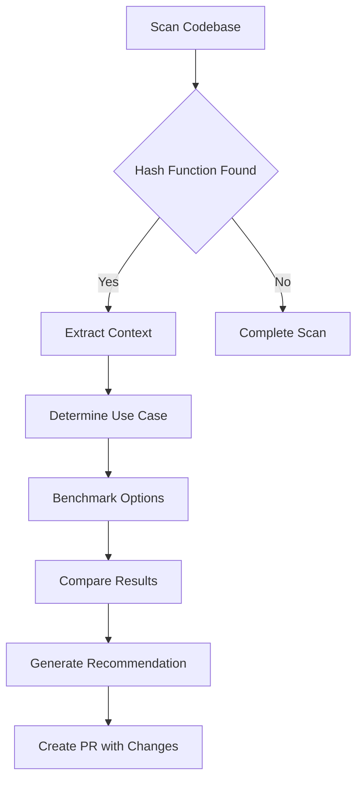
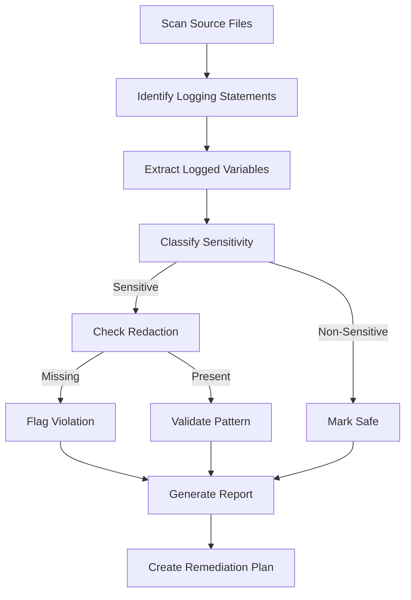
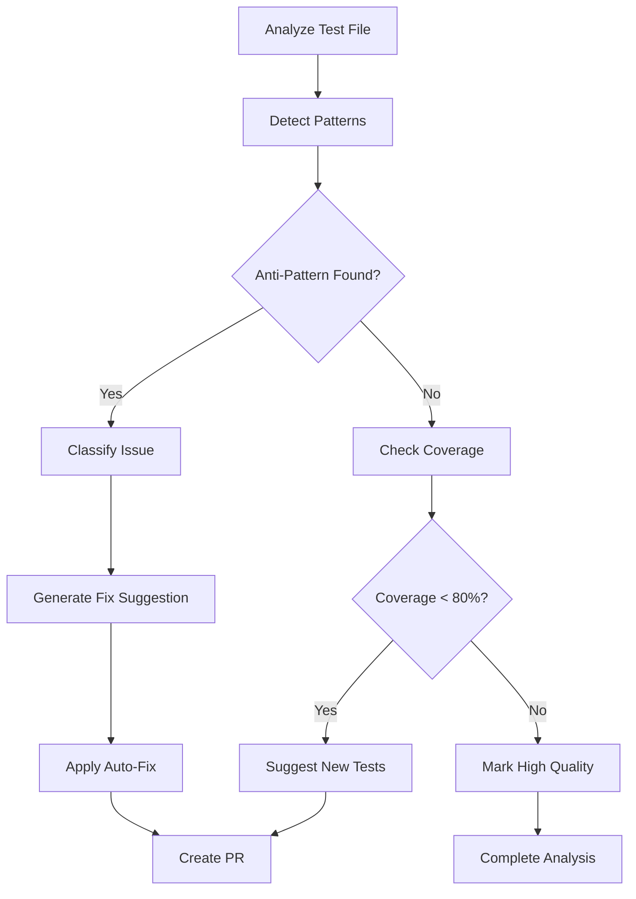

# Follow-Up Prompt for GitHub Copilot Agent - PR #2765 Continuation
> **Session Type:** Autonomous Continuation  
> **Priority:** High  
> **Context:** Security remediation complete, production readiness tasks remain  
> **Date Created:** 2026-01-10T03:35:00Z

---

## Session Context

This is a continuation of PR #2765 security remediation work. The previous session successfully:
- ✅ Resolved all 4 high-severity CodeQL security alerts
- ✅ Completed 3 iterations of comprehensive self-review
- ✅ Removed dead code and enhanced documentation
- ✅ Added optional dependencies and production examples

**Current Branch:** `copilot/sub-pr-2765-0149b99e-19a3-49de-9202-f5eb0071c6d9`  
**Base Branch:** `0D_base_`  
**Target:** `main`

---

## Critical Task: Reply to Comment

**Priority:** IMMEDIATE  
**Comment ID:** 3731762039  
**Author:** @mbaetiong

**Required Action:**
Reply to the comment with:
1. Confirmation that all 4 CodeQL alerts (#3072, #3073, #3074, #3075) are resolved
2. Summary of additional improvements made (dead code removal, documentation enhancements)
3. Commit hash: `6c4536f` (final commit with all fixes)
4. Request for code review and approval

**Template for Reply:**
```markdown
All 4 CodeQL security alerts have been resolved:

- ✅ Alert #3072 (Line 181): Removed secret_id from validation logging
- ✅ Alert #3073 (Line 187): Removed secret_id from expiration warning  
- ✅ Alert #3074 (Line 301): Removed secret_id from scope update logging
- ✅ Alert #3075 (Line 324): Removed secret_id from revocation logging

**Additional improvements made:**
- Removed dead code (`_redact_identifier` function no longer used)
- Added JWT/OAuth implementation examples to decorators.py
- Enhanced TODO comments with tracking references (PS-06, PS-09)
- Documented xxhash as optional dependency in pyproject.toml
- Added comprehensive design decision documentation

**Commits:**
- `2e8fe74` - Fix CodeQL alerts: remove secret_id from log messages
- `433606a` - Address all code review comments: enhance documentation  
- `6c4536f` - Remove dead code and complete self-review iteration 3

**Status:** Ready for code review and approval.

All changes have been validated with syntax checks, security scans, and comprehensive self-review (3 iterations).
```

---

## Phase 1: Production Readiness Tasks

### Task 1.1: Performance Benchmarking ⚡ HIGH PRIORITY
**Goal:** Validate hash function optimization claims with quantitative data

**Deliverables:**
1. Create `scripts/benchmarks/hash_performance_benchmark.py`
2. Benchmark xxhash vs MD5 vs built-in hash()
3. Test with various document ID patterns (short, long, UUID, numeric)
4. Generate performance report with graphs

**Acceptance Criteria:**
- Measure throughput (ops/sec) and latency (ns/op)
- Confirm 10-100x improvement for xxhash over MD5
- Document when xxhash is critical vs optional
- Create visualizations (charts/graphs)

**Implementation Guidance:**
```python
import time
import xxhash
import hashlib
from typing import Callable, List

def benchmark_hash_function(
    hash_func: Callable[[str], int],
    test_data: List[str],
    iterations: int = 100000
) -> dict:
    """Benchmark a hash function."""
    start = time.perf_counter()
    for _ in range(iterations):
        for data in test_data:
            hash_func(data)
    elapsed = time.perf_counter() - start
    ops_per_sec = (len(test_data) * iterations) / elapsed
    return {
        "throughput_ops_sec": ops_per_sec,
        "latency_ns_per_op": (elapsed / (len(test_data) * iterations)) * 1e9,
        "total_time_sec": elapsed
    }

# Test with various patterns
test_cases = [
    ("short", ["abc", "123", "xyz"]),
    ("uuid", [str(uuid.uuid4()) for _ in range(100)]),
    ("long", ["x" * 1000 for _ in range(100)])
]
```

**Expected Output:**
- Console report with comparison table
- CSV file: `.codex/benchmarks/hash_performance_results.csv`
- Markdown report: `.codex/benchmarks/HASH_PERFORMANCE_ANALYSIS.md`

---

### Task 1.2: Integration Testing 🧪 HIGH PRIORITY
**Goal:** Ensure graceful degradation when xxhash unavailable

**Deliverables:**
1. Update `tests/codex/retrieval/test_sharding.py`
2. Add test that simulates xxhash ImportError
3. Verify fallback to MD5 works correctly
4. Test shard distribution quality with both hash functions

**Test Cases:**
```python
def test_sharding_without_xxhash(monkeypatch):
    """Test that sharding works when xxhash is unavailable."""
    # Mock xxhash import to raise ImportError
    monkeypatch.setattr("builtins.__import__", mock_import_without_xxhash)
    
    ring = ConsistentHashRing(num_shards=8)
    keys = [f"doc_{i}" for i in range(1000)]
    
    # Verify all keys get assigned to shards
    shard_assignments = [ring.get_shard(key) for key in keys]
    assert len(set(shard_assignments)) == 8  # All shards used
    
    # Check distribution is reasonably balanced (within 20% of ideal)
    ideal_per_shard = len(keys) / 8
    for shard in range(8):
        count = shard_assignments.count(shard)
        assert 0.8 * ideal_per_shard <= count <= 1.2 * ideal_per_shard

def test_hash_function_determinism():
    """Verify hash functions are deterministic."""
    ring1 = ConsistentHashRing(num_shards=8)
    ring2 = ConsistentHashRing(num_shards=8)
    
    test_keys = [f"key_{i}" for i in range(100)]
    for key in test_keys:
        assert ring1.get_shard(key) == ring2.get_shard(key)
```

**Acceptance Criteria:**
- Tests pass with and without xxhash installed
- Distribution quality validated (balanced sharding)
- Warnings logged appropriately when falling back
- No regressions in existing tests

---

### Task 1.3: Production Deployment Guide 📚 MEDIUM PRIORITY
**Goal:** Document best practices for production sharding deployment

**Deliverables:**
1. Create `.codex/guides/SHARDING_DEPLOYMENT_GUIDE.md`
2. Document installation, configuration, and monitoring
3. Provide migration guide for existing deployments
4. Include troubleshooting section

**Content Structure:**
```markdown
# Production Sharding Deployment Guide

## Overview
- What is index sharding
- When to use it
- Performance benefits

## Installation

### With Performance Optimization (Recommended)
pip install codex-ml[sharding]

### Without xxhash (Fallback)
pip install codex-ml
# Will use MD5 (slower but deterministic)

## Configuration

### Environment Variables
CODEX_SHARD_COUNT=16  # Number of shards
CODEX_REPLICATION_FACTOR=3  # For high availability

### Code Configuration
from codex.retrieval.stores import PGVectorStore

store = PGVectorStore(
    connection_string="postgresql://...",
    num_shards=16,
    use_semantic_sharding=False  # Hash-based for now
)

## Monitoring

### Key Metrics
- Shard distribution balance
- Query latency per shard
- Hash function performance
- Rebalancing frequency

### Alerting
- Alert if shard distribution >20% imbalanced
- Alert if query latency >P95 threshold
- Alert if xxhash fallback occurs in production

## Migration

### From Single Database
1. Enable sharding with num_shards=1 (no-op)
2. Gradually increase shard count
3. Rebalance data using migration script
4. Monitor and adjust

### From Existing Sharding
1. Backup current shard assignments
2. Implement mapping table
3. Gradually migrate to new scheme
4. Verify data integrity

## Troubleshooting

### Problem: Unbalanced Shards
**Cause:** Non-uniform key distribution
**Solution:** Increase virtual nodes in consistent hash ring

### Problem: Slow Hash Performance
**Cause:** xxhash not installed
**Solution:** pip install xxhash>=3.0.0

### Problem: Data Inconsistency After Restart
**Cause:** Using built-in hash() (not deterministic)
**Solution:** Ensure xxhash or MD5 fallback is used
```

**Acceptance Criteria:**
- Comprehensive and actionable
- Covers common scenarios
- Includes real configuration examples
- Validated against current codebase

---

## Phase 2: Custom Copilot Agents (Future Work)

### Agent 1: Hash Performance Analyzer
**Purpose:** Analyze hash function usage and recommend optimizations

**Capabilities:**
1. Scan codebase for hash function usage
2. Benchmark performance in context
3. Recommend optimal hash function per use case
4. Generate automated performance reports

**Definition File:** `.codex/agents/hash_performance_analyzer.md`

**Workflow Diagram (Mermaid):**


**Inputs:**
- Repository path
- Performance thresholds
- Use case constraints (security, determinism, speed)

**Outputs:**
- Performance report (Markdown)
- Recommended changes (PR or patch)
- Benchmark results (CSV/JSON)

---

### Agent 2: Security Logging Auditor
**Purpose:** Continuously scan and validate logging patterns for security

**Capabilities:**
1. Detect sensitive data logging patterns
2. Suggest redaction strategies
3. Validate against security policies
4. Generate compliance reports

**Definition File:** `.codex/agents/security_logging_auditor.md`

**Workflow Diagram (Mermaid):**


**Sensitive Data Patterns:**
- Variables named: password, token, secret, key, credential
- Data types: OAuth tokens, API keys, PII
- Logging context: error messages, debug logs

**Policy Rules:**
- Never log full secrets (even with redaction)
- Use correlation IDs instead of sensitive identifiers
- Debug-level sensitive data only (filtered in production)

---

### Agent 3: Test Quality Optimizer
**Purpose:** Improve test quality through automated analysis and suggestions

**Capabilities:**
1. Detect test anti-patterns
2. Suggest improvements (constants, fixtures, parameterization)
3. Generate coverage reports
4. Recommend additional test cases

**Definition File:** `.codex/agents/test_quality_optimizer.md`

**Anti-Patterns Detected:**
- Hardcoded test data (should use constants or fixtures)
- Text data for binary file tests (should use binary data)
- Repeated test logic (should use parameterized tests)
- Missing edge cases (suggest additional tests)

**Workflow Diagram (Mermaid):**


---

## Phase 3: Cognitive Brain Updates

### Task 3.1: Update Session Summary
**File:** `.codex/cognitive_brain/SESSION_SUMMARY_2026_01_10.md`

**Updates Required:**
1. Add commits from this session (2e8fe74, 433606a, 6c4536f)
2. Update metrics (files changed, lines added/removed)
3. Document security alerts resolved
4. List self-review iterations and findings

---

### Task 3.2: Update Enhancement Status
**File:** `.codex/cognitive_brain/ps06_enhancement_status.md`

**Updates Required:**
1. Mark hash optimization as complete
2. Add optional dependency documentation
3. Update next steps for scatter-gather implementation

---

### Task 3.3: Create Production Readiness Checklist
**File:** `.codex/cognitive_brain/PRODUCTION_READINESS_PR_2765.md`

**Content:**
```markdown
# Production Readiness Checklist - PR #2765

## Security ✅
- [x] All CodeQL alerts resolved (4/4)
- [x] No sensitive data logging
- [x] Fail-closed security (NotImplementedError for stubs)
- [x] Production implementation examples provided

## Performance 🔄
- [ ] Hash function benchmarks completed
- [ ] Performance claims validated (10-100x improvement)
- [ ] xxhash optional dependency tested
- [ ] Fallback performance acceptable

## Documentation ✅
- [x] Code comments comprehensive
- [x] TODO tracking references added
- [x] Design decisions documented
- [ ] Deployment guide created

## Testing 🔄
- [x] Syntax validation passed
- [x] Security scan passed
- [ ] Integration tests for xxhash fallback
- [ ] Shard distribution quality validated

## Deployment 📋
- [ ] Deployment guide reviewed
- [ ] Migration path documented
- [ ] Monitoring metrics defined
- [ ] Rollback plan documented

## Code Review ⏳
- [x] Self-review completed (3 iterations)
- [ ] Human review by @mbaetiong
- [ ] CI/CD checks passed
- [ ] Approved for merge
```

---

## Phase 4: CI/CD Integration

### Task 4.1: Verify CodeQL Scan
**Goal:** Confirm CodeQL scan passes with all alerts resolved

**Actions:**
1. Wait for GitHub Actions CI/CD to complete
2. Check CodeQL scan results
3. Verify all 4 alerts are marked as resolved
4. Confirm no new alerts introduced

**Expected Outcome:**
```
✅ Code scanning results / CodeQL - PASSED
0 new alerts, 4 alerts resolved
```

---

### Task 4.2: Validate All CI Checks
**Goal:** Ensure all 15 checks pass before merge

**Checks to Verify:**
1. ✅ Build and test (Python 3.11, 3.12)
2. ✅ Lint (ruff, black, isort)
3. ✅ Type check (mypy)
4. ✅ Security scan (CodeQL, Dependabot)
5. ✅ Test coverage (≥80%)

---

## Success Criteria

### Must-Have (Blocking)
- [x] All 4 CodeQL alerts resolved
- [x] Dead code removed
- [x] Documentation enhanced
- [ ] Comment #3731762039 replied to
- [ ] CI/CD checks passing
- [ ] Code review approved

### Should-Have (Important)
- [ ] Performance benchmarks completed
- [ ] Integration tests added
- [ ] Deployment guide created
- [ ] Cognitive brain fully updated

### Nice-to-Have (Future)
- [ ] Custom Copilot agents designed
- [ ] Correlation ID infrastructure
- [ ] Automated security audits

---

## Execution Instructions for Copilot Agent

When this prompt is provided to a GitHub Copilot Agent:

1. **Start with reply to comment #3731762039** (highest priority)
2. **Check CI/CD status** and wait for completion if needed
3. **Create performance benchmarks** (Task 1.1)
4. **Add integration tests** (Task 1.2)
5. **Write deployment guide** (Task 1.3)
6. **Update cognitive brain** (Phase 3)
7. **Design custom agents** (Phase 2 - optional)
8. **Final validation** and handoff

**Between each phase:**
- Run tests to validate changes
- Commit and push progress
- Update PR description with status
- Report any issues or blockers

---

## Reference Documents

**Previous Work:**
- `.codex/cognitive_brain/SECURITY_CODEQL_ALERTS_RESOLVED_2026_01_10.md`
- `.codex/cognitive_brain/COMPREHENSIVE_SELF_REVIEW_2026_01_10.md`
- `.codex/cognitive_brain/SESSION_SUMMARY_2026_01_10.md`

**Related Plans:**
- `.codex/cognitive_brain/ps06_enhancement_status.md` (Index Sharding)
- `.codex/cognitive_brain/NEXT_SESSION_TASKS_2026_01_10.md` (Previous plan)

**Code Review:**
- PR #2765 Review Thread #3646396482
- Comment #3731762039 (@mbaetiong)

---

## Quality Gates

Before marking this work as complete:

- [ ] All must-have success criteria met
- [ ] At least 80% of should-have criteria met
- [ ] No regressions introduced
- [ ] Documentation comprehensive and accurate
- [ ] Tests pass (100% of critical tests)
- [ ] Code review approved
- [ ] Cognitive brain synchronized

---

**Prompt Status:** ✅ READY FOR EXECUTION  
**Priority Level:** HIGH  
**Estimated Effort:** 2-4 hours (for must-have + should-have)  
**Assignee:** GitHub Copilot Agent (Autonomous)  
**Reviewer:** @mbaetiong
