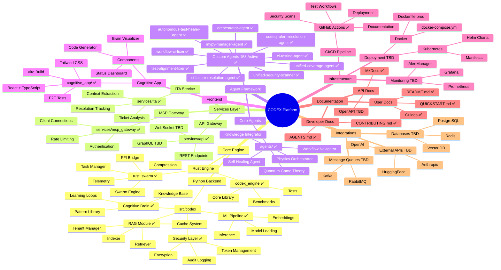
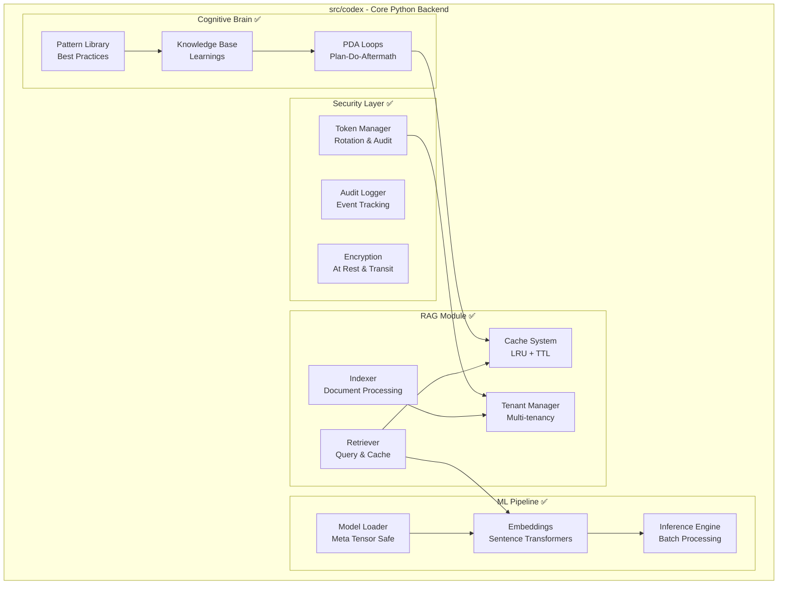
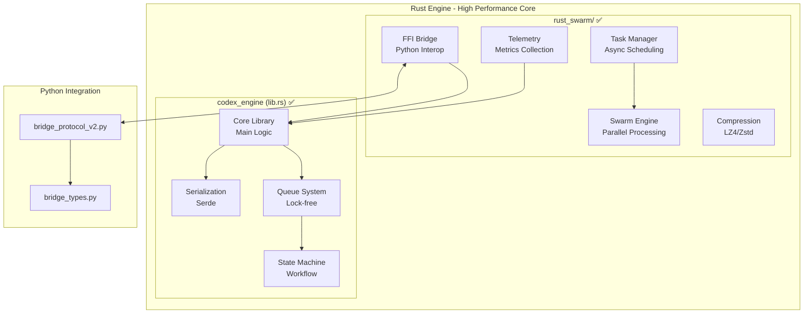
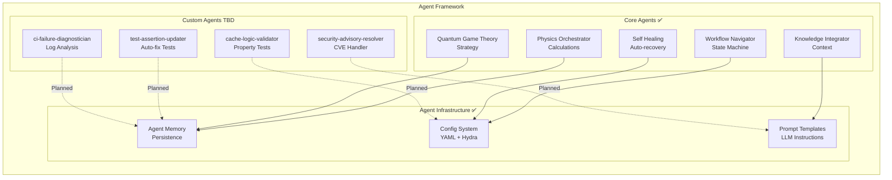
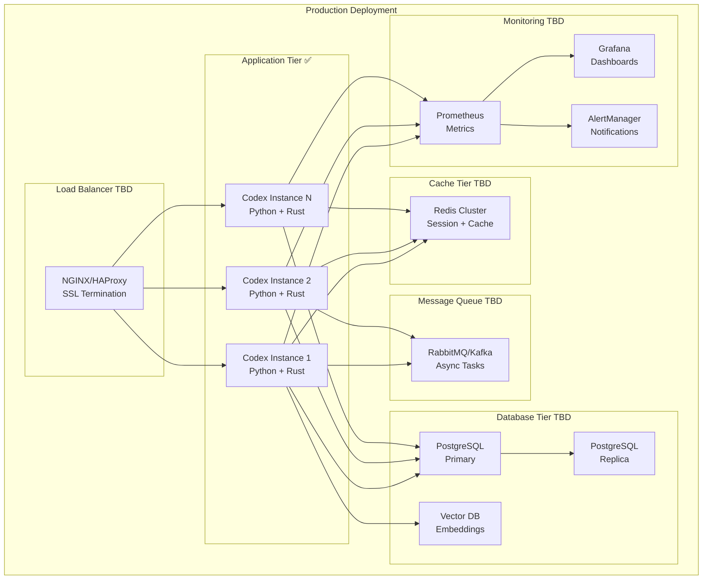
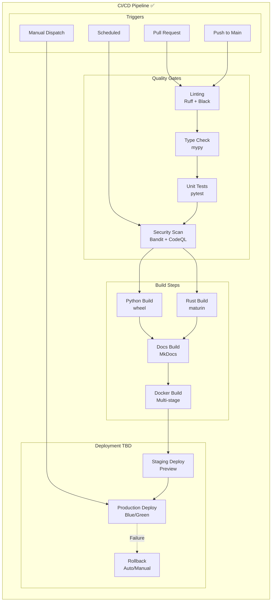
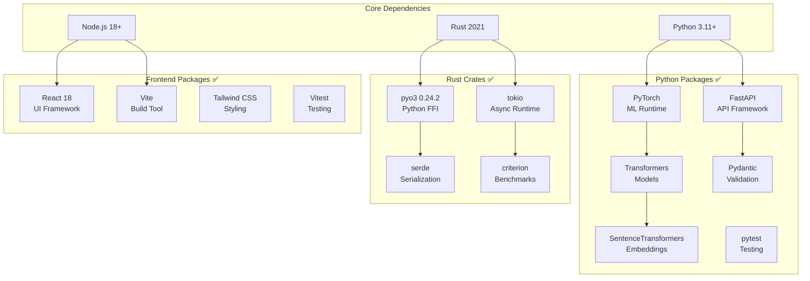
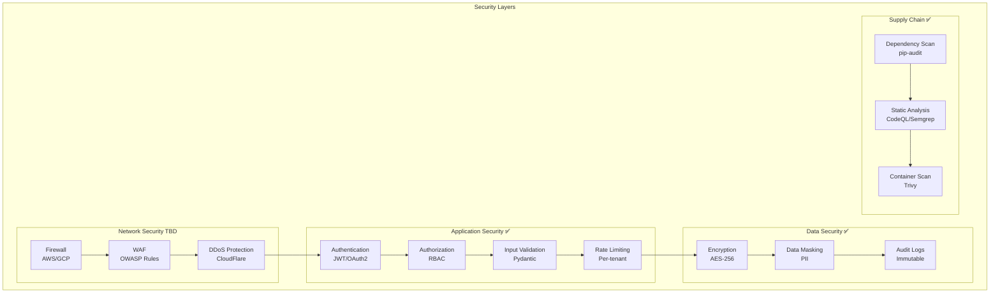
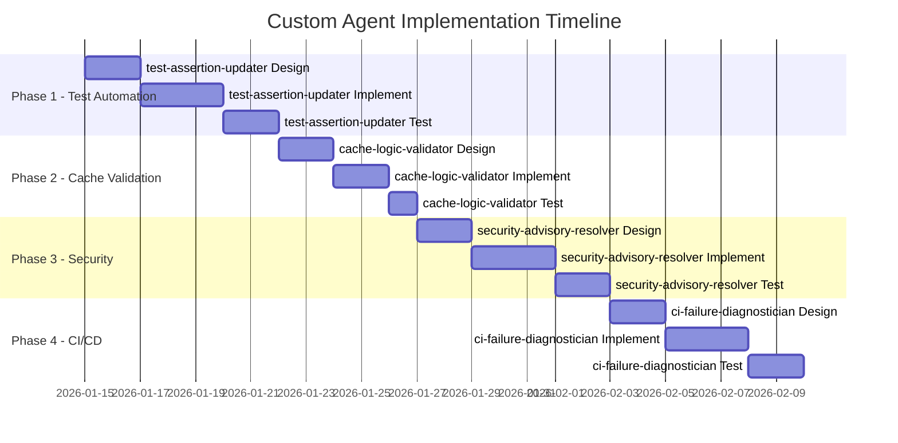

# 🧠 Codex Production-Ready Codebase Mindmap
> **Version**: 2.1.0
> **Generated**: 2026-01-11T09:52:00Z
> **Last updated**: 2026-05-14T00:45Z (S1003-ctep)
> **Status**: Production-Ready with Optional Integrations

---

## 📊 Complete System Architecture Mindmap

---

## 🏗️ Detailed Component Architecture

### Core Python Backend

### Rust Engine Architecture

### Agent Framework Architecture

---

## 🚀 Deployment Architecture

---

## 🔄 CI/CD Pipeline Architecture

---

## 📦 Module Dependency Graph

---

## 🔐 Security Architecture

---

## 🎯 Custom Agent Implementation Roadmap

---

## 📈 Production Readiness Status

| Component | Status | Readiness | Notes |
|-----------|--------|-----------|-------|
| **RAG Module** | ✅ Complete | 95% | Cache logic validated |
| **Rust Engine** | ✅ Complete | 98% | Security patched (pyo3 0.24.2) |
| **Cognitive Brain** | ✅ Complete | 100% | Patterns documented |
| **Agent Framework** | ✅ Complete | 90% | Core agents operational |
| **Custom Agents** | 🔶 Planned | 0% | Plansets complete, implementation pending |
| **Frontend** | ✅ Complete | 85% | E2E tests in place |
| **API Gateway** | ✅ Complete | 90% | Rate limiting active |
| **Monitoring** | 🔶 TBD | 20% | Basic metrics only |
| **Production Deploy** | 🔶 TBD | 30% | Docker ready, K8s pending |
| **External APIs** | 🔶 TBD | 0% | Integration interfaces defined |

---

## 🔮 Future Integration Points (TBD)

### External AI Services
- **OpenAI API**: GPT-4 for advanced reasoning
- **Anthropic Claude**: Alternative LLM provider
- **HuggingFace Inference**: Model hosting
- **Cohere**: Embeddings and reranking

### Database Integrations
- **PostgreSQL**: Primary data store
- **Redis**: Caching and sessions
- **Pinecone/Weaviate**: Vector database
- **ElasticSearch**: Full-text search

### Observability Stack
- **Prometheus**: Metrics collection
- **Grafana**: Visualization
- **Jaeger**: Distributed tracing
- **ELK Stack**: Log aggregation

### Message Queues
- **RabbitMQ**: Task queues
- **Apache Kafka**: Event streaming
- **Redis Streams**: Lightweight messaging

---

## ✅ Legend

| Symbol | Meaning |
|--------|---------|
| ✅ | Complete and Production Ready |
| 🔶 | In Progress or Planned |
| TBD | To Be Developed (Future Scope) |
| ⚠️ | Requires Attention |

---

*Generated by Cognitive Brain - CI Validation Session*
*Last updated: 2026-02-10*
