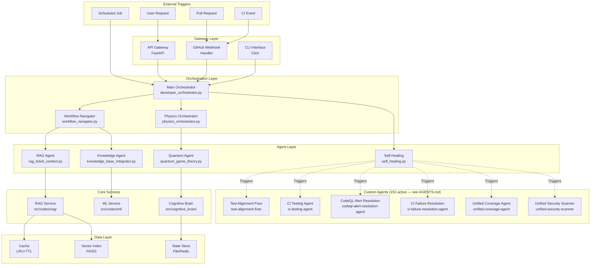
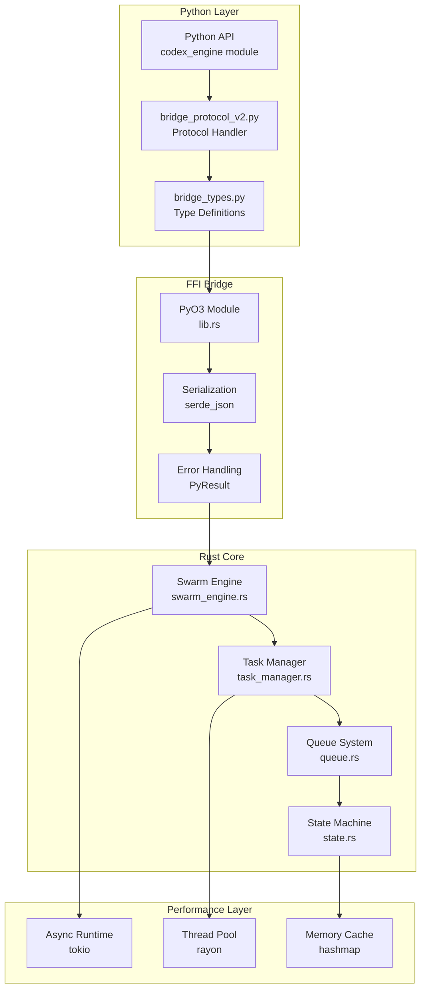
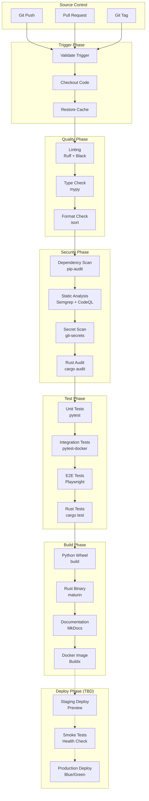
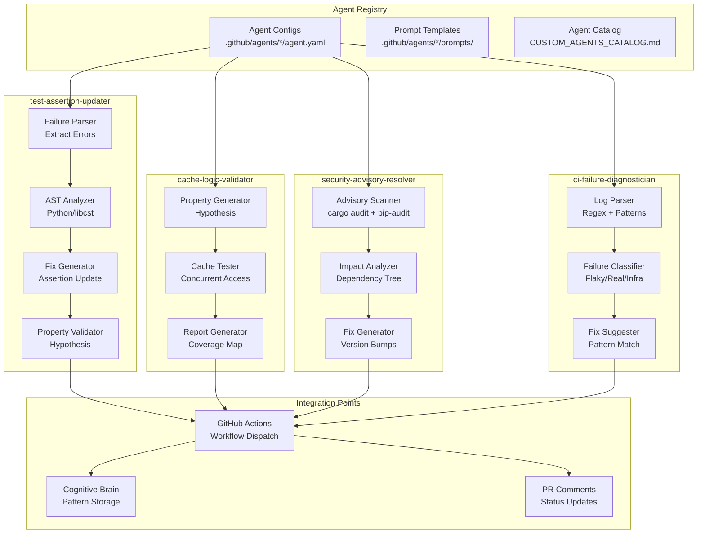
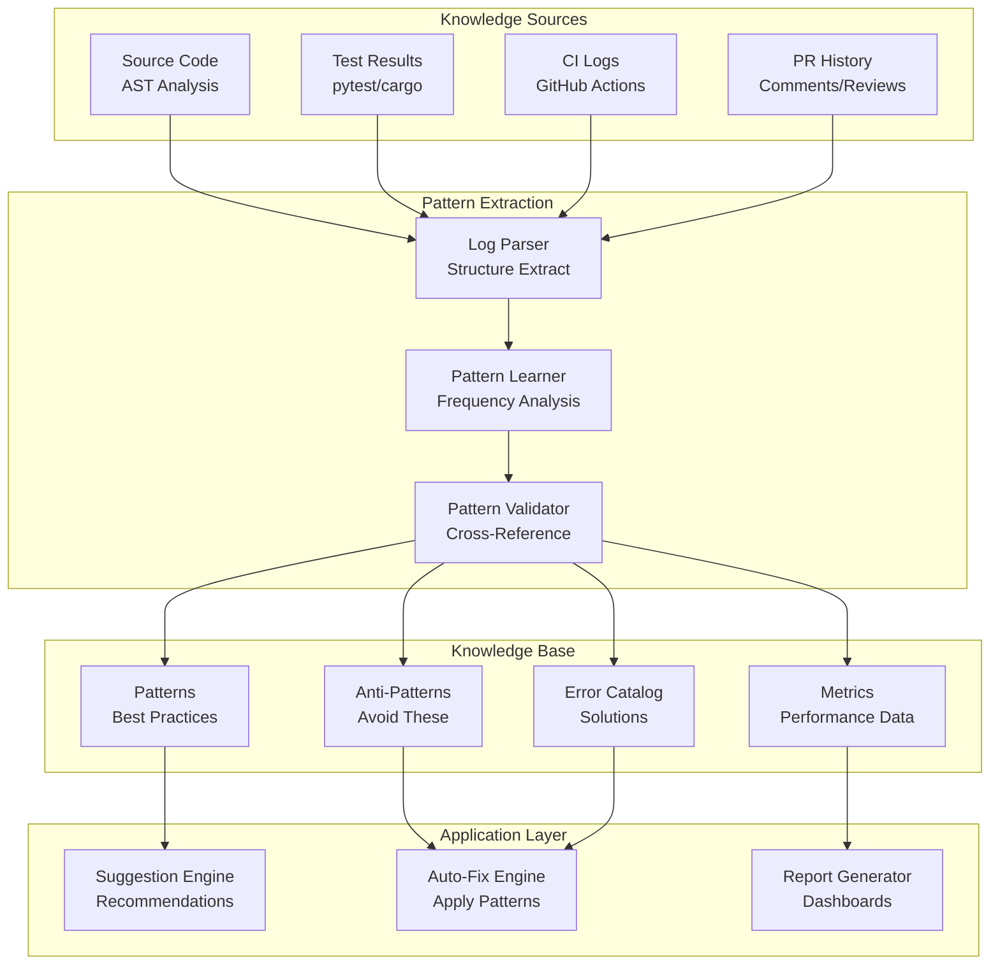
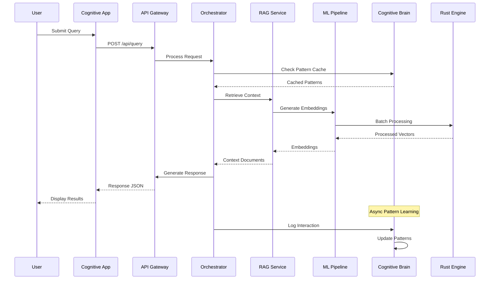
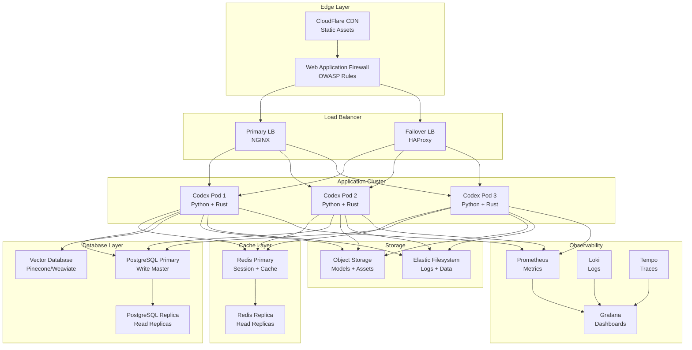

# 🔄 System Integration Flow Diagrams
> **Version**: 2.1.0
> **Generated**: 2026-01-11T10:00:00Z
> **Last updated**: 2026-05-14T00:30Z (S1003-ctep — agent count 153, CI self-healing hardened)
> **Purpose**: Complete flow diagrams for all system integrations

---

## 1. Complete Agent Orchestration Flow

---

## 2. RAG Pipeline Data Flow

```mermaid
flowchart LR
    subgraph "Input"
        IN_QUERY[User Query]
        IN_DOC[Documents]
        IN_CTX[Context]
    end

    subgraph "Preprocessing"
        PRE_CHUNK[Chunker<br/>Split Text]
        PRE_CLEAN[Cleaner<br/>Normalize]
        PRE_TOK[Tokenizer<br/>Encode]
    end

    subgraph "Embedding Layer"
        EMB_MODEL[SentenceTransformer<br/>all-MiniLM-L6-v2]
        EMB_CACHE[Embedding Cache<br/>LRU + TTL]
        EMB_BATCH[Batch Processor<br/>Async]
    end

    subgraph "Retrieval Layer"
        RET_INDEX[Vector Index<br/>FAISS/Annoy]
        RET_SEARCH[Semantic Search<br/>Top-K]
        RET_RERANK[Reranker<br/>Cross-Encoder]
    end

    subgraph "Generation Layer"
        GEN_PROMPT[Prompt Builder<br/>Templates]
        GEN_LLM[LLM API<br/>OpenAI/Local]
        GEN_POST[Post-Process<br/>Format]
    end

    subgraph "Output"
        OUT_RESP[Response]
        OUT_CITE[Citations]
        OUT_META[Metadata]
    end

    IN_QUERY --> PRE_CLEAN
    IN_DOC --> PRE_CHUNK
    IN_CTX --> PRE_CLEAN

    PRE_CHUNK --> PRE_TOK
    PRE_CLEAN --> PRE_TOK

    PRE_TOK --> EMB_MODEL
    EMB_MODEL --> EMB_CACHE
    EMB_CACHE --> EMB_BATCH

    EMB_BATCH --> RET_INDEX
    RET_INDEX --> RET_SEARCH
    RET_SEARCH --> RET_RERANK

    RET_RERANK --> GEN_PROMPT
    GEN_PROMPT --> GEN_LLM
    GEN_LLM --> GEN_POST

    GEN_POST --> OUT_RESP
    GEN_POST --> OUT_CITE
    GEN_POST --> OUT_META
```

---

## 3. Rust-Python Bridge Architecture

---

## 4. CI/CD Complete Pipeline

---

## 5. Custom Agent Implementation Architecture

---

## 6. Cognitive Brain Knowledge Graph

---

## 7. End-to-End Request Flow

---

## 8. Deployment Topology (TBD)

---

## Legend

| Symbol | Meaning |
|--------|---------|
| Solid Arrow | Active Connection |
| Dashed Arrow | Planned/TBD Connection |
| Green Fill | Production Ready |
| Yellow Fill | In Progress |
| Gray Fill | TBD (Future) |

---

*Generated by CI Testing Agent - System Integration Diagrams*
*Last updated: 2026-05-14 (S1003-ctep) — v2.1.0*
