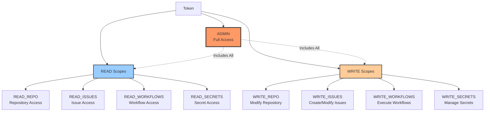
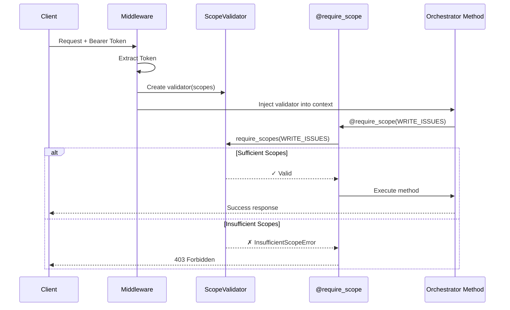

# Scope Validation Hierarchy

## Overview

This diagram shows the hierarchical token scope system for fine-grained authorization across the cognitive platform.

## Scope Hierarchy



## Scope Composition

### Bitwise Flags

```python
class TokenScope(IntFlag):
    """Token scope flags (bitwise)."""
    NONE = 0
    
    # Read scopes (0x01-0x0F)
    READ_REPO = 1 << 0      # 0x0001
    READ_ISSUES = 1 << 1    # 0x0002
    READ_WORKFLOWS = 1 << 2 # 0x0004
    READ_SECRETS = 1 << 3   # 0x0008
    
    # Write scopes (0x10-0xF0)
    WRITE_REPO = 1 << 4     # 0x0010
    WRITE_ISSUES = 1 << 5   # 0x0020
    WRITE_WORKFLOWS = 1 << 6 # 0x0040
    WRITE_SECRETS = 1 << 7  # 0x0080
    
    # Admin scope (all bits)
    ADMIN = 0xFFFF
```

### Scope Combinations

```mermaid
flowchart LR
    S1[READ_REPO] -->|OR| C1[READ_REPO |\nREAD_ISSUES]
    S2[READ_ISSUES] -->|OR| C1
    
    S3[WRITE_ISSUES] -->|OR| C2[WRITE_ISSUES |\nADMIN]
    S4[ADMIN] -->|OR| C2
    
    C1 --> V1[Validator]
    C2 --> V2[Validator]
    
    V1 -->|Check| OP1[query_knowledge_base]
    V2 -->|Check| OP2[create_ticket]
    
    style C1 fill:#9f9,stroke:#333,stroke-width:2px
    style C2 fill:#9f9,stroke:#333,stroke-width:2px
```

## Validation Flow



## Operation → Scope Mapping

### Orchestrator Operations

| Operation | Required Scope | Alternate Scope | Description |
|-----------|---------------|-----------------|-------------|
| `query_knowledge_base()` | `READ_REPO` | - | Search knowledge base |
| `prioritize_tickets()` | `READ_ISSUES` | - | View ticket priorities |
| `create_ticket()` | `WRITE_ISSUES` | `ADMIN` | Create new ticket |
| `execute_cycle()` | `WRITE_WORKFLOWS` | `ADMIN` | Execute orchestration |
| `delete_artifact()` | `ADMIN` | - | Delete any artifact |

### Token Rotation Operations

| Operation | Required Scope | Alternate Scope | Description |
|-----------|---------------|-----------------|-------------|
| `list_tokens()` | `READ_SECRETS` | `ADMIN` | List managed tokens |
| `register_token()` | `WRITE_SECRETS` | `ADMIN` | Register new token |
| `rotate_token()` | `WRITE_SECRETS` | `ADMIN` | Rotate existing token |
| `delete_token()` | `ADMIN` | - | Delete token permanently |

## Decorator Usage

### Single Scope Requirement

```python
from security.decorators import require_scope
from security.scope_validator import TokenScope

@require_scope(TokenScope.READ_REPO)
async def query_knowledge_base(query: str) -> dict:
    """Requires READ_REPO scope."""
    return {"results": [...]}
```

### Multiple Scope Options (OR)

```python
@require_scope(TokenScope.WRITE_ISSUES | TokenScope.ADMIN)
async def create_ticket(subject: str) -> int:
    """Requires WRITE_ISSUES OR ADMIN scope."""
    return ticket_id
```

### Multiple Scopes Required (AND)

```python
from security.decorators import require_all_scopes

@require_all_scopes([TokenScope.READ_REPO, TokenScope.WRITE_ISSUES])
async def create_issue_from_docs(query: str) -> int:
    """Requires both READ_REPO AND WRITE_ISSUES."""
    # Search docs, create issue
    return issue_id
```

## Context-Based Validation

### FastAPI Integration

```python
from fastapi import Depends, HTTPException
from security.decorators import scope_validator_dependency

app = FastAPI()

@app.middleware("http")
async def inject_scope_validator(request: Request, call_next):
    """Extract token and inject scope validator."""
    token = request.headers.get("Authorization", "").replace("Bearer ", "")
    scopes = extract_scopes_from_token(token)
    validator = ScopeValidator(scopes)
    
    # Inject into context
    _scope_validator_ctx.set(validator)
    
    response = await call_next(request)
    return response

@app.post("/tickets")
async def create_ticket(
    data: TicketCreate,
    orchestrator: ZendeskQuantumOrchestrator = Depends(get_orchestrator),
):
    """Create ticket - scope checked by orchestrator."""
    # orchestrator.create_ticket checks WRITE_ISSUES scope automatically
    return orchestrator.create_ticket(**data.dict())
```

## Token Scope Extraction

### JWT Token

```python
def extract_scopes_from_jwt(token: str) -> TokenScope:
    """Extract scopes from JWT token."""
    import jwt
    
    payload = jwt.decode(token, verify=False)  # In prod: verify signature
    scope_strings = payload.get("scope", "").split()
    
    scopes = TokenScope.NONE
    for scope_str in scope_strings:
        scopes |= TokenScope.from_string(scope_str)
    
    return scopes
```

### GitHub Token

```python
def extract_scopes_from_github_token(token: str) -> TokenScope:
    """Extract scopes from GitHub PAT."""
    # Query GitHub API for token scopes
    response = requests.get(
        "https://api.github.com/user",
        headers={"Authorization": f"Bearer {token}"}
    )
    
    # Map GitHub scopes to TokenScope
    gh_scopes = response.headers.get("X-OAuth-Scopes", "").split(", ")
    
    scopes = TokenScope.NONE
    if "repo" in gh_scopes:
        scopes |= TokenScope.READ_REPO | TokenScope.WRITE_REPO
    if "workflow" in gh_scopes:
        scopes |= TokenScope.WRITE_WORKFLOWS
    
    return scopes
```

## Privilege Escalation Prevention

### Validation Rules

1. **No Implicit Escalation**: Read scope doesn't grant write
2. **Explicit Requirements**: Each operation declares required scopes
3. **Context Isolation**: Scopes bound to request context
4. **Immutable Tokens**: Scope changes require new token
5. **Audit Trail**: All scope checks logged

### Anti-Patterns to Avoid

```python
# ❌ BAD: No scope check
async def delete_artifact(artifact_id: str):
    # Anyone can delete!
    db.delete(artifact_id)

# ✅ GOOD: Explicit scope requirement
@require_scope(TokenScope.ADMIN)
async def delete_artifact(artifact_id: str):
    # Only admins can delete
    db.delete(artifact_id)
```

## Monitoring & Auditing

### Metrics

- Scope validation attempts (success, failure)
- Most common insufficient scope errors
- Scope usage by operation
- Token scope distribution

### Audit Log

```json
{
  "timestamp": "2026-01-09T22:50:00Z",
  "operation": "create_ticket",
  "required_scope": "WRITE_ISSUES|ADMIN",
  "provided_scope": "READ_REPO",
  "result": "denied",
  "user_id": "user@example.com",
  "request_id": "req_abc123"
}
```

## References

- **Implementation**: `src/security/scope_validator.py`
- **Decorators**: `src/security/decorators.py`
- **Tests**: `tests/security/test_scope_validation.py`
