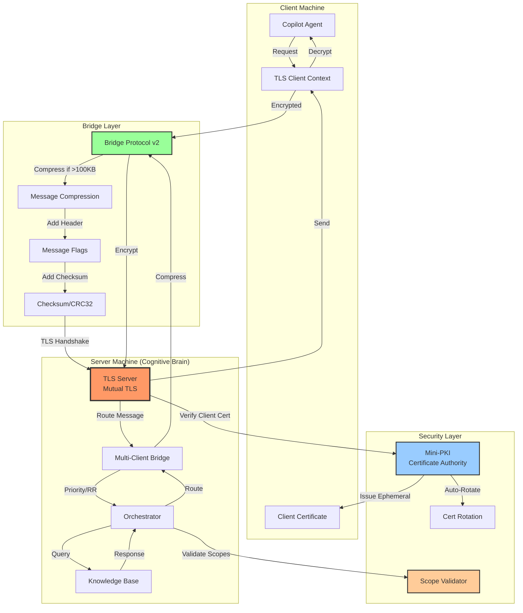

# TLS Bridge Architecture

## Overview

This diagram illustrates the secure TLS bridge architecture for cross-machine cognitive-copilot communication using Bridge Protocol v2.

## Architecture Diagram

## Communication Flow

### 1. Client → Server (Request)

1. **Copilot Agent** initiates request
2. **TLS Client Context** establishes encrypted connection
3. **Bridge Protocol v2** encodes message:
   - Checks payload size (>100KB triggers compression)
   - Adds protocol header (magic, version, flags, length)
   - Computes CRC32 checksum
4. **TLS Handshake** with mutual authentication
5. **Multi-Client Bridge** routes based on priority/round-robin
6. **Scope Validator** checks token permissions
7. **Orchestrator** processes request

### 2. Server → Client (Response)

1. **Orchestrator** generates response
2. **Bridge Protocol v2** encodes (compression if needed)
3. **TLS Layer** encrypts and sends
4. **Client** receives, decrypts, and decodes

## References

- **Implementation**: `src/bridge_protocol_v2.py`, `src/bridge_manager.py`
- **TLS Config**: `src/security/tls_config.py`
- **Tests**: `tests/test_bridge_protocol_v2.py`
