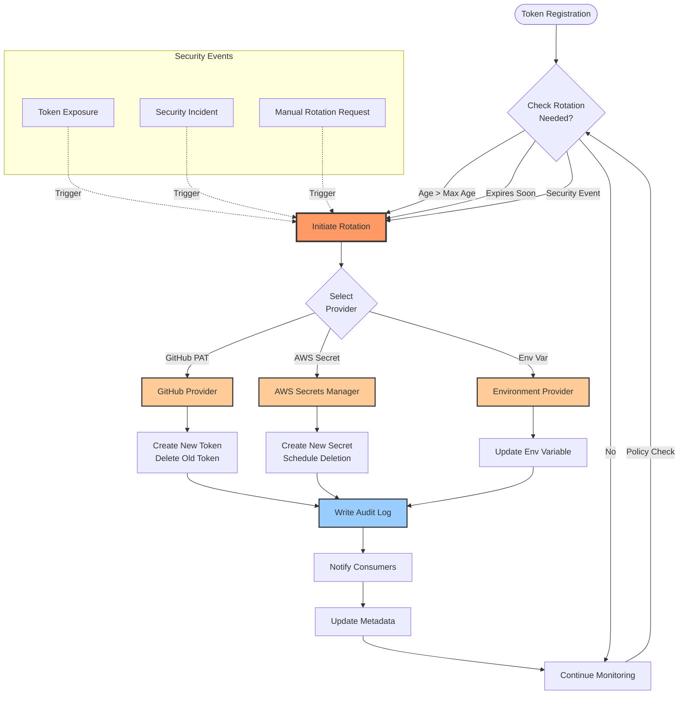
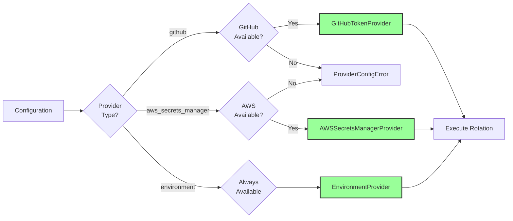

# Multi-Provider Token Rotation Workflow

## Overview

This diagram shows the automated token rotation workflow across multiple cloud providers (GitHub, AWS, Environment) with audit trail and security event handling.

## Workflow Diagram



## Rotation Triggers

### 1. Age-Based Rotation

```python
if token_age > policy.max_age_days:
    trigger = RotationTrigger.SCHEDULED
    rotate_token()
```

### 2. Expiration-Based Rotation

```python
if days_until_expiry < policy.rotate_before_expiry_days:
    trigger = RotationTrigger.PRE_EXPIRY
    rotate_token()
```

### 3. Security Event Rotation

```python
if event_type == "exposure" and policy.auto_rotate_on_exposure:
    trigger = RotationTrigger.SECURITY_EVENT
    rotate_token()
```

## Provider Selection Logic



## Audit Trail Structure

```json
{
  "event_id": "rot_abc123",
  "timestamp": "2026-01-09T22:45:00Z",
  "trigger": "scheduled",
  "token_id": "github-pat-1",
  "token_hash": "sha256:...",
  "provider": "github",
  "old_token_hash": "sha256:...",
  "new_token_hash": "sha256:...",
  "rotation_count": 5,
  "metadata": {
    "expires_at": "2026-04-09T22:45:00Z",
    "scopes": ["repo", "workflow"]
  }
}
```

## Configuration Example

```yaml
# Token Rotation Policy
rotation_policy:
  max_age_days: 90
  rotate_before_expiry_days: 14
  min_rotation_interval_hours: 1
  auto_rotate_on_exposure: true
  auto_rotate_on_incident: true
  
# Provider Configuration
providers:
  - type: github
    config:
      base_url: "https://api.github.com"
      app_id: "${GITHUB_APP_ID}"
      installation_id: "${GITHUB_INSTALLATION_ID}"
      
  - type: aws_secrets_manager
    config:
      region: "us-east-1"
      secret_prefix: "codex/"
      
  - type: environment
    config:
      prefix: "CODEX_"
```

## References

- **Implementation**: `src/security/token_rotation.py`
- **Providers**: `src/security/providers/`
- **Tests**: `tests/security/test_token_rotation.py`
