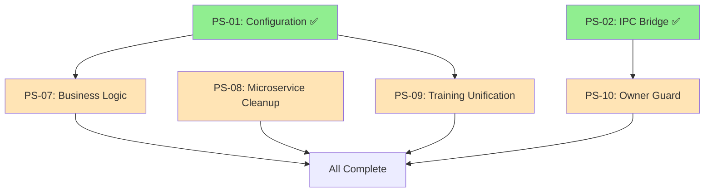
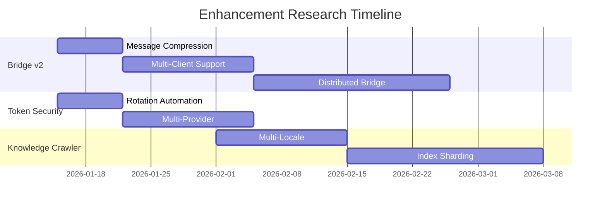

# PS-07-10 Implementation Roadmap & Research Plans

**Plansets:** PS-07, PS-08, PS-09, PS-10  
**Priority:** P1-P2  
**Status:** 📋 Ready for Implementation  
**Created:** 2026-01-09  
**Branch:** copilot/review-next-planset-phases

---

## Executive Summary

This document provides comprehensive implementation roadmaps for the remaining plansets (PS-07 through PS-10), including detailed task breakdowns, code specifications, and research guidance for optimal implementation.

---

## PS-07: Business Logic Elevation (D365 SLA)

**Priority:** P1 - High  
**Status:** 📋 Planned  
**Dependencies:** PS-01 (Configuration) ✅  
**Estimated Cycles:** 2

### Context

SLA business logic is currently hardcoded in CSV format at `configs/deployment/d365/slas.csv`. This violates the cognitive brain principle of "Schema Authority" - all business rules should be in validated, type-safe code.

### Implementation Plan

#### Cycle 1: Schema Design & Model Creation

**Tasks:**
- [ ] Create `src/codex/dynamics/model/sla.py`
- [ ] Define `SLAPolicy` Pydantic model
- [ ] Define `SLATier` enum
- [ ] Create validation functions
- [ ] Add unit tests

**Code Specification:**

```python
# src/codex/dynamics/model/sla.py
from __future__ import annotations

from enum import Enum
from pydantic import BaseModel, Field, validator
from datetime import timedelta
from typing import Optional

class SLATier(str, Enum):
    """SLA tier definitions for D365 integration."""
    PLATINUM = "platinum"
    GOLD = "gold"
    SILVER = "silver"
    BRONZE = "bronze"
    
    @property
    def priority_weight(self) -> float:
        weights = {
            self.PLATINUM: 1.0,
            self.GOLD: 0.8,
            self.SILVER: 0.6,
            self.BRONZE: 0.4
        }
        return weights[self]

class SLAPolicy(BaseModel):
    """Validated SLA policy definition."""
    
    name: str = Field(..., min_length=1, max_length=100)
    tier: SLATier
    response_time_hours: int = Field(..., ge=1, le=720)
    resolution_time_hours: int = Field(..., ge=1, le=2160)
    escalation_threshold_hours: int = Field(..., ge=1)
    business_hours_only: bool = True
    auto_escalate: bool = True
    
    @validator('resolution_time_hours')
    def resolution_after_response(cls, v, values):
        if 'response_time_hours' in values and v < values['response_time_hours']:
            raise ValueError('Resolution time must be >= response time')
        return v
    
    @property
    def response_deadline(self) -> timedelta:
        return timedelta(hours=self.response_time_hours)
    
    @property
    def resolution_deadline(self) -> timedelta:
        return timedelta(hours=self.resolution_time_hours)
```

#### Cycle 2: Migration & Validation

**Tasks:**
- [ ] Parse existing CSV data
- [ ] Create policy instances in code
- [ ] Delete/archive CSV file
- [ ] Update D365 integration to use models
- [ ] Integration tests

---

## PS-08: Microservice Root Cleanup

**Priority:** P1 - High  
**Status:** 📋 Planned  
**Dependencies:** None  
**Estimated Cycles:** 2

### Context

`audio_cleaner_v1/` directory violates the monolith structure. Per cognitive brain architecture, all services should live under `src/services/`.

### Implementation Plan

#### Cycle 1: Code Migration

**Tasks:**
- [ ] Create `src/services/audio/` directory
- [ ] Move `audio_cleaner_v1/src/*` to new location
- [ ] Update all import paths
- [ ] Create `configs/services/audio.yaml`

**Directory Transformation:**
```
BEFORE:
audio_cleaner_v1/
├── src/
│   ├── cleaner.py
│   └── filters.py
└── config.yaml

AFTER:
src/services/audio/
├── __init__.py
├── cleaner.py
└── filters.py
configs/services/audio.yaml
```

#### Cycle 2: Cleanup & Documentation

**Tasks:**
- [ ] Delete `audio_cleaner_v1/` directory
- [ ] Update documentation references
- [ ] Verify all tests pass
- [ ] Update `.gitignore` if needed

---

## PS-09: Training Entry Point Unification

**Priority:** P1 - High  
**Status:** 📋 Planned  
**Dependencies:** PS-01 (Configuration) ✅  
**Estimated Cycles:** 2

### Context

Split Brain exists between:
- `cli/train_codex.py` (legacy, argparse-based)
- `src/codex_ml/training/unified_training.py` (modern, Hydra-ready)

### Implementation Plan

#### Cycle 1: Modern Entry Point Creation

**Tasks:**
- [ ] Create `src/codex_ml/cli/train.py`
- [ ] Implement `@hydra.main` decorator
- [ ] Invoke `UnifiedTrainer` class
- [ ] Centralize logging/checkpointing

**Code Specification:**

```python
# src/codex_ml/cli/train.py
"""Unified training entry point with Hydra configuration."""

from __future__ import annotations

import hydra
from omegaconf import DictConfig

from codex_ml.training.unified_training import UnifiedTrainer

@hydra.main(version_base=None, config_path="../../configs", config_name="train")
def main(cfg: DictConfig) -> None:
    """Main training entry point.
    
    Args:
        cfg: Hydra configuration containing:
            - model: Model configuration
            - training: Training parameters
            - data: Dataset configuration
            - logging: Logging settings
    """
    trainer = UnifiedTrainer(cfg)
    trainer.train()

if __name__ == "__main__":
    main()
```

#### Cycle 2: Legacy Deprecation

**Tasks:**
- [ ] Mark `cli/train_codex.py` as deprecated
- [ ] Add deprecation warning
- [ ] Update documentation
- [ ] Create migration guide

---

## PS-10: Owner Guard CI/CD Enforcement

**Priority:** P2 - Medium  
**Status:** 📋 Planned  
**Dependencies:** PS-02 (Secure Bridge) ✅  
**Estimated Cycles:** 1

### Context

`scripts/ci/owner_approval_guard.sh` exists but is not enforced in the autonomous workflow. This is a critical security control.

### Implementation Plan

**Tasks:**
- [ ] Modify `.github/workflows/autonomous-agent.yml`
- [ ] Add guard step before execution
- [ ] Fail fast without `human-approved` label
- [ ] Add audit logging

**Workflow Modification:**

```yaml
# .github/workflows/autonomous-agent.yml
jobs:
  execute:
    runs-on: ubuntu-latest
    steps:
      - name: Checkout
        uses: actions/checkout@v4
        
      - name: Owner Approval Guard
        run: |
          bash scripts/ci/owner_approval_guard.sh
          if [ $? -ne 0 ]; then
            echo "::error::PR not approved by owner - deployment blocked"
            exit 1
          fi
        env:
          GITHUB_TOKEN: ${{ secrets.GITHUB_TOKEN }}
          
      # ... rest of workflow
```

---

## Enhancement Research Plansets

### Bridge Protocol v2 Enhancements

**Research Areas:**
1. **Message Compression** - Implement zlib/lz4 for large payloads
2. **Multi-Client Support** - Allow multiple Copilot instances
3. **Distributed Bridge** - Cross-machine TLS communication
4. **Bridge Analytics** - Performance and security dashboards

**Implementation Priority:** MEDIUM  
**Estimated Effort:** 4-6 cycles

### Token Security Enhancements

**Research Areas:**
1. **Token Rotation Automation** - Auto-rotate on security events
2. **Scope Validation Library** - Reusable scope checking
3. **Multi-Provider Support** - GitLab, Bitbucket tokens
4. **Token Analytics** - Usage patterns dashboard

**Implementation Priority:** HIGH  
**Estimated Effort:** 3-4 cycles

### Knowledge Crawler Enhancements

**Research Areas:**
1. **Multi-Locale Optimization** - Parallel sync for locales
2. **Change Webhooks** - Real-time Zendesk webhooks
3. **Content Diffing** - Detect partial article changes
4. **Index Sharding** - 100k+ article support

**Implementation Priority:** MEDIUM  
**Estimated Effort:** 6-8 cycles

---

## CI/CD Copilot Agent Deployment

### Agents Ready for Deployment

| Agent | Location | Trigger | Status |
|-------|----------|---------|--------|
| Performance Regression Detector | `.github/copilot/agents/performance-regression-detector.yml` | CI completion | 📋 Ready |
| Doc Freshness Checker | `.github/copilot/agents/doc-freshness-checker.yml` | PR/Schedule | 📋 Ready |
| Dependency Vulnerability Scanner | `.github/copilot/agents/dependency-vulnerability-scanner.yml` | Daily | 📋 Ready |
| Integration Test Runner | `.github/copilot/agents/integration-test-runner.yml` | PR | 📋 Ready |

### Deployment Steps

1. **Enable GitHub Actions Integration**
   - Review agent YAML files
   - Remove `if: false` guards when ready
   - Configure required secrets

2. **Test in Staging**
   - Run agents on non-critical branches
   - Validate output and behavior
   - Tune thresholds

3. **Production Rollout**
   - Enable on main branch
   - Monitor for false positives
   - Collect feedback

---

## Mermaid Diagrams

### PS-07-10 Dependency Graph



### Enhancement Research Roadmap



---

## Success Metrics

### PS-07-10 Completion Criteria

| Planset | Key Metric | Target | Verification |
|---------|------------|--------|--------------|
| PS-07 | CSV Eliminated | 0 business CSVs | `find . -name "*.csv" -path "*d365*"` |
| PS-08 | Root Cleaned | No service dirs | `ls -d */` check |
| PS-09 | Single Entry | 1 training CLI | Import validation |
| PS-10 | Guard Active | 100% PRs checked | Workflow logs |

### Overall Repository Health

| Metric | Before | After Target |
|--------|--------|--------------|
| Split Brain Issues | 3 | 0 |
| Root-level Services | 1 | 0 |
| Training Entry Points | 2 | 1 |
| Unguarded Deployments | Possible | 0 |

---

## Next Steps

### Immediate (Next Session)
1. Begin PS-07 implementation (SLA models)
2. Review audio_cleaner_v1 for PS-08
3. Prepare PS-09 Hydra migration

### Short-term (Next Week)
1. Complete PS-07, PS-08, PS-09, PS-10
2. Deploy Copilot agents to CI/CD
3. Begin enhancement research

### Medium-term (Next Month)
1. Implement Bridge v2 enhancements
2. Token rotation automation
3. Knowledge crawler improvements

---

## Related Documentation

- `.github/plans/PLANSET_07_10_CONSOLIDATED.md` - Original planset
- `.github/plans/INDEX.md` - Master planset index
- `.codex/cognitive_brain/` - Status documents
- `.github/copilot/agents/` - Agent definitions

---

**Maintained By:** GitHub Copilot  
**Last Updated:** 2026-01-09
