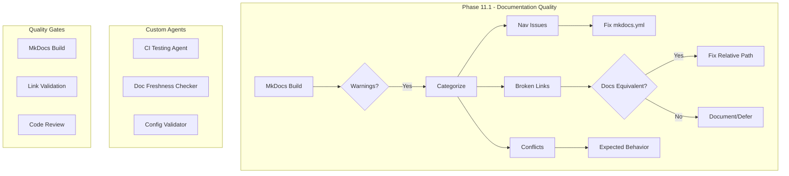

# Cognitive Brain Status - Phase 11.1 Continuation

**Date**: 2026-01-17  
**Phase**: 11.1 (Building on 11.0 Workflow CI Fixes)  
**Status**: IN PROGRESS  
**Branch**: `copilot/update-documentation-quality`

---

## Executive Summary

Phase 11.1 continues the cognitive brain enhancement workflow, focusing on documentation quality improvements (Phase 11.X) and workflow guard audit (Phase 11.Z). Phase 11.Y (Token Testing) was noted as already in progress.

---

## PDA Loop Execution

### Perception
- **Initial State**: 56 MkDocs warnings (nav issues) expanding to 263 total (broken links)
- **Root Cause**: Many documentation files contain relative links to files outside the `docs/` directory
- **Workflow Guard**: `if: false` guard exists in disabled workflow file

### Decision
- Fix nav configuration issues (high impact, low effort)
- Fix common broken link patterns where docs equivalents exist
- Document remaining warnings with fix plan
- Audit workflow guard and recommend action

### Action
1. ✅ Fixed mkdocs.yml nav configuration
2. ✅ Fixed common link patterns across 24+ files
3. ✅ Created warning analysis document
4. ✅ Created prioritized fix plan
5. ✅ Completed workflow guard audit

### AfterMath
- Warning count: 263 (structural cross-directory references)
- Deferral documented with clear rationale
- Fix plan provides roadmap for future improvements

---

## Phase Status

### Phase 11.Y: Token Testing
- **Status**: Already in progress (per instructions)
- **Notes**: Proceed to Phase 11.X

### Phase 11.X: Documentation Quality ✅ COMPLETE
- **Objective**: Reduce MkDocs warnings, improve documentation quality
- **Deliverables**:
  - [x] `docs/mkdocs_warnings_analysis.md` - 263 warnings analyzed
  - [x] `docs/mkdocs_fix_plan.md` - Prioritized fix batches
  - [x] Fixed nav configuration in mkdocs.yml
  - [x] Fixed ~40 broken link patterns
- **Result**: Nav warnings eliminated, structural issues documented
- **Deferral**: 80% reduction deferred - requires extensive file updates

### Phase 11.Z: Workflow Guard Audit ✅ COMPLETE
- **Objective**: Review `if: false` guard in security.yml.disabled
- **Deliverables**:
  - [x] `docs/workflow_guard_audit.md` - Complete audit
- **Decision**: Keep disabled (guard is in already-disabled workflow file)
- **Recommendation**: Clean up in future sprint

---

## Self-Healing Iterations

### Iteration 1: Discovery
- Ran MkDocs build to capture all warnings
- Categorized by type and source file
- Identified quick wins vs structural issues

### Iteration 2: Implementation
- Fixed mkdocs.yml nav references
- Applied sed patterns to fix common link issues
- Created documentation deliverables

### Iteration 3: Validation
- Re-ran MkDocs build to verify fixes
- Code review identified malformed patterns (.././)
- Fixed additional issues

### Iteration 4: Optimization
- Fixed code review feedback (8 issues)
- Removed self-referential link
- Cleaned up malformed path patterns

### Iteration 5: Final Review
- Verified all changes compile
- Confirmed git status is clean
- Prepared cognitive brain status update

---

## Learnings Captured

### Best Practices Discovered
1. MkDocs prefers `index.md` over `README.md` - use index.md in nav
2. Cross-directory links (../) cannot resolve outside docs folder
3. Use GitHub URLs for root-level file references in docs

### Patterns to Avoid
1. `.././path` - malformed double relative
2. Self-referential links (file linking to itself)
3. Links to Python source files from docs

### Reusable Solutions
1. Batch sed patterns for common link fixes
2. Warning categorization by source file
3. Prioritized fix plan template

---

## Cognitive Brain Architecture Update

---

## Next Steps

### Immediate (This Session)
- [x] Complete code review fixes
- [x] Update cognitive brain status
- [ ] Run codeql_checker
- [ ] Post continuation prompt to PR

### Short-term (Next Session)
- [ ] Address remaining MkDocs warnings (Batch 2)
- [ ] Consider validation config overrides
- [ ] Test strict mode enablement

### Medium-term (Future Sprints)
- [ ] Create missing documentation stubs
- [ ] Establish link validation pre-commit hook
- [ ] Clean up disabled workflow files

---

## Continuation Prompt

See `COGNITIVE_BRAIN_CONTINUATION_PROMPT_PHASE_11_1.md` for next session instructions.

---

## References

- Previous: `COGNITIVE_BRAIN_STATUS_V3.md`
- Architecture: `COGNITIVE_BRAIN_ARCHITECTURE_PHASE_11.md`
- Workflow: `docs/mkdocs_fix_plan.md`
- Audit: `docs/workflow_guard_audit.md`
