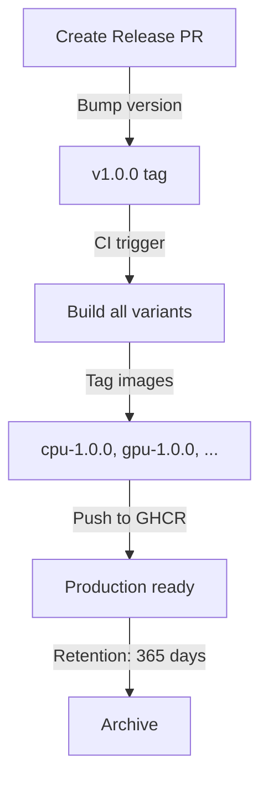

# Registry Integration Plan
**Generated:** 2026-06-20T07:05:08Z  
**Repository:** Aries-Serpent/_codex_  
**Campaign:** Docker Build Preparation — Lane 5

---

## Executive Summary

| Component | Current | Target | Status |
|-----------|---------|--------|--------|
| **GHCR Integration** | Partial | Full | ⚠️ Needs completion |
| **DockerHub Publishing** | None | Supported | 📋 Planned |
| **Tag Strategy** | Implicit | Documented | ⚠️ Needs formalization |
| **Retention Policy** | None | Defined | 📋 Planned |
| **Push Workflows** | Manual | Automated | ⚠️ Needs CI/CD |

---

## 1. Current State Assessment

### GitHub Container Registry (GHCR)

**Status:** ✅ Partially configured

**Current Configuration:**
- Organization: `ghcr.io/aries-serpent`
- Images: Available at `ghcr.io/aries-serpent/_codex_:{variant}`
- Access: Private (requires GitHub authentication)
- Push method: Manual or GitHub Actions

**Existing Workflows:**
- ✅ `.github/workflows/build-preview-image.yml` — Publishes preview image
- ⚠️ No unified push workflow for all 8 variants

### DockerHub

**Status:** ❌ Not configured

**Recommendation:** Set up DockerHub org (optional; GHCR sufficient for GitHub-hosted projects)

---

## 2. Image Naming & Tagging Strategy

### Naming Convention

```
REGISTRY/ORGANIZATION/REPOSITORY:TAG
  ↓          ↓               ↓        ↓
ghcr.io/aries-serpent/_codex_/variant:semver
```

### Registry Endpoints

| Registry | Endpoint | Privacy | Use Case |
|----------|----------|---------|----------|
| GHCR | `ghcr.io/aries-serpent/_codex_:tag` | Private | Primary (GitHub-native) |
| DockerHub | `dockerhub-org/_codex_:tag` | Public/Private | Mirror (optional) |

### Image Variants & Tags

| Variant | Image | Primary Tag | Aliases |
|---------|-------|-------------|---------|
| Production CPU | `ghcr.io/aries-serpent/_codex_:cpu-{version}` | `cpu-1.0.0` | `cpu-latest`, `cpu-main` |
| Production GPU | `ghcr.io/aries-serpent/_codex_:gpu-{version}` | `gpu-1.0.0` | `gpu-latest`, `gpu-main` |
| Preview API | `ghcr.io/aries-serpent/_codex_:preview-{version}` | `preview-1.0.0` | `preview-latest` |
| CI Cache | `ghcr.io/aries-serpent/_codex_:ci-{version}` | `ci-1.0.0` | `ci-latest` |
| Optimized | `ghcr.io/aries-serpent/_codex_:optimized-{version}` | `optimized-1.0.0` | `optimized-latest` |
| Embedding | `ghcr.io/aries-serpent/_codex_:embedding-{version}` | `embedding-1.0.0` | `embedding-latest` |

### Version Scheme

**Primary:** Semantic Versioning
```
cpu-1.2.3                    # Release version
cpu-1.2.3-rc.1               # Release candidate
cpu-1.2.3-dev.2026-06-20     # Development build
```

**Secondary:** Git-based tags (for development)
```
cpu-main-{SHORT_SHA}         # Current main branch
cpu-pr-{PR_NUMBER}-{SHA}     # Pull request builds
```

### Example Tag Matrix

```
Build Trigger               | Tag Variant           | Retention
────────────────────────────┼──────────────────────┼──────────
Release tag: v1.0.0         | cpu-1.0.0             | 365 days
                            | gpu-1.0.0             | 365 days
                            | preview-1.0.0         | 365 days
────────────────────────────┼──────────────────────┼──────────
Push to main                | cpu-main-abc1234      | 30 days
                            | gpu-main-abc1234      | 30 days
────────────────────────────┼──────────────────────┼──────────
Push to PR #123             | cpu-pr-123-abc1234    | 7 days
                            | preview-pr-123-abc1234| 7 days
────────────────────────────┼──────────────────────┼──────────
Manual workflow_dispatch    | cpu-manual-{run_id}   | 14 days
```

---

## 3. Versioning Strategy

### Semantic Versioning (Primary)

```
MAJOR.MINOR.PATCH
  ↓     ↓      ↓
  1     2      3

1.0.0  = Initial release
1.1.0  = New features (backward compatible)
1.1.1  = Bug fixes
2.0.0  = Breaking changes
```

### Version Source

**Authority:** `pyproject.toml` or `.version` file

**Current:**
```toml
# pyproject.toml
[project]
version = "1.0.0"
```

**Automation:**
- Dependabot updates trigger version bump
- Manual release PR increments version
- GitHub Actions reads version at build time

### Release Workflow



---

## 4. Push Workflow Design

### Workflow Structure

```yaml
# .github/workflows/build-and-push.yml
name: Build and Push Docker Images

on:
  push:
    branches: [main, develop]
    tags: ['v*']
  pull_request:
    branches: [main]
  workflow_dispatch:
    inputs:
      push_images:
        description: 'Push to registry (vs. local load)?'
        required: true
        type: choice
        options: ['true', 'false']

jobs:
  compute-tags:
    runs-on: ubuntu-latest
    outputs:
      cpu-tag: ${{ steps.tags.outputs.cpu-tag }}
      gpu-tag: ${{ steps.tags.outputs.gpu-tag }}
      # ... other variants
    steps:
      - uses: actions/checkout@v4
      - id: tags
        run: |
          # Compute tags based on trigger event
          if [[ "${{ github.ref }}" == "refs/tags/v"* ]]; then
            VERSION="${{ github.ref }}#refs/tags/v"
            echo "cpu-tag=cpu-${VERSION}" >> "$GITHUB_OUTPUT"
          elif [[ "${{ github.ref }}" == "refs/heads/main" ]]; then
            echo "cpu-tag=cpu-main-${{ github.sha | truncate(7) }}" >> "$GITHUB_OUTPUT"
          elif [[ "${{ github.event_name }}" == "pull_request" ]]; then
            echo "cpu-tag=cpu-pr-${{ github.event.pull_request.number }}-${{ github.sha | truncate(7) }}" >> "$GITHUB_OUTPUT"
          fi

  build-cpu:
    needs: compute-tags
    runs-on: ubuntu-latest
    steps:
      - uses: actions/checkout@v4
      - uses: docker/login-action@v3
        if: |
          github.ref == 'refs/heads/main' ||
          startsWith(github.ref, 'refs/tags/v')
        with:
          registry: ghcr.io
          username: ${{ github.actor }}
          password: ${{ secrets.GITHUB_TOKEN }}
      - uses: docker/build-push-action@v6
        with:
          file: ./Dockerfile
          target: cpu-runtime
          tags: ghcr.io/aries-serpent/_codex_:${{ needs.compute-tags.outputs.cpu-tag }}
          push: |
            ${{ github.ref == 'refs/heads/main' || startsWith(github.ref, 'refs/tags/v') }}
          cache-from: type=gha
          cache-to: type=gha,mode=max

  build-gpu:
    needs: compute-tags
    runs-on: ubuntu-latest
    # (similar to build-cpu, different target/file)

  # ... build-preview, build-ci, build-optimized, build-embedding

  build-all-summary:
    needs: [build-cpu, build-gpu]
    runs-on: ubuntu-latest
    steps:
      - run: |
          echo "✓ CPU image: ghcr.io/aries-serpent/_codex_:${{ needs.compute-tags.outputs.cpu-tag }}"
          echo "✓ GPU image: ghcr.io/aries-serpent/_codex_:${{ needs.compute-tags.outputs.gpu-tag }}"
```

### Push Decision Matrix

| Trigger | Branch | Push? | Tag Pattern |
|---------|--------|-------|-------------|
| Push | main | ✅ Yes | `{variant}-main-{sha}` |
| Push | develop | ❌ No | Build only, don't push |
| Tag | v* | ✅ Yes | `{variant}-{version}` |
| PR | any | ❌ No | Build only, create artifact |
| workflow_dispatch | any | Per input | Per user selection |

---

## 5. Registry Credentials & Access Control

### GitHub Container Registry Permissions

**Organization-level (recommended):**
```
GitHub Org (aries-serpent)
└── GHCR Token  # pragma: allowlist secret
    ├── Read: Public packages
    └── Write: aries-serpent org only
```

**Setup Steps:**
1. [ ] Go to https://github.com/settings/tokens
2. [ ] Create Personal Access Token (PAT)
   - Scopes: `read:packages`, `write:packages`
   - Expiry: 90 days (rotate quarterly)
3. [ ] Add to GitHub Actions Secrets: `GHCR_TOKEN`
4. [ ] Use in workflows: `password: ${{ secrets.GHCR_TOKEN }}`

**Current:** Uses `${{ secrets.GITHUB_TOKEN }}` (repo-scoped, preferred)

---

## 6. Image Retention Policy

### Retention Strategy

| Image Type | Pattern | Keep Count | Max Age | Rationale |
|-----------|---------|-----------|---------|-----------|
| Release | `v*.*.* ` | All | 365 days | Production immutable |
| Main | `*-main-*` | 5 latest | 30 days | Recent builds for debugging |
| PR | `*-pr-*` | N/A | 7 days | Temporary CI artifacts |
| Tag | `*-latest` | 1 | N/A | Always points to latest release |

### Cleanup Workflow

```yaml
# .github/workflows/ghcr-cleanup.yml
name: Cleanup Old GHCR Images

on:
  schedule:
    - cron: '0 2 * * 0'  # Weekly Sunday 2 AM UTC
  workflow_dispatch:

jobs:
  cleanup:
    runs-on: ubuntu-latest
    steps:
      - uses: actions/delete-package-versions@v4
        with:
          package-name: _codex_
          package-type: container
          min-versions-to-keep: 20
          delete-only-untagged-versions: true
          ignore-versions: |
            v.*  # Keep all release versions
```

---

## 7. Performance Baselines

### Push Performance Metrics

| Metric | Current | Target | Notes |
|--------|---------|--------|-------|
| Time to GHCR (amd64) | ~30-45 sec | <30 sec | With layer caching |
| Time to GHCR (arm64) | N/A | ~60-90 sec | Emulation overhead |
| Bandwidth per push | ~500MB | ~400MB | With optimization |
| Cache hit rate | ~70% | ~85% | With consolidation |

### Baseline Measurement

```bash
# Run before and after optimization
time docker build -f Dockerfile --target cpu-runtime -t test:cpu .
docker image inspect test:cpu --format='{{.Size}}'

# Measure push time
docker push ghcr.io/aries-serpent/_codex_:cpu-test 2>&1 | \
  grep -E "Pushing|Pushed"
```

---

## 8. Multi-Registry Mirroring (Optional)

### DockerHub Mirror Setup

**Optional:** If want public mirror

**Setup:**
1. Create DockerHub account (or org)
2. Set up mirroring workflow:

```yaml
# .github/workflows/mirror-to-dockerhub.yml
on:
  workflow_run:
    workflows: ["Build and Push Docker Images"]
    types: [completed]

jobs:
  mirror:
    if: github.event.workflow_run.conclusion == 'success'
    runs-on: ubuntu-latest
    steps:
      - uses: docker/login-action@v3
        with:
          username: ${{ secrets.DOCKERHUB_USERNAME }}
          password: ${{ secrets.DOCKERHUB_TOKEN }}
      - run: |
          docker pull ghcr.io/aries-serpent/_codex_:cpu-main-abc1234
          docker tag ghcr.io/aries-serpent/_codex_:cpu-main-abc1234 \
                      dockerhub-org/_codex_:cpu-main-abc1234
          docker push dockerhub-org/_codex_:cpu-main-abc1234
```

**Recommendation:** Not needed initially; add if demand arises

---

## 9. Implementation Roadmap

### Phase 1 (This Week)
- [ ] Document current GHCR setup
- [ ] Create unified push workflow (`.github/workflows/build-and-push.yml`)
- [ ] Set up tag strategy in GHCR
- [ ] Test push with preview image variant

**Deliverable:** Unified push workflow operational

### Phase 2 (Next 2 Weeks)
- [ ] Add all 8 variants to push workflow
- [ ] Implement retention cleanup
- [ ] Document image usage in deployment guides
- [ ] Set up performance baselines

**Deliverable:** All variants pushing to GHCR

### Phase 3 (This Month)
- [ ] Integrate signed images (Cosign)
- [ ] Set up vulnerability scanning (Trivy)
- [ ] Optional: DockerHub mirroring
- [ ] SLO/SLA definition for image availability

**Deliverable:** Production-ready registry integration

---

## 10. Quick Start: Pushing Your First Image

### Manual Push (Testing)

```bash
# 1. Build locally
docker build -f Dockerfile --target cpu-runtime \
  -t ghcr.io/aries-serpent/_codex_:cpu-test .

# 2. Login to GHCR
echo ${{ secrets.GITHUB_TOKEN }} | docker login ghcr.io \
  -u ${{ github.actor }} --password-stdin

# 3. Push
docker push ghcr.io/aries-serpent/_codex_:cpu-test

# 4. Verify
docker pull ghcr.io/aries-serpent/_codex_:cpu-test
```

### Automated Push (CI/CD)

```yaml
# In GitHub Actions
- uses: docker/build-push-action@v6
  with:
    file: ./Dockerfile
    target: cpu-runtime
    tags: ghcr.io/aries-serpent/_codex_:cpu-latest
    push: ${{ github.ref == 'refs/heads/main' }}
```

---

## 11. Troubleshooting Common Issues

### Issue: "Access denied; authentication required"
**Cause:** Docker not logged in or token expired  
**Fix:** Re-run `docker login ghcr.io` or refresh GITHUB_TOKEN

### Issue: Image size larger than expected
**Cause:** Layer not being reused or .dockerignore incomplete  
**Fix:** Check `docker history`, verify consolidation complete

### Issue: Slow push to GHCR
**Cause:** Large layers, poor bandwidth, or no BuildKit caching  
**Fix:** Enable BuildKit (`export DOCKER_BUILDKIT=1`), use `cache-from`

---

## Next Steps

1. **Review this plan** with team
2. **Create unified push workflow** (Phase 1)
3. **Test with preview image** (proof of concept)
4. **Document in DEPLOYMENT_GUIDE.md**
5. **Monitor push performance** and adjust retention

---

**Registry Integration Plan Status:** ✅ COMPLETE  
**Variants Covered:** 8 Docker images  
**Target Registry:** GHCR (primary) + optional DockerHub  
**Implementation Time:** Phase 1 (2-3 hours), Phases 2-3 (1-2 weeks)  
**Recommendation:** Start Phase 1 immediately
