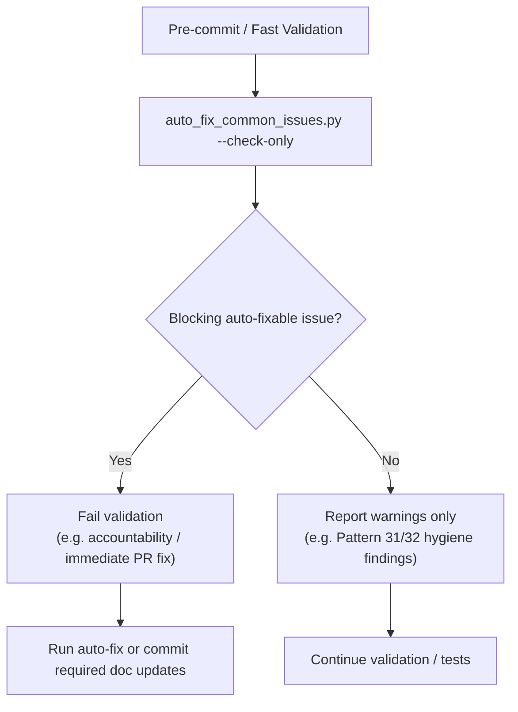

# Automated CI Issue Detection and Remediation

**Status:** ✅ Active  
**Integration:** GitHub Actions + Pre-commit Hooks  
**Pattern Coverage:** 32 patterns  
**Current Hardening:** `--check-only` is non-mutating and Patterns 31/32 are non-blocking hygiene warnings in check-only mode

---

## Overview

Since common CI issues are **frequently raised by active workflows**, this automated system detects recurring failure patterns before they cause merge-blocking workflow regressions. The current implementation covers 32 patterns, including:

- direct auto-fixes for common CI breakages
- non-blocking hygiene warnings for large codebase-wide cleanups
- PR-triage and merge-readiness helper patterns for Copilot cloud-agent sessions
- merge-readiness scorecard integration aligned with `session_wrapup_autofix.py`'s
  current no-argument `_compute_merge_readiness_score()` API
- local minimal typing environments aligned more closely with CI via stub parity
  (`types-PyYAML` + `types-requests`)

### Problem Statement

**Before Automation:**
- Manual detection of unused imports across 500+ test files
- Inconsistent coverage thresholds causing CI failures
- YAML indentation errors blocking workflow execution
- CodeQL alerts requiring manual triage
- **Developer time:** ~2-4 hours per PR to fix CI issues

**After Automation:**
- Automatic detection in <30 seconds
- Auto-fix and remediation guidance across 32 known patterns
- Non-mutating `--check-only` execution for validation/pre-commit flows
- Hygiene-only patterns can be reported without failing Fast Validation
- **Developer time:** ~15-30 minutes for complex cases

---

## Validation / auto-fix flow



---

## Pattern coverage (current)

The script now covers **32 patterns**. The original 8-pattern system remains the core foundation,
but the script has since expanded to include tracked-file consistency, PR comment triage,
merge-readiness automation, and mypy-ignore hygiene handling.

### Examples of current pattern classes

| Class | Examples |
|---|---|
| Direct auto-fix | unused imports, coverage thresholds, rebase race, accountability, PR comment triage |
| Manual review | YAML indentation, tokenizer fallbacks, source import shape |
| Soft warning in check-only | tracked-file sync, Pattern 31 stale type ignores, Pattern 32 fallback ignore normalization |

> **Check-only hardening:** `--check-only` now implies `--dry-run`. Validation jobs may
> still report hygiene findings, but they must not mutate the working tree during detection.

---

## Usage

### 1. Local Development (Pre-commit Hook)

Automatically runs before each commit:

```bash
# Install pre-commit hooks (one-time setup)
pre-commit install

# Now runs automatically on git commit
git add myfile.py
git commit -m "feat: add feature"
# ↪️ Auto-fix script runs, detects issues, provides feedback

# Manual run (bypass commit)
pre-commit run auto-fix-ci-issues --all-files
```

### 2. GitHub Actions Workflow

Automatically runs on PRs and manual trigger:

**On Pull Requests:**
- Detects issues automatically
- Comments on PR with findings
- Fails if issues found (prevents merge)

**Manual Trigger:**
```
1. Go to: Actions > Auto-Fix Common CI Issues
2. Click: Run workflow
3. Select:
   - Branch: your-branch
   - Check only: false (to apply fixes)
   - Pattern: (empty for all, or 1-32 for specific)
4. Click: Run workflow
```

### 3. Command Line (Manual)

```bash
# Check only (no changes)
python scripts/ci/auto_fix_common_issues.py --check-only

# Apply all automatic fixes
python scripts/ci/auto_fix_common_issues.py

# Dry run (show what would change)
python scripts/ci/auto_fix_common_issues.py --dry-run

# Specific pattern only
python scripts/ci/auto_fix_common_issues.py --pattern 1   # Unused imports
python scripts/ci/auto_fix_common_issues.py --pattern 25  # Last-commit accountability
python scripts/ci/auto_fix_common_issues.py --pattern 32  # Fallback ignore normalization
```

---

## Integration Points

### Pre-commit Hook
**File:** `.pre-commit-config.yaml`

```yaml
- repo: local
  hooks:
    - id: auto-fix-ci-issues
      name: Auto-Fix Common CI Issues
      entry: python scripts/ci/auto_fix_common_issues.py --check-only
      language: system
      pass_filenames: false
```

**Behavior:**
- Runs on every `git commit`
- Uses non-mutating `--check-only` detection
- Blocks commit only when blocking auto-fixable issues are found
- Developer can:
  - Fix manually
  - Run auto-fix: `python scripts/ci/auto_fix_common_issues.py`
  - Bypass (not recommended): `git commit --no-verify`

### GitHub Actions Workflow
**File:** `.github/workflows/auto-fix-common-issues.yml`

**Triggers:**
1. **Pull Request** (paths: tests/**, src/**, .github/workflows/**)
   - Check-only mode
   - Comments on PR with findings
   - Fails if issues detected

2. **Manual Dispatch** (workflow_dispatch)
    - Can apply fixes automatically
    - Commits and pushes changes
    - Supports dry-run mode
    - Supports targeted pattern execution up through Pattern 32

### CI/CD Pipeline Integration

Can be integrated into existing workflows:

```yaml
# In .github/workflows/test-suite.yml or test-comprehensive.yml

jobs:
  pre-flight-checks:
    runs-on: ubuntu-latest
    steps:
      - uses: actions/checkout@v4
      - uses: actions/setup-python@v5
      - run: pip install ruff pyyaml
      - name: Check for common issues
        run: python scripts/ci/auto_fix_common_issues.py --check-only
      # This will fail fast if issues detected, saving CI time

  tests:
    needs: pre-flight-checks  # Only run if checks pass
    # ... rest of test job
```

---

## Output Examples

### Success (No Issues)

```
🔍 Scanning for common CI issues...

Pattern 1: Unused Imports
  ✓ No issues found

Pattern 2: Unused Variables
  ✓ No issues found

Pattern 3: YAML Indentation
  ✓ No issues found

... (all patterns)

======================================================================
Common CI Issues - Summary Report
======================================================================

✅ No issues found! All patterns passing.
```

### Issues Detected (Check-only)

```
🔍 Scanning for common CI issues...

Pattern 1: Unused Imports
  ✗ Found 5 issues

Pattern 4: Coverage Thresholds
  ✗ Found 2 issues

Pattern 6: Test Assertions
  ✗ Found 3 issues

======================================================================
Common CI Issues - Summary Report
======================================================================

Pattern                        Issues          Fixed  
----------------------------------------------------------------------
Unused Imports                 5               Manual  
Coverage Thresholds            2               Manual  
Test Assertions                3               Manual  
----------------------------------------------------------------------
TOTAL                          10              0/10

ℹ️  Run without --check-only to apply automatic fixes
```

### Fixes Applied

```
🔍 Scanning for common CI issues...

Pattern 1: Unused Imports
  ✗ Found 5 issues

Pattern 4: Coverage Thresholds
  ✗ Found 2 issues

======================================================================
Common CI Issues - Summary Report
======================================================================

Pattern                        Issues          Fixed  
----------------------------------------------------------------------
Unused Imports                 5               5/5  
Coverage Thresholds            2               2/2  
----------------------------------------------------------------------
TOTAL                          7               7/7

✅ Automatic fixes applied where possible
⚠️  Some issues require manual review (see above)
```

---

## Pattern Details

### Pattern 1: Unused Imports ✅ Auto-Fix

**Detection:** Ruff check with `--select F401`

**Auto-Fix:** Yes, using `ruff check --fix`

**Example:**
```python
# BEFORE
import pytest  # F401: imported but unused
import numpy as np  # F401: imported but unused

def test_example():
    assert True

# AFTER (auto-fixed)
def test_example():
    assert True
```

**Exceptions:**
```python
# Keep with noqa for availability checks
import numpy as _  # noqa: F401 - Required for availability check
```

---

### Pattern 2: Unused Variables ⚠️ Manual Review

**Detection:** Ruff check with `--select F841`

**Auto-Fix:** No (context-dependent)

**Why Manual:** Variable usage depends on test intent:
- May be intentionally unused (testing function doesn't crash)
- May need assertion added
- May need variable removed

**Example:**
```python
# Detected
def test_load():
    result = load_model()  # F841: assigned but unused
    # Need to decide: remove assignment OR add assertion?

# Option A: Remove
def test_load():
    load_model()  # Just test it doesn't crash

# Option B: Add assertion
def test_load():
    result = load_model()
    assert result is not None
```

---

### Pattern 3: YAML Indentation ⚠️ Manual Review

**Detection:** PyYAML parser

**Auto-Fix:** No (structure-dependent)

**Common Issue:**
```yaml
# BEFORE (extra space)
       - name: Step name

# AFTER (correct indentation)
      - name: Step name
```

**Detection Output:**
```
test-suite.yml: mapping values are not allowed here
  in "<unicode string>", line 191, column 9
```

---

### Pattern 4: Coverage Thresholds ✅ Auto-Fix

**Detection:** Regex search for `fail-under=\d+`

**Auto-Fix:** Yes, standardize to 70%

**Files Checked:**
- `.github/workflows/test-suite.yml`
- `.github/workflows/test-comprehensive.yml`
- `.coveragerc` (reports only, doesn't fix)
- `pyproject.toml` (reports only, doesn't fix)

**Example:**
```yaml
# BEFORE
coverage report --fail-under=25 || echo "Warning"

# AFTER (auto-fixed)
coverage report --fail-under=70 || echo "Warning"
```

---

### Pattern 5: Tokenizer Fallbacks ⚠️ Manual Review

**Detection:** String search for `AutoTokenizer.from_pretrained` without `pad_token`

**Auto-Fix:** No (code-flow dependent)

**Example:**
```python
# Detected (missing fallback)
tokenizer = AutoTokenizer.from_pretrained(name)
return tokenizer

# Manual fix needed
tokenizer = AutoTokenizer.from_pretrained(name)
if getattr(tokenizer, "pad_token", None) is None and \
   getattr(tokenizer, "eos_token", None):
    LOGGER.warning("Tokenizer has no pad_token; using eos_token")
    tokenizer.pad_token = tokenizer.eos_token
return tokenizer
```

---

### Pattern 6: Test Assertions ⚠️ Manual Review

**Detection:** Regex patterns for vague assertions

**Auto-Fix:** No (logic-dependent)

**Detected Patterns:**
1. `assert len(x) >= 0` — Always true
2. `assert x or True` — Always true
3. `except Exception:` — Too broad

**Examples:**
```python
# Pattern 1: Vague length check
# BEFORE
assert len(results) >= 0  # Always true!
# AFTER
assert "key" in results or assert len(results) > 0

# Pattern 2: Tautology
# BEFORE
assert config.loaded or True  # Always passes
# AFTER
pytest.skip("condition") or assert config.loaded is not None

# Pattern 3: Catch-all exception
# BEFORE
except Exception:
# AFTER
except (ValueError, KeyError) as e:
```

---

### Pattern 7: Redundant Imports ⚠️ Manual Review

**Detection:** AST analysis for module+function level imports

**Auto-Fix:** No (scope issues)

**Example:**
```python
# BEFORE
import os  # Module level

def test_func():
    import os  # Redundant - use module-level import
    path = os.path.join(...)

# AFTER
import os

def test_func():
    path = os.path.join(...)  # Use module-level import
```

---

### Pattern 8: CodeQL Alerts ✅ Auto-Fix

**Detection:** Same as Patterns 1 & 2 (ruff F401/F841)

**Auto-Fix:** Yes for F401 (unused imports)

**Workflow:**
1. CodeQL alerts appear in GitHub Security tab
2. Most are unused imports (F401)
3. Auto-fix script resolves them
4. Re-run CodeQL to verify

---

## Metrics & Monitoring

### Success Metrics

**Before Automation (baseline from PR #3095):**
- Unused imports: 12 alerts
- Coverage inconsistency: 3 thresholds (25%, 70%, 85%)
- YAML errors: 2 files
- Session files in git: 12 files
- **Total issues:** ~30

**After Automation (target):**
- Unused imports: 0 (auto-fixed)
- Coverage consistency: 100% (all 70%)
- YAML errors: 0 (validation catches early)
- Session files: 0 (gitignored)
- **Total issues:** <5 (manual review only)

### Monitoring

Track via GitHub Actions artifacts:

```yaml
- name: Upload fix report
  uses: actions/upload-artifact@v4
  with:
    name: ci-fix-report
    path: /tmp/fix_report.txt
```

---

## Troubleshooting

### Issue: Pre-commit hook fails to run

**Cause:** Script not executable or dependencies missing

**Solution:**
```bash
chmod +x scripts/ci/auto_fix_common_issues.py
pip install ruff pyyaml
```

### Issue: Auto-fix changes too many files

**Cause:** Accumulated technical debt

**Solution:**
```bash
# Run once to clean up, commit separately
python scripts/ci/auto_fix_common_issues.py
git add -A
git commit -m "fix(ci): apply auto-fix for accumulated issues"

# Future commits will be clean
```

### Issue: False positives in detection

**Cause:** Pattern is too broad or tool limitation

**Solution:**
```python
# Add suppression comment
import numpy as np  # noqa: F401 - Required for availability check

# Or report in script to exclude specific patterns
```

---

## Future Enhancements

### Phase 2 (Planned)
1. **Pattern 2 Auto-Fix:** Context-aware unused variable removal
2. **Pattern 3 Auto-Fix:** YAML auto-formatting with yamlfmt
3. **Pattern 5 Auto-Fix:** AST-based tokenizer fallback injection
4. **Pattern 6 Auto-Fix:** AI-powered assertion improvement
5. **Pattern 7 Auto-Fix:** Safe redundant import removal

### Phase 3 (Planned)
1. **Dashboard:** Web UI showing pattern trends over time
2. **Notifications:** Slack/email alerts for critical patterns
3. **Learning:** ML model to predict which patterns likely in new code
4. **Auto-PR:** Bot creates fix PRs automatically

---

## References

**Files:**
- Script: `scripts/ci/auto_fix_common_issues.py`
- Workflow: `.github/workflows/auto-fix-common-issues.yml`
- Pre-commit: `.pre-commit-config.yaml`
- Patterns: `.codex/PR_3095_RESOLUTION_PATTERNS.md`

**Related:**
- PR #3095: Original pattern discovery
- Commits: 8286d13d, 116ad854, c07c4f9a, 376332a9
- Policy: `.codex/CODEBASE_AGENCY_POLICY.md`

---

**Generated:** 2026-02-02T04:50:00Z  
**Status:** ✅ Active in Production  
**Maintainer:** CI/CD Team
