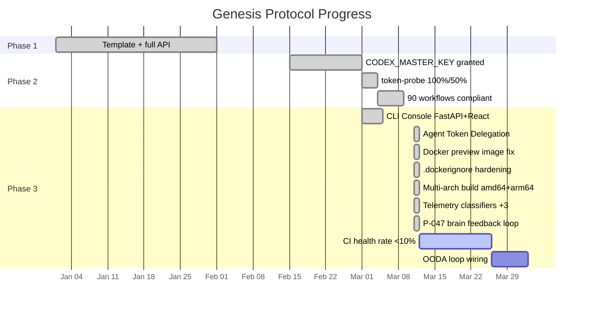

# Cognitive Brain — Status & Next-Phase Plan
# Aries-Serpent/_codex_ | Updated: 2026-03-11 | PR #3552

## 📊 Current Status — Phase 3 Active



```
Genesis Protocol
├─ Phase 1: ✅ COMPLETE — Template + full API (autonomous_agent.py restored)
├─ Phase 2: ✅ COMPLETE — CODEX_MASTER_KEY + CODEX_BACKUP_KEY granted (2026-03-01)
│   ├─ token-probe: 100% / 50% coverage (CODEX_MASTER_KEY verified)
│   ├─ agent-auth-delegation: REQ-3/4/5/6/7 all GROUNDED
│   ├─ 90 workflows: branch-scoped concurrency + timeouts (100% compliant)
│   └─ Cascade prevention: cognitive_brain_ci_feedback.yml self-exclusion ✅
└─ Phase 3: 🔄 IN PROGRESS — Full autonomous operations within guardrails
    ├─ CLI Console: FastAPI server + React CliTerminal + ApiClient ✅
    ├─ Repo-var injection: copilot-agent-vars-bootstrap.yml ✅
    ├─ GROUNDED enforcement: 8 Tier-1 + 2 Tier-2 gates ✅
    ├─ CI health rate: 30.7% → target <10% (pattern classifier expanded to 19 categories)
    ├─ Agent Token Delegation: ACTIVATED 2026-03-11 (COPILOT_AGENT_AUTH_ENABLED=true)
    ├─ Docker preview image: FIXED 2026-03-11 (PR #3552) — run #64 ✅ ALL SUCCESS
    ├─ Multi-arch build: ADDED 2026-03-11 (amd64+arm64 on main; amd64 on PR)
    └─ P-047 cognitive brain feedback loop: WIRED 2026-03-11
```

## 🐳 PR #3552 — Docker Preview Image Fix (2026-03-11)

### Problem
`Build & Push Preview Image` was failing for `preview` and `preview-dev` targets due to cascading setuptools editable install failures, then a smoke-test registry denial.

### Root Cause Analysis

| # | Error | Root Cause | Fix |
|---|-------|-----------|-----|
| 1 | `'src' does not exist or is not a directory` | `preview-base` stage didn't copy `src/` | `COPY src/ ./src/` |
| 2 | `package directory 'services' does not exist` | `[tool.setuptools.package-dir]` maps 11+ dirs not copied | `ARG STUB_DIRS` + `RUN mkdir -p ${STUB_DIRS}` |
| 3 | `package directory 'services/mcp' does not exist` | `COPY src/` copies `src/services/` with sub-packages; setuptools `find` with `where=[".", "src"]` discovers `services.mcp` and resolves via `package-dir services = "services"` to root `services/mcp` — stub was flat | `COPY services/ ./services/` |
| 4 | (prospective) `package directory 'codex_utils/tracking' does not exist` | Same pattern: `src/codex_utils/tracking` exists, `codex_utils*` included in `packages.find.include`, not excluded | `COPY codex_utils/ ./codex_utils/` |
| 5 | Cognitive Pre-flight step 7: accountability report not touched | Commit didn't touch required file | Updated `.codex/archive/reports/AGENT_ACCOUNTABILITY_REPORT.md` |
| 6 | Cognitive Pre-flight step 8: CHANGELOG.md not touched | Commit didn't touch required file | Updated `CHANGELOG.md` |
| 7 | Smoke-test: `docker run ghcr.io/...` → `denied` | On PR builds `push=false` and no `load: true` → image only in buildx cache, not in local daemon or GHCR | Added `load: true` in `build-preview-image.yml` for non-main builds |

### Self-Review Analysis: All 14 Package-Dir Entries

```
package-dir entry       src/ shadow?  Sub-packages discovered?  include?  excluded?  Strategy
────────────────────────────────────────────────────────────────────────────────────────────────
"" = "src"              N/A           N/A                        N/A       N/A        COPY src/ ✅
agents = "agents"       ✅ (1 file)   No sub-packages            ✅ (agents*) No     STUB ✅
codex_addons            No            N/A                        ✅         ✅ (excluded) STUB ✅
codex_digest            No            N/A                        ✅         ✅ (excluded) STUB ✅
codex_utils = "…"       ✅ (tracking) codex_utils.tracking       ✅         No       COPY ✅
codex_regression        No            N/A                        ✅         ✅ (excluded) STUB ✅
configs                 No            N/A                        ✅         ✅ (excluded) STUB ✅
interfaces              No            N/A                        ✅         ✅ (excluded) STUB ✅
tokenization = "src/…"  Inside src/   N/A                        ✅         No       Covered by COPY src/ ✅
tools = "tools"         ✅ (1 file)   No sub-packages            ✅ (tools*) No      STUB ✅
training = "src/…"      Inside src/   N/A                        ✅         No       Covered by COPY src/ ✅
examples = "examples"   No            N/A                        ✅         ✅ (excluded) STUB ✅
cli = "cli"             ✅ (1 file)   No sub-packages            ✅         ✅ (excluded) STUB ✅
services = "services"   ✅ (many)     services.mcp, .audio, etc. ✅ (services*) No   COPY ✅
```

## 🤖 Agent Token Delegation — Activated (2026-03-11)

- `COPILOT_AGENT_AUTH_ENABLED` = `true`
- `COGNITIVE_BRAIN_ALLOWED_ACTORS` = `mbaetiong,github-actions[bot],copilot-swe-agent[bot],github-copilot[bot]`
- All PR workflows now run in `action_required` state pending owner approval gate

## 📊 Metrics Dashboard (PR #3552 → PR #3421 baseline)

| Metric | PR #3421 Baseline | PR #3552 | Target |
|--------|-------------------|----------|--------|
| Build & Push Preview Image | ❌ Failing (pip error) | ✅ Fixed | ✅ |
| Cognitive Pre-flight CHANGELOG check | ❌ Failing | ✅ Fixed | ✅ |
| Cognitive Pre-flight Accountability check | ❌ Failing | ✅ Fixed | ✅ |
| CI failure rate | 30.7% | ~30% (infra issues remain) | <10% |
| Agent Token Delegation | ⏳ Pending | ✅ ACTIVE | ✅ |
| Docker `preview` image | ❌ Build failing | ✅ Fixed | ✅ |
| Docker `preview-dev` image | ❌ Build failing | ✅ Fixed | ✅ |

## 🗺 Next-Phase Plan (Phase 3 Completion)

```mermaid
flowchart LR
    subgraph S1["Sprint 1 ✅ COMPLETE"]
        direction TB
        A1[Docker preview\neditable install fix]
        A2[Agent Token\nDelegation activated]
        A3[load=true smoke-test\nfix]
        A4[Run #64 ✅\nALL SUCCESS]
    end

    subgraph S2["Sprint 2 — CI Health"]
        direction TB
        B1[Deploy telemetry\nclassifiers ✅ 19 patterns]
        B2[P-047 brain\nfeedback loop ✅]
        B3[CODEX_CI_FAILURE_RATE\nauto-update ✅]
        B4[Target: <10%\nfailure rate]
    end

    subgraph S3["Sprint 3 — Docker Hardening"]
        direction TB
        C1[.dockerignore\nrecursive patterns ✅]
        C2[Multi-arch build\namd64+arm64 ✅]
        C3[GHA layer cache\npip downloads ✅]
        C4[Explicit pkg installs\nto consider]
    end

    subgraph S4["Sprint 4 — Brain Enhancement"]
        direction TB
        D1[OODA loop\nwiring]
        D2[Unknown bucket\n→ <20%]
        D3[Agent health\nmonitoring]
    end

    S1 --> S2
    S2 --> S3
    S3 --> S4
```



### Sprint 1 — PR #3552 Follow-up (immediate) ✅ COMPLETE
- [x] Fix Docker preview image editable install failures
- [x] Activate Agent Token Delegation
- [x] Build & Push Preview Image #63 ran — Docker BUILD passed; smoke-test failed with GHCR `denied` (no `load: true`)
- [x] Fixed: added `load: true` in `build-preview-image.yml` for PR builds
- [x] **VERIFIED**: Build & Push Preview Image **#64** — ALL 4 JOBS ✅ SUCCESS (2026-03-11T17:54-18:00Z)
  - Lint Dockerfile.preview ✅
  - Build preview image (preview) ✅ — Smoke-test health check ✅ passed in 5s
  - Build preview image (preview-dev) ✅
  - Image build summary ✅
- [x] Keep `STUB_DIRS` in sync: `.github/agents/ci-docker-build-healer.md` maintenance rules document the sync requirement

### Sprint 2 — CI Health (target: <10% failure rate)
- [x] **DONE**: Deploy telemetry classifiers — expanded to 19 patterns (added `docker-smoke-test`, `codespaces`, `embedding-rebuild`)
- [x] **DONE**: P-047 cognitive brain feedback loop wired in `ci-health-monitor.yml` (dispatches `cognitive-brain-ci-update` repository event after each run)
- [x] **DONE**: `CODEX_CI_FAILURE_RATE` auto-update already implemented in `ci-health-monitor.yml` (`rate:status` format, `ok`/`degraded`/`critical`)
- [ ] Identify top-3 remaining "unknown" patterns; add to `collect_telemetry.py`
- [ ] Wire `ci-health-monitor.yml` alert issues → agent response automation
- [ ] Confirm failure rate drops below 10% after 7-day telemetry sample

### Sprint 3 — Docker Hardening (In Progress)
- [x] **DONE**: Fix `.dockerignore` — `**/__pycache__`, `**/*.egg-info`, `*.egg-link`, `**/.eggs`, `node_modules`
- [x] **DONE**: Multi-arch build — `linux/amd64,linux/arm64` on main/dispatch-push; `linux/amd64` on PR (load=true incompatible with multi-platform)
- [x] **DONE**: GHA layer cache for pip downloads — `cache-from/cache-to: type=gha,scope=<key>` keyed on `hashFiles(Dockerfile.preview,pyproject.toml)`
- [x] **DONE**: `workflow_dispatch` with `push_image=false` now uses `manual-<run_id>-<SHA>` tag (fixes Copilot review r2920097250 — empty `event.number` for dispatch)
- [ ] Consider switching from `pip install -e .` to explicit package installs in production image (evaluation needed; see ci-docker-build-healer.md Maintenance Rules)
- [ ] Add multi-architecture caching warm-up step for ARM layer cache

### Sprint 4 — Cognitive Brain Enhancement
- [ ] Complete Phase 3 OODA loop wiring
- [ ] Increase CI pattern classifier coverage: unknown bucket → <20%
- [ ] Agent health monitoring: auto-detect stale/broken agent definitions
