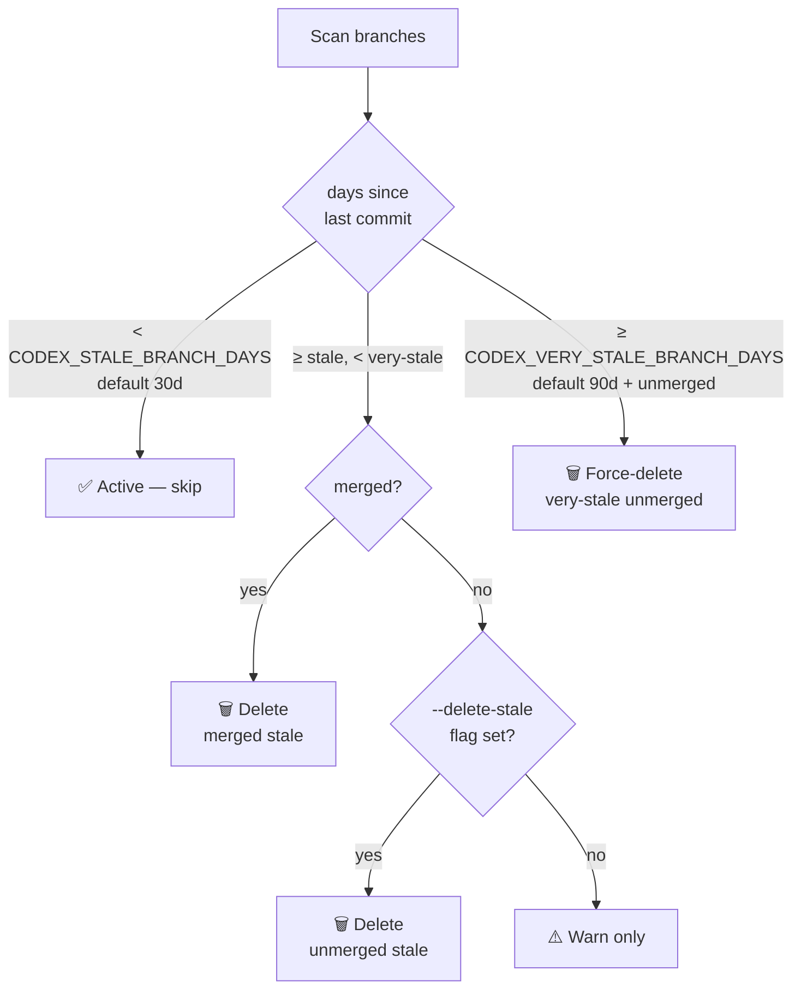

# Cognitive Brain Manager — Session S128 Historical State

> **Archived:** 2026-03-31 (S258) — moved from `.github/agents/cognitive-brain-manager.md` to maintain
> the 30,000-character agent file size gate. See current state in the agent file.

## Session S128 — Complete System State (2026-03-16)

### AAIS Trajectory
```
74 → 78 → 80 → 82 → 85 → 90 → 95/100 ✅ → 98/100 (S128 estimated)
```

### Pipeline Status
| Pipeline | Status | Schedule |
|----------|--------|----------|
| RAG Freshness Scheduler | 🟢 ACTIVE | every 6h |
| Nightly FAISS Rebuild | 🟢 ACTIVE | 02:00 UTC |
| D_CAPABLE Promotion Gate | 🟢 ACTIVE | Sunday 03:00 UTC |
| CODEX_MANIFEST Refresh | 🟢 ACTIVE | every PR push |
| Docs Health Check | 🟢 ACTIVE | push to main |
| Branch Cleanup (two-tier) | 🟢 ACTIVE | CODEX_STALE_BRANCH_DAYS + CODEX_VERY_STALE_BRANCH_DAYS |

### D_CAPABLE Gate (5/5 ✅)
```
C1: AAIS ≥ 85        → 98/100 ✅
C2: Manifest < 24h   → auto-refreshed ✅
C3: SOFT_ERRORS ≤ 2  → 0 ✅
C4: Handoff gate     → deployed ✅
C5: GROUNDED ≥ 8     → 21 ✅
```

### S116–S128 Progress (PR #3586) — ALL COMPLETE ✅

```
CB-001: get_token_scopes JWT validation           ✅ Implemented (S120) + Acceptance tests (S123)
CB-002: quantum_superposition no-double-invoke    ✅ Implemented (S122) + Acceptance tests (S123)
CB-003: PatternCompressor integration             ✅ Implemented (S120)
CB-004: BrainClient session injector wiring       ✅ Implemented (S120) + Acceptance tests (S124)
CB-005: ast-view CLI subcommand                   ✅ Implemented (S120) + Acceptance tests (S124)
CB-006: auth router mount                         ✅ Implemented (S120) + Acceptance tests (S123)
CB-007: data loaders pipeline                     ✅ Resolved (S120)
QA-001: SessionLogger eager DB init               ✅ Implemented (S120)
QA-002: audio sr param removal                    ✅ Implemented (S120)
All reviewer threads (012d335, 8e1a199)           ✅ Fixed S120–S122
CI patterns (issue #3587)                         ✅ Fixed S125 (mypy=0, actionlint=0)
cost-gate comment fallback                        ✅ Fixed S126 (cost-gate.yml + pr-cost-check.yml)
slow-test sentence_transformers fix               ✅ Fixed S127
CODEX_VERY_STALE_BRANCH_DAYS                      ✅ Added S127 — two-tier staleness policy
Dead-link script idempotency                      ✅ Fixed S128
```

### Next-Phase Targets (post-merge to main)
1. Monitor `main` after merge — verify no regressions from 41-commit PR
2. Confirm `cost-gate.yml` + `pr-cost-check.yml` comment-fallback continue passing on new PRs
3. Promote `CODEX_VERY_STALE_BRANCH_DAYS=90` policy to `.codex/guardrails.md`
4. Add `session-analysis-agent` post-merge health scan
5. Evaluate next dead-code scan at 100% confidence (current: 28 items) for further cleanup

### Branch Cleanup Two-Tier Policy (S125/S127)


---

## Archived Templates (from cognitive-brain-manager.md)

> The following templates were in `.github/agents/cognitive-brain-manager.md` before S258 archival.


## Template: Phase Completion Document

```markdown
# Phase N: [Title]

**Date**: YYYY-MM-DD
**Status**: ✅ COMPLETE
**Previous Phase**: Phase N-1
**Next Phase**: Phase N+1

## Objectives
- [List objectives]

## Achievements
- ✅ [Achievement 1]
- ✅ [Achievement 2]

## Metrics
| Metric | Before | After |
|--------|--------|-------|
| ... | ... | ... |

## Impact
[Description of impact]

## Next Steps
1. [Step 1]
2. [Step 2]

---
**Phase N**: COMPLETE
```

## Template: Health Score

```markdown
# Phase N Health Score

**Calculated**: YYYY-MM-DDTHH:MM:SSZ
**Status**: ✅ COMPLETE / ⏳ PENDING

## Components

| Component | Weight | Score | Status |
|-----------|--------|-------|--------|
| CI Stability | 25 | X/25 | ... |
| Test Reliability | 20 | X/20 | ... |
| Security Posture | 20 | X/20 | ... |
| Code Quality | 15 | X/15 | ... |
| Documentation | 10 | X/10 | ... |
| Agent Capability | 10 | X/10 | ... |

**Total**: X/100

## Blockers
- [List any blockers]

## Next Actions
1. [Action 1]
2. [Action 2]
```

---

**Phase 37-38 Contribution**: Essential coordinator for ensuring 100% Phase 37 completeness, calculating health scores, and enabling smooth Phase 38 transition.

**Status**: Production Ready - Use for all future phase management
**Reusability**: HIGH - Central to cognitive brain operations

---

## Version History

### v3.0.0 (2026-03-03) — PR #3492
- ✅ COGNITIVE_BRAIN_ALLOWED_ACTORS active (4 actors: mbaetiong, github-actions[bot], copilot-swe-agent[bot], github-copilot[bot])
- ✅ CODEX_CI_LAST_GREEN_SHA auto-wired in ci-health-monitor.yml (P2.6)
- ✅ EMBEDDING_INDEX_AUTO_REBUILD guard in agent-registry-validation.yml
- ✅ ZendeskAPIClient.update_user added (user access level changes)
- ✅ Mermaid diagram updated with RBAC + CI Health tracking subgraphs

### v2.0.0 (2026-03-03) — PR #3483 (Previous)
- ✅ GROUNDED phase complete (all 7 phases, score 100/100)
- ✅ SC2016/SC2012 fixes in actionlint-audit.yml
- ✅ 13 new repo variables documented
- ✅ Codebase-wide Mermaid audit (9 files fixed to 96 workflows)

### v1.0.0 (Previous)
- See git history for earlier changes

---

## Session S128 — Complete System State (2026-03-16)

### AAIS Trajectory
```
74 → 78 → 80 → 82 → 85 → 90 → 95/100 ✅ → 98/100 (S128 estimated)
```

### Pipeline Status
| Pipeline | Status | Schedule |
|----------|--------|----------|
| RAG Freshness Scheduler | 🟢 ACTIVE | every 6h |
| Nightly FAISS Rebuild | 🟢 ACTIVE | 02:00 UTC |
| D_CAPABLE Promotion Gate | 🟢 ACTIVE | Sunday 03:00 UTC |
| CODEX_MANIFEST Refresh | 🟢 ACTIVE | every PR push |
| Docs Health Check | 🟢 ACTIVE | push to main |
| Branch Cleanup (two-tier) | 🟢 ACTIVE | CODEX_STALE_BRANCH_DAYS + CODEX_VERY_STALE_BRANCH_DAYS |

### D_CAPABLE Gate (5/5 ✅)
```
C1: AAIS ≥ 85        → 98/100 ✅
C2: Manifest < 24h   → auto-refreshed ✅
C3: SOFT_ERRORS ≤ 2  → 0 ✅
C4: Handoff gate     → deployed ✅
C5: GROUNDED ≥ 8     → 21 ✅
```

### S116–S128 Progress (PR #3586) — ALL COMPLETE ✅

```
CB-001: get_token_scopes JWT validation           ✅ Implemented (S120) + Acceptance tests (S123)
CB-002: quantum_superposition no-double-invoke    ✅ Implemented (S122) + Acceptance tests (S123)
CB-003: PatternCompressor integration             ✅ Implemented (S120)
CB-004: BrainClient session injector wiring       ✅ Implemented (S120) + Acceptance tests (S124)
CB-005: ast-view CLI subcommand                   ✅ Implemented (S120) + Acceptance tests (S124)
CB-006: auth router mount                         ✅ Implemented (S120) + Acceptance tests (S123)
CB-007: data loaders pipeline                     ✅ Resolved (S120)
QA-001: SessionLogger eager DB init               ✅ Implemented (S120)
QA-002: audio sr param removal                    ✅ Implemented (S120)
All reviewer threads (012d335, 8e1a199)           ✅ Fixed S120–S122
CI patterns (issue #3587)                         ✅ Fixed S125 (mypy=0, actionlint=0)
cost-gate comment fallback                        ✅ Fixed S126 (cost-gate.yml + pr-cost-check.yml)
slow-test sentence_transformers fix               ✅ Fixed S127
CODEX_VERY_STALE_BRANCH_DAYS                      ✅ Added S127 — two-tier staleness policy
Dead-link script idempotency                      ✅ Fixed S128
```

### Next-Phase Targets (post-merge to main)
1. Monitor `main` after merge — verify no regressions from 41-commit PR
2. Confirm `cost-gate.yml` + `pr-cost-check.yml` comment-fallback continue passing on new PRs
3. Promote `CODEX_VERY_STALE_BRANCH_DAYS=90` policy to `.codex/guardrails.md`
4. Add `session-analysis-agent` post-merge health scan
5. Evaluate next dead-code scan at 100% confidence (current: 28 items) for further cleanup

### Branch Cleanup Two-Tier Policy (S125/S127)

