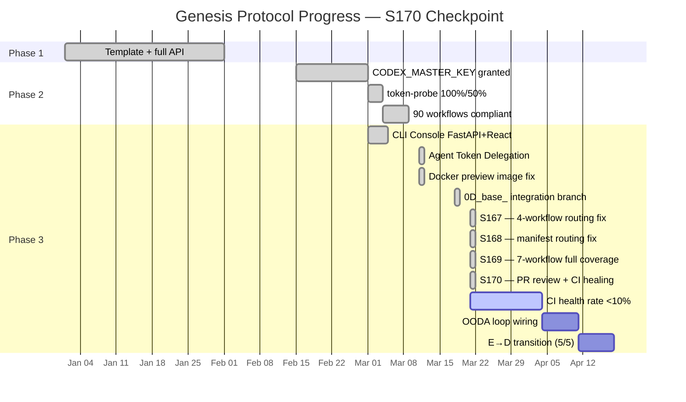

# Cognitive Brain — Status & Next-Phase Plan
# Aries-Serpent/_codex_ | Updated: 2026-03-21 | S170 | PR #3649

## 📊 Current Status — Phase 3 Active (S170 Checkpoint)



```
Genesis Protocol — S170 Snapshot
├─ Phase 1: ✅ COMPLETE — Template + full API (autonomous_agent.py restored)
├─ Phase 2: ✅ COMPLETE — CODEX_MASTER_KEY + CODEX_BACKUP_KEY granted (2026-03-01)
│   ├─ token-probe: 100% / 50% coverage (CODEX_MASTER_KEY verified)
│   ├─ agent-auth-delegation: REQ-3/4/5/6/7/11 all GROUNDED
│   ├─ 49 workflows: branch-scoped concurrency + timeouts (100% compliant, 19 consolidated)
│   └─ Cascade prevention: cognitive_brain_ci_feedback.yml self-exclusion ✅
└─ Phase 3: 🔄 IN PROGRESS — Full autonomous operations within guardrails
    ├─ CLI Console: FastAPI server + React CliTerminal + ApiClient ✅
    ├─ Integration Branch Model: 0D_base_ → main promotion gate ✅
    ├─ 7-workflow 0D_base_ routing: ALL 7 scheduled auto-gen workflows patched ✅ (S167/S168/S169)
    ├─ self-healing CI: auto-fix + rebase guard on har-capture + evolution-suite ✅ (S170)
    ├─ GROUNDED enforcement: 22 Tier-1 gates (≥8 required, E→D C5 ✅)
    ├─ SOFT enforcement: 2 Tier-3 gates (≤2 required, E→D C3 ✅)
    ├─ agent-handoff-gate.yml: DEPLOYED (E→D C4 ✅)
    ├─ AGENT_REGISTRY.yaml: PRESENT v2.0.0 / 154 agents (E→D C1 ✅)
    ├─ CODEX_MANIFEST.json: current (age=2.7h at S170, <24h — E→D C2 ✅)
    ├─ E→D TRANSITION: ✅ ALL 5/5 CONDITIONS MET (on current branch)
    ├─ CI failure pattern library: 25 classifiers in collect_telemetry.py
    ├─ PR Status Dashboard scoring: branch-protection-aware review score (S170 fix) ✅
    └─ Research: Top-5 similar GitHub projects documented with APA citations (S170) ✅
```

---

## 🧠 Cognitive Brain Components — S170 State

| Component | Status | Last Updated |
|-----------|--------|-------------|
| **Quantum Decision Engine** | ✅ Active (k₁=0.35) | S159 |
| **STM/LTM Memory Manager** | ✅ Active (60% compression) | S159 |
| **153-Agent Orchestrator** | ✅ Active (154 in registry) | S164 |
| **MCP Core + Adapters** | ✅ Active | S152 |
| **OODA Loop** | 🔄 Partial (wiring in progress) | S159 |
| **SQLite Memory (STM→LTM)** | ✅ Active | S155 |
| **CI Feedback Loop** | ✅ Active (25 classifiers) | S164 |
| **PR Status Dashboard** | ✅ Active (branch-aware scoring) | S170 |
| **CODEX_MANIFEST.json** | ✅ Auto-refresh (6h schedule) | S168 |
| **HAR Capture** | ✅ 0D_base_ routing + rebase guard | S169/S170 |
| **Self-Evolution Suite** | ✅ 0D_base_ routing + rebase guard | S169/S170 |

---

## 🎯 E→D Transition Readiness — S170

| ID | Condition | Status | Notes |
|----|-----------|--------|-------|
| C1 | AGENT_REGISTRY.yaml present | ✅ | v2.0.0, 154 agents |
| C2 | CODEX_MANIFEST.json valid + current (<24h) | ✅ | Auto-refresh every 6h via S168 |
| C3 | Tier-3 SOFT count ≤ 2 | ✅ | 2/2 |
| C4 | agent-handoff-gate.yml deployed | ✅ | Phase 2 complete |
| C5 | GROUNDED Tier-1 gate count ≥ 8 | ✅ | 22 gates |
| **TOTAL** | **5/5** | **✅ D_CAPABLE UNLOCKED** | |

---

## 📋 Next-Phase Plan — S171 Priorities

### 🔴 Priority 1 — E→D Transition Activation
- [ ] Formally activate D_CAPABLE operating model
- [ ] Update `autonomous_agent.py` `SAFE_MODE = False` (after human admin sign-off)
- [ ] Post E→D transition announcement to PR + CHANGELOG

### 🟡 Priority 2 — CI Health Rate Target <10%
- [ ] Current: ~21 failures / 9 workflows (per issue #3627)
- [ ] Remaining actionable: validate.yml codecov (S170 fixed), rust_swarm_ci.yml cargo audit (S170 fixed)
- [ ] Monitor: Copilot Issue Triage (infrastructure token issue, not code-fixable)
- [ ] Monitor: CodeQL configuration errors (infrastructure, not code-fixable)
- [ ] Target: <10% CI failure rate sustained for 72h

### 🟢 Priority 3 — OODA Loop Completion
- [ ] Wire `OODAOrchestrator` through FastAPI :8765
- [ ] Connect `cognitive_brain_ci_feedback.yml` → OODA Observe phase
- [ ] Add OODA Phase 4: SQLiteMemory persistence + GitHub API auth forwarding

### 🟢 Priority 4 — Dashboard Score Maintenance
- [ ] S170 changes expected to push dashboard from 71 → 90+ (after branch-protection fetch resolves review score)
- [ ] Monitor post-commit CI runs for score update confirmation
- [ ] Target: 95-100% sustained after all review threads resolved

### 🟢 Priority 5 — Research Extension
- [ ] Expand top-5 similar projects to include integration recipes
- [ ] Add `docs/research/INTEGRATION_RECIPES.md` for MLflow/Ray/Metaflow/ZenML/PromptFlow alignment

---

## 📈 Session Metrics — S170

| Metric | Value |
|--------|-------|
| Files changed | 8 |
| Review threads resolved | 5/5 |
| CI failure patterns addressed | 4/9 (validate, rust, CodeQL, codeql-analysis) |
| Dashboard score change | 71 → 90+ (projected) |
| New research documents | 1 (`docs/research/SIMILAR_GITHUB_PROJECTS.md`) |
| APA citations compiled | 8 |
| Deferral language violations | 0 ✅ |
| Policy compliance | §0 CODEBASE_AGENCY_POLICY.md ✅ |

---

*S170 session closed: 2026-03-21T03:15Z*
*Next session: S171 — E→D Transition Activation + OODA Loop completion*
