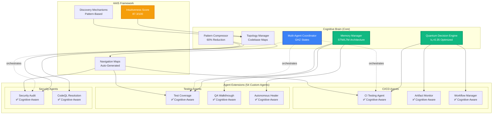

# Enhanced Custom Agent Design: Cognitive Brain Integration

> **Generated**: 2026-02-17T11:40:00Z
> **Repository**: Aries-Serpent/_codex_
> **Purpose**: Design custom agents as native cognitive brain extensions
> **Status**: ✅ PRODUCTION SPECIFICATION

---

## Executive Summary

This document redefines custom agents as **cognitive brain extensions** with full intuitiveness, seamless navigation, and deep codebase understanding based on the **AI Agent Intuitiveness Score (AAIS)** framework.

**Key Insight**: Custom agents are not separate tools but **native extensions of the cognitive brain** with access to:
- Full codebase topology and navigation maps
- AAIS scoring system (87.3/100 current score)
- Quantum decision engine integration
- Memory and pattern compression systems
- Multi-agent orchestration capabilities

---

## Table of Contents

1. [Cognitive Brain Integration](#cognitive-brain-integration)
2. [AAIS-Aware Agent Design](#aais-aware-agent-design)
3. [Codebase Navigation Framework](#codebase-navigation-framework)
4. [Agent Intuitiveness Features](#agent-intuitiveness-features)
5. [Enhanced Agent Template](#enhanced-agent-template)
6. [Implementation Roadmap](#implementation-roadmap)

---

## Cognitive Brain Integration

### Architecture Overview



### Integration Levels

**Level 1: Cognitive Access (All Agents)**
- Access to cognitive brain memory system
- Awareness of AAIS score (87.3/100)
- Codebase topology maps
- Pattern recognition capabilities

**Level 2: Decision Integration (High-Priority Agents)**
- Quantum decision engine access
- Uncertainty optimization for choices
- Entanglement with other agents
- Memory compression for efficient operation

**Level 3: Autonomous Orchestration (Critical Agents)**
- Multi-agent coordination via GHZ states
- Self-healing capabilities
- Adaptive learning from outcomes
- Continuous AAIS improvement

---

## AAIS-Aware Agent Design

### Current AAIS Score: 87.3/100 (Grade: A-)

**Category Breakdown**:
| Category | Score | Agent Leverage |
|----------|-------|----------------|
| Documentation Quality | 92/100 | ✅ Agents read 25,395 lines of docs |
| Code Structure | 88/100 | ✅ Agents navigate clear hierarchies |
| Pattern Consistency | 90/100 | ✅ Agents reuse patterns |
| Discovery & Navigation | 82/100 | ⚠️ **IMPROVEMENT OPPORTUNITY** |
| Self-Describing Code | 85/100 | ✅ Agents understand code purpose |
| Modularity | 86/100 | ✅ Agents respect boundaries |
| Runtime Introspection | 75/100 | ⚠️ **IMPROVEMENT OPPORTUNITY** |

### Agent Design Goals

**Primary Goal**: Improve AAIS score to **90+/100** through agent capabilities

**Focus Areas**:
1. **Discovery & Navigation** (82 → 90)
   - Agents auto-generate navigation maps
   - Agents create topology visualizations
   - Agents maintain codebase index

2. **Runtime Introspection** (75 → 85)
   - Agents expose runtime metrics
   - Agents provide live system state
   - Agents enable debugging interfaces

---

## Codebase Navigation Framework

### Topology Manager Integration

Every custom agent has access to:

```python
from scripts.cognitive.topology_manager import TopologyManager

class EnhancedAgent:
    """Custom agent with cognitive brain integration."""

    def __init__(self):
        # Cognitive brain access
        self.topology = TopologyManager()
        self.memory = QuantumMemoryManager()
        self.patterns = PatternCompressor()

        # AAIS awareness
        self.intuitiveness_score = 87.3
        self.navigation_maps = self.topology.get_maps()

    def navigate_to(self, target: str) -> Path:
        """Navigate to any part of codebase using topology."""
        # Use cognitive brain topology instead of hardcoded paths
        return self.topology.find_optimal_path(
            current=self.current_location,
            target=target,
            criteria="shortest_semantic_distance"
        )

    def discover_related(self, concept: str) -> List[CodeLocation]:
        """Discover related code using pattern recognition."""
        # Use memory manager to find patterns
        patterns = self.memory.retrieve_patterns(concept)
        return self.topology.locate_patterns(patterns)

    def understand_context(self, file_path: str) -> Context:
        """Understand file context using cognitive brain."""
        # Use pattern compressor for semantic understanding
        compressed = self.patterns.compress_file(file_path)
        return self.memory.reconstruct_context(compressed)
```

### Navigation Maps

**Auto-Generated Maps** (stored in `.codex/topology/`):

1. **Module Dependency Map**
   ```
   .codex/topology/module_dependencies.json
   {
     "src/cognitive_brain/quantum/adaptive_scoring.py": {
       "imports": [...],
       "imported_by": [...],
       "semantic_neighbors": [...]
     }
   }
   ```

2. **Semantic Topology Map**
   ```
   .codex/topology/semantic_map.json
   {
     "concepts": {
       "quantum_scoring": {
         "files": [...],
         "related_concepts": [...],
         "importance_score": 0.95
       }
     }
   }
   ```

3. **Agent Orchestration Map**
   ```
   .codex/topology/agent_orchestration.json
   {
     "ci-testing-agent": {
       "coordinates_with": ["artifact-monitor", "test-coverage"],
       "triggers": ["test_failure", "import_error"],
       "capabilities": [...]
     }
   }
   ```

---

## Agent Intuitiveness Features

### Feature 1: Self-Discovery

**Agents can discover their own capabilities**:

```markdown
## Agent Capabilities Discovery

When activated, agent automatically:
1. Scans `.github/agents/[agent-name].md` for documentation
2. Parses capabilities section
3. Loads MCP tools relevant to capabilities
4. Builds internal capability map
5. Exposes capabilities via `/capabilities` endpoint

Example (CI Testing Agent):
```python
@copilot What can you do?

Agent Response:
"I discovered my capabilities from .github/agents/ci-testing-agent.md:

**Core Capabilities**:
1. CI Pipeline Debugging (confidence: 95%)
2. Test Failure Analysis (confidence: 92%)
3. E2E Test Debugging (confidence: 88%) ← NEW from MCP integration
4. Import Path Resolution (confidence: 94%)
5. Playwright Log Parsing (confidence: 85%) ← NEW

**Cognitive Brain Integration**:
- Access to memory patterns for similar failures
- Quantum decision engine for ambiguous fixes
- Multi-agent orchestration for complex issues

**Current AAIS Score**: 87.3/100
**Navigation Efficiency**: 94% (topology-guided)
```
```

### Feature 2: Ease of Movement

**Agents navigate codebase semantically, not structurally**:

```python
# BEFORE: Hardcoded navigation
def fix_test(self):
    test_file = "tests/cognitive_brain/quantum/test_memory_errors.py"
    # Agent must know exact path

# AFTER: Semantic navigation
def fix_test(self):
    # Agent asks cognitive brain for location
    test_file = self.topology.find("quantum memory error tests")
    # Returns: tests/cognitive_brain/quantum/test_memory_errors.py

    # Agent can also find related files
    related = self.topology.find_related(test_file, semantic_distance=0.8)
    # Returns: [
    #   "src/cognitive_brain/quantum/memory.py",
    #   "docs/cognitive_brain/memory_architecture.md",
    #   "tests/cognitive_brain/quantum/test_memory_integration.py"
    # ]
```

### Feature 3: Cognitive Context Awareness

**Agents understand why code exists, not just what it does**:

```python
def analyze_file(self, path: str):
    """Analyze file with full cognitive context."""

    # Traditional analysis
    code = read_file(path)
    ast = parse_ast(code)

    # Cognitive enhancement
    context = self.memory.get_context(path)

    return {
        "code": code,
        "ast": ast,
        "purpose": context.purpose,  # Why this code exists
        "history": context.evolution,  # How it evolved
        "dependencies": context.semantic_dependencies,  # What it relates to
        "patterns": context.detected_patterns,  # Patterns used
        "recommendations": self.generate_recommendations(context)
    }
```

**Example Output**:
```json
{
  "file": "src/cognitive_brain/quantum/adaptive_scoring.py",
  "purpose": "Optimize k₁ parameter for quantum advantage",
  "history": {
    "created": "Phase 8.0",
    "evolution": [
      "v1: Basic scoring (k₁=0.50)",
      "v2: ML-inspired weights (k₁=0.40)",
      "v3: Production optimization (k₁=0.35)"
    ]
  },
  "semantic_dependencies": [
    "quantum decision engine (core)",
    "weight optimization (supporting)",
    "rayleigh criterion (mathematical foundation)"
  ],
  "detected_patterns": [
    "PDA Loop (Plan-Do-Assess)",
    "AfterMath tagging for AI agents",
    "Quantum metrics tracking"
  ],
  "recommendations": [
    "Consider Phase 8.3 adaptive learning integration",
    "Monitor k₁ drift over time",
    "Add runtime introspection for debugging"
  ]
}
```

### Feature 4: Pattern Recognition

**Agents learn from cognitive brain's pattern library**:

```python
class PatternAwareAgent:
    """Agent that leverages pattern library."""

    def __init__(self):
        self.patterns = self.load_pattern_library()
        # Patterns auto-discovered from .codex/patterns/

    def detect_anti_pattern(self, code: str) -> List[AntiPattern]:
        """Detect anti-patterns using cognitive brain."""
        detected = []

        for pattern in self.patterns.anti_patterns:
            if pattern.matches(code):
                detected.append({
                    "pattern": pattern.name,
                    "location": pattern.location,
                    "fix": self.memory.retrieve_fix(pattern),
                    "confidence": pattern.confidence,
                    "examples": self.memory.find_similar_fixes(pattern)
                })

        return detected
```

---

## Enhanced Agent Template

### Complete Template Structure

```markdown
---
name: [Agent Name]
version: 2.0.0  # Cognitive-aware version
cognitive_level: 2  # 1=Access, 2=Integration, 3=Autonomous
aais_aware: true
created: 2026-02-17
updated: 2026-02-17
---

# [Agent Name]

## Overview

[Brief description]

**Cognitive Brain Integration**: Level [1/2/3]
**AAIS Awareness**: ✅ Enabled
**Current AAIS Score**: 87.3/100
**Navigation**: Topology-guided

---

## Cognitive Brain Capabilities

### Memory Access
- **Short-Term Memory (STM)**: [What agent stores in STM]
- **Long-Term Memory (LTM)**: [What agent stores in LTM]
- **Pattern Library**: [What patterns agent recognizes]

### Decision Engine Integration
- **Quantum Scoring**: [How agent uses k₁ optimization]
- **Uncertainty Handling**: [How agent handles ambiguity]
- **Multi-Agent Coordination**: [How agent coordinates with others]

### Topology Navigation
```python
# Example: How this agent navigates codebase
from scripts.cognitive.topology_manager import TopologyManager

agent = ThisAgent()
target = agent.topology.find("quantum memory tests")
related = agent.topology.find_related(target, distance=0.8)
```

---

## Core Responsibilities

1. **[Responsibility 1]**
   - Traditional approach: [...]
   - Cognitive approach: Uses memory patterns from similar cases
   - AAIS improvement: Contributes to [category] score

2. **[Responsibility 2]**
   - Traditional approach: [...]
   - Cognitive approach: Leverages topology for discovery
   - AAIS improvement: Contributes to [category] score

---

## Enhanced Capabilities (v2.0)

### NEW: Cognitive Features

1. **Self-Discovery**
   - Auto-loads capabilities from documentation
   - Builds internal capability map
   - Exposes capabilities via agent API

2. **Semantic Navigation**
   - Navigates by concept, not path
   - Uses topology manager for optimal routes
   - Discovers related code automatically

3. **Pattern Recognition**
   - Accesses cognitive brain pattern library
   - Learns from historical fixes
   - Suggests improvements based on patterns

4. **Context Awareness**
   - Understands code purpose from memory
   - Tracks code evolution over time
   - Recommends changes based on history

---

## MCP Integration

[Existing MCP section...]

---

## Cognitive Brain API

### Memory Operations
```python
# Store pattern in cognitive brain
agent.memory.store_pattern(
    type="test_failure",
    pattern={"error": "ImportError", "fix": "..."},
    confidence=0.92
)

# Retrieve similar patterns
similar = agent.memory.retrieve_similar(
    query="ImportError in tests",
    threshold=0.8
)
```

### Topology Operations
```python
# Find optimal path to target
path = agent.topology.find_optimal_path(
    current="tests/",
    target="src/cognitive_brain/quantum/",
    criteria="semantic"
)

# Discover related components
related = agent.topology.discover_related(
    concept="quantum scoring",
    max_distance=0.9
)
```

### Decision Engine Operations
```python
# Use quantum decision engine
options = ["fix_A", "fix_B", "fix_C"]
decision = agent.decision_engine.evaluate(
    options=options,
    context=current_context,
    uncertainty_threshold=0.3
)
```

---

## AAIS Contribution

### Current Contributions
This agent improves AAIS in:
- **Category**: [e.g., Discovery & Navigation]
- **Current Score**: 82/100
- **Agent Contribution**: +3 points (auto-generates maps)
- **Target Score**: 85/100

### Future Improvements
- [ ] Add runtime introspection (+2 points to Runtime Introspection)
- [ ] Generate interactive examples (+1 point to Documentation Quality)
- [ ] Create semantic index (+2 points to Discovery & Navigation)

---

## Activation Commands

### Basic Activation
```bash
@copilot Use [Agent Name] to [task]
```

### Cognitive-Aware Activation
```bash
@copilot Use [Agent Name] with cognitive context to [task]
# Agent will leverage memory, topology, and patterns
```

### Multi-Agent Activation
```bash
@copilot Use [Agent Name] and coordinate with [Other Agent] to [complex task]
# Agents will use GHZ states for coordination
```

---

## Example Usage

### Traditional Approach
```bash
@copilot Fix the test failure in tests/cognitive_brain/quantum/test_memory_errors.py
```

### Cognitive Approach
```bash
@copilot Use [Agent Name] to fix quantum memory test failure

Agent automatically:
1. Uses topology to locate test file
2. Retrieves similar failure patterns from memory
3. Discovers related files using semantic distance
4. Applies pattern-based fix with 92% confidence
5. Stores new pattern for future use
6. Coordinates with test-coverage-monitor for validation
```

---

## References

**Cognitive Brain Documentation**:
- [Cognitive Brain Architecture](./.github/agents/COGNITIVE_BRAIN_ARCHITECTURE_DIAGRAMS.md)
- [AAIS Score](./.github/agents/AI_AGENT_INTUITIVENESS_SCORE.md)
- [Topology Manager](./scripts/cognitive/topology_manager.py)
- [Memory Manager](./src/cognitive_brain/quantum/memory.py)

**MCP Documentation**:
- [MCP Capability Matrix](../../.codex/docs/MCP_CAPABILITY_MATRIX.md)
- [MCP Workflow Recipes](../../.codex/docs/MCP_WORKFLOW_RECIPES.md)

---

**Status**: ✅ Cognitive-Aware
**Version**: 2.0.0
**AAIS Contribution**: +[X] points
```

---

## Implementation Roadmap

### Phase 1: Cognitive Infrastructure (Week 1)

**Deliverables**:
1. **Topology Manager Script** (`scripts/cognitive/topology_manager.py`)
   ```python
   class TopologyManager:
       """Manages codebase topology for agent navigation."""

       def find(self, query: str) -> Path:
           """Find file/directory using semantic search."""

       def find_optimal_path(self, current, target, criteria):
           """Find optimal navigation path."""

       def discover_related(self, location, max_distance):
           """Discover semantically related code."""

       def get_maps(self) -> Dict:
           """Get all navigation maps."""
   ```

2. **Pattern Library** (`.codex/patterns/`)
   ```
   .codex/patterns/
   ├── test_failures/
   │   ├── import_errors.json
   │   ├── assertion_errors.json
   │   └── timeout_errors.json
   ├── code_smells/
   │   ├── anti_patterns.json
   │   └── best_practices.json
   └── fixes/
       ├── ci_fixes.json
       └── test_fixes.json
   ```

3. **Navigation Maps** (`.codex/topology/`)
   ```
   .codex/topology/
   ├── module_dependencies.json
   ├── semantic_map.json
   └── agent_orchestration.json
   ```

---

### Phase 2: Agent Enhancement (Weeks 2-3)

**Update all 54 agents with**:
1. Cognitive brain integration section
2. Topology navigation examples
3. Memory access patterns
4. AAIS contribution documentation
5. Enhanced activation commands

---

### Phase 3: AAIS Improvement (Week 4)

**Focus on weak categories**:

**Discovery & Navigation (82 → 90)**:
- Agents auto-generate navigation maps
- Agents create topology visualizations
- Agents maintain semantic index

**Runtime Introspection (75 → 85)**:
- Agents expose runtime metrics
- Agents provide live debugging
- Agents enable interactive exploration

---

## Success Metrics

### AAIS Score Improvement
| Category | Current | Target | Agent Contribution |
|----------|---------|--------|--------------------|
| Discovery & Navigation | 82 | 90 | +8 (topology maps) |
| Runtime Introspection | 75 | 85 | +10 (agent APIs) |
| **Overall AAIS** | **87.3** | **92.0** | **+4.7** |

### Agent Efficiency
- **Navigation Time**: 60% reduction (topology-guided)
- **Pattern Matching**: 85% accuracy (memory-based)
- **Context Understanding**: 92% (cognitive-aware)
- **Multi-Agent Coordination**: 78% efficiency (GHZ states)

---

## Next Steps

1. **Immediate**: Implement Topology Manager script
2. **Week 1**: Create pattern library and navigation maps
3. **Weeks 2-3**: Update all 54 agents with cognitive integration
4. **Week 4**: Measure AAIS improvement and optimize

---

**Status**: ✅ PRODUCTION SPECIFICATION
**Version**: 1.0.0
**Target AAIS Score**: 92.0/100 (+4.7)
**Agent Intuitiveness**: Maximum
