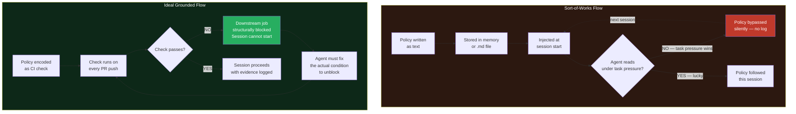
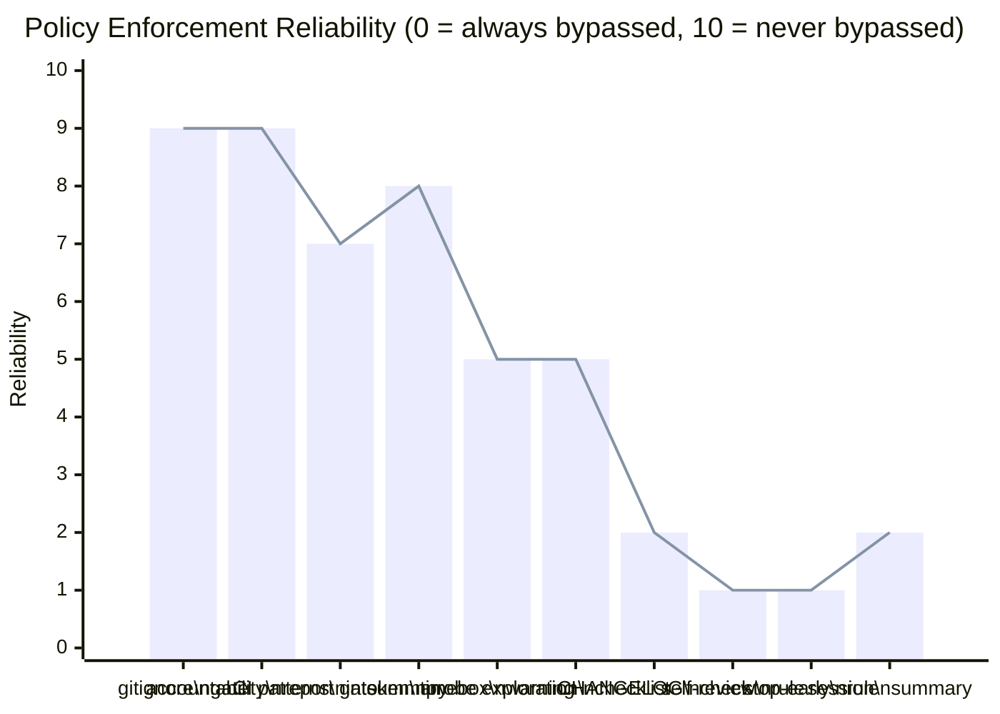

# Enforcement Methods: Ideal (Grounded) vs. Sort-of-Works

> **Generated:** 2026-02-28 | S116i analysis
> **Context:** Aries-Serpent/_codex_ agent behavioral enforcement audit
> **Question:** What mechanisms actually prevent the agent from forgetting / bypassing policy under task pressure?

---

## The Core Problem

Agent behavioral policies are **ephemeral by design**. Every session starts with injected
`<repository_memories>` that the agent reads once, pattern-matches against the immediate task,
then ignores under execution pressure. The same violations recur session after session:

| Violation | Times in accountability report |
|-----------|-------------------------------|
| Gitignore regression | 3× (V-004, V-010, S116d) |
| Skipped accountability report | 2× (V-006, V-014) |
| Premature session end | 5+ documented instances |
| "Do NOT auto-proceed" ignored | Undocumented — no mechanism existed |
| Timebox forgotten | Undocumented — no mechanism existed |

The fundamental gap: **reading is not enforcement.**

---

## Comparison Map

---

## Side-by-Side: Every Policy Enforcement Layer

```mermaid
flowchart LR
    subgraph IDEAL ["✅ IDEAL — Grounded Methods\n(bypass impossible without conscious override)"]
        direction TB

        G1["🚧 CI Hard Stop\n──────────────────\nMethod: exit 1 in cognitive-preflight\nTriggered: every PR push\nEffect: activate-delegation CANNOT run\nExamples:\n• git check-ignore .codex/agent_auth_session.json\n• git diff HEAD~1 HEAD on AGENT_ACCOUNTABILITY_REPORT.md\nBypass cost: must fix the actual problem or skip the job\n(skipping requires conscious manual override)"]

        G2["📌 needs: dependency chain\n──────────────────\nMethod: activate-delegation needs\n[detect-checkbox, await-approval, cognitive-preflight]\nTriggered: every PR push\nEffect: downstream job is structurally blocked\nBypass cost: must edit YAML — intentional, auditable"]

        G3["💬 PR comment injection\n──────────────────\nMethod: github-script POST comment on every push\nTriggered: every PR push (SHA-deduped)\nEffect: checklist appears IN CURRENT CONTEXT\nas an active PR comment — not background memory\nAgent reads PR comments as present-tense instructions\nBypass cost: must consciously ignore a visible checklist"]

        G4["⏱ Timebox marker system\n──────────────────\nMethod: session-watchdog.yml issue_comment trigger\nPosts SESSION_TIMEBOX_START with EXPIRES_AT\nChecks expiry on every subsequent comment\nPosts SESSION_TIMEBOX_EXPIRED with required actions\nEffect: time-bound sessions have a visible deadline\nBypass cost: must ignore a posted expiry notice"]

        G5["🔑 Token probe workflow\n──────────────────\nMethod: token-probe.yml workflow_dispatch\nReal HTTP probes: GET /repo + POST /comments\nReturns HTTP status codes — not assumptions\nPosts consolidated pass/fail summary to PR\nEffect: token health is objectively verified\nBypass cost: cannot fake an HTTP 201"]

        G6["🔍 Exploration session gate\n──────────────────\nMethod: SESSION_TYPE_EXPLORATION marker\nPosted by session-watchdog on detection\nRead by cognitive-preflight on next push\nInjects continuity policy items into checklist\nEffect: exploration rules become present-tense items\nBypass cost: must ignore a PR checklist comment"]
    end

    subgraph SOFT ["⚠️ SORT-OF-WORKS — Soft Methods\n(bypass happens passively under task pressure)"]
        direction TB

        S1["📝 store_memory\n──────────────────\nMethod: fact injected as repository_memories text\nTriggered: injected at session start\nEffect: agent reads it once, pattern-matches,\nthen reverts to trained behavior under pressure\nFailure mode: passive — no active recall trigger\nEvidence: same gitignore regression 3× despite memory\nViolation IDs: V-004, V-010, S116d"]

        S2["📄 Policy text files\n──────────────────\nFiles: CODEBASE_AGENCY_POLICY.md,\nNonDeferPolicy.md,\nEmotionSafeUrgencyGuardrails.md\nMethod: text in repo, referenced in session start protocol\nEffect: only if agent reads them unprompted\nFailure mode: 38 MUST/NEVER/mandatory lines,\n0 enforcement hooks\nBypass cost: zero — just don't read the file"]

        S3["📋 CONTINUATION_PROMPT files\n──────────────────\nCount: 15 files in .codex/\nMethod: manually written prompt for next session\nEffect: only if §8 or human explicitly links to it\nFailure mode: files accumulate, none guaranteed\nto be the one picked up\nBypass cost: zero — agent picks wrong file or ignores"]

        S4["⚠️ README_FIRST_MANDATORY.md\n──────────────────\nMethod: file named to suggest reading order\nEffect: agent should read it — no enforcement\nFailure mode: V-012: agent never read it despite\nmemory entry saying it's mandatory\nBypass cost: zero — naming convention is not a gate"]

        S5["📊 Accountability report text\n──────────────────\nMethod: AGENT_ACCOUNTABILITY_REPORT.md updated each session\nEffect: records violations after they happen\nFailure mode: reactive, not preventive\nViolations V-001 to V-014 all documented AFTER the fact\nBypass cost: zero — violations still occurred"]

        S6["🔔 Session end checklist\n──────────────────\nMethod: store_memory fact listing 5 mandatory steps\nEffect: agent should follow them — no gate\nFailure mode: premature session end still happens\ndespite memory entry specifically saying not to\nBypass cost: zero — agent stops anyway"]
    end

    IDEAL ~~~ SOFT
```

---

## The Critical Distinction

---

## Policy-by-Policy Verdict

| Policy / Rule | Current Method | Grounded? | Gap / Fix |
|---------------|----------------|-----------|-----------|
| Accountability report touched each session | `cognitive-preflight` REQ-4: `git diff HEAD~1 HEAD` → `exit 1` | ✅ **GROUNDED** | None — blocks activation |
| `.gitignore` allows `agent_auth_session.json` | `cognitive-preflight` REQ-3: `git check-ignore` → `exit 1` | ✅ **GROUNDED** | None — blocks activation |
| Timebox respected | `session-watchdog.yml` + `SESSION_TIMEBOX_EXPIRED` | 🟡 **PARTIAL** | Expiry posts a comment. Agent CAN ignore it. No hard block yet. |
| Exploration: never self-close | `SESSION_TYPE_EXPLORATION` → checklist injection | 🟡 **PARTIAL** | Checklist is present-tense but not a hard stop. |
| "Do NOT auto-proceed" | `session-watchdog` detection + checklist item | 🟡 **PARTIAL** | Same — visible, but no structural gate |
| Session summary on close | Checklist item only | ⚠️ **SOFT** | No detection mechanism for "session close" event |
| ~10min incremental summaries | Checklist item only | ⚠️ **SOFT** | No timer / no detection |
| Tokens functional | `token-probe.yml` real HTTP probe | ✅ **GROUNDED** | Must be dispatched manually (not automatic yet) |
| Read README_FIRST_MANDATORY | `store_memory` + naming | ❌ **SOFT** | No gate. V-012: failed despite memory entry |
| Pre-commit gitignore check | `store_memory` + REQ-3 gate | ✅ **GROUNDED** | REQ-3 catches it at PR time — grounded |
| 5-pass self-review before close | Policy text only | ❌ **SOFT** | No mechanism can detect review quality |
| NEVER stop after one commit | `store_memory` + policy text | ❌ **SOFT** | No gate. Still happens. Most serious violation. |
| Update CHANGELOG.md | Policy text only | ❌ **SOFT** | No check. Frequently missed. |
| CI failure patterns reviewed | `cognitive-preflight` REQ-2: table in job summary | ✅ **GROUNDED** | Summary is visible. Not a hard stop but present-tense. |

---

## What Would Make the Remaining Soft Policies Grounded

```mermaid
flowchart TD
    subgraph REMAINING_GAPS ["Remaining Soft Policies — Engineering Path to Grounded"]

        G1["NEVER stop after one commit\n──────────────\nCurrent: store_memory (fails)\nGrounded fix:\nAdd session-duration check to cognitive-preflight:\n• Read SESSION_START timestamp from agent_auth_session.json\n• If only 1 commit since session start AND\n  work queue has open items → exit 1\nBlocker: requires session-start tracking to be reliable"]

        G2["CHANGELOG.md update required\n──────────────\nCurrent: policy text (fails)\nGrounded fix:\ncognitive-preflight REQ-5:\ngit diff HEAD~1 HEAD | grep CHANGELOG.md\nIf not touched → exit 1 (same pattern as REQ-4)\nCost: 8 lines of bash — trivially implementable"]

        G3["Session summary on close\n──────────────\nCurrent: checklist item (soft)\nGrounded fix:\nPost a PR comment template when SESSION_TIMEBOX_EXPIRED\nfires that BLOCKS the next @copilot continue\nuntil a ## 🧠 Session Summary comment is detected.\nRequires: chatops_copilot_trigger.yml check\nfor Session Summary marker before dispatching"]

        G4["~10min incremental summaries\n──────────────\nCurrent: checklist item (soft)\nGrounded fix:\nScheduled workflow (cron: every 10 min) that checks\nif SESSION_TYPE_EXPLORATION is active and last\nagent comment was >10min ago → posts reminder\nBlocker: GitHub Actions minimum cron interval = 5min\nCost: medium — requires cron + comment timestamp logic"]

        G5["5-pass self-review\n──────────────\nCurrent: policy text (soft)\nGrounded fix: NONE POSSIBLE\nReasoning: review quality is subjective.\nCannot be CI-gated.\nBest available: checklist item that is\npresent-tense (already implemented in REQ-1)"]
    end

    NEXT["Highest ROI next steps:\n1. CHANGELOG check (trivial — 8 lines)\n2. Session summary gate in chatops trigger\n3. NEVER-stop-early: session duration tracking"]

    REMAINING_GAPS --> NEXT

    style NEXT fill:#27ae60,color:#fff
```

---

## Reliability Spectrum — Current State

---

## Summary: The Three Tiers

| Tier | Mechanism | Bypass Cost | Examples built |
|------|-----------|-------------|----------------|
| **Tier 1 — Hard Block** | `exit 1` in CI job that `activate-delegation needs:` | Must fix the actual condition | REQ-3 gitignore, REQ-4 accountability report |
| **Tier 2 — Present-Tense Injection** | PR comment posted with every push (visible in current context) | Must consciously ignore a visible checklist | REQ-1 checklist, session-type directives, timebox remaining |
| **Tier 3 — Background Memory** | `store_memory`, `.md` files, README naming | Zero — bypassed passively under task pressure | All pre-WF-001 policies |

**Rule:** Every Tier-3 policy that has caused a documented violation should be promoted to Tier-1 or Tier-2.

---

*Generated: 2026-02-28 | S116i | .codex/docs/GROUNDED_VS_SOFT_ENFORCEMENT.md*
