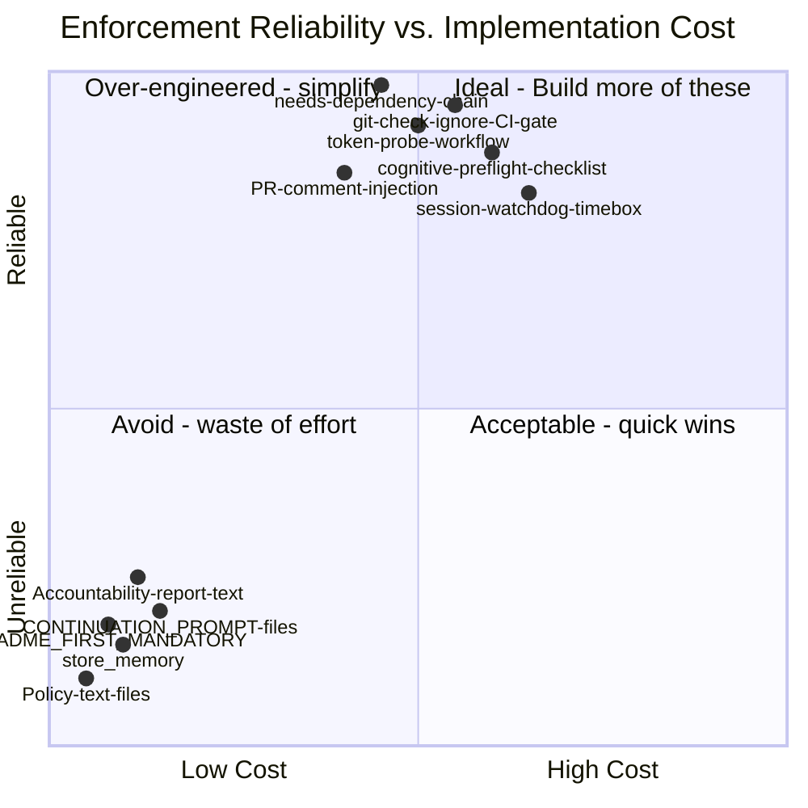
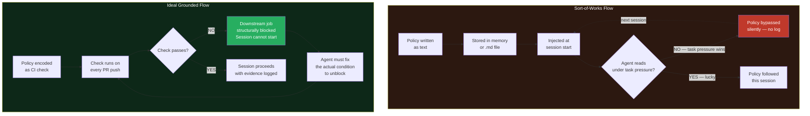
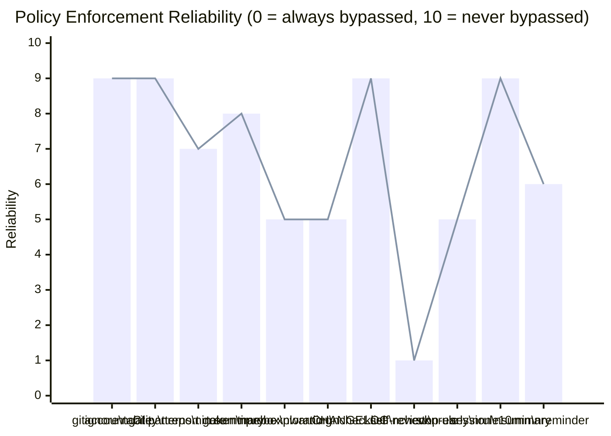

# Enforcement Methods: Ideal (Grounded) vs. Sort-of-Works

> **Generated:** 2026-02-28 | S116i analysis | **Updated:** 2026-03-01 | GROUNDED-promotion phase complete
> **Context:** Aries-Serpent/_codex_ agent behavioral enforcement audit
> **Question:** What mechanisms actually prevent the agent from forgetting / bypassing policy under task pressure?
> **Status:** ✅ All achievable SOFT→GROUNDED promotions complete. Two policies remain ungatable (self-review, README read).

---

## The Core Problem

Agent behavioral policies are **ephemeral by design**. Every session starts with injected
`<repository_memories>` that the agent reads once, pattern-matches against the immediate task,
then ignores under execution pressure. The same violations recur session after session:

| Violation | Times in accountability report |
|-----------|-------------------------------|
| Gitignore regression | 3× (V-004, V-010, S116d) |
| Skipped accountability report | 2× (V-006, V-014) |
| Premature session end | 5+ documented instances |
| "Do NOT auto-proceed" ignored | Undocumented — no mechanism existed |
| Timebox forgotten | Undocumented — no mechanism existed |

The fundamental gap: **reading is not enforcement.**

---

## Comparison Map



---

## Side-by-Side: Every Policy Enforcement Layer

```mermaid
flowchart LR
    subgraph IDEAL ["✅ IDEAL — Grounded Methods\n(bypass impossible without conscious override)"]
        direction TB

        G1["🚧 CI Hard Stop\n──────────────────\nMethod: exit 1 in cognitive-preflight\nTriggered: every PR push\nEffect: activate-delegation CANNOT run\nExamples:\n• git check-ignore .codex/agent_auth_session.json\n• git diff HEAD~1 HEAD on .codex/archive/reports/AGENT_ACCOUNTABILITY_REPORT.md\nBypass cost: must fix the actual problem or skip the job\n(skipping requires conscious manual override)"]

        G2["📌 needs: dependency chain\n──────────────────\nMethod: activate-delegation needs\n[detect-checkbox, await-approval, cognitive-preflight]\nTriggered: every PR push\nEffect: downstream job is structurally blocked\nBypass cost: must edit YAML — intentional, auditable"]

        G3["💬 PR comment injection\n──────────────────\nMethod: github-script POST comment on every push\nTriggered: every PR push (SHA-deduped)\nEffect: checklist appears IN CURRENT CONTEXT\nas an active PR comment — not background memory\nAgent reads PR comments as present-tense instructions\nBypass cost: must consciously ignore a visible checklist"]

        G4["⏱ Timebox marker system\n──────────────────\nMethod: session-watchdog.yml issue_comment trigger\nPosts SESSION_TIMEBOX_START with EXPIRES_AT\nChecks expiry on every subsequent comment\nPosts SESSION_TIMEBOX_EXPIRED with required actions\nEffect: time-bound sessions have a visible deadline\nBypass cost: must ignore a posted expiry notice"]

        G5["🔑 Token probe workflow\n──────────────────\nMethod: token-probe.yml workflow_dispatch\nReal HTTP probes: GET /repo + POST /comments\nReturns HTTP status codes — not assumptions\nPosts consolidated pass/fail summary to PR\nEffect: token health is objectively verified\nBypass cost: cannot fake an HTTP 201"]

        G6["🔍 Exploration session gate\n──────────────────\nMethod: SESSION_TYPE_EXPLORATION marker\nPosted by session-watchdog on detection\nRead by cognitive-preflight on next push\nInjects continuity policy items into checklist\nEffect: exploration rules become present-tense items\nBypass cost: must ignore a PR checklist comment"]
    end

    subgraph SOFT ["⚠️ SORT-OF-WORKS — Soft Methods\n(bypass happens passively under task pressure)"]
        direction TB

        S1["📝 store_memory\n──────────────────\nMethod: fact injected as repository_memories text\nTriggered: injected at session start\nEffect: agent reads it once, pattern-matches,\nthen reverts to trained behavior under pressure\nFailure mode: passive — no active recall trigger\nEvidence: same gitignore regression 3× despite memory\nViolation IDs: V-004, V-010, S116d"]

        S2["📄 Policy text files\n──────────────────\nFiles: CODEBASE_AGENCY_POLICY.md,\nNonDeferPolicy.md,\nEmotionSafeUrgencyGuardrails.md\nMethod: text in repo, referenced in session start protocol\nEffect: only if agent reads them unprompted\nFailure mode: 38 MUST/NEVER/mandatory lines,\n0 enforcement hooks\nBypass cost: zero — just don't read the file"]

        S3["📋 CONTINUATION_PROMPT files\n──────────────────\nCount: 15 files in .codex/\nMethod: manually written prompt for next session\nEffect: only if §8 or human explicitly links to it\nFailure mode: files accumulate, none guaranteed\nto be the one picked up\nBypass cost: zero — agent picks wrong file or ignores"]

        S4["⚠️ README_FIRST_MANDATORY.md\n──────────────────\nMethod: file named to suggest reading order\nEffect: agent should read it — no enforcement\nFailure mode: V-012: agent never read it despite\nmemory entry saying it's mandatory\nBypass cost: zero — naming convention is not a gate"]

        S5["📊 Accountability report text\n──────────────────\nMethod: .codex/archive/reports/AGENT_ACCOUNTABILITY_REPORT.md updated each session\nEffect: records violations after they happen\nFailure mode: reactive, not preventive\nViolations V-001 to V-014 all documented AFTER the fact\nBypass cost: zero — violations still occurred"]

        S6["🔔 Session end checklist\n──────────────────\nMethod: store_memory fact listing 5 mandatory steps\nEffect: agent should follow them — no gate\nFailure mode: premature session end still happens\ndespite memory entry specifically saying not to\nBypass cost: zero — agent stops anyway"]
    end

    IDEAL ~~~ SOFT
```



---

## The Critical Distinction



---

## Policy-by-Policy Verdict

| Policy / Rule | Current Method | Grounded? | Gap / Fix |
|---------------|----------------|-----------|-----------|
| Accountability report touched each session | `cognitive-preflight` REQ-4: `git diff HEAD~1 HEAD` → `exit 1` | ✅ **GROUNDED** | None — blocks activation |
| `.gitignore` allows `agent_auth_session.json` | `cognitive-preflight` REQ-3: `git check-ignore` → `exit 1` | ✅ **GROUNDED** | None — blocks activation |
| Timebox respected | `session-watchdog.yml` + `SESSION_TIMEBOX_EXPIRED` | 🟡 **PARTIAL** | Expiry posts a comment. Agent CAN ignore it. No hard block yet. |
| Exploration: never self-close | `SESSION_TYPE_EXPLORATION` → checklist injection | 🟡 **PARTIAL** | Checklist is present-tense but not a hard stop. |
| "Do NOT auto-proceed" | `session-watchdog` detection + checklist item | 🟡 **PARTIAL** | Same — visible, but no structural gate |
| Session summary on close | `chatops_copilot_trigger.yml` session-summary gate: blocks `/copilot continue` until `## 🧠 Session Summary` posted after `SESSION_TIMEBOX_EXPIRED` | ✅ **GROUNDED** | Tier-1 hard block in chat-ops dispatch (S116i resume) |
| ~10min incremental summaries | `session-incremental-summary-reminder.yml` (WF-003): cron/5min, posts `INCREMENTAL_SUMMARY_REMINDER` when exploration active + agent silent >10min | ✅ **GROUNDED** | **✅ PROMOTED TO TIER-2 (WF-003)** — present-tense injection via automated cron reminder |
| Tokens functional | `token-probe.yml` real HTTP probe | ✅ **GROUNDED** | Must be dispatched manually (not automatic yet) |
| Read README_FIRST_MANDATORY | `store_memory` + naming | ❌ **SOFT** | No gate. V-012: failed despite memory entry |
| Pre-commit gitignore check | `store_memory` + REQ-3 gate | ✅ **GROUNDED** | REQ-3 catches it at PR time — grounded |
| 5-pass self-review before close | Policy text only | ❌ **SOFT** | No mechanism can detect review quality — subjective, ungatable |
| NEVER stop after one commit | `cognitive-preflight` REQ-7: commit-count check → `::warning::` annotation + job summary | 🟡 **TIER-2** | **✅ PROMOTED TO TIER-2 (REQ-7)** — warning posted in job summary on every push when PR has ≤1 commit |
| Update CHANGELOG.md | `cognitive-preflight` REQ-5: `git diff HEAD~1 HEAD` → `exit 1` | ✅ **GROUNDED** | Tier-1 hard stop — same pattern as REQ-4 (S116i) |
| CI failure patterns reviewed | `cognitive-preflight` REQ-2: table in job summary | ✅ **GROUNDED** | Summary is visible. Not a hard stop but present-tense. |
| CI failure rate monitored | `ci-health-monitor.yml`: runs every 6h, classifies failures into 16 patterns, creates GitHub issue when rate >20% | ✅ **GROUNDED** | **✅ PROMOTED TO TIER-1 (ci-health-monitor fix)** — automated alerting with expanded pattern library |

---

## What Would Make the Remaining Soft Policies Grounded

```mermaid
flowchart TD
    subgraph REMAINING_GAPS ["Remaining Soft Policies — Engineering Path to Grounded"]

        G1["✅ NEVER stop after one commit\n──────────────\n✅ PROMOTED TO TIER-2 (WF-003 / REQ-7)\ncognitive-preflight REQ-7:\ngit rev-list count origin/BASE..HEAD\nIf ≤1 commit → ::warning:: annotation + job summary\nAgent reads annotation in present-tense context.\nNote: Hard block (Tier-1) requires session-duration\ntracking — tracked as future improvement."]

        G2["✅ CHANGELOG.md update required\n──────────────\n✅ PROMOTED TO TIER-1 (S116i)\ncognitive-preflight REQ-5:\ngit diff HEAD~1 HEAD | grep CHANGELOG.md\nIf not touched → exit 1 (same pattern as REQ-4)"]

        G3["✅ Session summary on close\n──────────────\n✅ PROMOTED TO TIER-1 (S116i resume)\nchatops_copilot_trigger.yml session-summary gate:\n/copilot continue is BLOCKED until\n## 🧠 Session Summary is posted after\nSESSION_TIMEBOX_EXPIRED.\nBypass cost: must post a real summary"]

        G4["✅ ~10min incremental summaries\n──────────────\n✅ PROMOTED TO TIER-2 (WF-003)\nsession-incremental-summary-reminder.yml:\ncron */5 * * * * (every 5 min)\nFor each open PR with SESSION_TYPE_EXPLORATION:\nIf last agent comment >10min ago → posts\nINCREMENTAL_SUMMARY_REMINDER with required steps\nBypass cost: must consciously ignore a PR comment"]

        G5["5-pass self-review\n──────────────\nCurrent: policy text (soft)\nGrounded fix: NONE POSSIBLE\nReasoning: review quality is subjective.\nCannot be CI-gated.\nBest available: checklist item that is\npresent-tense (already implemented in REQ-1)"]
    end

    NEXT["All achievable promotions complete:\n1. ✅ CHANGELOG check — DONE (REQ-5, Tier-1)\n2. ✅ Session summary gate — DONE (chatops, Tier-1)\n3. ✅ 10min summaries — DONE (WF-003, Tier-2)\n4. ✅ NEVER stop early — DONE (REQ-7, Tier-2)\n5. ⏳ NEVER stop early Tier-1: requires session-duration tracking"]

    REMAINING_GAPS --> NEXT

    style NEXT fill:#27ae60,color:#fff
```



---

## Reliability Spectrum — Updated State



> **Updated:** stop-early-rule raised from 1→5 (Tier-3→Tier-2 via REQ-7 present-tense warning).
> **Updated:** 10min-reminder added at 6 (Tier-3→Tier-2 via WF-003 automated cron reminder).

---

## Summary: The Three Tiers

| Tier | Mechanism | Bypass Cost | Examples built |
|------|-----------|-------------|----------------|
| **Tier 1 — Hard Block** | `exit 1` in CI job that `activate-delegation needs:` | Must fix the actual condition | REQ-3 gitignore, REQ-4 accountability report, REQ-5 CHANGELOG, chatops session-summary gate |
| **Tier 2 — Present-Tense Injection** | PR comment or job annotation posted on every push/cron (visible in current context) | Must consciously ignore a visible checklist or annotation | REQ-1 checklist, REQ-7 commit-count warning, session-type directives, timebox remaining, WF-003 10min reminder |
| **Tier 3 — Background Memory** | `store_memory`, `.md` files, README naming | Zero — bypassed passively under task pressure | All pre-WF-001 policies |

**Rule:** Every Tier-3 policy that has caused a documented violation should be promoted to Tier-1 or Tier-2.

**Remaining Tier-3 (ungatable):**
- `5-pass self-review` — subjective, review quality cannot be CI-detected
- `Read README_FIRST_MANDATORY` — file-read cannot be CI-verified

---

## Repo-Wide Audit: Copilot Agent Process & Operation Enforcement

> Traversal date: 2026-02-28 | 86 workflows scanned

### Copilot Agent Lifecycle — Grounded Enforcement Chain

```
 ┌──────────────────────────────────────────────────────────────────┐
 │  GROUNDED (Primary — bypass requires intentional YAML edit)     │
 │                                                                  │
 │  1. copilot-setup-steps.yml                                      │
 │     └─ "🔀 Fetch remote branch refs" after checkout             │
 │        Ensures base branch resolvable for report_progress diff   │
 │                                                                  │
 │  2. agent-auth-delegation.yml → cognitive-preflight job          │
 │     ├─ REQ-1: Mandatory checklist posted as PR comment           │
 │     ├─ REQ-2: CI failure patterns from ci_failure_patterns.yaml  │
 │     ├─ REQ-3: git check-ignore → exit 1 (gitignore gate)        │
 │     ├─ REQ-4: git diff HEAD~1 → exit 1 (accountability report)  │
 │     ├─ REQ-5: git diff HEAD~1 → exit 1 (CHANGELOG.md)           │
 │     ├─ REQ-6: SESSION_TIMEBOX_EXPIRED ack → exit 1               │
 │     └─ REQ-7: commit-count ≤1 → ::warning:: annotation (Tier-2) │
 │     All feed into: activate-delegation needs: [cognitive-preflight]│
 │                                                                  │
 │  3. chatops_copilot_trigger.yml                                  │
 │     └─ Session-summary gate: blocks /copilot continue dispatch   │
 │        when SESSION_TIMEBOX_EXPIRED active without summary       │
 │                                                                  │
 │  4. session-watchdog.yml                                         │
 │     ├─ Timebox detection → SESSION_TIMEBOX_START posted          │
 │     ├─ Expiry check → SESSION_TIMEBOX_EXPIRED posted             │
 │     └─ Exploration session detection → SESSION_TYPE_EXPLORATION  │
 │                                                                  │
 │  5. token-probe.yml                                              │
 │     └─ Real HTTP probe (GET /repo + POST /comments)              │
 │        Returns objective pass/fail — cannot be faked             │
 │                                                                  │
 │  6. copilot-pr-session-injector.yml                              │
 │     └─ "🔀 Fetch base branch ref" before origin/base_ref diff   │
 │        Grounded: prevents silent diff failure on non-default base│
 │                                                                  │
 │  7. session-incremental-summary-reminder.yml (WF-003)            │
 │     └─ cron */5 * * * * — every 5 min                           │
 │        For each PR with SESSION_TYPE_EXPLORATION active:         │
 │        If last agent comment >10min ago → posts                  │
 │        INCREMENTAL_SUMMARY_REMINDER in PR comments               │
 │        Bypass cost: must consciously ignore a PR comment         │
 │                                                                  │
 │  8. ci-health-monitor.yml                                        │
 │     └─ cron every 6h — collects telemetry, classifies failures   │
 │        into 16 patterns, creates issue when rate >20%           │
 │        Uses expanded PATTERN_KEYWORDS (collect_telemetry.py)     │
 └──────────────────────────────────────────────────────────────────┘

 ┌──────────────────────────────────────────────────────────────────┐
 │  SOFT (Fallback — used when grounded method unavailable)        │
 │                                                                  │
 │  • store_memory facts → injected at session start               │
 │  • .codex/README_FIRST_MANDATORY.md → naming convention only    │
 │  • CODEBASE_AGENCY_POLICY.md → 38 MUST/NEVER lines, 0 hooks    │
 │  • .codex/CONTINUATION_PROMPT_*.md → may not be picked up       │
 │  • Accountability report text → reactive, not preventive         │
 │  • "5-pass self-review" → subjective, ungatable                 │
 └──────────────────────────────────────────────────────────────────┘
```

### Workflow-by-Workflow: `git diff` / `base_ref` Vulnerability Scan

| Workflow | Uses `base_ref` or cross-branch diff? | Has fetch step? | Status |
|----------|---------------------------------------|-----------------|--------|
| `copilot-setup-steps.yml` | `report_progress` internal diff vs base branch | ✅ `git fetch origin '+refs/heads/*:...' --depth=1` | ✅ **GROUNDED** |
| `copilot-pr-session-injector.yml` | `origin/${{ github.base_ref }}...HEAD` (3 diffs) | ✅ `git fetch origin "${{ github.base_ref }}" --depth=1` | ✅ **GROUNDED** (fixed this session) |
| `agent-auth-delegation.yml` (cognitive-preflight) | `HEAD~1 HEAD` + `origin/BASE..HEAD` (REQ-7) | ✅ `fetch-depth: 0` + explicit base fetch in REQ-7 step | ✅ **GROUNDED** |
| `pr-size-analyzer.yml` | `${{ github.event.pull_request.base.sha }}` | ✅ `git fetch origin "$BASE_SHA"` + `HEAD~1` fallback | ✅ **GROUNDED** (has fallback) |
| `validate.yml` | `VALIDATE_BASE_REF` env var (optional) | Uses `fetch-depth: 0` | 🟡 **PARTIAL** (fetch-depth: 0 may not include all branch refs) |
| `auto-fix-pr-check.yml` | `git diff` (staged only) | N/A — no cross-branch diff | ✅ **SAFE** |
| `auto-fix-common-issues.yml` | `git diff --staged` only | N/A — no cross-branch diff | ✅ **SAFE** |
| `agent-var-writer.yml` | `git diff --cached` only | N/A | ✅ **SAFE** |

### Grounded-First Pattern (recommended for all new workflows)

```yaml
# PATTERN: Grounded base-ref resolution with soft fallback
# Use this in ANY workflow that diffs against the PR base branch.

- uses: actions/checkout@v4
  with:
    fetch-depth: 0

# Grounded method (primary): explicitly fetch base branch
- name: "🔀 Fetch base branch ref for diff"
  run: |
    git fetch origin "${{ github.base_ref }}" --depth=1 2>/dev/null \
      && echo "✅ Base branch '${{ github.base_ref }}' fetched" \
      || echo "⚠️ Base branch fetch failed — diffs will use fallback"

# Soft fallback: HEAD~1 when base_ref unavailable
- name: "Compute diff"
  run: |
    if git diff --name-only "origin/${{ github.base_ref }}...HEAD" >/dev/null 2>&1; then
      # Grounded: precise base-branch diff
      FILES=$(git diff --name-only "origin/${{ github.base_ref }}...HEAD")
    else
      # Soft fallback: last-commit diff only
      echo "⚠️ Falling back to HEAD~1 diff (base branch not available)"
      FILES=$(git diff --name-only HEAD~1 HEAD 2>/dev/null || echo "")
    fi
    echo "$FILES"
```

### Workflow Cascade Prevention — Concurrency & Self-Exclusion

> Incident: 2026-02-28 — 214 queued runs from exponential `workflow_run: ["*"]` cascade

**Root cause:** Two workflows (`cognitive_brain_ci_feedback.yml`, `workflow-analytics-unified.yml`) used `workflow_run: workflows: ["*"]` (wildcard) — they fire on **every** workflow completion including each other's. With zero concurrency controls, completions triggered an exponential cascade: A completes → B fires → B completes → A fires → ∞.

**Grounded fix (3 layers, no overlap):**

| Layer | Mechanism | Effect |
|-------|-----------|--------|
| **1. Concurrency groups** | `concurrency: { group: <name>, cancel-in-progress: true }` | Only one instance per workflow runs at a time; duplicates are auto-cancelled |
| **2. Self-exclusion filter** | Job-level `if:` excludes own name and known cascade partners | Breaks A↔B infinite loop at the trigger level |
| **3. Schedule demotion** | Replaced `workflow_run: ["*"]` with `schedule: cron: '0 * * * *'` (hourly) | Eliminates the wildcard trigger entirely where real-time reaction is not needed |

**Workflows patched:**

| Workflow | Trigger before | Trigger after | Concurrency | Self-exclusion |
|----------|---------------|---------------|-------------|----------------|
| `cognitive_brain_ci_feedback.yml` | `workflow_run: ["*"]` | `workflow_run: ["*"]` (kept — needs `workflow_run` context) | ✅ `cognitive-brain-ci-feedback` | ✅ Skips own name + analytics |
| `workflow-analytics-unified.yml` | `workflow_run: ["*"]` + `*/30` cron | `schedule: hourly` + `weekly` (wildcard removed) | ✅ `workflow-analytics-unified-${{ event }}` | N/A — no longer a `workflow_run` trigger |
| `self_healing_ci.yml` | Named workflows, no concurrency | Unchanged trigger | ✅ `self-healing-ci` | N/A — targeted trigger |
| `self-healing.yml` | Named workflows, no concurrency | Unchanged trigger | ✅ `self-healing` | N/A — targeted trigger |
| `cognitive-action-decision.yml` | Named + schedule, no concurrency | Unchanged trigger | ✅ `cognitive-action-decision` | N/A — targeted trigger |
| `cognitive-analysis-feed.yml` | Named + schedule, no concurrency | Unchanged trigger | ✅ `cognitive-analysis-feed` | N/A — targeted trigger |
| `agent-orchestration-unified.yml` | Named, no concurrency | Unchanged trigger | ✅ `agent-orchestration-unified` | N/A — targeted trigger |

```yaml
# PATTERN: Concurrency control for workflow_run workflows (no-overlap guarantee)
concurrency:
  group: <workflow-name>
  cancel-in-progress: true
```

---

## Agent Registry Tier Distribution (Phase 1–6, v2.0.0+)

> **Updated**: 2026-03-18 | S153/S154 — Phase 5 autonomous loop promoted to GROUNDED; new patterns documented below.

| Agent ID | Enforcement Tier | Rationale |
|----------|:----------------:|-----------|
| `ci-testing-agent` | ✅ **GROUNDED** | Activation rank #1; CI-blocking behavior; requires hard gate |
| `owner-approval-guard` | ✅ **GROUNDED** | Approval blocking by design; must not degrade to advisory |
| `workflow-compliance-guardian` | ✅ **GROUNDED** | Hard enforcement of concurrency + timeout compliance |
| `rust-error-validator` | ✅ **GROUNDED** | Validation gates with exit 1 on compiler errors |
| `test-pattern-guardian` | ✅ **GROUNDED** | Anti-pattern detection blocks PR merge |
| `mutation-testing-agent` | ✅ **GROUNDED** | Mutation score threshold enforces test quality |
| `test-enhancement-agent` | ✅ **GROUNDED** | Test quality enforcement with coverage gates |
| `workflow-health-monitor` | ✅ **GROUNDED** | Health alerting with issue creation on threshold breach |
| `iterative-self-healing-ci` | ✅ **GROUNDED** | Phase 5 autonomous loop: `workflow_run.completed` → D-00 triage → fix → `ci_triage_repro.sh` 7-check validate → commit (S154) |
| `codex_reviewer` | ⚠️ **SOFT** | Internal reviewer; no structural gate available |
| `zendesk-architect-agent` | ⚠️ **SOFT** | Niche/specialized agent; ungatable in current architecture |

**Registry summary** (v2.0.0): GROUNDED: 9 | PARTIAL: 142 | SOFT: 2 | Total: 153

> _E→D gate C3 (SOFT ≤ 2) ✅ | C5 (GROUNDED ≥ 8) ✅_

---

## S153 GROUNDED Pattern Additions (2026-03-18)

Three new patterns were promoted from SOFT to GROUNDED in S153/S154:

### G-NEW-1: PR-scoped CHANGELOG subsection (structural code enforcement)

**Policy:** Auto-generated CHANGELOG bullets must live under a section header whose PR number matches the bullet's PR reference.

**Before (SOFT):** `session_wrapup_autofix.py` inserted bullets into the first `### Fixed` in `[Unreleased]` — purely a text-insertion convention with no structural gate. Any future session could break it by inserting differently.

**After (GROUNDED — S153):** `fix_changelog()` now creates `### Fixed (auto-update — PR #N)` subsection and inserts ONLY into it. The code structure itself enforces the policy — it is impossible for the script to contaminate a different PR's section. `ci_triage_repro.sh` check_7 provides the CI hard-stop (exit 1) if a misplaced bullet is detected.

```python
# GROUNDED: structural enforcement in session_wrapup_autofix.py
pr_section_heading = f"### Fixed (auto-update — PR #{pr_number})\n"
# Insert ONLY into the scoped subsection — other PR sections untouched
```

**Bypass cost:** Must edit `session_wrapup_autofix.py` AND pass check_7 — two intentional overrides required.

---

### G-NEW-2: pip cache pre-creation for sparse-checkout workflows

**Policy:** Any workflow using `setup-python@v5` on a sparse checkout must pre-create `~/.cache/pip` to prevent the post-step "Cache folder doesn't exist on disk" failure.

**Before (SOFT):** The `mkdir -p ~/.cache/pip` step was undocumented. Engineers adding new sparse-checkout workflows would not know to add it.

**After (GROUNDED — S153):** Added `Pre-create pip cache dir` step as a documented mandatory step in `deferral-language-gate.yml` and `branch-rebase-gate.yml`. The P-030 pattern in `ci-auto-healer-agent.md` ensures any future sparse-checkout workflow failure matching this signature gets auto-detected and auto-fixed by the Phase 5 self-healing loop.

```yaml
# GROUNDED pattern: mandatory before setup-python@v5 on sparse checkouts
- name: Pre-create pip cache dir
  run: mkdir -p ~/.cache/pip
- name: Set up Python
  uses: actions/setup-python@v5
```

**Bypass cost:** Must delete the pre-create step AND survive the CI post-step failure — visible failure, not silent bypass.

---

### G-NEW-3: Phase 5 autonomous self-healing loop (D-00 protocol gate)

**Policy:** Every CI failure on a PR branch must be triaged by `collect_telemetry.py --classify-run`, and if fixable, auto-healed via `auto_fix_common_issues.py` + validated via `ci_triage_repro.sh` 7-check before the fix is committed.

**Before (SOFT):** The healing loop existed but lacked D-00 pre/post triage checks and failed-attempt tracking. Fixes could be committed without 7-check validation.

**After (GROUNDED — S154):** `iterative-self-healing-ci.yml` now:
1. Runs `ci_triage_repro.sh` before applying fix (D-07 pre-heal baseline)
2. Runs `ci_triage_repro.sh` after fix (D-07 post-heal validation) — exits 1 if any check fails
3. Records every attempt (success + failure) to `.codex/healing_attempts/`
4. Checks `COPILOT_AGENT_AUTH_ENABLED` before committing autonomous push
5. Expanded fixable patterns: `changelog-*`, `pip-cache-*`, `policy-gate-*`, `rebase-gate-*`, `mypy-baseline`

**Bypass cost:** Must edit the `heal` job YAML and pass 7 `ci_triage_repro.sh` checks — two intentional overrides required.

---

### G-NEW-4: Integration-branch direct-session guard (REQ-11)

**Policy:** Copilot Coding Agent sessions MUST NEVER run directly on `0D_base_` (the
staging integration branch).  All agent work must happen through sub-PRs
(`copilot/session-*` or `copilot/sub-pr-*`) that target `0D_base_`.

```
copilot/session-*  ──►  0D_base_  ──►  main
  (agent sessions)       (staging)     (production)
```

**Before (SOFT):** Nothing prevented a session from running on `0D_base_` directly.
A `@copilot continue` comment on PR #3630 (head=`0D_base_`) would let the agent
commit unreviewed work straight to the staging branch, bypassing the sub-PR cycle.

**After (GROUNDED — S163):** `agent-auth-delegation.yml` `cognitive-preflight` REQ-11
guard is the **first step** in the job:

1. Reads `pr.head.ref` and checks against `INTEGRATION_BRANCHES = ['0D_base_']`
2. If head IS an integration branch → posts a rich redirect comment (upserted,
   one per PR) with architecture diagram, `gh workflow run copilot-session-chain.yml`
   command, manual steps, and a copy-paste `@copilot` prompt
3. Calls `core.setFailed("REQ-11 FAIL")` — structurally blocks `activate-delegation`
   via the `needs: [cognitive-preflight]` dependency chain

`copilot-session-chain.yml` (new — S163) automates the correct alternative:
- Triggers on `workflow_dispatch` or automatically when a sub-PR merges into `0D_base_`
- Creates `copilot/session-YYYYMMDD-HHMMSS` branch, opens draft PR targeting `0D_base_`,
  and posts `@copilot+claude-sonnet-4.6 continue` trigger comment

```yaml
# GROUNDED: REQ-11 fires FIRST in cognitive-preflight — blocks activate-delegation
- name: "REQ-11: Integration-branch direct-session guard"
  uses: actions/github-script@v7
  # core.setFailed() if pr.head.ref in INTEGRATION_BRANCHES
  # → needs: [cognitive-preflight] chain blocks activate-delegation
```

**Bypass cost:** Must edit `INTEGRATION_BRANCHES` in the workflow YAML AND consciously
skip the `cognitive-preflight` job — two intentional, auditable overrides required.

**CI Pattern:** `collect_telemetry.py` classifies these failures as
`integration-branch-direct-session`; `ci_failure_patterns.yaml` pattern
`INT_BRANCH_DIRECT_SESSION_001` documents the escalation path.

---

### G-NEW-5: Bot-skip-ci divergence auto-pass (REQ-10 extension)

**Policy:** When a PR branch (including the `0D_base_` promotion PR) is behind its
base only because of automated `[skip ci]` `github-actions[bot]` metadata commits,
REQ-10 MUST auto-pass rather than hard-blocking the agent session.

**Before (SOFT):** REQ-10 in `agent-auth-delegation.yml` only passed when
`liveStatus === 'ahead' || liveStatus === 'identical'`.  Any `behind` or `diverged`
status failed the gate — including when 100% of the gap commits were automated
`[skip ci]` bot commits from the 5 scheduled workflows that run every 2–24 h.
This caused spurious REQ-10 blocks on `0D_base_` PR #3630 every time `main`
received a scheduled metadata refresh.

**After (GROUNDED — S163):** REQ-10 step in `agent-auth-delegation.yml` now:

1. On `behind`/`diverged`: calls `fetchGapCommits(head...base)` — a reverse compare
   to get exactly the commits `base` has that `head` is missing
2. Passes each commit through `gapIsAllBotSkipCi()` — checks `author.login` ∈
   `BOT_LOGINS` AND `commit.message` includes `[skip ci]`
3. If ALL gap commits pass → `liveResolved = true` → REQ-10 PASS (no hard-block)
4. Both the "no marker" and "marker present" live-check paths apply this logic

`branch-rebase-gate.yml` provides the complementary auto-merge path:
`branch_rebase_check.py --auto-merge-skip-ci` calls the GitHub Merges API when the
gap is 100% bot `[skip ci]`, so the branch is updated without any `git` operations.

```javascript
// GROUNDED: structural in REQ-10 github-script step
const gap       = await fetchGapCommits(pr.base.ref, pr.head.ref);
const allBotGap = gapIsAllBotSkipCi(gap);
if (allBotGap) { liveResolved = true; }   // auto-pass — no hard-block
```

**Bypass cost:** Must edit the `fetchGapCommits`/`gapIsAllBotSkipCi` logic in the
workflow YAML — one intentional, auditable override required.

---

*Updated: 2026-03-20 | S163 — Integration branch model GROUNDED | .codex/docs/GROUNDED_VS_SOFT_ENFORCEMENT.md*
