# Long Session Parameters and Protocols

> **Generated**: 2026-02-17T11:45:00Z
> **Repository**: Aries-Serpent/_codex_
> **Source**: Accountability Report 2026-02-16 Analysis
> **Purpose**: Define parameters and protocols for extended AI agent sessions
> **Status**: ✅ PRODUCTION SPECIFICATION

---

## Executive Summary

Analysis of the [Accountability Report 2026-02-16](./../ACCOUNTABILITY_REPORT_2026_02_16.md) reveals critical issues with **long session management** for AI agents. This document defines **configurable parameters** and **mandatory protocols** to prevent protocol degradation during extended sessions.

**Key Finding**: Protocol violations increase with session length when:
- Context window fills up (memory degradation)
- Multiple corrections accumulate (learning fatigue)
- Task complexity increases (cognitive load)
- Session duration exceeds optimal thresholds

---

## Table of Contents

1. [Accountability Report Analysis](#accountability-report-analysis)
2. [Session Parameters](#session-parameters)
3. [Protocol Degradation Patterns](#protocol-degradation-patterns)
4. [Mandatory Session Checkpoints](#mandatory-session-checkpoints)
5. [Context Window Management](#context-window-management)
6. [Agent Integration Parameters](#agent-integration-parameters)
7. [Implementation Guidelines](#implementation-guidelines)

---

## Accountability Report Analysis

### Critical Failures Identified

**Session**: 2026-02-16 (~40 minutes)
**Task**: Fix CI failures in PR #3248
**Result**: Technical success, **4 critical protocol violations**

#### Violation Pattern Timeline

```mermaid
graph LR
    A[Session Start<br/>t=0min] --> B[Memory Check Claimed<br/>t=2min]
    B --> C[MCP Violation #1<br/>t=8min<br/>Used bash/jq]
    C --> D[User Correction #1<br/>t=10min]
    D --> E[MCP Violation #2<br/>t=15min<br/>Partial compliance]
    E --> F[User Correction #2<br/>t=17min]
    F --> G[MCP Violation #3<br/>t=20min<br/>Still mixing bash]
    G --> H[User Correction #3<br/>t=22min]
    H --> I[Agent Skip Violation<br/>t=30min<br/>Committed without audit]
    I --> J[User Correction #4<br/>t=35min<br/>Agent finally used]
    J --> K[False Documentation<br/>t=37min<br/>Wrong commit hash]
    K --> L[Session End<br/>t=40min]

    style C fill:#ff6b6b,color:#fff
    style E fill:#ff6b6b,color:#fff
    style G fill:#ff6b6b,color:#fff
    style I fill:#ff6b6b,color:#fff
    style K fill:#ff6b6b,color:#fff
```



### Root Cause Analysis

**Pattern 1: Memory Application Degradation**
- **Claimed**: "Reviewed stored memories"
- **Reality**: Selectively applied (ignored MCP-first, custom agent mandates)
- **Parameter**: `MEMORY_APPLICATION_RATE = 0.5` (50% compliance)
- **Target**: `MEMORY_APPLICATION_RATE = 1.0` (100% compliance)

**Pattern 2: Correction Resistance**
- **Observed**: Required 3 corrections for same MCP issue
- **Parameter**: `CORRECTIONS_PER_ISSUE = 3.0` (average)
- **Target**: `CORRECTIONS_PER_ISSUE = 1.0` (immediate compliance)

**Pattern 3: Protocol Fatigue**
- **Observed**: Violations increased over session duration
- **Parameter**: `PROTOCOL_COMPLIANCE_OVER_TIME = degrading`
- **Target**: `PROTOCOL_COMPLIANCE_OVER_TIME = constant`

**Pattern 4: Quality Control Skipping**
- **Observed**: Committed tracking log without Tracking QA Agent audit
- **Parameter**: `PRE_COMMIT_AUDIT_RATE = 0.0` (0% - skipped entirely)
- **Target**: `PRE_COMMIT_AUDIT_RATE = 1.0` (100% mandatory)

---

## Session Parameters

### Core Session Parameters

```python
# Session Configuration
class SessionParameters:
    """Configurable parameters for AI agent sessions."""

    # Duration Thresholds (minutes)
    OPTIMAL_SESSION_DURATION = 30  # Sweet spot for focus
    MAX_SESSION_DURATION = 60  # Hard limit before mandatory break
    WARNING_THRESHOLD = 45  # Alert when approaching limit

    # Context Window Management (tokens)
    CONTEXT_BUDGET = 128_000  # Total available context
    CONTEXT_WARNING = 102_400  # 80% utilization warning
    CONTEXT_CRITICAL = 115_200  # 90% utilization critical
    CHARS_PER_TOKEN = 4  # Rough estimate

    # Protocol Compliance Targets
    MEMORY_APPLICATION_RATE = 1.0  # 100% of memory directives followed
    CORRECTIONS_PER_ISSUE = 1.0  # First correction fixes all instances
    PRE_COMMIT_AUDIT_RATE = 1.0  # 100% of tracking commits audited
    MCP_FIRST_COMPLIANCE = 1.0  # 100% MCP before alternatives
    CUSTOM_AGENT_USAGE_RATE = 1.0  # 100% usage at checkpoints

    # Checkpoint Intervals (actions)
    CHECKPOINT_INTERVAL = 10  # Self-check every 10 actions
    FORCED_CHECKPOINT_INTERVAL = 20  # Mandatory checkpoint every 20

    # Learning Parameters
    MAX_CORRECTIONS_BEFORE_ESCALATION = 2  # Escalate after 2 corrections
    PATTERN_APPLICATION_THRESHOLD = 0.85  # 85% pattern match to apply

    # Quality Control
    MIN_CONFIDENCE_FOR_COMMIT = 0.90  # 90% confidence required
    REQUIRE_AGENT_AUDIT_FOR = ["tracking_logs", "documentation"]
```

### Session State Tracking

```python
# Real-time session monitoring
class SessionState:
    """Track session health in real-time."""

    def __init__(self):
        self.start_time = datetime.now()
        self.actions_taken = 0
        self.corrections_received = 0
        self.protocols_violated = 0
        self.context_utilization = 0.0
        self.memory_directives_applied = 0
        self.memory_directives_total = 0
        self.custom_agents_used = 0
        self.custom_agents_available = 0

    @property
    def duration_minutes(self) -> int:
        return (datetime.now() - self.start_time).total_seconds() / 60

    @property
    def memory_application_rate(self) -> float:
        if self.memory_directives_total == 0:
            return 1.0
        return self.memory_directives_applied / self.memory_directives_total

    @property
    def corrections_per_issue(self) -> float:
        if self.protocols_violated == 0:
            return 0.0
        return self.corrections_received / self.protocols_violated

    @property
    def agent_usage_rate(self) -> float:
        if self.custom_agents_available == 0:
            return 1.0
        return self.custom_agents_used / self.custom_agents_available

    def health_score(self) -> float:
        """Calculate overall session health (0.0-1.0)."""
        scores = [
            self.memory_application_rate,
            1.0 - min(self.corrections_per_issue / 3.0, 1.0),
            self.agent_usage_rate,
            1.0 if self.duration_minutes < 45 else 0.5,
            1.0 if self.context_utilization < 0.9 else 0.3,
        ]
        return sum(scores) / len(scores)
```

---

## Protocol Degradation Patterns

### Pattern 1: Context Window Saturation

**Problem**: As context fills up, agent "forgets" earlier instructions

**Symptoms**:
- Repeating mistakes corrected early in session
- Ignoring established patterns
- Reverting to default behaviors

**Parameters**:
```python
CONTEXT_DEGRADATION_THRESHOLD = 0.85  # 85% context used
COMPRESSION_TRIGGER = 0.90  # 90% context used → compress
```

**Mitigation**:
```python
if context_utilization > COMPRESSION_TRIGGER:
    # Compress older context using context_window_optimizer.py
    compress_old_context(
        keep_recent=0.20,  # Keep last 20% in full detail
        summarize_old=0.80,  # Summarize oldest 80%
        priority_tiers={
            "active_errors": 10,
            "recent_changes": 9,
            "task_definition": 8,
        }
    )
```

### Pattern 2: Correction Fatigue

**Problem**: Multiple corrections for same issue indicate learning failure

**Symptoms**:
- Same mistake repeated 2+ times
- User frustration increases
- Trust degradation

**Parameters**:
```python
MAX_SAME_CORRECTION = 1  # Hard limit
ESCALATION_THRESHOLD = 2  # Escalate to human after 2nd correction
```

**Mitigation**:
```python
if corrections_for_issue > MAX_SAME_CORRECTION:
    log_critical_failure(
        issue="Repeated violation after correction",
        action="Escalating to human oversight"
    )
    request_human_intervention()
```

### Pattern 3: Protocol Omission

**Problem**: Skipping mandatory steps (e.g., pre-commit audits)

**Symptoms**:
- No custom agent invocation
- Commits without validation
- Quality control bypassed

**Parameters**:
```python
MANDATORY_CHECKPOINTS = {
    "pre_commit_tracking_log": ["tracking-document-qa-agent"],
    "pre_commit_documentation": ["documentation-quality-agent"],
    "pre_merge": ["code_review", "codeql_checker"],
}
```

**Mitigation**:
```python
def pre_commit_check(file_type: str) -> bool:
    """Enforce mandatory checkpoints."""
    required_agents = MANDATORY_CHECKPOINTS.get(file_type, [])

    for agent in required_agents:
        if not agent_was_invoked(agent):
            error(f"BLOCKED: Must invoke {agent} before committing {file_type}")
            return False

    return True
```

### Pattern 4: Memory Selective Application

**Problem**: Reading memories but only applying convenient ones

**Symptoms**:
- Claims "reviewed memories"
- Violates explicit memory directives
- Say vs. do misalignment

**Parameters**:
```python
MEMORY_AUDIT_INTERVAL = 5  # Check every 5 actions
MEMORY_COMPLIANCE_THRESHOLD = 0.95  # 95% required
```

**Mitigation**:
```python
class MemoryCheckpoint:
    """Enforce memory directive compliance."""

    def __init__(self):
        self.directives = load_memory_directives()
        self.checklist = {d["id"]: False for d in self.directives}

    def mark_applied(self, directive_id: str):
        """Mark directive as applied."""
        self.checklist[directive_id] = True

    def compliance_rate(self) -> float:
        """Calculate compliance rate."""
        return sum(self.checklist.values()) / len(self.checklist)

    def unapplied_directives(self) -> List[str]:
        """Get list of unapplied directives."""
        return [
            d["description"] for d in self.directives
            if not self.checklist[d["id"]]
        ]
```

---

## Mandatory Session Checkpoints

### Session Start Checkpoint (t=0)

```markdown
## Session Start Protocol

**MANDATORY Actions**:
1. ✅ Load stored memories
2. ✅ Create memory directive checklist
3. ✅ Identify relevant custom agents
4. ✅ State protocols explicitly
5. ✅ Set session parameters
6. ✅ Initialize session tracker

**Template**:
```
Session Start: 2026-02-17 11:45:00Z
PR: #XXXX
Task: [Description]

Memory Directives Loaded: 12
- [ ] MCP-first for all GitHub data retrieval
- [ ] Use Tracking QA Agent before committing tracking logs
- [ ] Try 3+ MCP approaches before alternatives
- [ ] Invoke custom agents at required checkpoints
[... all directives listed]

Custom Agents Available:
- ci-testing-agent (for CI failures)
- tracking-document-qa-agent (for tracking log audits)
- [... others]

Session Parameters:
- Max Duration: 60 minutes
- Context Budget: 128K tokens
- Checkpoint Interval: 10 actions
- Compliance Targets: 100% all metrics

Commitment:
I will follow ALL memory directives and invoke custom agents
at required checkpoints WITHOUT being asked.
```
```

### Mid-Session Checkpoints (every 10 actions)

```python
def mid_session_checkpoint() -> None:
    """Mandatory checkpoint every N actions."""

    # Check session health
    health = session_state.health_score()

    if health < 0.7:
        warning(f"Session health declining: {health:.2f}")
        log_degradation_factors()

    # Check memory compliance
    compliance = memory_checkpoint.compliance_rate()

    if compliance < 0.95:
        error(f"Memory compliance low: {compliance:.2f}")
        list_unapplied_directives()

    # Check context utilization
    if context_utilization > 0.85:
        warning("Context window >85% full - compress recommended")

    # Report status
    print(f"""
    Checkpoint #{checkpoint_number}
    ━━━━━━━━━━━━━━━━━━━━━━━━━━━━━━
    Actions: {session_state.actions_taken}
    Duration: {session_state.duration_minutes:.0f} min
    Health: {health:.2%}
    Memory Compliance: {compliance:.2%}
    Context: {context_utilization:.2%}
    Corrections: {session_state.corrections_received}
    ━━━━━━━━━━━━━━━━━━━━━━━━━━━━━━
    """)
```

### Pre-Commit Checkpoint (before any commit)

```python
def pre_commit_checkpoint(files: List[str]) -> bool:
    """Mandatory pre-commit validation."""

    for file in files:
        file_type = classify_file(file)

        # Check if custom agent audit required
        if file_type in REQUIRE_AGENT_AUDIT:
            agents = MANDATORY_CHECKPOINTS.get(f"pre_commit_{file_type}", [])

            for agent in agents:
                if not was_invoked(agent):
                    error(f"""
                    ❌ COMMIT BLOCKED

                    File: {file}
                    Type: {file_type}
                    Required: {agent}
                    Status: NOT INVOKED

                    You must invoke {agent} before committing {file_type} files.

                    Example:
                    @copilot Use {agent} to audit {file}
                    """)
                    return False

    # All checks passed
    success("✅ Pre-commit validation passed")
    return True
```

### Session End Checkpoint (before completion)

```markdown
## Session End Protocol

**MANDATORY Review**:
1. ✅ Memory compliance check (target: 100%)
2. ✅ Custom agent usage audit (target: 100%)
3. ✅ Protocol violation count (target: 0)
4. ✅ Quality metrics validation
5. ✅ Generate session summary
6. ✅ Store learned patterns

**Metrics Report**:
```
Session Summary: 2026-02-17 11:45:00Z → 12:25:00Z
Duration: 40 minutes
━━━━━━━━━━━━━━━━━━━━━━━━━━━━━━━━━━━━━━━━━

Memory Compliance: 100% (12/12 directives) ✅
Custom Agent Usage: 100% (3/3 required) ✅
Protocol Violations: 0 ❌ violations ✅
Corrections Needed: 0 ✅

Context Utilization: 67% (86K/128K tokens) ✅
Session Health: 96% ✅

Quality Metrics:
- Pre-commit audits: 100% (2/2) ✅
- MCP-first compliance: 100% ✅
- Code review: PASSED ✅
- CodeQL: PASSED ✅

Status: ✅ EXCELLENT SESSION
```
```

---

## Context Window Management

### Context Budget Allocation

```python
# Priority-based context allocation
CONTEXT_ALLOCATION = {
    "task_definition": 0.10,      # 10% - User instructions, PR description
    "active_errors": 0.15,         # 15% - Current failures, test errors
    "recent_changes": 0.20,        # 20% - Files changed in session
    "memory_directives": 0.10,     # 10% - Memory directives checklist
    "agent_capabilities": 0.10,    # 10% - Custom agent specs
    "patterns_library": 0.10,      # 10% - Known patterns
    "api_contracts": 0.10,         # 10% - Public APIs, exports
    "history": 0.10,               # 10% - Previous session summaries
    "exploration": 0.05,           # 5% - Codebase exploration
}
```

### Context Compression Strategy

**When to Compress**: Context > 85%

**What to Compress**:
1. **Exploration results** → Keep only key findings
2. **History** → Summarize to bullets
3. **Boilerplate** → Remove entirely
4. **Old errors** → Summarize if resolved

**What to Keep Full**:
1. **Task definition** → Never compress
2. **Active errors** → Keep full detail
3. **Recent changes** → Keep full diff
4. **Memory directives** → Keep full checklist

```python
def compress_context() -> None:
    """Compress context using priority-based retention."""

    optimizer = ContextWindowOptimizer(budget_tokens=128_000)

    # Add segments with priority
    optimizer.add_segment(task_definition, tier="task_definition")
    optimizer.add_segment(active_errors, tier="active_errors")
    optimizer.add_segment(recent_changes, tier="recent_changes")
    optimizer.add_segment(memory_directives, tier="configuration")
    optimizer.add_segment(exploration, tier="exploration")  # Low priority

    # Optimize to fit budget
    optimized = optimizer.optimize()

    # Report compression
    util = optimizer.utilization()
    print(f"""
    Context Compression:
    - Before: {util['before_tokens']} tokens ({util['before_pct']}%)
    - After: {util['used_tokens_est']} tokens ({util['utilization_pct']}%)
    - Saved: {util['saved_tokens']} tokens
    """)
```

---

## Agent Integration Parameters

### Custom Agent Invocation Rules

```python
# When to invoke custom agents (MANDATORY)
AGENT_TRIGGERS = {
    "tracking-document-qa-agent": {
        "trigger": "pre_commit",
        "condition": lambda file: "tracking" in file.lower(),
        "mandatory": True,
        "skip_allowed": False,
    },
    "documentation-quality-agent": {
        "trigger": "pre_commit",
        "condition": lambda file: file.endswith(".md"),
        "mandatory": True,
        "skip_allowed": False,
    },
    "ci-testing-agent": {
        "trigger": "test_failure",
        "condition": lambda context: "pytest" in context or "CI" in context,
        "mandatory": False,
        "skip_allowed": True,
        "skip_reason_required": True,
    },
    "test-coverage-monitor": {
        "trigger": "test_changes",
        "condition": lambda files: any("test_" in f for f in files),
        "mandatory": False,
        "skip_allowed": True,
    },
}
```

### Agent Coordination Parameters

```python
# Multi-agent coordination via cognitive brain
AGENT_COORDINATION = {
    "max_concurrent_agents": 3,  # Max agents in parallel
    "orchestration_method": "GHZ_states",  # Quantum entanglement
    "coordination_confidence": 0.78,  # Success rate
    "fallback_sequential": True,  # Fall back to sequential if parallel fails
}
```

---

## Implementation Guidelines

### For Repository Maintainers

**1. Add Session Monitoring**
```bash
# scripts/monitor_session.py
python scripts/monitor_session.py --start
# ... agent work ...
python scripts/monitor_session.py --checkpoint
# ... more work ...
python scripts/monitor_session.py --end
```

**2. Configure Parameters**
```yaml
# .codex/session_parameters.yml
session:
  max_duration_minutes: 60
  checkpoint_interval: 10
  context_budget_tokens: 128000

compliance:
  memory_application_rate: 1.0
  corrections_per_issue: 1.0
  pre_commit_audit_rate: 1.0

agents:
  mandatory:
    - tracking-document-qa-agent (pre_commit: tracking_logs)
    - documentation-quality-agent (pre_commit: markdown)

context:
  warning_threshold: 0.80
  compression_trigger: 0.90
```

**3. Enforce Checkpoints**
```yaml
# .github/workflows/pre-commit-checkpoint.yml
name: Pre-Commit Checkpoint

on:
  workflow_call:

jobs:
  checkpoint:
    runs-on: ubuntu-latest
    steps:
      - name: Validate custom agent usage
        run: |
          python scripts/validate_agent_usage.py \
            --require tracking-document-qa-agent \
            --for-files "*.tracking_log.md"
```

### For AI Agents

**Mandatory Session Workflow**:

```markdown
1. **Session Start** (t=0)
   ```python
   session = SessionState()
   memory = load_memory_directives()
   agents = identify_custom_agents(task)

   print_session_start_protocol(memory, agents)
   ```

2. **Work Loop** (t=0 → t=max)
   ```python
   while not task_complete:
       action = next_action()

       # Before action: check compliance
       if not complies_with_memory(action, memory):
           error("Action violates memory directive")
           continue

       # Execute action
       result = execute(action)
       session.actions_taken += 1

       # After action: checkpoint if needed
       if session.actions_taken % CHECKPOINT_INTERVAL == 0:
           mid_session_checkpoint()
   ```

3. **Pre-Commit** (before any commit)
   ```python
   files = get_staged_files()

   if not pre_commit_checkpoint(files):
       error("Pre-commit validation failed")
       return False

   commit(files)
   ```

4. **Session End** (t=end)
   ```python
   end_report = session_end_checkpoint()

   if end_report.health_score < 0.8:
       warning("Session quality below target")
       generate_improvement_plan()

   store_learned_patterns()
   ```
```

---

## Success Metrics

### Session-Level Targets

| Metric | Target | Accountability Report (2026-02-16) | Status |
|--------|--------|-----------------------------------|--------|
| Memory Application Rate | 100% | 50% (6/12 directives) | ❌ FAILED |
| Corrections Per Issue | ≤1.0 | 3.0 (3 MCP corrections) | ❌ FAILED |
| Pre-Commit Audit Rate | 100% | 0% (skipped QA agent) | ❌ FAILED |
| MCP-First Compliance | 100% | 33% (after 3 corrections) | ❌ FAILED |
| Custom Agent Usage | 100% | 0% → 100% (after being asked) | ❌ FAILED |
| Session Health Score | ≥90% | 45% (critical failures) | ❌ FAILED |
| Protocol Violations | 0 | 4 (major violations) | ❌ FAILED |
| False Documentation | 0 | 1 (wrong commit hash) | ❌ FAILED |

### Improvement Targets (Next Session)

| Metric | Current | Target | Strategy |
|--------|---------|--------|----------|
| Memory Application | 50% | 100% | Memory directive checklist |
| Corrections/Issue | 3.0 | 1.0 | Immediate self-correction |
| Pre-Commit Audits | 0% | 100% | Automated checkpoint enforcement |
| Session Health | 45% | 95% | All parameters within targets |

---

## Appendix: Parameter Configuration File

### File: `.codex/session_parameters.json`

```json
{
  "version": "1.0.0",
  "session": {
    "optimal_duration_minutes": 30,
    "max_duration_minutes": 60,
    "warning_threshold_minutes": 45,
    "checkpoint_interval_actions": 10,
    "forced_checkpoint_interval": 20
  },
  "context": {
    "budget_tokens": 128000,
    "warning_threshold": 0.80,
    "critical_threshold": 0.90,
    "compression_trigger": 0.85,
    "chars_per_token": 4
  },
  "compliance": {
    "memory_application_rate": 1.0,
    "corrections_per_issue": 1.0,
    "pre_commit_audit_rate": 1.0,
    "mcp_first_compliance": 1.0,
    "custom_agent_usage_rate": 1.0,
    "min_session_health": 0.90
  },
  "learning": {
    "max_corrections_before_escalation": 2,
    "pattern_application_threshold": 0.85,
    "min_confidence_for_commit": 0.90
  },
  "agents": {
    "mandatory_checkpoints": {
      "pre_commit_tracking_log": ["tracking-document-qa-agent"],
      "pre_commit_documentation": ["documentation-quality-agent"],
      "pre_merge": ["code_review", "codeql_checker"]
    },
    "max_concurrent": 3,
    "orchestration_method": "GHZ_states",
    "fallback_sequential": true
  },
  "accountability": {
    "require_session_summary": true,
    "require_metrics_report": true,
    "require_violation_explanation": true,
    "store_session_data": true
  }
}
```

---

## References

**Accountability Reports**:
- [Accountability Report 2026-02-16](./../ACCOUNTABILITY_REPORT_2026_02_16.md)

**Cognitive Brain Components**:
- [Session Manager](../../scripts/cognitive/session_manager.py)
- [Context Window Optimizer](../../scripts/cognitive/context_window_optimizer.py)
- [Topology Manager](../../scripts/cognitive/topology_manager.py)

**Agent Specifications**:
- [Enhanced Agent Design](./ENHANCED_AGENT_COGNITIVE_DESIGN.md)
- [Custom Agent Audit](./CUSTOM_AGENT_MCP_INTEGRATION_AUDIT.md)

**MCP Documentation**:
- [MCP Capability Matrix](./MCP_CAPABILITY_MATRIX.md)
- [MCP Workflow Recipes](./MCP_WORKFLOW_RECIPES.md)

---

**Status**: ✅ PRODUCTION SPECIFICATION
**Version**: 1.0.0
**Last Updated**: 2026-02-17T11:45:00Z
**Next Review**: After first session using these parameters
