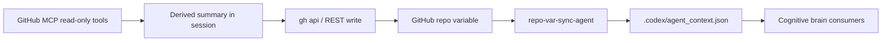
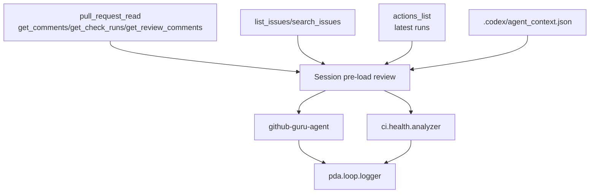
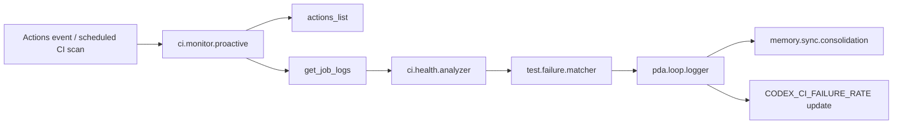
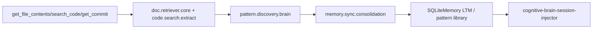

# GitHub MCP Server Native Capabilities for Cognitive Brain

- **Version:** `github-mcp-server/remote-112de3b831975632257acbdeb73b577f32ea1762`
- **Date:** 2026-08-01
- **Author:** `mcp-github-doc-agent`
- **Scope:** Aries-Serpent/_codex_ cognitive brain integration map for the 36 surfaced GitHub MCP capabilities

> Key repo findings: `src/codex/skills/` does **not** exist in this checkout; the active cognitive brain skill tree is `src/aries_serpent_core/skills/`. Also, `.codex/docs/COPILOT_MCP_TOOL_REFERENCE.md` and `.codex/docs/GITHUB_API_AND_MCP_REFERENCE.md` still describe **28** GitHub MCP tools, so they lag the 36-tool surface documented here.

## 1. Tool Catalog Table

| Tool | Category | Description | Key Parameters | Cognitive Brain Integration Status |
|---|---|---|---|---|
| `github-mcp-server/actions_get` | Actions/CI | Read one workflow, run, job, artifact, usage record, or logs URL. | `method`, `owner`, `repo`, `resource_id` | ✅ Integrated |
| `github-mcp-server/actions_list` | Actions/CI | List workflows, runs, jobs, or artifacts with branch/status filters. | `method`, `owner`, `repo`, `resource_id`, `workflow_runs_filter` | ✅ Integrated |
| `github-mcp-server/get_code_scanning_alert` | Code Scanning | Read a single CodeQL/code-scanning alert in detail. | `owner`, `repo`, `alertNumber` | ✅ Integrated |
| `github-mcp-server/get_commit` | Commits/Code | Inspect one commit with metadata, stats, or full patch. | `owner`, `repo`, `sha`, `detail` | 🔲 Planned |
| `github-mcp-server/get_discussion` | Discussions | Read one GitHub Discussion thread. | `owner`, `repo`, `discussionNumber` | ⬜ Not Planned |
| `github-mcp-server/get_discussion_comments` | Discussions | Read discussion comments and replies. | `owner`, `repo`, `discussionNumber`, `includeReplies` | ⬜ Not Planned |
| `github-mcp-server/get_file_contents` | Files | Read file or directory contents at a ref/SHA. | `owner`, `repo`, `path`, `ref`, `sha` | 🔲 Planned |
| `github-mcp-server/get_job_logs` | Actions/CI | Fetch failed-job or single-job logs for classification. | `owner`, `repo`, `job_id` or `run_id`, `failed_only`, `return_content` | ✅ Integrated |
| `github-mcp-server/get_label` | Labels | Read one label definition. | `owner`, `repo`, `name` | 🔲 Planned |
| `github-mcp-server/get_latest_release` | Releases | Read latest published release metadata. | `owner`, `repo` | 🔲 Planned |
| `github-mcp-server/get_release_by_tag` | Releases | Read release metadata for a specific tag. | `owner`, `repo`, `tag` | 🔲 Planned |
| `github-mcp-server/get_secret_scanning_alert` | Security | Read one secret-scanning alert in detail. | `owner`, `repo`, `alertNumber` | ✅ Integrated |
| `github-mcp-server/get_tag` | Tags | Read one git tag object. | `owner`, `repo`, `tag` | 🔲 Planned |
| `github-mcp-server/issue_read` | Issues | Read issue details, comments, labels, parent/child links. | `method`, `owner`, `repo`, `issue_number` | ✅ Integrated |
| `github-mcp-server/list_branches` | Commits/Code | List repository branches. | `owner`, `repo`, `page`, `perPage` | 🔲 Planned |
| `github-mcp-server/list_code_scanning_alerts` | Code Scanning | List open/fixed/dismissed code-scanning alerts. | `owner`, `repo`, `state`, `severity`, `tool_name`, `ref` | ✅ Integrated |
| `github-mcp-server/list_commits` | Commits/Code | List commits on a branch/path/time range. | `owner`, `repo`, `sha`, `path`, `since`, `until` | 🔲 Planned |
| `github-mcp-server/list_discussion_categories` | Discussions | List discussion categories. | `owner`, `repo` | ⬜ Not Planned |
| `github-mcp-server/list_discussions` | Discussions | List discussions with category/order filters. | `owner`, `repo`, `category`, `orderBy`, `direction` | ⬜ Not Planned |
| `github-mcp-server/list_issue_fields` | Issues | List custom issue fields and select options. | `owner`, `repo` | 🔲 Planned |
| `github-mcp-server/list_issue_types` | Issues | List supported issue types. | `owner`, `repo` | 🔲 Planned |
| `github-mcp-server/list_issues` | Issues | List issues with state/label/custom-field filters. | `owner`, `repo`, `state`, `labels`, `field_filters`, `since` | ✅ Integrated |
| `github-mcp-server/list_label` | Labels | List repository labels. | `owner`, `repo` | 🔲 Planned |
| `github-mcp-server/list_pull_requests` | PRs | List PRs by state/base/head/sort. | `owner`, `repo`, `state`, `base`, `head`, `sort` | 🔲 Planned |
| `github-mcp-server/list_releases` | Releases | List releases with pagination. | `owner`, `repo`, `page`, `perPage` | 🔲 Planned |
| `github-mcp-server/list_repository_collaborators` | Users/Collaborators | List repository collaborators and affiliations. | `owner`, `repo`, `affiliation` | 🔲 Planned |
| `github-mcp-server/list_secret_scanning_alerts` | Security | List secret-scanning alerts by state/type/resolution. | `owner`, `repo`, `state`, `resolution`, `secret_type` | ✅ Integrated |
| `github-mcp-server/list_tags` | Tags | List git tags. | `owner`, `repo`, `page`, `perPage` | 🔲 Planned |
| `github-mcp-server/pull_request_read` | PRs | Read PR metadata, diff, files, checks, comments, reviews, and threads. | `method`, `owner`, `repo`, `pullNumber` | ✅ Integrated |
| `github-mcp-server/search_code` | Search | Search GitHub code across repos with exact qualifiers. | `query`, `sort`, `order`, `page`, `perPage` | 🔲 Planned |
| `github-mcp-server/search_commits` | Search | Search commit messages on default branches. | `query`, `sort`, `order`, `page`, `perPage` | 🔲 Planned |
| `github-mcp-server/search_issues` | Search | Search issues using GitHub query syntax. | `query`, `owner`, `repo`, `sort`, `order` | ✅ Integrated |
| `github-mcp-server/search_pull_requests` | Search | Search PRs using GitHub query syntax. | `query`, `owner`, `repo`, `sort`, `order` | 🔲 Planned |
| `github-mcp-server/search_repositories` | Search | Search repositories by topic/name/metadata. | `query`, `sort`, `order`, `minimal_output` | ⬜ Not Planned |
| `github-mcp-server/search_users` | Users/Collaborators | Search GitHub users and profiles. | `query`, `sort`, `order` | 🔲 Planned |
| `github-mcp-server/web_search` | Search | AI-assisted web search for current external facts. | `query` | 🔲 Planned |

## 2. Cognitive Brain Integration Plan

| Tool(s) | Cognitive brain objective | Existing skill / agent consumer | Repo variable feed (`.codex/agent_context.json`) | Priority |
|---|---|---|---|---|
| `actions_list`, `actions_get`, `get_job_logs`, `pull_request_read(get_check_runs)` | CI run triage and rescue-comment generation | `ci.monitor.proactive`, `ci.health.analyzer`, `ci-testing-agent`, `workflow-health-monitor` | `CODEX_CI_FAILURE_RATE`, `CODEX_CI_LAST_GREEN_SHA` | P0 |
| `issue_read`, `list_issues`, `search_issues` | Open issue triage for `ci-health-alert` / governance threads | `github-guru-agent`, `ci-health-alert-agent`, `session-log-retrieval-agent` | `CODEX_CI_FAILURE_RATE` | P0 |
| `list_code_scanning_alerts`, `get_code_scanning_alert` | CodeQL ingestion and alert remediation | `codeql-alert-resolution-agent`, `security-alert-verification-agent` | `COPILOT_AGENT_FIREWALL_ENABLED` | P0 |
| `list_secret_scanning_alerts`, `get_secret_scanning_alert` | Secret exposure triage and escalation | `security-alert-verification-agent`, `secret-detection-agent` | `COPILOT_AGENT_FIREWALL_ENABLED` | P0 |
| `pull_request_read(get_comments|get_review_comments|get_reviews|get_files)` | Session pre-load review and maintainer-comment compliance | `github-guru-agent`, `cognitive-brain-agent` | `COGNITIVE_BRAIN_SESSION_NUMBER` | P0 |
| `get_file_contents`, `search_code`, `get_commit`, `list_commits` | Grounded code/doc retrieval for skills and postmortems | `doc.retriever.core`, `code.search.extract`, `session-log-retrieval-agent` | `EMBEDDING_INDEX_AUTO_REBUILD` | P1 |
| `list_branches`, `list_pull_requests`, `search_pull_requests` | Branch governance and promotion-PR health | `github-guru-agent`, `workflow-health-monitor`, `branch-divergence-resolution-agent` | `CODEX_CI_LAST_GREEN_SHA` | P1 |
| `list_repository_collaborators`, `search_users` | Actor allowlist hygiene and org-owner elevation | `structural_policy_manager`, `repo-var-sync-agent`, `cognitive-brain-session-injector` | `COGNITIVE_BRAIN_ALLOWED_ACTORS` | P1 |
| `get_label`, `list_label` | Label taxonomy enforcement and policy coaching | `github-guru-agent`, `policy-coach-agent` | — | P2 |
| `list_issue_fields`, `list_issue_types` | Better issue routing, field-aware triage, and OODA dispatch | `github-guru-agent`, `cognitive-ooda-loop-agent` | — | P2 |
| `get_latest_release`, `get_release_by_tag`, `list_releases`, `get_tag`, `list_tags` | Release intelligence, docs freshness, and deployment validation | `github-pages-manager`, `pypi-publishing-operations-agent`, `doc-freshness-checker` | — | P2 |
| `get_discussion`, `get_discussion_comments`, `list_discussion_categories`, `list_discussions` | Cross-agent knowledge harvesting from Discussions | `cross-agent-knowledge-graph`, `ci-pattern-guardian` | — | P3 |
| `search_commits`, `search_repositories`, `web_search` | External evidence gathering and claim verification | `claim-verification-agent`, `documentation-quality-agent`, `github-guru-agent` | — | P3 |

### Cross-reference notes

- **Skills path mismatch:** requested `src/codex/skills/` is absent; active manifests are under `src/aries_serpent_core/skills/`.
- **Strongest current skill matches:** `ci.monitor.proactive`, `ci.health.analyzer`, `pda.loop.logger`, `memory.sync.consolidation`, `pattern.discovery.brain`, `doc.retriever.core`, `code.search.extract`, `test.failure.matcher`.
- **Detailed agent mapping source:** `.github/agents/AGENT_REGISTRY.yaml` is actionable; `.codex/AGENT_REGISTRY.yaml` is only a high-level health snapshot.
- **Write-path constraint:** GitHub MCP in this repo is documented as **read-only**; any repo-variable update must be performed through `gh api`/REST and then synchronized back into `.codex/agent_context.json` by `repo-var-sync-agent`.

## 3. Variable Wiring Map

Only derived summaries should be written; raw MCP output should remain session-local.

| Tool output source | Repo variable target | Agent / subsystem consumer |
|---|---|---|
| `actions_list` + `actions_get` + `get_job_logs` failure summaries | `CODEX_CI_FAILURE_RATE` | `ci-health-alert-agent`, `workflow-health-monitor`, `okr_tracker` |
| `list_commits` + `get_commit` + `list_branches` green-commit confirmation | `CODEX_CI_LAST_GREEN_SHA` | `workflow-health-monitor`, `okr_tracker`, session wrap-up flows |
| `pull_request_read` pre-load snapshot | `COGNITIVE_BRAIN_SESSION_NUMBER` | `cognitive-brain-session-injector`, `mcp_session_bridge` |
| `list_repository_collaborators` + `search_users` actor validation | `COGNITIVE_BRAIN_ALLOWED_ACTORS` | `structural_policy_manager`, `agent-auth-delegation`, `repo-var-sync-agent` |
| `get_file_contents` + `search_code` repo-change detection | `EMBEDDING_INDEX_AUTO_REBUILD` | `doc.retriever.core`, `rag-index-manager`, embedding refresh jobs |
| `list_code_scanning_alerts` / `get_code_scanning_alert` / `list_secret_scanning_alerts` / `get_secret_scanning_alert` risk rollups | `COPILOT_AGENT_FIREWALL_ENABLED` | `security-alert-verification-agent`, `codeql-alert-resolution-agent` |

## 4. Process Integration Map

### Session pre-load integration

### PDA Loop + CI trigger integration

### Memory sync integration

### Recommended process placements

- **PDA Loop:** `actions_*`, `get_job_logs`, `pull_request_read`, `list_code_scanning_alerts`, `list_secret_scanning_alerts`.
- **Mandatory pre-load:** `pull_request_read`, `actions_list`, `list_issues`, `search_issues`, plus `agent_context.json`.
- **CI pipeline triggers:** scheduled CI health scans, security alert sweeps, release freshness checks, collaborator drift audits.
- **Memory sync:** code/file retrieval, repeated PR/comment patterns, security-alert pattern promotion, branch-governance postmortems.

## 5. Gap Analysis

| Gap | Evidence | Recommended next step |
|---|---|---|
| Skills path in request is stale | `src/codex/skills/` absent; active skills live in `src/aries_serpent_core/skills/` | Update cognitive brain docs and prompts to point at the real skill tree. |
| Existing MCP docs are outdated | `.codex/docs/COPILOT_MCP_TOOL_REFERENCE.md` and `.codex/docs/GITHUB_API_AND_MCP_REFERENCE.md` still say 28 GitHub MCP tools | Refresh both docs to align with this 36-tool reference. |
| Discussions tooling has no current consumer path | No checked skill/agent explicitly routes GitHub Discussions data today | Add a `discussion-harvester` flow under `cross-agent-knowledge-graph` or `ci-pattern-guardian`. |
| Release/tag tooling is not wired into deployment memory | Release agents exist, but no checked skill manifest consumes MCP release/tag outputs | Feed release/tag metadata into `doc-freshness-checker` and `github-pages-manager` validation loops. |
| Label and issue-schema tooling is underused | `github-guru-agent` mentions label taxonomy, but no skill wiring was found | Add field-aware issue routing skill and label taxonomy audit command. |
| External GitHub discovery is not grounded into memory | `search_repositories`, `search_commits`, `web_search` have no current variable or STM/LTM bridge | Route outputs through `pattern.discovery.brain` with confidence thresholds from `COGNITIVE_BRAIN_PATTERN_MIN_CONFIDENCE`. |
| `.codex/AGENT_REGISTRY.yaml` is too coarse for tool assignment | It only reports a few top-level agents/lanes | Keep using `.github/agents/AGENT_REGISTRY.yaml` for operational mapping; note `.codex/AGENT_REGISTRY.yaml` as health-only. |

## 6. Summary Findings

1. The repo already has strong **CI/security cognitive consumers**, so Actions, PR, issue, CodeQL, and secret-scanning MCP tools should be treated as first-class P0 surfaces.
2. The **largest documentation drift** is the 28-tool count in existing MCP docs; this new file should become the canonical 36-tool reference until those are updated.
3. The **largest structural drift** is the missing `src/codex/skills/` path; all live skill manifests examined are under `src/aries_serpent_core/skills/`.
4. Because the MCP server is **read-only**, variable mutation must stay in the existing `gh api` + `repo-var-sync-agent` pattern.
