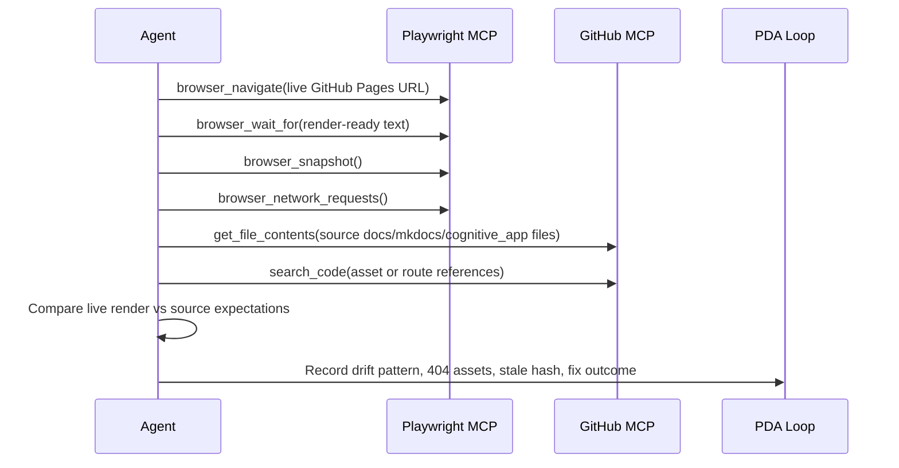
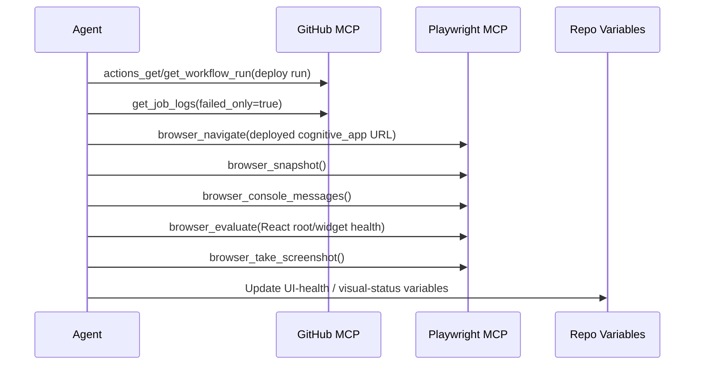
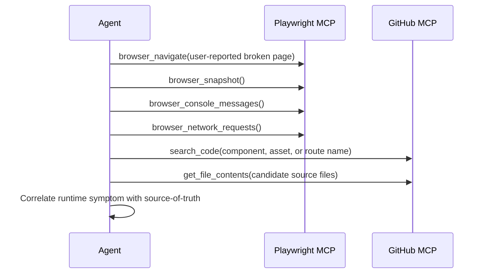

# MCP Playwright Native Capabilities Reference

- **Version:** `playwright 0.0.40`
- **Date:** `2026-08-01`
- **Author:** `mcp-playwright-doc-agent`

## Repository Cross-Reference Summary

- **Existing canonical inventory:** `.codex/docs/COPILOT_MCP_TOOL_REFERENCE.md`
- **Agent definition scan:** no `.github/agents/` filename explicitly contains `playwright`; related agent definition filenames include `github-pages-manager.md`, `integration-test-runner.agent.md`, `post-merge-doc-alignment-agent.md`, `test-alignment-fixer.agent.md`, `agent-iq-scoring-gate.md`, and `msv-dashboard-monitor.md`.
- **`src/` references:** only `src/aries_serpent_core/agents/brain_client.py` and `src/aries_serpent_core/github/mcp_poster.py` mention Playwright; `brain_client.py` explicitly prioritizes GitHub MCP + Playwright as the primary automation tier.
- **Current browser-test assets:** `cognitive_app/playwright.config.ts`, `cognitive_app/e2e/code-generator-lazy-init.spec.ts`, `cognitive_app/e2e/har-capture.spec.ts`, `.github/workflows/har-capture.yml`
- **Current Pages/deployment workflows:** `.github/workflows/html_visual_regression.yml`, `.github/workflows/pages-mkdocs.yml`, `.github/workflows/pages-health-guard.yml`, `.github/workflows/pages-scheduled-validation.yml`, `.github/workflows/automated-post-deployment-verification.yml`
- **Current gap:** `har-capture.yml` already runs Playwright test automation, but `html_visual_regression.yml` and `automated-post-deployment-verification.yml` are still mostly script/curl/pytest driven rather than native MCP-browser driven.

## Tool Catalog

| Tool | Category | Description | Primary Use Case | Cognitive Brain Integration Status |
|---|---|---|---|---|
| `playwright/browser_click` | Interaction | Click an element, with optional modifiers or double-click. | Button, link, and tab activation in live UI checks. | ✅ Integrated |
| `playwright/browser_close` | Tab Management | Close the active page. | Session cleanup after browser-based checks. | 🔲 Planned |
| `playwright/browser_console_messages` | Inspection | Read browser console output. | Detect widget boot errors and JS exceptions on deployed pages. | 🔲 Planned |
| `playwright/browser_drag` | Interaction | Drag an element onto another element. | Future drag/drop UI coverage if dashboards adopt draggable layouts. | ⬜ Not Planned |
| `playwright/browser_evaluate` | Inspection | Execute JavaScript on the page or a specific element. | Verify React mount state, Mermaid render state, and DOM health. | ✅ Integrated |
| `playwright/browser_file_upload` | Input | Upload one or more files through a file input. | Future admin/import flows and artifact upload simulations. | ✅ Integrated |
| `playwright/browser_fill_form` | Input | Fill multiple form fields in one call. | Batch form population for multi-field UI tests. | 🔲 Planned |
| `playwright/browser_handle_dialog` | Utilities | Accept or dismiss alerts, confirms, and prompts. | Future destructive-action confirmation coverage. | 🔲 Planned |
| `playwright/browser_hover` | Interaction | Hover over an element. | Tooltip and menu validation in dashboards. | 🔲 Planned |
| `playwright/browser_install` | Utilities | Install the browser when the runtime is missing it. | Recovery path for self-healing browser sessions. | ⬜ Not Planned |
| `playwright/browser_navigate` | Navigation | Open a target URL. | Live GitHub Pages and `cognitive_app` route verification. | ✅ Integrated |
| `playwright/browser_navigate_back` | Navigation | Use the browser back action. | Breadcrumb, history, and multi-page docs traversal. | 🔲 Planned |
| `playwright/browser_network_requests` | Inspection | Inspect requests made since page load. | Detect 404 assets, stale hashes, and backend/API drift. | 🔲 Planned |
| `playwright/browser_press_key` | Input | Send keyboard input. | Search boxes, command palettes, and accessibility navigation. | ✅ Integrated |
| `playwright/browser_resize` | Utilities | Resize the viewport. | Responsive layout checks for Pages and dashboards. | 🔲 Planned |
| `playwright/browser_select_option` | Input | Select options in a dropdown. | Environment and mode selectors in web UIs. | ✅ Integrated |
| `playwright/browser_snapshot` | Inspection | Capture an accessibility snapshot with actionable refs. | Preferred MCP inspection primitive for safe UI automation. | ✅ Integrated |
| `playwright/browser_take_screenshot` | Inspection | Capture viewport or element screenshots. | Visual regression evidence and dashboard capture. | ✅ Integrated |
| `playwright/browser_tabs` | Tab Management | List, create, close, or switch tabs. | Parallel doc/page comparisons and external-link validation. | 🔲 Planned |
| `playwright/browser_type` | Input | Type text into an editable element. | Prompt entry and search interactions in `cognitive_app`. | ✅ Integrated |
| `playwright/browser_wait_for` | Utilities | Wait for text or time-based readiness conditions. | Deployed app stabilization before assertions. | 🔲 Planned |

> Note: the repository already tracks active MCP mappings for `browser_click`, `browser_snapshot`, `browser_evaluate`, `browser_type`, `browser_navigate`, `browser_press_key`, `browser_select_option`, and `browser_file_upload` in `.codex/MCP_TOOL_INTEGRATION.json`.

## Cognitive Brain Integration Plan

### 1. Visual Regression Testing

**Current state**
- `.github/workflows/html_visual_regression.yml` exists, but it currently behaves more like a validation stub than a full screenshot pipeline.
- `cognitive_app/playwright.config.ts` already enables screenshot-on-failure and browser-based E2E execution.

**Best-fit MCP tools**
- `browser_navigate`
- `browser_wait_for`
- `browser_snapshot`
- `browser_take_screenshot`
- `browser_console_messages`
- `browser_network_requests`

**Recommended mapping to `html_visual_regression.yml`**
1. Navigate to GitHub Pages root and `cognitive_app/`.
2. Wait for root text, React root, and Mermaid SVG render completion.
3. Capture accessibility snapshot for semantic structure.
4. Capture screenshot artifacts for diffing.
5. Persist console/network anomalies as artifacts and PDA evidence.

### 2. `cognitive_app` UI Automation

**Current state**
- `cognitive_app/playwright.config.ts` defines Chromium/Firefox/WebKit runs.
- `cognitive_app/e2e/code-generator-lazy-init.spec.ts` covers prompt entry, button interaction, and status validation.
- `cognitive_app/e2e/har-capture.spec.ts` performs a full walkthrough and records `public/har-cache/api-demo.har`.
- `.github/workflows/har-capture.yml` already operationalizes Playwright-based CI recording.

**Best-fit MCP tools**
- `browser_navigate`, `browser_click`, `browser_type`, `browser_press_key`
- `browser_select_option`, `browser_fill_form`, `browser_hover`
- `browser_snapshot`, `browser_evaluate`, `browser_wait_for`
- `browser_network_requests`, `browser_console_messages`

**Primary integration points**
- Widget smoke testing after Pages deploy
- HAR freshness verification after workflow runs
- Live regression triage when users report “text-only” or “missing widget” failures

### 3. Post-Deployment Verification

**Current state**
- `.github/workflows/automated-post-deployment-verification.yml` uses curl, pytest, and report generation.
- `.github/workflows/pages-mkdocs.yml` verifies Pages accessibility and calls `scripts/ci/verify_cognitive_app_deployment.py`.
- `.github/workflows/pages-health-guard.yml` records telemetry and self-heals by dispatching `pages-mkdocs.yml`.

**Best-fit MCP tools**
- `browser_navigate`
- `browser_wait_for`
- `browser_snapshot`
- `browser_evaluate`
- `browser_network_requests`
- `browser_console_messages`
- `browser_take_screenshot`

**Recommended upgrade**
Add a browser-first verification lane that confirms:
- React root actually mounts
- widgets are interactive, not just HTML-present
- asset bundles return 200 rather than stale-hash 404s
- console is clean of boot/runtime errors

### 4. Documentation Pages Monitoring

**Current state**
- `pages-scheduled-validation.yml` checks links, MkDocs builds, and `cognitive_app` file presence.
- `pages-health-guard.yml` records enhanced telemetry for Pages + `cognitive_app` health.
- `docs/agents/POST_MERGE_ALIGNMENT_PROMPT.md` already directs live-site traversal with `playwright-browser_navigate` and `playwright-browser_snapshot`.

**Best-fit MCP tools**
- `browser_navigate`
- `browser_snapshot`
- `browser_take_screenshot`
- `browser_tabs`
- `browser_navigate_back`
- `browser_wait_for`

### 5. Agent IQ Scoring

**Current state**
- Related agent definition filenames exist: `agent-iq-scoring-gate.md` and `msv-dashboard-monitor.md`.
- The repository already stores score/dashboard artifacts under `.codex/` (for example `WAVE_4_AGENT_IQ_SCORES.json`).

**Best-fit MCP tools**
- `browser_resize`
- `browser_snapshot`
- `browser_take_screenshot`
- `browser_evaluate`
- `browser_tabs`

**Recommended use**
Capture reproducible dashboard evidence for scorecards, anomaly review, and cross-session comparison.

## Playwright ↔ GitHub MCP Orchestration Patterns

### Pattern A — GitHub Pages Drift Detection

### Pattern B — Deployment Verification With CI Context

### Pattern C — Live UI Triage + Source Correlation

## Variable & Process Integration

### Recommended repo variables to emit from Playwright-backed checks

| Variable | Source operations | Purpose |
|---|---|---|
| `COGNITIVE_APP_UI_HEALTH` | `browser_navigate` + `browser_wait_for` + `browser_evaluate` | Latest end-user-visible app health verdict. |
| `COGNITIVE_APP_ASSET_STATUS` | `browser_network_requests` | Track stale bundles, 404 assets, or hash drift. |
| `PAGES_VISUAL_STATUS` | `browser_snapshot` + `browser_take_screenshot` | Last visual regression pass/fail state. |
| `PLAYWRIGHT_LAST_HAR_REFRESH` | `browser_navigate` + `browser_network_requests` | Timestamp/evidence that HAR capture reflects current app behavior. |
| `AGENT_IQ_LAST_CAPTURE` | `browser_take_screenshot` + `browser_evaluate` | Last dashboard evidence capture for scoring review. |

### Playwright signals that should feed the PDA loop

- bundle 404 / asset hash mismatch
- React root missing after deploy
- raw Mermaid text instead of rendered SVG
- console exceptions during app boot
- API/network requests failing or unexpectedly absent
- screenshot/snapshot evidence proving UI drift or recovery

### Session pre-load opportunities

For sessions involving GitHub Pages, docs drift, or `cognitive_app` regressions, preload these browser checks early:
1. `browser_navigate` to the live Pages root and `/cognitive_app/`
2. `browser_snapshot` to capture current semantic UI state
3. `browser_console_messages` + `browser_network_requests` if the report mentions missing widgets, broken scripts, or stale assets

## Recommended Implementation Roadmap

1. **Upgrade `html_visual_regression.yml` to real MCP-backed visual validation**  
   Add snapshot + screenshot + console/network collection for Pages and `cognitive_app`.
2. **Add browser-first lane to `automated-post-deployment-verification.yml`**  
   Keep curl/pytest, but require a real browser pass for widget-level readiness.
3. **Promote `pages-health-guard.yml` from HTTP-only health to UI-aware health**  
   Detect text-only regressions, missing React root, and stale asset bundles.
4. **Create a standard GitHub Pages drift recipe**  
   Pair Playwright live-page inspection with GitHub MCP `search_code`/`get_file_contents` comparisons.
5. **Add Agent IQ dashboard evidence capture**  
   Use resize + screenshot + evaluate for reproducible dashboard scoring artifacts.
6. **Persist Playwright outcomes into repo variables + PDA**  
   Treat browser telemetry as first-class operational memory, not ephemeral test output.
