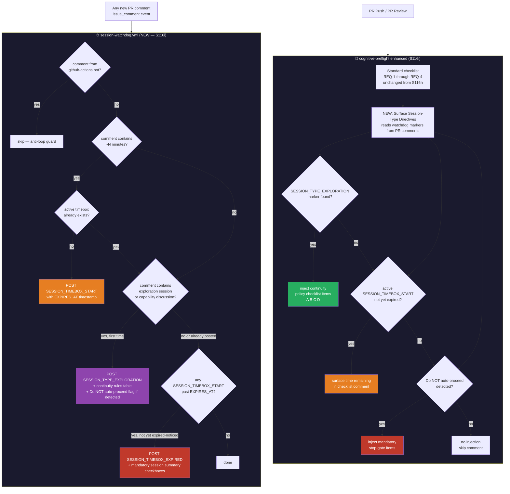
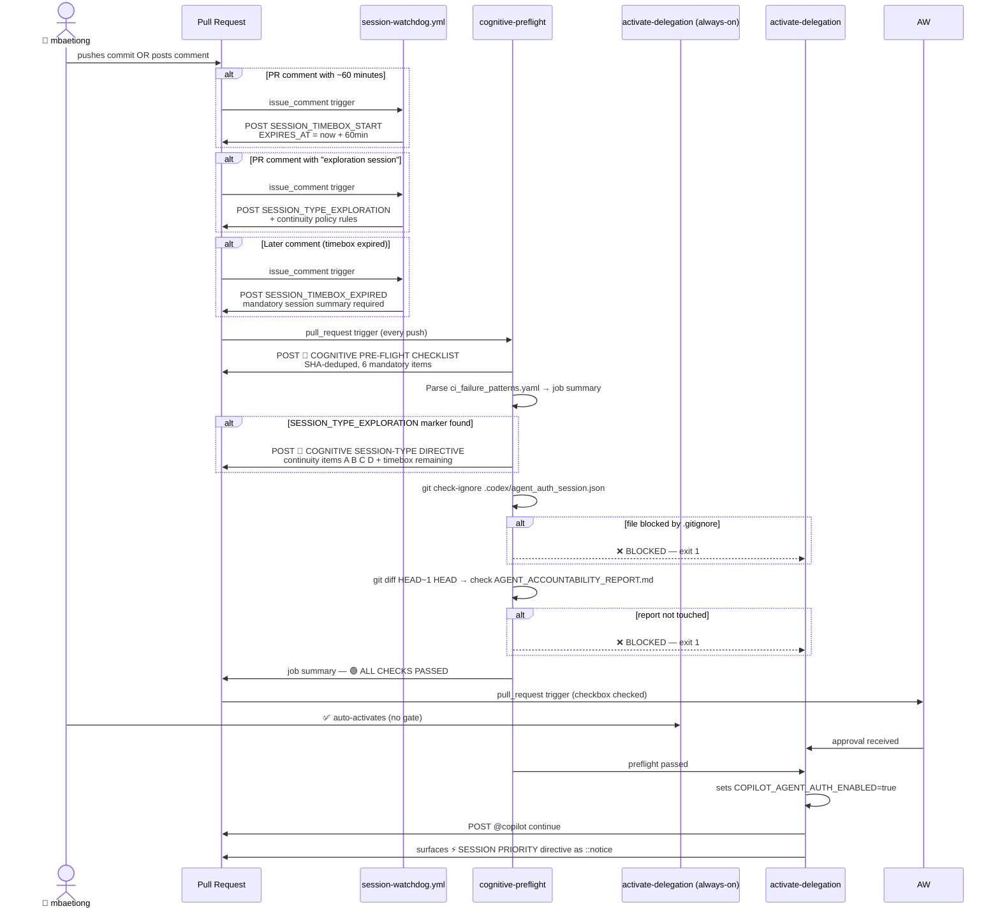
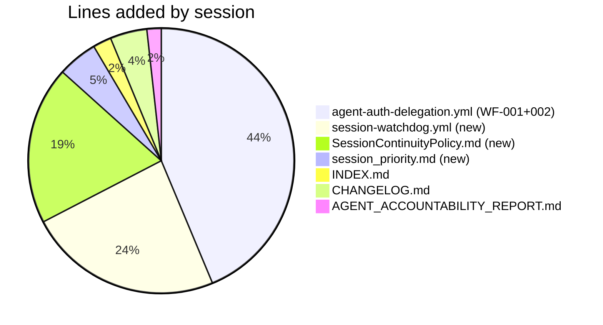

# S116g → S116i: Architecture Change Map

> **Generated:** 2026-02-28 | Session S116i complete
> **Baseline:** commit `9ac8ee7` (S116g — agent-auth-delegation restored, regression fixed)
> **HEAD:** commit `a63ed40` (S116i — WF-001 + WF-002 complete)
> **Admin setup verification last passed:** run `22527333801` at `2026-02-28T20:18Z` (✅ both keys)

---

## What Changed


---

## System Architecture — Before S116h (baseline)

```mermaid
flowchart TD
    PR[PR Push / PR Review] --> D[detect-checkbox]
    D -->|auth_requested=true| AW[activate-delegation\n✅ always-on (no gate)]
    AW -->|approved| ACT[activate-delegation\n✅ sets COPILOT_AGENT_AUTH_ENABLED\nposts @copilot continue]
    D -->|auth_requested=false| SKIP[skip — nothing to do]

    style AW fill:#f5a623,color:#000
    style ACT fill:#27ae60,color:#fff
    style SKIP fill:#aaa,color:#fff
```

**Gap at baseline:** `activate-delegation` was guarded only by the environment approval gate.
No checks on `.gitignore`, accountability report, or CI patterns. Agent could start a session
with a broken repo state.

---

## After S116h — WF-001: Cognitive Pre-flight Gate

```mermaid
flowchart TD
    PR[PR Push / PR Review] --> D[detect-checkbox]
    PR --> CP

    D -->|auth_requested=true| AW[activate-delegation\n✅ always-on (no gate)]

    subgraph CP ["🧠 cognitive-preflight (NEW — S116h)"]
        direction TB
        R1[REQ-1: Post mandatory checklist\nas PR comment — SHA-deduped]
        R2[REQ-2: Parse ci_failure_patterns.yaml\n→ table in job summary]
        R3{REQ-3: .gitignore allows\n.codex/agent_auth_session.json?}
        R4{REQ-4: accountability report\ntouched in last commit?}
        R1 --> R2 --> R3
        R3 -->|❌ blocked| FAIL1[exit 1\nSESSION BLOCKED]
        R3 -->|✅ allowed| R4
        R4 -->|❌ not touched| FAIL2[exit 1\nSESSION BLOCKED]
        R4 -->|✅ touched| PASS[🟢 ALL CHECKS PASSED]
    end

    AW --> ACT
    PASS --> ACT

    ACT{activate-delegation\nneeds: cognitive-preflight (await-approval REMOVED)}
    ACT -->|all 3 pass| RUN[✅ sets COPILOT_AGENT_AUTH_ENABLED\nposts @copilot continue\nsurfaces Priority directive]

    FAIL1 --> BLOCKED[🚫 activate-delegation\nDOES NOT RUN]
    FAIL2 --> BLOCKED

    style CP fill:#1a1a2e,color:#fff
    style FAIL1 fill:#c0392b,color:#fff
    style FAIL2 fill:#c0392b,color:#fff
    style PASS fill:#27ae60,color:#fff
    style BLOCKED fill:#c0392b,color:#fff
    style RUN fill:#27ae60,color:#fff
```

**New files (S116h):**
- `.github/workflows/agent-auth-delegation.yml` — `cognitive-preflight` job added (258 line diff)
- `.github/ISSUE_TEMPLATE/session_priority.md` — priority directive template
- `.github/workflows/INDEX.md` — Authentication section updated

---

## After S116i — WF-002: Session Watchdog + Continuity Enforcement



**New files (S116i):**
- `.github/workflows/session-watchdog.yml` — 190 lines, issue_comment trigger
- `.github/docs/SessionContinuityPolicy.md` — 5-rule engineered policy
- `.github/workflows/agent-auth-delegation.yml` — +93 lines (Surface Session-Type Directives step)
- `.github/workflows/INDEX.md` — session-watchdog.yml registered, count → 56

---

## Full End-to-End Flow — Current State (HEAD a63ed40)



---

## Token Validation Status

| Key | Last Test | Result | Run |
|-----|-----------|--------|-----|
| `CODEX_MASTER_KEY` | 2026-02-28T20:18:54Z (S116c) | ✅ read HTTP 200 + write HTTP 201 | [#22527333801](https://github.com/Aries-Serpent/_codex_/actions/runs/22527333801) |
| `CODEX_BACKUP_KEY` | 2026-02-28T20:18:55Z (S116c) | ✅ read HTTP 200 + write HTTP 201 | [#22527333801](https://github.com/Aries-Serpent/_codex_/actions/runs/22527333801) |

> ⚠️ **Token re-validation required on new PR** — tests ran on commit `b19853b` (S116c).
> HEAD is now `a63ed40` (S116i, +782 lines). Tokens themselves do not change with commits,
> but a fresh validation against the new PR number should be run to confirm write scope
> is operational on the new PR context.

---

## File Change Summary (S116g → S116i)



---

*Generated: 2026-02-28 | S116i complete | Next: S117 token re-validation on new PR*
