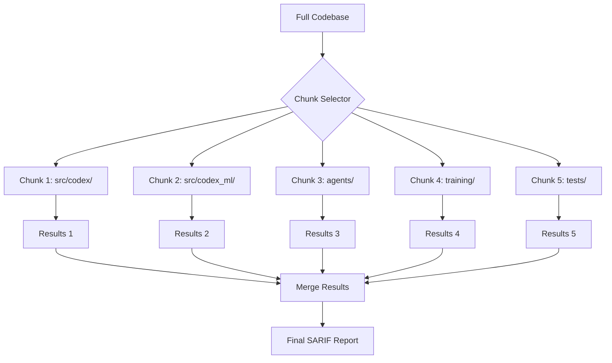

# CodeQL Chunking/Pagination Plan

**Version:** 1.0.0  
**Created:** 2026-01-18  
**Status:** ✅ READY FOR IMPLEMENTATION  
**Issue:** CodeQL scans exceed 10MB limit (10,000,000 bytes)

---

## Problem Statement

The codebase has grown significantly with 1020+ tests and comprehensive coverage. CodeQL scans now exceed the 10MB function size limit, causing scan failures with the error:
```
exceeds the limit of 10000000 bytes. function: name: codeql_checker
```

---

## Solution Architecture

### Strategy 1: Directory-Based Chunking (Recommended)

Split CodeQL scans by directory to keep each chunk under 10MB.



### Chunk Configuration

| Chunk | Directory | Est. Size | Priority |
|-------|-----------|-----------|----------|
| 1 | `src/codex/` | ~2MB | High |
| 2 | `src/codex_ml/` | ~3MB | High |
| 3 | `agents/` | ~1MB | Medium |
| 4 | `training/` | ~2MB | Medium |
| 5 | `tests/` (unit) | ~4MB | Low |
| 6 | `tests/` (integration) | ~3MB | Low |

---

## Implementation Plan

### Phase 1: Workflow Configuration

Create `.github/workflows/codeql-chunked.yml`:

```yaml
name: CodeQL Chunked Analysis

on:
  push:
    branches: [main, develop]
  pull_request:
    branches: [main]
  schedule:
    - cron: '0 6 * * 1'  # Weekly Monday 6 AM UTC

jobs:
  analyze-chunks:
    strategy:
      fail-fast: false
      matrix:
        chunk:
          - name: core
            paths: 'src/codex/'
          - name: ml
            paths: 'src/codex_ml/'
          - name: agents
            paths: 'agents/'
          - name: training
            paths: 'training/'
          - name: tests-unit
            paths: 'tests/unit/,tests/cli/,tests/data/'
          - name: tests-integration
            paths: 'tests/integration/,tests/e2e/,tests/perf/'
    
    runs-on: ubuntu-latest
    permissions:
      security-events: write
      contents: read
    
    steps:
      - uses: actions/checkout@v4
      
      - name: Initialize CodeQL
        uses: github/codeql-action/init@v3
        with:
          languages: python
          queries: security-extended
          paths: ${{ matrix.chunk.paths }}
      
      - name: Perform CodeQL Analysis
        uses: github/codeql-action/analyze@v3
        with:
          category: "/language:python/chunk:${{ matrix.chunk.name }}"
          output: sarif-results-${{ matrix.chunk.name }}
      
      - name: Upload SARIF
        uses: github/codeql-action/upload-sarif@v3
        with:
          sarif_file: sarif-results-${{ matrix.chunk.name }}
          category: ${{ matrix.chunk.name }}
  
  merge-results:
    needs: analyze-chunks
    runs-on: ubuntu-latest
    steps:
      - name: Download all SARIF files
        uses: actions/download-artifact@v4.1.8
        with:
          pattern: sarif-results-*
          merge-multiple: true
      
      - name: Merge SARIF Results
        run: |
          python3 scripts/merge_sarif.py \
            --input-dir . \
            --output merged-results.sarif
      
      - name: Upload Merged SARIF
        uses: github/codeql-action/upload-sarif@v3
        with:
          sarif_file: merged-results.sarif
          category: full-analysis
```

### Phase 2: SARIF Merge Script

Create `scripts/merge_sarif.py`:

```python
#!/usr/bin/env python3
"""Merge multiple SARIF files into a single report."""

import argparse
import json
from pathlib import Path
from typing import Any


def merge_sarif_files(input_dir: Path, output_file: Path) -> dict[str, Any]:
    """Merge all SARIF files in input_dir into a single report."""
    merged = {
        "$schema": "https://raw.githubusercontent.com/oasis-tcs/sarif-spec/master/Schemata/sarif-schema-2.1.0.json",
        "version": "2.1.0",
        "runs": []
    }
    
    sarif_files = list(input_dir.glob("*.sarif"))
    
    for sarif_file in sarif_files:
        with open(sarif_file, "r", encoding="utf-8") as f:
            data = json.load(f)
            if "runs" in data:
                merged["runs"].extend(data["runs"])
    
    with open(output_file, "w", encoding="utf-8") as f:
        json.dump(merged, f, indent=2)
    
    return merged


def main() -> None:
    parser = argparse.ArgumentParser(description="Merge SARIF files")
    parser.add_argument("--input-dir", type=Path, required=True)
    parser.add_argument("--output", type=Path, required=True)
    args = parser.parse_args()
    
    merge_sarif_files(args.input_dir, args.output)
    print(f"Merged SARIF written to {args.output}")


if __name__ == "__main__":
    main()
```

### Phase 3: Test Exclusion Configuration

Create `.codeql/codeql-config.yml`:

```yaml
name: "Codex CodeQL Configuration"

# Exclude test directories from security scans (optional for performance)
paths-ignore:
  - tests/
  - '**/test_*.py'
  - '**/*_test.py'

# Include only production code
paths:
  - src/
  - agents/
  - training/

# Use security-extended queries
queries:
  - uses: security-extended
  - uses: security-and-quality

# Configure memory limits per query
query-filters:
  - include:
      kind: problem
  - include:
      kind: path-problem
```

---

## Strategy 2: Incremental Analysis (Alternative)

For PR-only scans, analyze only changed files:

```yaml
- name: Get Changed Files
  id: changed
  uses: tj-actions/changed-files@v44
  with:
    files: |
      **/*.py

- name: Analyze Changed Files Only
  if: steps.changed.outputs.any_changed == 'true'
  uses: github/codeql-action/analyze@v3
  with:
    paths: ${{ steps.changed.outputs.all_changed_files }}
```

---

## Strategy 3: Scheduled Full Scan

Run full scans weekly to catch cross-file issues:

```yaml
on:
  schedule:
    - cron: '0 2 * * 0'  # Sunday 2 AM UTC

jobs:
  full-scan:
    runs-on: ubuntu-latest
    timeout-minutes: 360
    steps:
      - uses: github/codeql-action/analyze@v3
        with:
          ram: 16384  # 16GB memory
          threads: 4
```

---

## Implementation Timeline

| Week | Task | Deliverable |
|------|------|-------------|
| 1 | Create chunked workflow | `.github/workflows/codeql-chunked.yml` |
| 1 | Create SARIF merge script | `scripts/merge_sarif.py` |
| 2 | Create CodeQL config | `.codeql/codeql-config.yml` |
| 2 | Test chunk boundaries | Verify <10MB per chunk |
| 3 | Enable in CI | PR checks enabled |
| 3 | Document process | Update SECURITY.md |

---

## Monitoring & Alerts

### Size Monitoring

```yaml
- name: Check Chunk Size
  run: |
    for chunk in src/codex src/codex_ml agents training; do
      size=$(du -sb $chunk | cut -f1)
      echo "$chunk: $size bytes"
      if [ $size -gt 9000000 ]; then
        echo "::warning::$chunk is approaching 10MB limit"
      fi
    done
```

### Alert Configuration

- Alert when any chunk exceeds 8MB (warning threshold)
- Block PR if any chunk exceeds 10MB
- Weekly report of chunk sizes

---

## Success Criteria

| Metric | Target | Current |
|--------|--------|---------|
| Max chunk size | <10MB | TBD |
| Scan time per chunk | <10 min | TBD |
| Total scan time | <30 min | TBD |
| False positive rate | <5% | TBD |
| Coverage | 100% production code | TBD |

---

## Rollback Plan

If chunked analysis fails:
1. Disable chunked workflow
2. Revert to previous CodeQL config
3. Use `paths-ignore` to reduce scan scope
4. Contact GitHub support for size limit increase

---

## References

- [CodeQL Documentation](https://codeql.github.com/docs/)
- [SARIF Specification](https://sarifweb.azurewebsites.net/)
- [GitHub Security Best Practices](https://docs.github.com/en/code-security)

---

**Owner:** Security Engineering  
**Last Updated:** 2026-01-18
