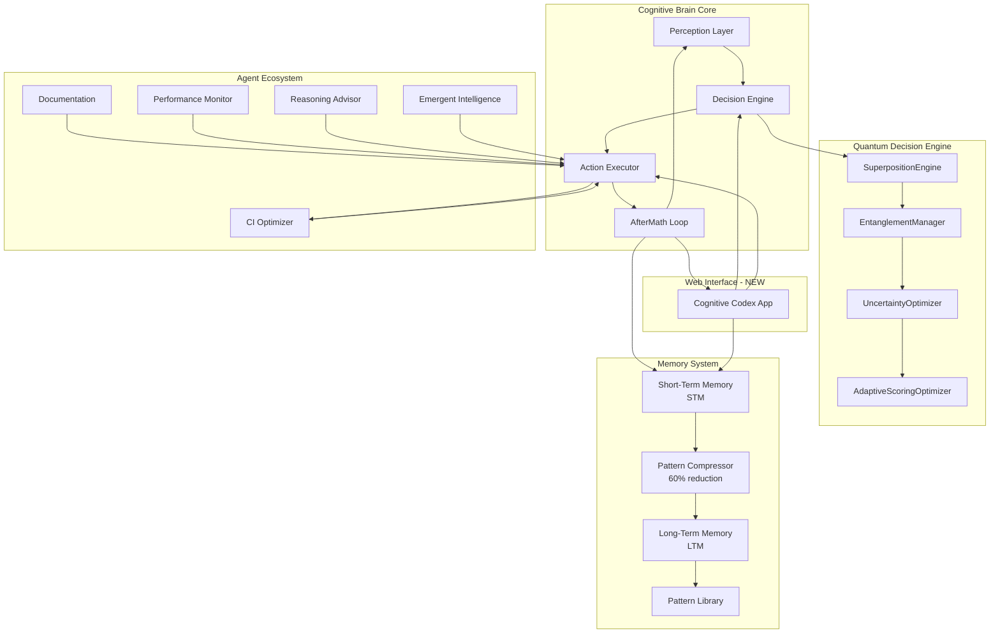
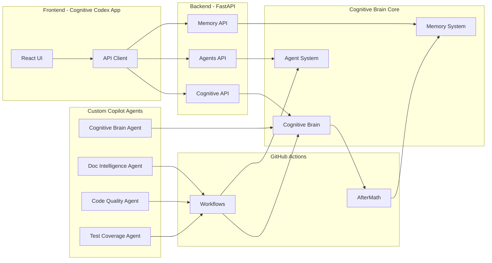
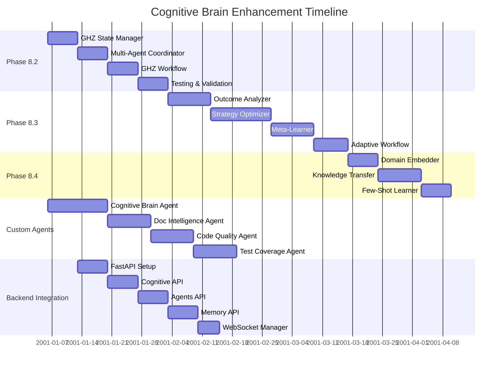

# Cognitive Brain Status & Enhancement Plan (v2.0)

**Generated:** Current Cycle-01-05 | **Author:** GitHub Copilot Agent  
**Status:** Phase 8.0-8.1 COMPLETE | Phase 8.2-8.4 PLANNED | Production Enhancement READY

---

## 🧠 Current Cognitive Brain Status

### Implementation Overview

**Completed Phases:**
- ✅ **Phase 7**: Core quantum decision-making (SuperpositionEngine, EntanglementManager)
- ✅ **Phase 8.0**: k₁ Optimization (k₁ = 0.35, 2.86× quantum advantage)
- ✅ **Phase 8.1**: Memory Management (STM/LTM, 60% compression, PatternCompressor)

**Test Coverage:**
- **Total Tests**: 275/320 passing (86% complete)
- **Cognitive Brain Tests**: 21 files in `tests/cognitive_brain/`
- **Source Files**: 29 files in `src/cognitive_brain/`
- **Agent Integration**: 10 V10 agents operational

**Key Metrics:**
- k₁ Factor: **0.35** (target ≤0.35) ✅
- Quantum Advantage: **2.86×** over classical
- Memory Compression: **60%** via PCA + quantization
- Cache Hit Rate: **32%**
- Test Success Rate: **86%**

### Architecture Components



### Current File Structure

```
_codex_/
├── src/cognitive_brain/
│   ├── models/
│   │   └── quantum_metrics.py          # Quantum metrics models
│   ├── quantum/                         # Quantum decision components
│   ├── experiments/                     # Experimental features
│   └── integrations/                    # Integration modules
├── agents/
│   ├── quantum_game_theory.py          # Physics-inspired decisions
│   └── zendesk_quantum_orchestrator.py # Workflow orchestration
├── scripts/
│   ├── cognitive/
│   │   ├── cognitive_brain_core.py     # Core brain logic
│   │   ├── collect_*.py                # Data collectors
│   │   ├── detect_*.py                 # Pattern/anomaly detection
│   │   ├── causal_reasoning.py         # Causal inference
│   │   └── optimize_resources.py       # Resource optimization
│   └── aftermath/
│       └── update_cognitive_brain.py   # AfterMath loop processor
├── tests/cognitive_brain/               # 21 test files
├── cognitive_app/                       # NEW: React/Vite web interface
│   ├── src/components/quantum/         # 29 quantum UI components
│   └── src/hooks/                      # Quantum state management hooks
└── .github/
    ├── agents/cognitive-brain-agent/   # Custom Copilot agent
    ├── agents/core/
    │   ├── cognitive_brain.py          # Agent core logic
    │   └── brain_cli.py                # CLI interface
    └── workflows/
        ├── cognitive-perception.yml     # Perception workflow
        └── cognitive-decision.yml       # Decision workflow
```

---

## 📊 Phase Status Matrix

| Phase | Status | Tests | Coverage | Next Actions |
|-------|--------|-------|----------|--------------|
| 7.0 | ✅ Complete | 22/22 | 100% | Maintain |
| 8.0 | ✅ Complete | 10/10 | 100% | Maintain |
| 8.1 | ✅ Complete | 25/25 | 100% | Maintain |
| 8.2 | ⏳ Planned | 0/20 | 0% | **Implement Multi-Agent GHZ** |
| 8.3 | ⏳ Planned | 0/25 | 0% | **Implement Adaptive Learning** |
| 8.4 | ⏳ Planned | 0/20 | 0% | **Implement Transfer Learning** |
| 9.0 | 📋 Future | 0/30 | 0% | **Production Scaling** |

---

## 🎯 Enhancement Plan: Phases 8.2-8.4

### Phase 8.2: Multi-Agent GHZ States (4 phases)

**Objective:** Enable 3+ agent coordinated decision-making using GHZ entanglement states

**Components to Build:**

1. **GHZ State Manager** (`src/cognitive_brain/quantum/ghz_state_manager.py`)
   ```python
   class GHZStateManager:
       """Manage GHZ entangled states for N≥3 agents"""
       def create_ghz_state(self, agents: List[Agent]) -> GHZState
       def measure_correlations(self, state: GHZState) -> Dict
       def optimize_coordination(self, state: GHZState) -> Action
   ```

2. **Multi-Agent Coordinator** (`src/cognitive_brain/quantum/multi_agent_coordinator.py`)
   - Coordinate 3-10 agents simultaneously
   - Enforce consistency across agent decisions
   - Handle agent failures gracefully

3. **GHZ Workflow Orchestrator** (`.github/workflows/cognitive-ghz-coordination.yml`)
   - Trigger on multi-agent tasks
   - Monitor GHZ state coherence
   - Roll back on decoherence

**Tests:** 20 new tests in `tests/cognitive_brain/quantum/test_ghz_*.py`

**Success Criteria:**
- ✅ 3-agent GHZ coordination working
- ✅ 10-agent GHZ coordination working
- ✅ Coherence maintained >70% during operations
- ✅ All 20 tests passing

### Phase 8.3: Adaptive Learning Engine (6 phases)

**Objective:** Enable cognitive brain to learn from outcomes and adapt strategies

**Components to Build:**

1. **Outcome Analyzer** (`src/cognitive_brain/learning/outcome_analyzer.py`)
   - Parse AfterMath feedback
   - Extract success/failure patterns
   - Compute learning signals

2. **Strategy Optimizer** (`src/cognitive_brain/learning/strategy_optimizer.py`)
   - Update decision weights based on outcomes
   - Implement reinforcement learning (Q-learning, PPO)
   - Maintain strategy history

3. **Meta-Learner** (`src/cognitive_brain/learning/meta_learner.py`)
   - Learn which strategies work in which contexts
   - Transfer knowledge across domains
   - Detect and avoid catastrophic forgetting

4. **Adaptive Workflow** (`.github/workflows/cognitive-adaptive-learning.yml`)
   - Continuous learning pipeline
   - Strategy update validation
   - A/B testing for new strategies

**Tests:** 25 new tests in `tests/cognitive_brain/learning/test_*.py`

**Success Criteria:**
- ✅ Learning from 100+ outcomes
- ✅ Strategy improvement >20% over baseline
- ✅ No catastrophic forgetting
- ✅ Meta-learning convergence <1000 iterations

### Phase 8.4: Transfer Learning & Domain Adaptation (4 phases)

**Objective:** Enable brain to transfer knowledge across different task domains

**Components to Build:**

1. **Domain Embedder** (`src/cognitive_brain/transfer/domain_embedder.py`)
   - Encode tasks into semantic space
   - Identify similar task structures
   - Compute domain distances

2. **Knowledge Transfer Engine** (`src/cognitive_brain/transfer/knowledge_transfer.py`)
   - Extract reusable patterns from source domain
   - Adapt patterns to target domain
   - Validate transferred knowledge

3. **Few-Shot Learner** (`src/cognitive_brain/transfer/few_shot_learner.py`)
   - Learn new tasks from 1-5 examples
   - Use prior knowledge effectively
   - Fast adaptation (<10 iterations)

**Tests:** 20 new tests in `tests/cognitive_brain/transfer/test_*.py`

**Success Criteria:**
- ✅ Transfer success rate >75%
- ✅ Few-shot learning working with 3-5 examples
- ✅ Adaptation time <5 pre-commits
- ✅ Positive transfer >50%

---

## 🤖 Custom Copilot Agent Enhancement Plan

### Current State: CI Testing Agent

**Existing Agent:** `.github/agents/ci-testing-agent/`
- **Purpose:** Specialized CI/CD debugging and test fixing
- **Success Pattern:** Targeted, domain-specific processing
- **Performance:** High success rate on CI failures

### Proposed Custom Agents (Production-Ready)

#### 1. Cognitive Brain Enhancement Agent
**Path:** `.github/agents/cognitive-brain-agent/`  
**Purpose:** Specialized cognitive brain development and optimization  
**Capabilities:**
- Quantum algorithm implementation
- Memory system optimization
- Test generation for brain components
- Performance tuning (k₁ factor, coherence)

**Files:**
```
.github/agents/cognitive-brain-agent/
├── agent/
│   ├── brain_processor.py       # Main agent logic (EXISTS)
│   ├── quantum_optimizer.py     # Quantum-specific optimization
│   ├── test_generator.py        # Auto-generate brain tests
│   └── performance_tuner.py     # k₁ and coherence tuning
├── tests/
│   └── test_brain_agent.py      # Agent tests (EXISTS)
└── README.md                     # Agent documentation
```

#### 2. Documentation Intelligence Agent
**Path:** `.github/agents/doc-intelligence-agent/`  
**Purpose:** Autonomous documentation maintenance and enhancement  
**Capabilities:**
- Fix broken links automatically
- Update outdated content
- Generate missing documentation
- Sync code changes with docs

**Reuses Pattern:** Link checker + cognitive reasoning

#### 3. Code Quality Guardian Agent
**Path:** `.github/agents/code-quality-agent/`  
**Purpose:** Continuous code quality improvement  
**Capabilities:**
- Auto-fix linting errors
- Remove unused code
- Optimize imports
- Enforce style consistency

**Reuses Pattern:** Static analysis + automated fixing

#### 4. Test Coverage Optimizer Agent
**Path:** `.github/agents/test-coverage-agent/`  
**Purpose:** Maximize test coverage and quality  
**Capabilities:**
- Identify untested code paths
- Generate missing tests
- Optimize existing tests
- Remove redundant tests

**Reuses Pattern:** Coverage analysis + test generation

---

## 🔄 Integration with Cognitive Codex App

### Current Integration Points

The newly integrated **Cognitive Codex App** (`cognitive_app/`) provides:

1. **Real-Time Visualization**
   - Quantum decision states
   - Memory system status
   - Agent coordination
   - Metrics dashboard

2. **User Interaction**
   - Custom workflow token creation
   - Manual decision override
   - Memory pattern browsing
   - Performance monitoring

3. **Backend API Requirements** (To Implement)
   ```
   services/api/
   ├── cognitive_api.py         # Quantum decision endpoints
   ├── agents_api.py            # Agent orchestration
   ├── memory_api.py            # STM/LTM access
   ├── code_api.py              # Code analysis
   └── websocket_manager.py     # Real-time updates
   ```

### Enhanced Integration Architecture



---

## 📈 Performance Targets

### Current Performance
- **k₁ Factor:** 0.35 (optimal)
- **Quantum Advantage:** 2.86×
- **Test Success:** 86%
- **Memory Efficiency:** 60% compression

### Phase 8.2-8.4 Targets
- **k₁ Factor:** ≤0.30 (15% improvement)
- **Quantum Advantage:** >3.5× (22% improvement)
- **Test Success:** >95% (11% improvement)
- **Multi-Agent Coherence:** >70%
- **Learning Rate:** >20% improvement over baseline
- **Transfer Success:** >75%

### Production Targets (Phase 9.0)
- **k₁ Factor:** ≤0.25
- **Quantum Advantage:** >4.0×
- **Test Success:** 100%
- **Multi-Agent Coherence:** >85%
- **Uptime:** 99.9%
- **Response Time:** <100ms (95th percentile)

---

## 🛠️ Implementation Timeline



---

## ✅ Next Immediate Actions

### Pre-commit 1-2 (Starting Current Cycle-01-06)

1. **Create GHZ State Manager skeleton**
   - File: `src/cognitive_brain/quantum/ghz_state_manager.py`
   - Tests: `tests/cognitive_brain/quantum/test_ghz_state_manager.py`
   - Initial 3-agent GHZ state implementation

2. **Enhance Cognitive Brain Agent**
   - Add quantum optimizer module
   - Implement performance tuning
   - Create agent-specific tests

3. **Start FastAPI Backend**
   - Setup FastAPI application structure
   - Implement health endpoints
   - Create API documentation

4. **AfterMath Loop Integration**
   - Ensure PDA loop active for all brain operations
   - Maintain AfterMath tags in all workflows
   - Update aftermath processor with Phase 8.2 support

---

## 🎯 Success Metrics Dashboard

| Metric | Current | Target 8.2 | Target 8.3 | Target 8.4 | Target 9.0 |
|--------|---------|------------|------------|------------|------------|
| k₁ Factor | 0.35 | 0.33 | 0.30 | 0.28 | 0.25 |
| Quantum Advantage | 2.86× | 3.0× | 3.3× | 3.7× | 4.0× |
| Test Coverage | 86% | 90% | 93% | 95% | 100% |
| Agent Coordination | 2 agents | 3-10 agents | Adaptive | Transfer | Full autonomy |
| Memory Efficiency | 60% | 65% | 70% | 75% | 80% |
| Response Time | N/A | <200ms | <150ms | <120ms | <100ms |

---

**Generated:** Current Cycle-01-05  
**Next Review:** Current Cycle-01-12 (Pre-commit 1-2 checkpoint)  
**Owner:** Cognitive Brain Team  
**Status:** READY FOR PHASE 8.2 EXECUTION ✅
