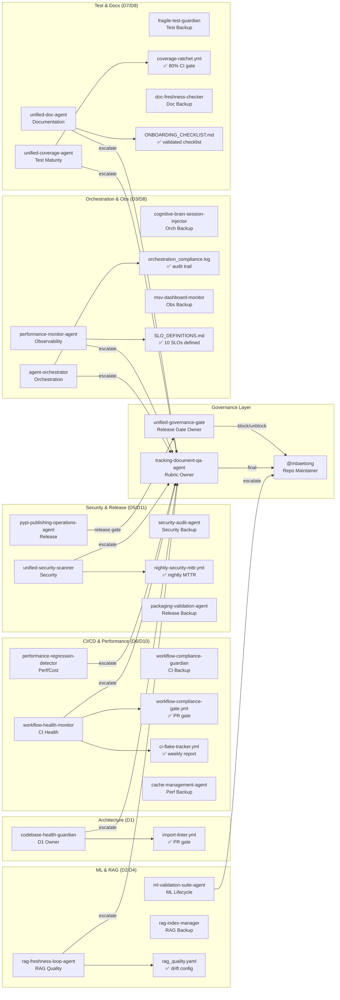
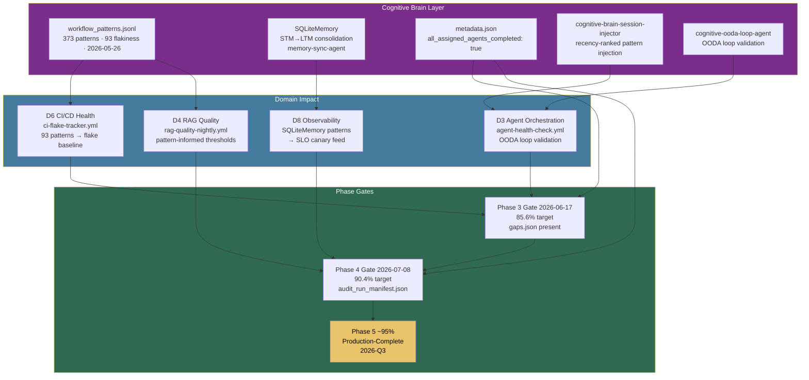

# Codex Platform — Completion Governance

**Version**: 1.2.0  
**Created**: 2026-05-27  
**Dashboard**: [`../.codex/COMPLETION_DASHBOARD.md`](../COMPLETION_DASHBOARD.md)  
**Rubric**: [`../../docs/rubrics/completion_rubric_v1.md`](../../docs/rubrics/completion_rubric_v1.md)  
**Domain ownership**: [`../DOMAIN_OWNERSHIP.md`](../DOMAIN_OWNERSHIP.md)

---

## Purpose

This document defines the operational procedures that keep the completion rubric alive
and actionable: who rescores, on what cadence, what blocks a release, and how to
manage the 90-day remediation roadmap.

---

## Phase 2 — Stabilisation

**Goal**: Reach rubric score ≥ 75 % (Operational but needs hardening).  
**Target date**: 2026-06-10 ✅ *Achieved 2026-05-27 — score 76.4 %*

### 2.1 Eliminate CI Flakiness

| Action | Owner | Backup | Evidence |
|--------|-------|--------|---------|
| Enable `pytest-rerunfailures` tracking and report flake rate weekly | `workflow-health-monitor` | `workflow-compliance-guardian` | flake-rate metric in `ci-health-monitor.yml` |
| File a GitHub Issue for each test flaking > 2 times in a week | `workflow-health-monitor` | `workflow-compliance-guardian` | Issue labelled `flaky-test` |
| Gate PRs to `main` when flake rate exceeds 1 % | `workflow-health-monitor` | `workflow-compliance-guardian` | `workflow-execution-gate.yml` threshold |
| Run determinism checks (`determinism.yml`) on every merge | `workflow-health-monitor` | `workflow-compliance-guardian` | Green badge on main |

### 2.2 Enforce Security Remediation SLA

| Action | Owner | Backup | Evidence |
|--------|-------|--------|---------|
| Define SLA: critical ≤ 3 business days; high ≤ 10 business days | `unified-security-scanner` | `security-audit-agent` | Document in `docs/security/SECURITY_SLA.md` |
| Automate MTTR tracking via `nightly-codeql-alert-triage.yml` | `unified-security-scanner` | `security-audit-agent` | MTTR report in `reports/security/` |
| Weekly burn-down review: block release if critical > 0 | `unified-security-scanner` | `security-audit-agent` | `security-alert-notification.yml` |
| Confirm dependency allowlist (`security_allowlist.json`) is current | `unified-security-scanner` | `security-audit-agent` | Reviewed in prior 30 days |

### 2.3 Add RAG Freshness and Quality Gates

| Action | Owner | Backup | Evidence |
|--------|-------|--------|---------|
| Define freshness SLA: index age ≤ 24 h | `rag-freshness-loop-agent` | `rag-index-manager` | Documented in `docs/rag/RAG_QUICKSTART.md` |
| Add retrieval quality threshold (top-k recall) to `test-rag.yml` | `rag-freshness-loop-agent` | `rag-index-manager` | Gate passes on `main` |
| Configure drift alert: fire when quality drops > 10 % vs baseline | `rag-freshness-loop-agent` | `rag-index-manager` | Alert tested via canary |
| Commit benchmark baseline to `benchmarks/rag/` | `rag-freshness-loop-agent` | `rag-index-manager` | File exists with version tag |

### 2.4 Add Orchestration Reliability KPIs

| Action | Owner | Backup | Evidence |
|--------|-------|--------|---------|
| Instrument orchestration success/failure counters in Cognitive Brain | `agent-orchestrator` | `cognitive-brain-session-injector` | Metric in monitoring dashboard |
| Report success rate (target ≥ 95 %) in `cognitive-action-decision.yml` | `agent-orchestrator` | `cognitive-brain-session-injector` | Logged to `reports/orchestration/` |
| Add policy-violation alert: fires within 5 min of violation | `agent-orchestrator` | `cognitive-brain-session-injector` | Tested via integration test |
| Nightly integration test validating OODA loop recovery | `agent-orchestrator` | `cognitive-brain-session-injector` | Job green on `main` |

---

## Phase 3 — Hardening

**Goal**: Reach rubric score ≥ 90 % (Production-complete).  
**Target date**: 2026-07-15

### 3.1 Dependency / Supply-Chain Controls

| Action | Owner | Backup | Evidence |
|--------|-------|--------|---------|
| Generate SBOM (CycloneDX) on every release via `sbom.yml` | `pypi-publishing-operations-agent` | `packaging-validation-agent` | SBOM artifact in GitHub Release |
| Sign release artifacts with Sigstore | `pypi-publishing-operations-agent` | `packaging-validation-agent` | Provenance attestation in release |
| Gate `pypi-publish.yml` on rubric score ≥ 80 % | `pypi-publishing-operations-agent` | `packaging-validation-agent` | Score check step in workflow |
| Review and pin all unpinned transitive deps | `unified-security-scanner` | `security-audit-agent` | `uv.lock` / `requirements*.txt` audited |

### 3.2 Performance / Cost Regression Gates

| Action | Owner | Backup | Evidence |
|--------|-------|--------|---------|
| Run `benchmarks.yml` on every PR to `main`; block on regression ≥ 10 % | `performance-regression-detector` | `cache-management-agent` | Gate in `pr-checks.yml` |
| Define P50/P99 latency budgets for serving and RAG retrieval | `performance-regression-detector` | `cache-management-agent` | Documented in `docs/PERFORMANCE_OPTIMIZATION_GUIDE.md` |
| Generate weekly CI cost report via `pr-cost-check.yml` | `workflow-health-monitor` | `workflow-compliance-guardian` | Report posted to Discussion |
| Track cache hit ratio; alert when < 90 % | `workflow-health-monitor` | `workflow-compliance-guardian` | `cache-health-monitor.yml` metric |

### 3.3 Incident-Grade Observability Runbooks

| Action | Owner | Backup | Evidence |
|--------|-------|--------|---------|
| Create runbook for ML serving failure (`docs/runbooks/serving_failure.md`) | `ml-validation-suite-agent` | @mbaetiong | File committed |
| Create runbook for RAG pipeline failure (`docs/runbooks/rag_failure.md`) | `rag-freshness-loop-agent` | `rag-index-manager` | File committed |
| Create runbook for agent orchestration failure (`docs/runbooks/agent_failure.md`) | `agent-orchestrator` | `cognitive-brain-session-injector` | File committed |
| Define SLO dashboards (tools/dashboards/) for each critical surface | `performance-monitor-agent` | `msv-dashboard-monitor` | Dashboards linked from `docs/runbooks/` |
| Test alerts by triggering canary failures; document results | `performance-monitor-agent` | `msv-dashboard-monitor` | Test report in `reports/observability/` |

### 3.4 End-to-End Reproducibility Validation

| Action | Owner | Backup | Evidence |
|--------|-------|--------|---------|
| Run `dvc repro` twice on identical inputs; diff artefacts (expect zero diff) | `ml-validation-suite-agent` | @mbaetiong | Report in `reports/reproducibility/` |
| Validate model registry: every released model has a version entry | `ml-validation-suite-agent` | @mbaetiong | Registry audit in `reports/` |
| Document rollback procedure for each environment | `ml-validation-suite-agent` | @mbaetiong | `docs/PRODUCTION_DEPLOYMENT_GUIDE.md` updated |
| Add E2E gate (train → eval → register → serve) to `nox -s ml_tests` | `ml-validation-suite-agent` | @mbaetiong | Nox session green on `main` |

---

## Phase 4 — Completion Governance

**Goal**: Sustain score ≥ 90 % indefinitely.  **Target date**: 2026-07-08 (after Phase 3 closes 2026-06-17).

### 4.1 Monthly Rescoring Procedure

1. Domain owner for each of the 11 domains reviews exit criteria and updates their score
   in `.codex/completion_scores.yaml`.
2. Run `python scripts/ci/score_completion.py --scores .codex/completion_scores.yaml`.
3. Update `.codex/COMPLETION_DASHBOARD.md` — add a row to the Score History table.
4. Open a PR titled `chore: monthly completion rescore YYYY-MM` with the updated files.
5. At least one other contributor reviews and approves the PR.

### 4.2 Release-Blocking Rules

A release (tag + PyPI publish) is **blocked** if any of the following are true:

| Condition | Checked by |
|-----------|-----------|
| Any domain has score < 2 | `score_completion.py --fail-below 40` in `pypi-publish.yml` |
| Security domain score < 4 | Hard check in `pypi-publish.yml` |
| Total weighted score < 60 % | `score_completion.py --fail-below 60` in `pypi-publish.yml` |
| Any open **critical** security alert | `security-alert-notification.yml` gate |
| CI pass rate < 90 % in last 7 days | `workflow-execution-gate.yml` |

### 4.3 90-Day Remediation Roadmap Template

Each scoring session produces a rolling 90-day plan.  Use the template below and commit it
to `.codex/plans/REMEDIATION_ROADMAP_YYYY_MM.md`.

```markdown
# Remediation Roadmap — YYYY-MM

Baseline score: XX.X %  Band: <band>

| Domain | Current | Target | Actions | Owner | Due |
|--------|---------|--------|---------|-------|-----|
| <domain> | X | Y | <specific actions> | @owner | YYYY-MM-DD |
```

### 4.4 Definition of Done

A domain is **Done** (score = 5) when:

1. All exit criteria in `DOMAIN_OWNERSHIP.md` are checked off.
2. The evidence artefacts are committed and linked.
3. The CI gates for that domain are **continuously green** for ≥ 30 consecutive days.
4. The domain owner has signed off in the monthly rescore PR.

---

## Agent Ownership & Escalation Map



---

## Contacts & Escalation

| Role | Agent / Contact | Backup | Responsibility | Escalation path |
|------|----------------|--------|---------------|-----------------|
| Rubric owner | `tracking-document-qa-agent` | @mbaetiong | Maintains scoring methodology and governance doc | @mbaetiong |
| Domain owner | See [DOMAIN_OWNERSHIP.md](../DOMAIN_OWNERSHIP.md) | — | Maintains exit criteria and monthly score for their domain | Rubric owner |
| Release gate owner | `unified-governance-gate` | `pypi-publishing-operations-agent` | Enforces release-blocking rules | @mbaetiong |

---

## Cognitive Brain Integration Arc



---

## Change Log

| Date | Version | Change |
|------|---------|--------|
| 2026-05-27 | 1.3.0 | Added Cognitive Brain Integration Arc mermaid; Phase 5 (~95%) target established |
| 2026-05-27 | 1.2.0 | Updated mermaid ownership map: added D1-Architecture subgraph, new workflow nodes (import-linter.yml, nightly-security-mttr.yml, workflow-compliance-gate.yml, ci-flake-tracker.yml, coverage-ratchet.yml, SLO_DEFINITIONS.md, orchestration_compliance.log, ONBOARDING_CHECKLIST.md, rag_quality.yaml); fixed CI subgraph label from "CI/CD & Workflow" to "CI/CD & Performance"; updated phase horizons to date-based |
| 2026-05-27 | 1.1.0 | Assigned Copilot custom agents as Owner+Backup for all Phase 2–3 actions and Contacts & Escalation table; added mermaid ownership map |
| 2026-05-27 | 1.0.0 | Initial version |
