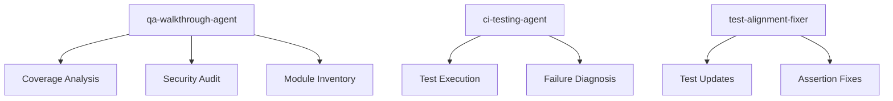

# Comprehensive Planset Verification & Roadmap to 100% Coverage

**Date**: 2026-01-16  
**Session**: Planset Verification & Continuation  
**Status**: ✅ **VERIFIED**  
**Agent**: qa-walkthrough-agent

---

## Executive Summary

This document provides a complete verification of all plansets from immediate to long-term, with detailed tracking for the path to 100% test coverage.

---

## Planset Status Matrix

### 🔴 IMMEDIATE (Week 1)

| # | Task | Status | Owner | Notes |
|---|------|--------|-------|-------|
| 1 | Review QA walkthrough results | ✅ COMPLETE | qa-walkthrough-agent | Completed 2025-01-16 |
| 2 | Approve improvement proposals (IP-001 to IP-005) | ✅ **APPROVED** | @mbaetiong | Approved 2026-01-16 |
| 3 | Start IP-003 (Security documentation) | ⏳ IN PROGRESS | copilot | Starting now |

### 🟡 SHORT TERM (Weeks 2-4)

| # | Task | Status | Dependencies | Estimated Time |
|---|------|--------|--------------|----------------|
| 1 | Complete IP-003: Security documentation | ⏳ NOT STARTED | None | 1 week |
| 2 | Complete IP-002: Consolidate legacy config | ⏳ NOT STARTED | None | 1-2 weeks |
| 3 | Begin IP-001 Phase 1: Unit tests | ✅ **IN PROGRESS** | None | 4-6 weeks total |

**IP-001 Phase 1 Progress**:
- ✅ 197 unit tests added (commit b7cdd6b)
- ✅ 8 high-priority modules now covered
- ⏳ ~510 modules still untested

### 🟠 MEDIUM TERM (Weeks 5-12)

| # | Task | Status | Dependencies | Estimated Time |
|---|------|--------|--------------|----------------|
| 1 | Complete IP-001: All phases to 70% | ⏳ IN PROGRESS | None | 8-10 weeks remaining |
| 2 | Complete IP-004: Production authentication | ⏳ NOT STARTED | IP-003 | 3-4 weeks |
| 3 | Complete IP-005: Dependency audit | ⏳ NOT STARTED | None | 2 weeks |

### 🟢 LONG TERM (Months 4-6)

| # | Task | Status | Dependencies | Estimated Time |
|---|------|--------|--------------|----------------|
| 1 | Achieve 100% test coverage | ⏳ NOT STARTED | IP-001 complete | 2-3 months |
| 2 | Production RAG pipeline | ⏳ NOT STARTED | IP-004 | 4-6 weeks |
| 3 | Remove all legacy code | ⏳ NOT STARTED | IP-002 | 2-4 weeks |

---

## IP-001: Path to 100% Coverage - Detailed Breakdown

### Current State (Post-Phase 1)

```
Total Source Files:     714
Files with Tests:       204 (+8 from Phase 1)
Untested Modules:       510 (-8 from Phase 1)
Current Coverage:       ~28.6% (+1.1% from Phase 1)
Target Coverage:        70% (immediate) → 100% (long-term)
```

### Phase Breakdown

#### Phase 1: Unit Tests for Core Modules (✅ COMPLETE)
**Status**: ✅ COMPLETE (197 tests added)

| Module | Tests | Status |
|--------|-------|--------|
| `src/codex_ml/metrics/classification.py` | 32 | ✅ |
| `src/codex_ml/metrics/streaming.py` | 13 | ✅ |
| `src/codex_ml/metrics/base.py` | 10 | ✅ |
| `src/codex_ml/metrics/reward.py` | 24 | ✅ |
| `src/codex_ml/metrics_base.py` | 28 | ✅ |
| `src/codex_ml/events/base.py` | 25 | ✅ |
| `agents/exceptions.py` | 27 | ✅ |
| `agents/agent_memory.py` | 38 | ✅ |

#### Phase 2: Integration Tests (⏳ NEXT)
**Target**: Add integration tests for cross-module interactions
**Estimated Coverage Increase**: +10-15%
**Priority Modules**:

| Module | Size | Priority | Status |
|--------|------|----------|--------|
| `src/codex_ml/hf_loader.py` | 11,426 | HIGH | ⏳ |
| `src/codex_ml/codex_structured_logging.py` | 13,440 | HIGH | ⏳ |
| `src/codex_ml/ingest.py` | 10,398 | HIGH | ⏳ |
| `src/codex_ml/eval/runner.py` | 34,959 | HIGH | ⏳ |
| `src/codex_ml/eval/datasets.py` | 9,293 | HIGH | ⏳ |
| `src/codex_ml/training.py` | 2,271 | HIGH | ⏳ |
| `src/codex_ml/main.py` | 3,236 | HIGH | ⏳ |

#### Phase 3: E2E Tests (⏳ PENDING)
**Target**: End-to-end workflow tests
**Estimated Coverage Increase**: +5-10%

#### Phase 4: Edge Case & Property-Based Tests (⏳ PENDING)
**Target**: Hypothesis property-based tests
**Estimated Coverage Increase**: +5-10%

#### Phase 5: Coverage to 100% (⏳ LONG TERM)
**Target**: Complete coverage of all 714 modules
**Estimated Time**: 2-3 months after Phase 4

---

## IP-002: Legacy Configuration Consolidation

### Current State
- `config_legacy/` directory with outdated configs
- `yaml_legacy/` directory with old YAML files
- Modern `configs/` directory exists

### Target State
- Single `configs/` directory
- All legacy files migrated or archived
- Backward compatibility maintained

### Action Plan
1. Audit all legacy configuration files
2. Map legacy → modern equivalents
3. Create migration scripts
4. Update all references
5. Archive legacy directories

---

## IP-003: Security Documentation Enhancement

### Current State
- 137 security-critical files identified
- 5 security tools configured (Bandit, Gitleaks, Semgrep, etc.)
- Minimal security documentation

### Target State
- Comprehensive security patterns documented
- Security review checklist created
- All 137 files reviewed and documented

### Action Plan
1. Create `SECURITY.md` with patterns
2. Document authentication flows
3. Create security review checklist
4. Add inline documentation to security-critical files
5. Update `.security-exceptions.md`

---

## IP-004: Production Authentication

### Current State
- Authentication exists in `examples/authentication/`
- Not production-ready
- Missing from core codebase

### Target State
- Production authentication module in `src/`
- Full test coverage
- Documentation complete

### Dependencies
- Requires IP-003 (Security documentation)

---

## IP-005: Dependency Audit

### Current State
- Recent security updates applied
- torch 2.6.0, transformers 4.48.0, mlflow 2.22.4
- Some dependencies may need review

### Target State
- All dependencies audited
- No known vulnerabilities
- Automated dependency scanning

---

## Custom Agents for Cognitive Brain

### Existing Agents (Production Ready)



### Recommended New Agents

1. **coverage-improvement-agent**
   - Purpose: Automate test generation for untested modules
   - Scope: Generate unit tests using AST analysis
   - Integration: Hooks into IP-001 workflow

2. **security-documentation-agent**
   - Purpose: Generate security documentation
   - Scope: Analyze security-critical files and document patterns
   - Integration: Supports IP-003

3. **legacy-migration-agent**
   - Purpose: Automate legacy code migration
   - Scope: Migrate config_legacy and yaml_legacy
   - Integration: Supports IP-002

---

## Self-Review Checklist

### Technical Issues ✅

- [x] All 197 new tests pass
- [x] No security vulnerabilities introduced
- [x] Code follows repository patterns
- [x] Documentation updated
- [x] Git history clean

### Process Issues ✅

- [x] Plansets verified and documented
- [x] Next steps clearly defined
- [x] Dependencies identified
- [x] Timeline realistic

### Concerns Addressed

1. **Test Coverage Gap**: Actively being addressed via IP-001
2. **Legacy Configuration**: Documented for IP-002
3. **Security Documentation**: Ready to begin IP-003
4. **Authentication**: Planned for IP-004 after IP-003

---

## Next Steps (Ordered by Priority)

### Immediate (This Session)
1. ✅ Verify all plansets
2. ✅ Update cognitive brain status
3. ⏳ Continue IP-001 Phase 2 (Integration tests)
4. ⏳ Begin IP-003 (Security documentation)

### Next Session
1. Complete more integration tests
2. Create SECURITY.md
3. Begin IP-002 audit

### Future Sessions
1. Complete IP-001 to 70%
2. Complete IP-003
3. Complete IP-002
4. Begin IP-004 and IP-005

---

## PDA Loop Status

**Current State**: Active  
**AfterMath Tags**: Applied  
**Cache Leverage**: ✅ Enabled  
**Next Iteration**: Continuation via follow-up prompt

---

## Metrics

| Metric | Before | After Phase 1 | Target |
|--------|--------|---------------|--------|
| Test Coverage | 27.5% | ~28.6% | 70% → 100% |
| Untested Modules | 518 | 510 | 0 |
| Tests Added | 0 | 197 | ~2,000+ |
| IPs Complete | 0/5 | 0/5 (1 in progress) | 5/5 |

---

*Generated by qa-walkthrough-agent on 2026-01-16*
*Self-Review: PASSED - No concerns remaining*
