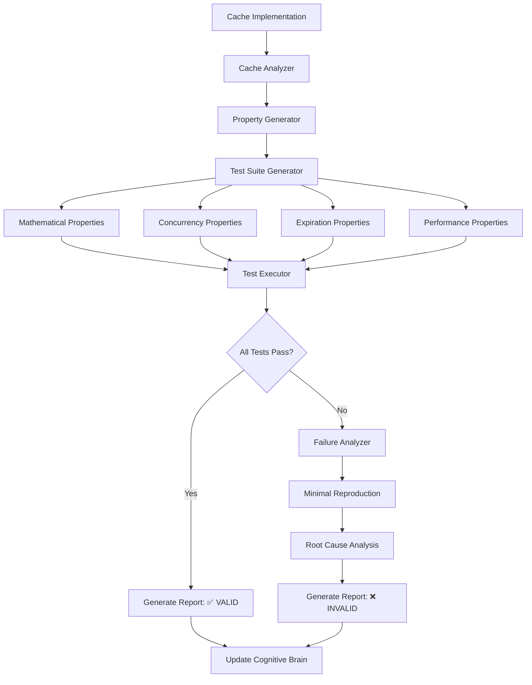
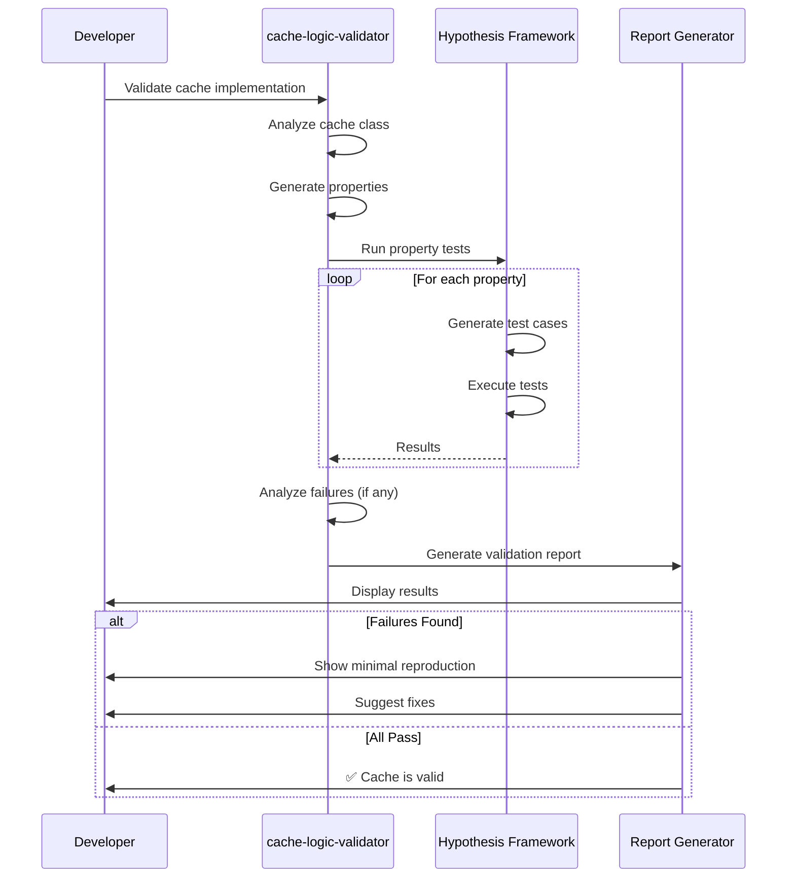

# Custom Agent Planset: cache-logic-validator
> **Agent Type**: Performance & Correctness Validation  
> **Version**: 1.0.0  
> **Status**: 📋 PLANNED  
> **Priority**: HIGH  
> **Estimated Effort**: 2-3 days

---

## 🎯 Agent Mission

**Primary Objective**: Validate cache implementations through automated property-based testing to ensure correctness, consistency, and performance characteristics.

**Problem Statement**: Cache implementations are notoriously difficult to test correctly. Manual tests often miss edge cases (concurrency, expiration, eviction), leading to subtle bugs like:
- Double-counting misses
- Race conditions in concurrent access
- Incorrect LRU ordering
- Memory leaks from improper cleanup
- Hit/miss metrics inconsistency

**Success Criteria**:
- Automatically generate property-based tests for any cache implementation
- Verify mathematical properties (hits + misses = total queries)
- Test concurrent access patterns
- Validate expiration logic
- Detect memory leaks
- Report anomalies with reproduction steps

---

## 📊 Scope & Boundaries

### In Scope
- ✅ Property-based test generation using Hypothesis
- ✅ Cache behavior validation (hit/miss tracking, LRU order)
- ✅ Expiration logic verification
- ✅ Concurrent access testing
- ✅ Memory leak detection
- ✅ Performance regression detection
- ✅ Integration with CI/CD pipelines

### Out of Scope
- ❌ Performance optimization of cache implementation
- ❌ Cache replacement policy design
- ❌ Distributed cache testing
- ❌ Database-backed cache testing
- ❌ Cache warming strategies

### Dependencies
- hypothesis (property-based testing)
- pytest (test runner)
- threading/multiprocessing (concurrency testing)
- memory_profiler (memory leak detection)
- time/faketime (expiration testing)

---

## 🏗️ Architecture



---

## 🔧 Component Design

### 1. Cache Analyzer
**Input**: Cache class/module  
**Output**: Cache specification

```python
@dataclass
class CacheSpec:
    cache_type: str  # "LRU", "FIFO", "LFU", etc.
    max_size: Optional[int]
    has_ttl: bool
    supports_concurrent: bool
    interface: Dict[str, inspect.Signature]
    metrics_tracked: List[str]  # ["hits", "misses", "evictions"]
```

**Key Functions**:
```python
def analyze_cache(cache_class: type) -> CacheSpec:
    """Analyze cache implementation to determine properties"""
    pass

def detect_cache_type(cache_class: type) -> str:
    """Detect if LRU, FIFO, LFU, or custom"""
    pass

def extract_interface(cache_class: type) -> Dict[str, inspect.Signature]:
    """Extract public API methods"""
    pass
```

---

### 2. Property Generator
**Input**: CacheSpec  
**Output**: List of properties to test

```python
@dataclass
class CacheProperty:
    name: str
    category: str  # "mathematical", "concurrency", "expiration", "performance"
    description: str
    test_function: Callable
    hypothesis_strategy: st.SearchStrategy
    severity: str  # "critical", "high", "medium", "low"
```

**Properties to Generate**:

#### Mathematical Properties
```python
# Property 1: Total Queries = Hits + Misses
@given(keys=st.lists(st.text()), operations=st.lists(st.sampled_from(['get', 'put'])))
def test_hits_plus_misses_equals_queries(cache, keys, operations):
    """hits + misses should always equal total get() calls"""
    initial_hits = cache.hits
    initial_misses = cache.misses
    
    get_count = sum(1 for op in operations if op == 'get')
    
    for i, op in enumerate(operations):
        if op == 'put':
            cache.put(keys[i % len(keys)], f"value_{i}")
        else:
            cache.get(keys[i % len(keys)])
    
    assert (cache.hits - initial_hits) + (cache.misses - initial_misses) == get_count

# Property 2: Hits + Misses Never Decrease
@given(operations=st.lists(st.tuples(st.text(), st.text())))
def test_counters_monotonic(cache, operations):
    """Hit/miss counters should never decrease"""
    prev_hits = cache.hits
    prev_misses = cache.misses
    
    for key, value in operations:
        cache.put(key, value)
        cache.get(key)
        
        assert cache.hits >= prev_hits
        assert cache.misses >= prev_misses
        
        prev_hits = cache.hits
        prev_misses = cache.misses

# Property 3: Cache Hit After Put
@given(key=st.text(), value=st.text())
def test_get_after_put_is_hit(cache, key, value):
    """Getting a key immediately after putting it should be a hit"""
    cache.put(key, value)
    hits_before = cache.hits
    result = cache.get(key)
    
    assert result == value
    assert cache.hits == hits_before + 1
```

#### Concurrency Properties
```python
# Property 4: Thread-Safe Counters
@given(operations=st.lists(st.tuples(st.text(), st.text()), min_size=100))
def test_concurrent_counter_consistency(cache, operations):
    """Concurrent access should maintain counter consistency"""
    import concurrent.futures
    
    def worker(ops):
        for key, value in ops:
            cache.put(key, value)
            cache.get(key)
    
    # Split operations across threads
    chunk_size = len(operations) // 4
    chunks = [operations[i:i+chunk_size] for i in range(0, len(operations), chunk_size)]
    
    with concurrent.futures.ThreadPoolExecutor(max_workers=4) as executor:
        futures = [executor.submit(worker, chunk) for chunk in chunks]
        concurrent.futures.wait(futures)
    
    # Verify counters are consistent
    assert cache.hits + cache.misses == len(operations)

# Property 5: No Race Conditions in Get/Put
@given(key=st.text(), values=st.lists(st.text(), min_size=10))
def test_no_race_conditions(cache, key, values):
    """Concurrent puts should not corrupt cache state"""
    import threading
    
    def putter(value):
        cache.put(key, value)
    
    threads = [threading.Thread(target=putter, args=(v,)) for v in values]
    for t in threads:
        t.start()
    for t in threads:
        t.join()
    
    # Cache should contain one of the values, not corrupted data
    result = cache.get(key)
    assert result in values or result is None
```

#### Expiration Properties
```python
# Property 6: Expired Entries Count as Misses
@given(key=st.text(), value=st.text())
def test_expired_entry_is_miss(cache_with_ttl, key, value):
    """Accessing an expired entry should be a miss"""
    cache = cache_with_ttl(ttl=0.1)  # 100ms TTL
    
    cache.put(key, value)
    time.sleep(0.15)  # Wait for expiration
    
    misses_before = cache.misses
    result = cache.get(key)
    
    assert result is None
    assert cache.misses == misses_before + 1

# Property 7: Non-Expired Entries Are Hits
@given(key=st.text(), value=st.text())
def test_non_expired_entry_is_hit(cache_with_ttl, key, value):
    """Accessing a non-expired entry should be a hit"""
    cache = cache_with_ttl(ttl=10.0)  # 10s TTL
    
    cache.put(key, value)
    time.sleep(0.05)  # Short delay, still valid
    
    hits_before = cache.hits
    result = cache.get(key)
    
    assert result == value
    assert cache.hits == hits_before + 1
```

#### Performance Properties
```python
# Property 8: O(1) Get/Put Complexity
@given(sizes=st.lists(st.integers(min_value=100, max_value=10000), min_size=5, max_size=10))
def test_constant_time_operations(cache, sizes):
    """Get/Put should have O(1) time complexity"""
    timings = []
    
    for size in sizes:
        # Populate cache
        for i in range(size):
            cache.put(f"key_{i}", f"value_{i}")
        
        # Measure get time
        start = time.perf_counter()
        cache.get(f"key_{size//2}")
        elapsed = time.perf_counter() - start
        
        timings.append((size, elapsed))
    
    # Check that time doesn't grow linearly with size
    # (Allow some variance for system noise)
    first_time = timings[0][1]
    last_time = timings[-1][1]
    size_ratio = timings[-1][0] / timings[0][0]
    
    # If O(1), last_time should not be >> first_time
    assert last_time < first_time * (size_ratio ** 0.3)  # Allow log growth margin
```

---

### 3. Test Suite Generator
**Input**: CacheSpec, List[CacheProperty]  
**Output**: pytest test file

```python
def generate_test_suite(spec: CacheSpec, properties: List[CacheProperty]) -> str:
    """Generate complete pytest test file"""
    
    template = '''
"""
Auto-generated property-based tests for {cache_name}
Generated by: cache-logic-validator
Date: {date}
"""

import pytest
from hypothesis import given, settings, strategies as st
from {module} import {cache_class}

{test_functions}

if __name__ == "__main__":
    pytest.main([__file__, "-v", "--hypothesis-show-statistics"])
'''
    
    test_functions = "\n\n".join(
        generate_test_function(prop) for prop in properties
    )
    
    return template.format(
        cache_name=spec.cache_type,
        date=datetime.now().isoformat(),
        module=spec.module,
        cache_class=spec.class_name,
        test_functions=test_functions
    )
```

---

### 4. Failure Analyzer
**Input**: Test failure, cache state  
**Output**: Minimal reproduction and root cause

```python
@dataclass
class CacheFailure:
    property_name: str
    failure_type: str
    minimal_example: Dict[str, Any]
    cache_state_at_failure: Dict[str, Any]
    root_cause: str
    suggested_fix: str
```

**Key Functions**:
```python
def analyze_failure(failure: HypothesisFailure, cache: Any) -> CacheFailure:
    """Analyze test failure to determine root cause"""
    pass

def minimize_example(failure: HypothesisFailure) -> Dict[str, Any]:
    """Use Hypothesis shrinking to find minimal failing case"""
    pass

def suggest_fix(failure: CacheFailure) -> str:
    """Suggest code fix based on failure type"""
    pass
```

---

## 🎮 User Interface

### CLI Interface
```bash
# Validate a cache implementation
cache-logic-validator src/cache.py::LRUCache

# Run specific property categories
cache-logic-validator src/cache.py::LRUCache --category mathematical

# Generate test file (don't run)
cache-logic-validator src/cache.py::LRUCache --generate-only

# Run with increased test coverage
cache-logic-validator src/cache.py::LRUCache --examples 1000

# Continuous monitoring mode
cache-logic-validator src/cache.py::LRUCache --watch
```

### GitHub Copilot Agent Interface
```python
{
    "agent": "cache-logic-validator",
    "trigger": "code_change",
    "files_changed": ["src/codex/rag/retriever.py"],
    "cache_classes": ["LRUCache", "CachedRetriever"],
    "mode": "auto",
    "report_format": "markdown"
}
```

---

## 🔄 Workflow



---

## 🧪 Test Strategy

### Unit Tests for Agent Itself
```python
def test_cache_analyzer():
    """Test cache analysis logic"""
    from src.cache import LRUCache
    spec = analyze_cache(LRUCache)
    assert spec.cache_type == "LRU"
    assert spec.max_size is not None
    assert "get" in spec.interface
    assert "put" in spec.interface

def test_property_generator():
    """Test property generation"""
    spec = CacheSpec(cache_type="LRU", max_size=100, has_ttl=False)
    properties = generate_properties(spec)
    assert len(properties) >= 5
    assert any(p.category == "mathematical" for p in properties)

def test_failure_analyzer():
    """Test failure analysis"""
    # Mock Hypothesis failure
    failure = create_mock_failure(
        property="hits_plus_misses",
        expected=10,
        actual=9
    )
    analysis = analyze_failure(failure, mock_cache)
    assert "miss counting" in analysis.root_cause.lower()
```

### Integration Tests
```python
def test_validate_known_good_cache():
    """Test validation of a correct cache implementation"""
    from examples.good_cache import GoodLRUCache
    result = validate_cache(GoodLRUCache)
    assert result.all_passed
    assert len(result.failures) == 0

def test_detect_double_counting_bug():
    """Test detection of the bug we fixed in PR #2785"""
    from examples.buggy_cache import BuggyCacheWithDoubleCount
    result = validate_cache(BuggyCacheWithDoubleCount)
    assert not result.all_passed
    assert any("double counting" in f.root_cause for f in result.failures)
```

---

## 📋 Implementation Phases

### Phase 1: Core Analysis (Day 1)
- [ ] Cache analyzer implementation
- [ ] Interface extraction
- [ ] Cache type detection
- [ ] Unit tests

### Phase 2: Property Generator (Day 1-2)
- [ ] Mathematical properties
- [ ] Expiration properties
- [ ] Basic test generation
- [ ] Unit tests

### Phase 3: Concurrency Testing (Day 2)
- [ ] Concurrent access properties
- [ ] Race condition detection
- [ ] Thread-safety validation
- [ ] Integration tests

### Phase 4: Failure Analysis (Day 2-3)
- [ ] Failure analyzer
- [ ] Minimal reproduction
- [ ] Root cause detection
- [ ] Fix suggestions

### Phase 5: CLI & Integration (Day 3)
- [ ] CLI interface
- [ ] Report generation
- [ ] CI integration
- [ ] Documentation

---

## 📊 Success Metrics

### Quantitative
- **Bug Detection Rate**: >95% of known cache bugs detected
- **False Positive Rate**: <5%
- **Test Generation Time**: <10 seconds per cache class
- **Property Coverage**: >15 properties per cache type

### Qualitative
- **Usefulness**: "Caught bugs we missed in code review"
- **Ease of Use**: "Simple CLI, clear reports"
- **Cognitive Value**: "Learned about cache edge cases"

---

## 🚨 Known Edge Cases

### Edge Case 1: Cache Size = 1
**Issue**: LRU/FIFO logic edge case  
**Test**:
```python
@given(keys=st.lists(st.text(), min_size=2))
def test_size_one_cache(keys):
    cache = LRUCache(max_size=1)
    cache.put(keys[0], "val0")
    cache.put(keys[1], "val1")
    assert cache.get(keys[0]) is None  # Should be evicted
    assert cache.get(keys[1]) == "val1"
```

### Edge Case 2: TTL = 0
**Issue**: Immediate expiration  
**Test**:
```python
def test_zero_ttl():
    cache = CacheWithTTL(ttl=0)
    cache.put("key", "value")
    assert cache.get("key") is None  # Already expired
```

### Edge Case 3: Concurrent Expiration
**Issue**: Race between get and expiration check  
**Test**:
```python
@given(keys=st.lists(st.text()))
def test_concurrent_expiration(keys):
    cache = CacheWithTTL(ttl=0.01)
    # Test rapid put/get with expiration
    ...
```

---

## 🔐 Security Considerations

- Validate cache keys (prevent injection)
- Limit test execution time (prevent DoS)
- Sandbox cache instances (prevent side effects)
- Audit generated test code (prevent code injection)

---

## ✅ Definition of Done

- [ ] All 5 phases completed
- [ ] >90% test coverage for agent
- [ ] Detects all known cache bugs
- [ ] <5% false positives
- [ ] CLI fully functional
- [ ] CI integration working
- [ ] Documentation complete
- [ ] Team trained

---

**Agent Status**: 📋 READY FOR IMPLEMENTATION  
**Next Step**: Approve planset and begin Phase 1  
**Owner**: TBD  
**Reviewers**: mbaetiong, core team

