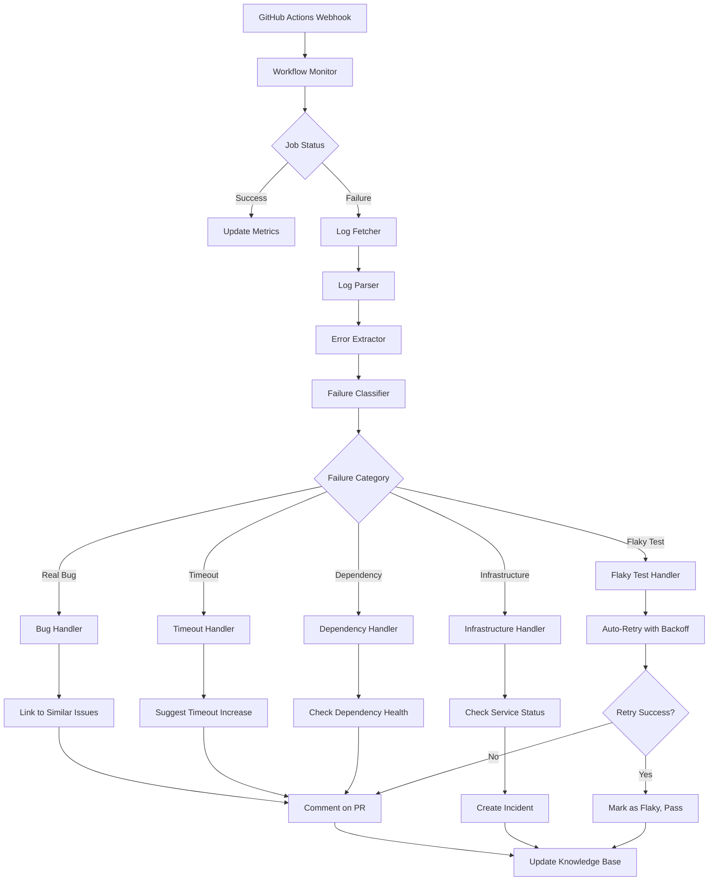
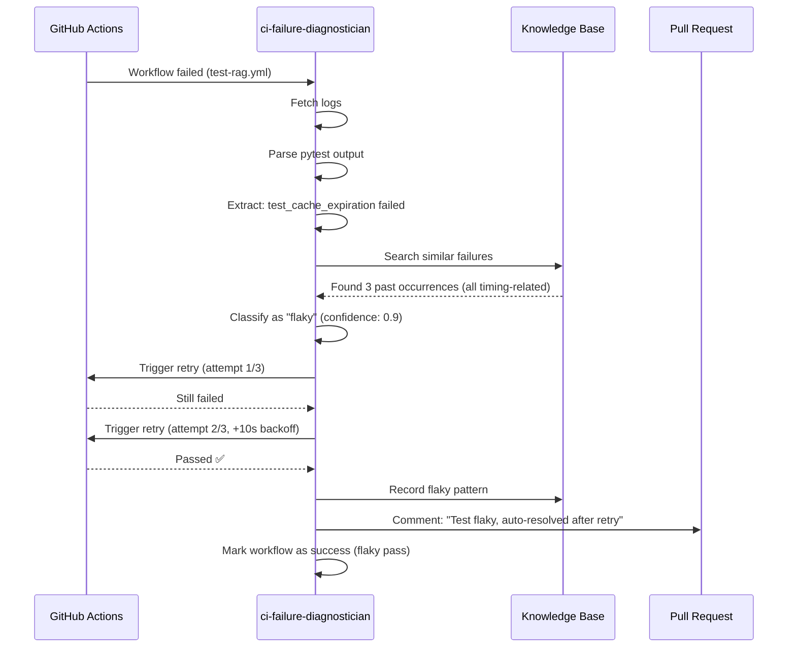

# Custom Agent Planset: ci-failure-diagnostician
> **Agent Type**: CI/CD Debugging & Automation  
> **Version**: 1.0.0  
> **Status**: 📋 PLANNED  
> **Priority**: MEDIUM-HIGH  
> **Estimated Effort**: 3-4 days

---

## 🎯 Agent Mission

**Primary Objective**: Automatically diagnose and categorize CI failures, extract root causes from logs, link to known issues, and suggest fixes or workarounds.

**Problem Statement**: CI failures require manual log analysis, searching for error patterns, and correlating with past issues. This is time-consuming especially for flaky tests, environment issues, or transient failures.

**Success Criteria**:
- Automatically detect and categorize CI failures
- Extract root cause from failure logs
- Link to known issues or past failures
- Suggest fixes based on failure patterns
- Auto-retry flaky tests with exponential backoff
- Reduce mean time to resolution (MTTR) by 70%

---

## 🏗️ Architecture



---

## 🔧 Component Design

### 1. Workflow Monitor
**Input**: GitHub Actions webhooks or polling  
**Output**: Workflow run events

```python
@dataclass
class WorkflowRun:
    id: int
    workflow_name: str
    run_number: int
    status: str  # "queued", "in_progress", "completed"
    conclusion: str  # "success", "failure", "cancelled", "skipped"
    jobs: List[WorkflowJob]
    commit_sha: str
    branch: str
    started_at: datetime
    completed_at: Optional[datetime]
```

**Key Functions**:
```python
def monitor_workflows(repo: str) -> AsyncIterator[WorkflowRun]:
    """Stream workflow run events"""
    
async def fetch_workflow_details(run_id: int) -> WorkflowRun:
    """Get full workflow run details"""
```

---

### 2. Log Parser & Error Extractor
**Input**: Raw log text  
**Output**: Structured errors

```python
@dataclass
class ExtractedError:
    error_type: str  # "AssertionError", "TimeoutError", "NetworkError", etc.
    error_message: str
    stack_trace: List[str]
    line_number: Optional[int]
    file_path: Optional[str]
    context: Dict[str, Any]  # Environment vars, timing, etc.
```

**Parsing Strategies**:

#### Strategy A: pytest Output
```python
def parse_pytest_error(log: str) -> List[ExtractedError]:
    """
    FAILED tests/test_foo.py::test_bar - AssertionError: assert False
    Extract test name, assertion, location
    """
```

#### Strategy B: Rust cargo test
```python
def parse_cargo_test_error(log: str) -> List[ExtractedError]:
    """
    thread 'test_foo' panicked at 'assertion failed: x == y'
    """
```

#### Strategy C: Build Errors
```python
def parse_build_error(log: str) -> List[ExtractedError]:
    """
    error[E0308]: mismatched types
    expected `i32`, found `&str`
    """
```

#### Strategy D: Infrastructure Errors
```python
def parse_infrastructure_error(log: str) -> List[ExtractedError]:
    """
    Error: Unable to resolve action `actions/checkout@v4`
    curl: (28) Connection timed out
    """
```

---

### 3. Failure Classifier
**Input**: ExtractedError, job context  
**Output**: Failure classification

```python
@dataclass
class FailureClassification:
    category: str  # "flaky", "infrastructure", "real_bug", "timeout", "dependency"
    subcategory: str  # More specific
    confidence: float
    patterns_matched: List[str]
    similar_failures: List[str]  # Past issue/PR links
```

**Classification Rules**:

```python
# Flaky Test Patterns
FLAKY_PATTERNS = [
    r"test_cache_expiration.*time\.sleep",  # Timing-dependent
    r"Connection refused.*localhost",  # Port binding race
    r"ResourceWarning.*unclosed",  # Resource cleanup timing
    r"AssertionError.*\d+ == \d+.*sometimes passes"
]

# Infrastructure Patterns
INFRASTRUCTURE_PATTERNS = [
    r"Unable to resolve action",
    r"docker: Error response from daemon",
    r"No space left on device",
    r"Connection timed out.*api\.github\.com"
]

# Dependency Patterns
DEPENDENCY_PATTERNS = [
    r"Could not find a version that satisfies",
    r"error: failed to fetch.*crates\.io",
    r"Package.*has no installation candidate"
]
```

**Key Functions**:
```python
def classify_failure(error: ExtractedError, context: JobContext) -> FailureClassification:
    """Classify failure into category"""
    
def find_similar_failures(error: ExtractedError) -> List[str]:
    """Search past issues/PRs for similar failures"""
    
def calculate_confidence(patterns: List[str], context: JobContext) -> float:
    """Calculate classification confidence"""
```

---

### 4. Category-Specific Handlers

#### Flaky Test Handler
```python
class FlakyTestHandler:
    def __init__(self, max_retries: int = 3, backoff_multiplier: float = 2.0):
        self.max_retries = max_retries
        self.backoff_multiplier = backoff_multiplier
    
    async def handle(self, failure: FailureClassification) -> HandlerResult:
        """
        1. Check flaky test database
        2. Retry with exponential backoff
        3. If passes, mark as flaky and continue
        4. If fails repeatedly, treat as real bug
        """
        if await self.is_known_flaky(failure.test_name):
            return await self.retry_with_backoff(failure)
        else:
            return await self.mark_and_retry(failure)
```

#### Infrastructure Handler
```python
class InfrastructureHandler:
    async def handle(self, failure: FailureClassification) -> HandlerResult:
        """
        1. Check service status (GitHub, Docker Hub, etc.)
        2. Check disk space, memory, CPU
        3. Create incident if infrastructure issue
        4. Suggest workaround or wait-and-retry
        """
        service_status = await self.check_service_status(failure)
        if service_status.degraded:
            return HandlerResult(
                action="create_incident",
                message=f"Service {service_status.service} is degraded"
            )
```

#### Bug Handler
```python
class BugHandler:
    async def handle(self, failure: FailureClassification) -> HandlerResult:
        """
        1. Search for similar past issues
        2. Extract minimal reproduction
        3. Comment on PR with findings
        4. Suggest potential fixes
        """
        similar_issues = await self.find_similar_issues(failure)
        reproduction = self.extract_reproduction(failure)
        
        return HandlerResult(
            action="comment_on_pr",
            message=self.generate_bug_comment(failure, similar_issues, reproduction)
        )
```

---

## 🎮 User Interface

### CLI Interface
```bash
# Diagnose specific workflow run
ci-failure-diagnostician diagnose --run-id 12345

# Monitor all workflows
ci-failure-diagnostician monitor --repo owner/repo

# Analyze flaky tests
ci-failure-diagnostician flaky-report --days 30

# Show failure patterns
ci-failure-diagnostician patterns --category flaky
```

### GitHub Actions Integration
```yaml
name: CI Failure Diagnostician

on:
  workflow_run:
    workflows: ["*"]
    types: [completed]

jobs:
  diagnose:
    if: ${{ github.event.workflow_run.conclusion == 'failure' }}
    runs-on: ubuntu-latest
    steps:
      - name: Diagnose Failure
        uses: ./.github/actions/ci-failure-diagnostician
        with:
          run-id: ${{ github.event.workflow_run.id }}
          auto-retry-flaky: true
          comment-on-pr: true
```

---

## 📋 Implementation Phases

### Phase 1: Monitors & Parsers (Day 1)
- [ ] Workflow monitor (polling/webhooks)
- [ ] Log fetcher
- [ ] Multi-format log parser (pytest, cargo, npm)
- [ ] Error extractor

### Phase 2: Classifier (Day 1-2)
- [ ] Pattern matching engine
- [ ] Failure classification logic
- [ ] Confidence scoring
- [ ] Similar failure search

### Phase 3: Handlers (Day 2-3)
- [ ] Flaky test handler with retry
- [ ] Infrastructure handler
- [ ] Bug handler
- [ ] Timeout/dependency handlers

### Phase 4: Knowledge Base (Day 3)
- [ ] Store past failures
- [ ] Pattern library
- [ ] Success/failure metrics
- [ ] Trending analysis

### Phase 5: Integration & Automation (Day 3-4)
- [ ] GitHub Actions integration
- [ ] PR commenting
- [ ] Auto-retry logic
- [ ] Incident creation

### Phase 6: Reporting & UI (Day 4)
- [ ] Failure dashboard
- [ ] Flaky test report
- [ ] MTTR metrics
- [ ] Alert notifications

---

## 📊 Success Metrics

### Quantitative
- **MTTR Reduction**: 70% faster diagnosis
- **Auto-Resolution Rate**: >60% of flaky tests auto-resolved
- **False Positive Rate**: <10%
- **Classification Accuracy**: >85%

### Qualitative
- **Developer Feedback**: "Don't have to dig through logs anymore"
- **CI Reliability**: "Flaky tests are less disruptive"
- **Visibility**: "Clear insights into failure patterns"

---

## 🧪 Test Strategy

### Unit Tests
```python
def test_parse_pytest_failure():
    log = "FAILED test_foo.py::test_bar - AssertionError"
    errors = parse_pytest_error(log)
    assert len(errors) == 1
    assert errors[0].error_type == "AssertionError"

def test_classify_flaky_test():
    error = ExtractedError(error_message="Connection refused")
    classification = classify_failure(error, mock_context)
    assert classification.category == "flaky"
    assert classification.confidence > 0.7
```

### Integration Tests
```python
async def test_handle_real_flaky_test():
    """Test with actual flaky test from PR #2785"""
    workflow_run = await fetch_workflow("test-rag.yml", run_id=12345)
    diagnosis = await diagnose_failures(workflow_run)
    
    assert diagnosis.category == "flaky"
    assert diagnosis.suggested_action == "retry"
    
    # Simulate retry
    retry_result = await retry_workflow(workflow_run)
    assert retry_result.passed
```

---

## 🔄 Workflow Example

### Scenario: Flaky Cache Test


---

## 🚨 Known Patterns (from PR #2785)

### Pattern 1: HuggingFace Model Download Timeout
```python
{
    "pattern": "huggingface_hub.*ConnectionError",
    "category": "infrastructure",
    "subcategory": "network_timeout",
    "suggested_fix": "Increase timeout or use cached models",
    "confidence": 0.95
}
```

### Pattern 2: Cache Expiration Race
```python
{
    "pattern": "test_cache_expiration.*misses.*expected 2.*got 1",
    "category": "flaky",
    "subcategory": "timing_dependent",
    "suggested_fix": "Increase sleep margin or use mock timers",
    "confidence": 0.9
}
```

### Pattern 3: Rust pyo3 Security Advisory
```python
{
    "pattern": "RUSTSEC-2025-0020.*pyo3",
    "category": "dependency",
    "subcategory": "security_advisory",
    "suggested_fix": "Upgrade pyo3 to >=0.24.1",
    "confidence": 1.0
}
```

---

## ✅ Definition of Done

- [ ] All 6 phases completed
- [ ] >85% classification accuracy on test set
- [ ] Successfully handles all failure types from PR #2785
- [ ] Auto-retry working for flaky tests
- [ ] PR commenting functional
- [ ] Dashboard operational
- [ ] Documentation complete

---

**Agent Status**: 📋 READY FOR IMPLEMENTATION  
**Next Step**: Approve planset and begin Phase 1  
**Priority**: MEDIUM-HIGH  
**Owner**: TBD  
**Reviewers**: mbaetiong, core team

