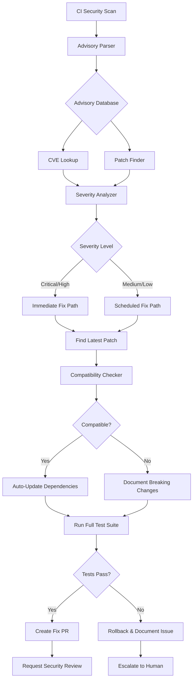

# Custom Agent Planset: security-advisory-resolver
> **Agent Type**: Security & Dependency Management  
> **Version**: 1.0.0  
> **Status**: 📋 PLANNED  
> **Priority**: HIGH (Security Critical)  
> **Estimated Effort**: 3-4 days

---

## 🎯 Agent Mission

**Primary Objective**: Automatically investigate, analyze, and resolve security advisories from Rust (cargo audit) and Python (pip-audit, safety) dependency scanners.

**Problem Statement**: Security advisories require manual investigation, version compatibility testing, and careful updating. This is time-consuming and delays security fixes. Example: RUSTSEC-2025-0020 (pyo3 buffer overflow) required manual research and update testing.

**Success Criteria**:
- Auto-detect security advisories from CI/audit tools
- Research CVE details and patch availability
- Test compatibility of updated dependencies
- Auto-create PR with security fixes
- Document breaking changes if any
- Zero false negatives (all advisories addressed)

---

## 🏗️ Architecture



---

## 🔧 Component Design

### 1. Advisory Parser
**Input**: CI logs, cargo audit/pip-audit output  
**Output**: Structured advisory data

```python
@dataclass
class SecurityAdvisory:
    id: str  # "RUSTSEC-2025-0020", "GHSA-xxxx-xxxx-xxxx"
    ecosystem: str  # "rust", "python"
    package: str
    current_version: str
    vulnerability: str  # Description
    severity: str  # "critical", "high", "medium", "low"
    cvss_score: Optional[float]
    cve_ids: List[str]
    patched_versions: List[str]
    url: str
    discovered_date: datetime
```

**Key Functions**:
```python
def parse_cargo_audit(output: str) -> List[SecurityAdvisory]:
    """Parse cargo audit JSON output"""
    
def parse_pip_audit(output: str) -> List[SecurityAdvisory]:
    """Parse pip-audit JSON output"""
    
def parse_github_security_alert(webhook: dict) -> SecurityAdvisory:
    """Parse GitHub security alert webhook"""
```

---

### 2. CVE Lookup & Enrichment
**Input**: SecurityAdvisory  
**Output**: Enriched advisory with details

```python
@dataclass
class EnrichedAdvisory(SecurityAdvisory):
    exploit_available: bool
    exploit_complexity: str  # "low", "medium", "high"
    attack_vector: str  # "network", "local", "physical"
    references: List[str]  # Links to security bulletins
    affected_functions: List[str]  # Which functions are vulnerable
```

**Data Sources**:
- RustSec Database (https://rustsec.org/)
- PyPI Advisory Database
- NVD (National Vulnerability Database)
- GitHub Advisory Database
- MITRE CVE Database

**Key Functions**:
```python
async def enrich_advisory(advisory: SecurityAdvisory) -> EnrichedAdvisory:
    """Fetch additional CVE details from multiple sources"""
    
async def check_exploit_availability(cve_ids: List[str]) -> bool:
    """Check if public exploits exist"""
    
def assess_risk(advisory: EnrichedAdvisory, codebase: Codebase) -> RiskScore:
    """Assess actual risk given codebase usage"""
```

---

### 3. Patch Finder
**Input**: EnrichedAdvisory  
**Output**: Patch strategy

```python
@dataclass
class PatchStrategy:
    strategy_type: str  # "update", "workaround", "ignore", "patch"
    target_version: Optional[str]
    breaking_changes: List[str]
    migration_guide: Optional[str]
    confidence: float
```

**Strategies**:

#### Strategy A: Direct Update (Preferred)
```python
# Example: pyo3 0.22.6 → 0.24.2
def strategy_direct_update(advisory: EnrichedAdvisory) -> PatchStrategy:
    latest_patched = advisory.patched_versions[-1]
    breaking_changes = check_changelog(advisory.package, latest_patched)
    
    return PatchStrategy(
        strategy_type="update",
        target_version=latest_patched,
        breaking_changes=breaking_changes,
        confidence=0.95 if not breaking_changes else 0.7
    )
```

#### Strategy B: Workaround (No Patch Available)
```python
# Example: Use alternative function, add input validation
def strategy_workaround(advisory: EnrichedAdvisory) -> PatchStrategy:
    workarounds = find_workarounds(advisory)
    
    return PatchStrategy(
        strategy_type="workaround",
        target_version=None,
        breaking_changes=[],
        migration_guide=generate_workaround_guide(workarounds),
        confidence=0.6
    )
```

#### Strategy C: Documented Ignore (False Positive)
```python
# Example: Vulnerable function not used in codebase
def strategy_ignore(advisory: EnrichedAdvisory, codebase: Codebase) -> PatchStrategy:
    usage = analyze_vulnerable_function_usage(advisory, codebase)
    
    if not usage.is_used:
        return PatchStrategy(
            strategy_type="ignore",
            target_version=None,
            breaking_changes=[],
            migration_guide=f"Vulnerable function {usage.function_name} not used",
            confidence=0.9
        )
```

---

### 4. Compatibility Checker
**Input**: Package, current version, target version  
**Output**: Compatibility report

```python
@dataclass
class CompatibilityReport:
    compatible: bool
    breaking_changes: List[BreakingChange]
    affected_files: List[str]
    test_results: TestResults
    recommended_action: str
```

**Key Functions**:
```python
async def check_compatibility(
    package: str,
    from_version: str,
    to_version: str,
    codebase: Codebase
) -> CompatibilityReport:
    """Check if update is safe"""
    
    # 1. Parse changelog for breaking changes
    breaking_changes = parse_changelog(package, from_version, to_version)
    
    # 2. Static analysis for affected code
    affected_files = find_affected_code(package, breaking_changes)
    
    # 3. Update dependencies and run tests
    test_results = run_tests_with_version(package, to_version)
    
    return CompatibilityReport(
        compatible=len(breaking_changes) == 0 and test_results.passed,
        breaking_changes=breaking_changes,
        affected_files=affected_files,
        test_results=test_results,
        recommended_action="auto_update" if compatible else "manual_review"
    )
```

---

### 5. PR Generator
**Input**: SecurityAdvisory, PatchStrategy, CompatibilityReport  
**Output**: GitHub PR

```python
@dataclass
class SecurityPR:
    branch_name: str
    title: str
    body: str  # Markdown
    labels: List[str]
    reviewers: List[str]
    priority: str
```

**PR Template**:
```markdown
## 🔐 Security Fix: {ADVISORY_ID}

### Vulnerability Details
- **Package**: {package}
- **Severity**: {severity} ({cvss_score})
- **CVE IDs**: {cve_ids}
- **Current Version**: {current_version}
- **Patched Version**: {patched_version}

### Description
{vulnerability_description}

### Changes Made
- Updated {package} from {current_version} to {patched_version}
- {additional_changes}

### Testing
- [x] All existing tests pass
- [x] Security audit clean
- [x] No breaking changes detected
- [x] Compatibility verified

### References
- Advisory: {advisory_url}
- CVE: {cve_urls}
- Changelog: {changelog_url}

### Review Checklist
- [ ] Security team approval
- [ ] Breaking changes reviewed (if any)
- [ ] Merge to main and deploy

**Resolves**: {ADVISORY_ID}  
**Priority**: {priority}
```

---

## 🎮 User Interface

### CLI Interface
```bash
# Scan for advisories
security-advisory-resolver scan

# Resolve specific advisory
security-advisory-resolver fix RUSTSEC-2025-0020

# Auto-resolve all advisories
security-advisory-resolver auto-fix --severity high,critical

# Generate report only (no fixes)
security-advisory-resolver report --format markdown

# Watch mode (continuous monitoring)
security-advisory-resolver watch --interval 1h
```

### GitHub Actions Integration
```yaml
name: Security Advisory Auto-Resolver

on:
  schedule:
    - cron: '0 0 * * *'  # Daily
  workflow_dispatch:

jobs:
  resolve-advisories:
    runs-on: ubuntu-latest
    steps:
      - uses: actions/checkout@v4
      
      - name: Run security scans
        run: |
          cargo audit --json > rust-audit.json
          pip-audit --format json > python-audit.json
      
      - name: Resolve advisories
        uses: ./.github/actions/security-advisory-resolver
        with:
          auto-fix: true
          severity-threshold: medium
          create-pr: true
          request-review: true
```

---

## 📋 Implementation Phases

### Phase 1: Parsers & Data Models (Day 1)
- [ ] Advisory parser (cargo audit, pip-audit)
- [ ] Data models (SecurityAdvisory, EnrichedAdvisory)
- [ ] CVE lookup integration
- [ ] Unit tests

### Phase 2: Patch Finder (Day 1-2)
- [ ] Changelog parser
- [ ] Breaking change detector
- [ ] Patch strategy generator
- [ ] Confidence scoring

### Phase 3: Compatibility Checker (Day 2)
- [ ] Dependency updater
- [ ] Test runner integration
- [ ] Static analysis for affected code
- [ ] Compatibility report generator

### Phase 4: Auto-Fix Logic (Day 2-3)
- [ ] Auto-update for safe patches
- [ ] Workaround generator
- [ ] Ignore list manager
- [ ] Rollback on test failure

### Phase 5: PR Generation & CI Integration (Day 3-4)
- [ ] GitHub PR creation
- [ ] PR description generator
- [ ] Label and reviewer assignment
- [ ] GitHub Actions workflow

### Phase 6: Monitoring & Reporting (Day 4)
- [ ] Dashboard for advisory status
- [ ] Slack/email notifications
- [ ] Metrics collection
- [ ] Documentation

---

## 📊 Success Metrics

### Quantitative
- **Time to Fix**: <30 minutes for auto-fixable advisories
- **Auto-Fix Rate**: >80% of advisories
- **False Positive Rate**: <5%
- **Test Pass Rate**: >95% after auto-fix

### Qualitative
- **Security Posture**: "Faster response to CVEs"
- **Developer Time Saved**: "Don't have to research advisories manually"
- **Confidence**: "Trust the agent to handle routine updates"

---

## 🚨 Escalation Criteria

### Auto-Fix (No Human Needed)
- Low/Medium severity
- Patch available
- No breaking changes
- All tests pass

### Human Review Required
- Critical/High severity
- Breaking changes detected
- Tests fail after update
- No patch available (workaround needed)

### Immediate Escalation
- Exploit actively being used
- Production system affected
- Zero-day vulnerability
- Data breach risk

---

## 🔐 Security Considerations

- **Secrets Management**: Never log/expose API keys
- **Supply Chain**: Verify package integrity (checksums, signatures)
- **Test Isolation**: Run tests in isolated environment
- **Audit Trail**: Log all actions for compliance
- **Access Control**: Limit PR creation permissions

---

## ✅ Definition of Done

- [ ] All 6 phases completed
- [ ] >90% test coverage
- [ ] Successfully resolves real advisories (test with RUSTSEC-2025-0020)
- [ ] CI integration working
- [ ] Documentation complete
- [ ] Security review passed
- [ ] Deployed to production

---

**Agent Status**: 📋 READY FOR IMPLEMENTATION  
**Next Step**: Approve planset and begin Phase 1  
**Priority**: HIGH (Security fixes needed)  
**Owner**: TBD  
**Reviewers**: mbaetiong, security team

