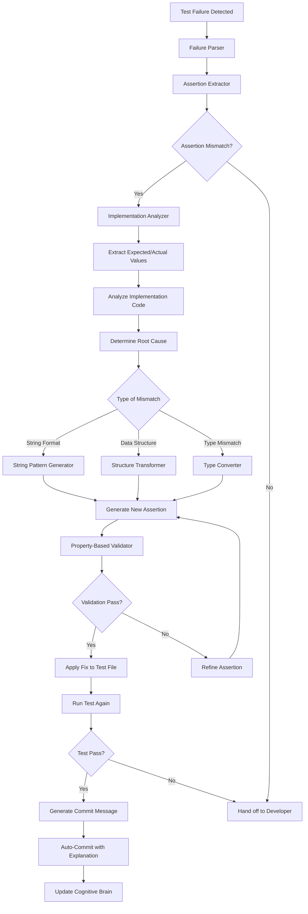
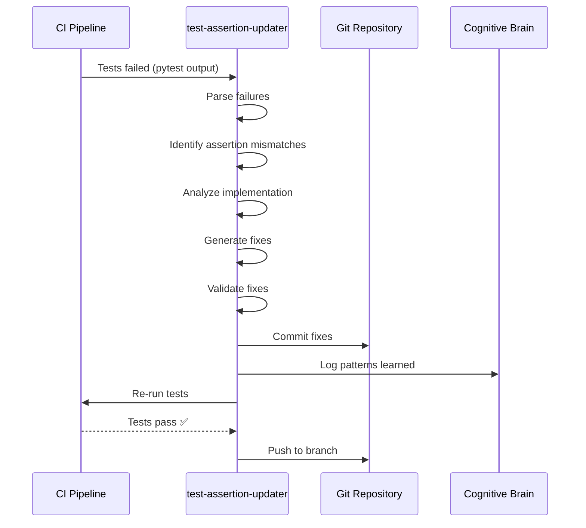
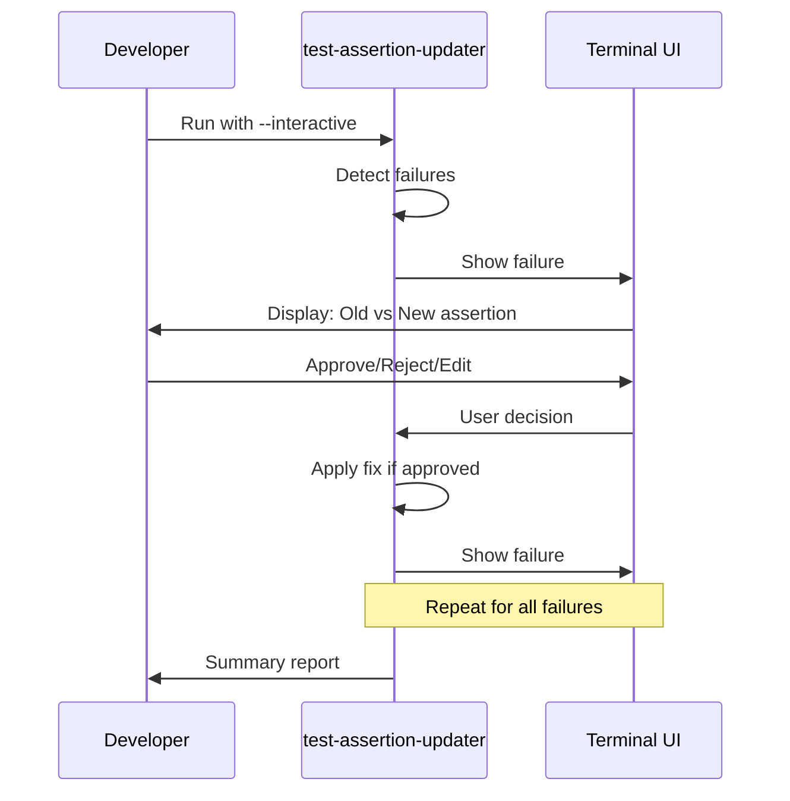

# Custom Agent Planset: test-assertion-updater
> **Agent Type**: Test Automation & Maintenance  
> **Version**: 1.0.0  
> **Status**: 📋 PLANNED  
> **Priority**: HIGH  
> **Estimated Effort**: 3-5 days

---

## 🎯 Agent Mission

**Primary Objective**: Automatically detect and fix test assertion mismatches when implementation evolves while preserving test intent and coverage.

**Problem Statement**: When code implementations evolve (better error messages, structured return values, etc.), tests often fail not because of bugs, but because assertions expect outdated formats. Currently, developers must manually identify and update these assertions, which is time-consuming and error-prone.

**Success Criteria**:
- Automatically identify assertion mismatches from test failures
- Generate corrected assertions that align with current implementation
- Preserve original test intent (what is being tested)
- Maintain or improve test coverage
- Provide clear explanations for each change

---

## 📊 Scope & Boundaries

### In Scope
- ✅ Parse pytest failure output
- ✅ Extract expected vs actual values from assertion errors
- ✅ Analyze implementation code to understand intent
- ✅ Generate updated assertions
- ✅ Validate fixes with property-based testing where applicable
- ✅ Auto-commit fixes with detailed commit messages
- ✅ Support Python unittest and pytest frameworks

### Out of Scope
- ❌ Fixing actual implementation bugs
- ❌ Adding new test cases
- ❌ Refactoring test structure
- ❌ Non-assertion test failures (imports, syntax errors, etc.)
- ❌ Integration test failures requiring external dependencies

### Dependencies
- pytest (test runner)
- ast (Python AST parsing)
- libcst (for code transformation)
- hypothesis (for property-based validation)
- git (for committing fixes)

---

## 🏗️ Architecture



---

## 🔧 Component Design

### 1. Failure Parser
**Input**: pytest output (stdout/stderr)  
**Output**: Structured failure data

```python
@dataclass
class TestFailure:
    test_name: str
    file_path: str
    line_number: int
    failure_type: str  # "AssertionError", "TypeError", etc.
    error_message: str
    expected_value: Optional[Any]
    actual_value: Optional[Any]
    context: Dict[str, Any]  # Variable values at failure point
```

**Key Functions**:
- `parse_pytest_output(output: str) -> List[TestFailure]`
- `extract_assertion_details(error_msg: str) -> Tuple[Any, Any]`
- `classify_failure_type(failure: TestFailure) -> FailureCategory`

---

### 2. Assertion Extractor
**Input**: TestFailure, test file content  
**Output**: AssertionNode (AST representation)

```python
@dataclass
class AssertionNode:
    line_number: int
    assertion_type: str  # "assert_in", "assert_equal", "assert_true", etc.
    left_operand: ast.expr
    operator: str
    right_operand: Optional[ast.expr]
    context: str  # Surrounding code for better understanding
```

**Key Functions**:
- `extract_assertion_ast(file_path: str, line: int) -> AssertionNode`
- `get_assertion_context(node: AssertionNode, window: int = 5) -> str`

---

### 3. Implementation Analyzer
**Input**: Test file, assertion location  
**Output**: Implementation insights

```python
@dataclass
class ImplementationInsight:
    function_name: str
    return_type: type
    return_structure: str  # "dict", "list", "string", "object"
    sample_return_value: Any
    changed_recently: bool  # git history check
    confidence: float
```

**Key Functions**:
- `find_tested_function(test_node: ast.FunctionDef) -> str`
- `analyze_return_value(func_name: str) -> ImplementationInsight`
- `extract_sample_data(insight: ImplementationInsight) -> Any`

---

### 4. Assertion Generator
**Input**: TestFailure, ImplementationInsight  
**Output**: New assertion code

**Strategies**:

#### Strategy A: String Format Mismatch
```python
# BEFORE:
assert "Failed to delete" in result.message

# DETECTED: Implementation returns "No indices deleted for tenant 'X'"
# GENERATED:
assert "No indices deleted" in result.message
```

#### Strategy B: Dict vs String
```python
# BEFORE:
assert "docs" in list_result.details["indices"]

# DETECTED: Implementation returns [{"name": "docs", "created_at": "..."}]
# GENERATED:
indices_list = list_result.details["indices"]
index_names = [idx["name"] if isinstance(idx, dict) else idx for idx in indices_list]
assert "docs" in index_names
```

#### Strategy C: Type Conversion
```python
# BEFORE:
assert result.count == 5

# DETECTED: Implementation returns string "5"
# GENERATED:
assert int(result.count) == 5
# OR better: Fix implementation to return int
```

**Key Functions**:
- `generate_assertion(failure: TestFailure, insight: ImplementationInsight) -> str`
- `choose_strategy(failure_type: str) -> AssertionStrategy`
- `apply_transformation(old_assertion: str, strategy: AssertionStrategy) -> str`

---

### 5. Property-Based Validator
**Input**: New assertion, test context  
**Output**: Validation result

**Purpose**: Ensure new assertion still tests what original intended

```python
@dataclass
class ValidationResult:
    passed: bool
    coverage_maintained: bool
    intent_preserved: bool
    edge_cases_covered: bool
    issues: List[str]
```

**Validation Checks**:
1. **Intent Preservation**: Does new assertion test the same behavior?
2. **Coverage**: Does it cover same code paths?
3. **Edge Cases**: Does it handle edge cases original handled?
4. **False Positives**: Could it pass when it shouldn't?

**Key Functions**:
- `validate_with_hypothesis(old_assertion: str, new_assertion: str) -> ValidationResult`
- `compare_test_intent(old: AssertionNode, new: AssertionNode) -> bool`
- `measure_coverage_delta(test_name: str) -> float`

---

## 🎮 User Interface

### CLI Interface
```bash
# Auto-fix all assertion failures
test-assertion-updater --auto-fix

# Interactive mode (review each fix)
test-assertion-updater --interactive

# Dry-run (show what would be fixed)
test-assertion-updater --dry-run

# Fix specific test file
test-assertion-updater tests/test_rag_tenant_management.py

# Fix specific test
test-assertion-updater tests/test_rag.py::test_list_operation
```

### GitHub Copilot Agent Interface
```python
# Invoked automatically when test failures detected
{
    "agent": "test-assertion-updater",
    "trigger": "ci_failure",
    "test_failures": ["test_rag_tenant_management.py::test_list_operation"],
    "mode": "auto",  # or "interactive", "suggest"
    "commit_changes": true
}
```

---

## 🔄 Workflow

### Workflow 1: Automatic Fix (CI Integration)


### Workflow 2: Interactive Mode


---

## 🧪 Test Strategy

### Unit Tests
```python
def test_parse_pytest_output():
    """Test parsing of pytest failure output"""
    output = """
    FAILED tests/test_example.py::test_foo - AssertionError: assert 'old' in 'new message'
    """
    failures = parse_pytest_output(output)
    assert len(failures) == 1
    assert failures[0].expected_value == "old"
    assert failures[0].actual_value == "new message"

def test_generate_string_mismatch_fix():
    """Test generating fix for string format mismatch"""
    failure = TestFailure(
        expected_value="Failed to merge",
        actual_value="No valid indices found to merge"
    )
    new_assertion = generate_assertion(failure, mock_insight)
    assert 'assert "No valid indices found" in result.message' in new_assertion

def test_preserve_test_intent():
    """Test that generated assertion preserves original intent"""
    old = 'assert "docs" in list_result.details["indices"]'
    new = generate_dict_extraction_fix(old)
    assert validates_same_condition(old, new)
```

### Integration Tests
```python
def test_end_to_end_fix():
    """Test complete workflow from failure to fix"""
    # Create test with intentional mismatch
    test_code = '''
    def test_example():
        result = get_result()
        assert "old message" in result.message
    '''
    
    # Run agent
    agent = TestAssertionUpdater()
    fixes = agent.process_failures(run_tests(test_code))
    
    # Verify fix applied
    assert len(fixes) == 1
    assert "new message" in fixes[0].new_code
    
    # Verify test now passes
    assert run_tests(fixes[0].updated_test_file).passed

def test_false_positive_prevention():
    """Test that agent doesn't fix actual bugs"""
    test_code = '''
    def test_critical_check():
        # This is testing actual bug, not assertion mismatch
        assert validate_security(user_input) == True
    '''
    agent = TestAssertionUpdater()
    fixes = agent.process_failures(run_tests(test_code))
    assert len(fixes) == 0  # Should not "fix" this
```

### Property-Based Tests
```python
from hypothesis import given, strategies as st

@given(st.text(), st.text())
def test_assertion_always_deterministic(old_msg, new_msg):
    """Property: Same input always produces same output"""
    failure1 = create_failure(old_msg, new_msg)
    failure2 = create_failure(old_msg, new_msg)
    
    fix1 = generate_assertion(failure1)
    fix2 = generate_assertion(failure2)
    
    assert fix1 == fix2

@given(st.lists(st.dictionaries(st.text(), st.text())))
def test_dict_extraction_handles_all_structures(data):
    """Property: Dict extraction works for any dict structure"""
    assertion = generate_dict_assertion(data)
    # Should not raise exception
    exec(f"result = {data}\n{assertion}")
```

---

## 📋 Implementation Phases

### Phase 1: Core Parser (Week 1)
- [ ] Implement pytest output parser
- [ ] Build assertion extractor (AST-based)
- [ ] Create failure classification system
- [ ] Unit tests for parser components

**Deliverables**:
- `parser.py` module
- Test suite (20+ tests)
- Documentation

### Phase 2: Implementation Analyzer (Week 1-2)
- [ ] Build function-under-test detector
- [ ] Implement return value analyzer
- [ ] Add git history integration
- [ ] Create sample data extractor

**Deliverables**:
- `analyzer.py` module
- Integration with AST and git
- Test suite (15+ tests)

### Phase 3: Assertion Generator (Week 2)
- [ ] Implement string format strategy
- [ ] Implement dict/structure strategy
- [ ] Implement type conversion strategy
- [ ] Build strategy selector

**Deliverables**:
- `generator.py` module
- Strategy pattern implementation
- Test suite (25+ tests)

### Phase 4: Validator (Week 2-3)
- [ ] Build property-based validator
- [ ] Implement intent checker
- [ ] Add coverage analyzer
- [ ] Create edge case detector

**Deliverables**:
- `validator.py` module
- Hypothesis integration
- Test suite (20+ tests)

### Phase 5: Integration & CLI (Week 3)
- [ ] Build CLI interface
- [ ] Add interactive mode
- [ ] Implement auto-commit logic
- [ ] Create summary reporter

**Deliverables**:
- `cli.py` module
- User documentation
- End-to-end tests

### Phase 6: CI Integration (Week 3-4)
- [ ] GitHub Actions workflow integration
- [ ] Auto-trigger on test failures
- [ ] Branch creation for fixes
- [ ] PR auto-creation

**Deliverables**:
- `.github/workflows/auto-fix-assertions.yml`
- Integration tests
- Runbook

### Phase 7: Polish & Deploy (Week 4-5)
- [ ] Performance optimization
- [ ] Error handling improvements
- [ ] Cognitive brain integration
- [ ] Production deployment

**Deliverables**:
- Optimized agent
- Production configuration
- Monitoring setup

---

## 🎓 Training Data & Patterns

### Pattern Library

#### Pattern 1: String Message Evolution
```python
# Signature: Old generic message → New specific message
OLD: assert "Failed to X" in result.message
NEW: assert "Specific reason for X failure" in result.message

# Examples:
"Failed to delete" → "No indices deleted for tenant 'X'"
"Failed to merge" → "No valid indices found to merge"
"Error occurred" → "Connection timeout after 30s"
```

#### Pattern 2: Dict Return Evolution
```python
# Signature: String list → Dict list with metadata
OLD: assert "item" in result.items
NEW: assert "item" in [x["name"] for x in result.items]

# Template:
items = result.{field}
names = [x["name"] if isinstance(x, dict) else x for x in items]
assert "{value}" in names
```

#### Pattern 3: Type Refinement
```python
# Signature: Loose type → Strict type
OLD: assert result.count > 0
NEW: assert isinstance(result.count, int) and result.count > 0

# Or: Fix implementation to return correct type
```

### Learning from PR #2785
```json
{
    "pattern_id": "dict_extraction_001",
    "source": "PR #2785, commit 4ff8eb1f",
    "before": "assert \"docs\" in list_result.details[\"indices\"]",
    "after": "index_names = [idx[\"name\"] if isinstance(idx, dict) else idx for idx in indices_list]\\nassert \"docs\" in index_names",
    "reason": "Implementation evolved to return dicts with metadata",
    "frequency": "high",
    "confidence": 0.95
}
```

---

## 📊 Success Metrics

### Quantitative
- **Fix Accuracy**: >90% of generated assertions pass validation
- **Coverage Preservation**: 100% (no coverage regression)
- **False Positives**: <5% (fixes that break intent)
- **Time Savings**: 80% reduction in manual assertion updates
- **Auto-commit Rate**: >85% (rest need human review)

### Qualitative
- **Developer Satisfaction**: "Saves significant time"
- **Code Quality**: "Assertions are clearer after fixes"
- **Cognitive Brain Growth**: Patterns learned and reused

---

## 🚨 Error Handling

### Scenarios

#### Scenario 1: Ambiguous Assertion
**Problem**: Can't determine what original assertion intended  
**Action**: Flag for human review with context  
**Example**: `assert x` (what does x mean?)

#### Scenario 2: Complex Logic
**Problem**: Assertion involves complex boolean logic  
**Action**: Suggest refactoring, don't auto-fix  
**Example**: `assert (a and b) or (c and not d)`

#### Scenario 3: Implementation Bug Suspected
**Problem**: Fix would make bad test pass  
**Action**: Flag as potential implementation bug  
**Example**: Security check that should fail but doesn't

---

## 🔐 Security Considerations

### Input Validation
- Sanitize test file paths (prevent directory traversal)
- Validate AST nodes before transformation
- Sandbox code execution during analysis

### Code Injection Prevention
- Never `eval()` or `exec()` user-provided code
- Use AST transformation only
- Validate generated code syntax

### Audit Trail
- Log all assertion changes
- Include before/after in commits
- Track auto-fix vs human-approved

---

## 📚 Documentation Plan

### User Documentation
- [ ] README with quick start
- [ ] CLI reference guide
- [ ] Configuration options
- [ ] Troubleshooting guide
- [ ] Examples and recipes

### Developer Documentation
- [ ] Architecture overview
- [ ] API reference
- [ ] Extension guide
- [ ] Contributing guidelines
- [ ] Testing guide

### Integration Documentation
- [ ] GitHub Actions setup
- [ ] CI/CD pipeline integration
- [ ] Webhook configuration
- [ ] Monitoring setup

---

## 🔮 Future Enhancements

### v1.1: Multi-Language Support
- Add JavaScript/TypeScript support (Jest)
- Add Rust support (cargo test)
- Add Go support (go test)

### v1.2: AI-Powered Analysis
- Use LLM to understand test intent
- Generate explanations for fixes
- Suggest better assertion strategies

### v1.3: Proactive Suggestions
- Analyze implementation changes before tests fail
- Suggest assertion updates in PR reviews
- Detect brittle assertions

### v1.4: Test Quality Metrics
- Score assertion quality
- Identify weak tests
- Suggest improvements

---

## ✅ Definition of Done

- [ ] All 7 phases completed
- [ ] >90% test coverage
- [ ] All security checks pass
- [ ] Documentation complete
- [ ] CI integration working
- [ ] Cognitive brain integration active
- [ ] Production deployment successful
- [ ] Monitoring and alerting configured
- [ ] Team trained on usage
- [ ] Success metrics being tracked

---

**Agent Status**: 📋 READY FOR IMPLEMENTATION  
**Next Step**: Approve planset and begin Phase 1  
**Owner**: TBD  
**Reviewers**: mbaetiong, core team

