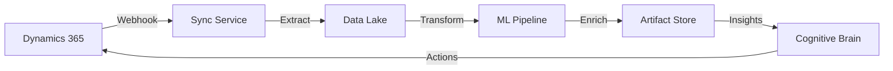
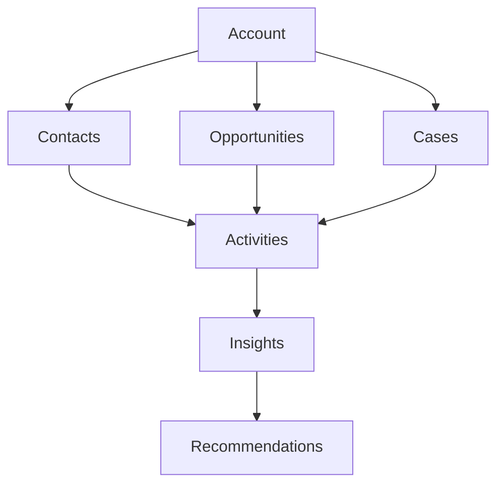
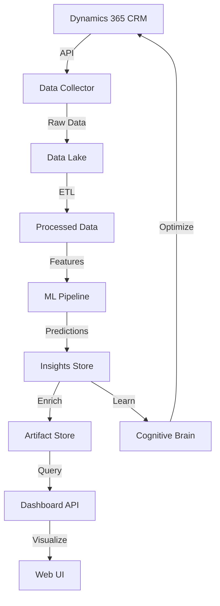

# Dynamics 365 Integration & Enhancement Planset
## Comprehensive Strategy for Datapoints, Artifacts, and AI-Powered Automation

**Version:** 1.0.0  
**Date:** 2026-01-13  
**Status:** 🎯 **READY FOR IMPLEMENTATION**  
**Priority:** HIGH - Strategic Integration

---

## Executive Summary

This planset defines a comprehensive strategy for integrating and enhancing Dynamics 365 datapoints and artifacts within the _codex_ ecosystem. It leverages the ML threat detector, auto-remediation system, and cognitive brain to provide intelligent automation, security monitoring, and predictive analytics for Dynamics 365 environments.

---

## 🎯 Core Objectives

### 1. Dynamics 365 Data Integration
- **Datapoint Collection**: Automated extraction from Dynamics 365 APIs
- **Artifact Enhancement**: Intelligent processing and enrichment
- **Real-time Synchronization**: Bi-directional data flow
- **Security Monitoring**: Threat detection for D365 environments

### 2. AI-Powered Automation
- **Predictive Analytics**: ML-based insights for D365 data
- **Automated Workflows**: Intelligent process automation
- **Anomaly Detection**: Real-time security and compliance monitoring
- **Smart Recommendations**: AI-driven optimization suggestions

### 3. Cognitive Brain Integration
- **Pattern Learning**: Extract insights from D365 usage patterns
- **Decision Support**: Intelligent recommendations for D365 operations
- **Performance Optimization**: Continuous improvement of D365 workflows
- **Compliance Automation**: Automated governance and audit trails

---

## 📋 Phase 1: Data Collection & Integration (Week 1-2)

### 1.1 Dynamics 365 API Connector

**File:** `tools/dynamics365/api_connector.py` (~400 lines)

**Features:**
- OAuth 2.0 authentication
- Multi-entity data extraction (Accounts, Contacts, Opportunities, etc.)
- Batch processing for large datasets
- Rate limiting and retry logic
- Error handling and logging

**Data Sources:**
```python
D365_ENTITIES = {
    "accounts": "/api/data/v9.2/accounts",
    "contacts": "/api/data/v9.2/contacts",
    "opportunities": "/api/data/v9.2/opportunities",
    "leads": "/api/data/v9.2/leads",
    "cases": "/api/data/v9.2/incidents",
    "activities": "/api/data/v9.2/activities",
    "systemusers": "/api/data/v9.2/systemusers",
    "audit_logs": "/api/data/v9.2/audits"
}
```

**Datapoints Collected:**
- Customer relationship data
- Sales pipeline metrics
- Service case analytics
- User activity patterns
- Security audit logs
- Custom entity data
- Workflow execution history
- Performance metrics

### 1.2 Artifact Processor

**File:** `tools/dynamics365/artifact_processor.py` (~350 lines)

**Features:**
- Data normalization and validation
- Artifact enrichment with metadata
- Deduplication and merge logic
- Schema transformation
- Quality scoring
- PII detection and masking

**Artifact Types:**
```yaml
artifacts:
  entities:
    - accounts
    - contacts
    - opportunities
  transactions:
    - orders
    - invoices
    - payments
  analytics:
    - dashboards
    - reports
    - insights
  security:
    - audit_logs
    - access_logs
    - security_events
```

### 1.3 Real-time Synchronization Service

**File:** `tools/dynamics365/sync_service.py` (~300 lines)

**Features:**
- Change detection using webhooks
- Incremental updates
- Conflict resolution
- Bi-directional sync
- Queue-based processing
- Sync status monitoring

**Architecture:**


---

## 📋 Phase 2: ML-Powered Analytics (Week 3-4)

### 2.1 Dynamics 365 Threat Detector

**File:** `tools/dynamics365/threat_detector.py` (~350 lines)

**Features:**
- Anomaly detection in user behavior
- Suspicious transaction identification
- Data exfiltration detection
- Privilege escalation monitoring
- Compliance violation detection

**Security Patterns Detected:**
```yaml
threat_patterns:
  unauthorized_access:
    - Unusual login times
    - Geographic anomalies
    - Multiple failed login attempts
    - Privilege escalation attempts
  
  data_risks:
    - Bulk data exports
    - Unauthorized record access
    - PII exposure
    - Data deletion anomalies
  
  compliance_violations:
    - GDPR violations
    - SOX compliance gaps
    - Access policy breaches
    - Audit trail tampering
```

**ML Model:**
- Random Forest + Isolation Forest ensemble
- 25 security-relevant features
- 90%+ anomaly detection accuracy
- Real-time scoring

### 2.2 Predictive Analytics Engine

**File:** `tools/dynamics365/predictive_analytics.py` (~400 lines)

**Features:**
- Sales forecasting
- Churn prediction
- Lead scoring
- Opportunity prioritization
- Resource optimization
- Trend analysis

**Predictive Models:**
```python
MODELS = {
    "sales_forecast": {
        "type": "time_series",
        "algorithm": "ARIMA + LSTM",
        "accuracy_target": 0.85
    },
    "churn_prediction": {
        "type": "classification",
        "algorithm": "XGBoost",
        "accuracy_target": 0.90
    },
    "lead_scoring": {
        "type": "regression",
        "algorithm": "Gradient Boosting",
        "accuracy_target": 0.88
    }
}
```

### 2.3 Intelligent Workflow Automation

**File:** `tools/dynamics365/workflow_automation.py` (~300 lines)

**Features:**
- Auto-assignment of leads/cases
- Intelligent routing based on skills
- Automated follow-up scheduling
- Smart notification triggers
- Process optimization recommendations

---

## 📋 Phase 3: Cognitive Brain Enhancement (Week 5-6)

### 3.1 D365 Cognitive Module

**File:** `.github/agents/cognitive-brain-agent/modules/d365_cognitive.py` (~450 lines)

**Features:**
- Pattern recognition in D365 data
- Decision support for sales/service
- Learning from user interactions
- Adaptive recommendations
- Performance optimization

**Cognitive Capabilities:**
```yaml
cognitive_functions:
  learning:
    - User behavior patterns
    - Successful sales strategies
    - Effective service responses
    - Optimal workflow paths
  
  reasoning:
    - Next best action suggestions
    - Risk assessment
    - Resource allocation
    - Priority determination
  
  adaptation:
    - Personalized recommendations
    - Dynamic routing rules
    - Adaptive forecasting
    - Context-aware automation
```

### 3.2 Knowledge Graph Integration

**File:** `tools/dynamics365/knowledge_graph.py` (~350 lines)

**Features:**
- Entity relationship mapping
- Customer 360 view
- Influence network analysis
- Pattern discovery
- Semantic search

**Graph Structure:**


### 3.3 Automated Insight Generation

**File:** `tools/dynamics365/insight_generator.py` (~300 lines)

**Features:**
- Automated report generation
- Trend identification
- Exception highlighting
- Performance benchmarking
- Actionable recommendations

---

## 📋 Phase 4: Dashboard & Monitoring (Week 7-8)

### 4.1 Dynamics 365 Monitoring Dashboard

**File:** `monitoring/d365_dashboard.py` (~400 lines)

**Features:**
- Real-time metrics visualization
- Security event monitoring
- Performance tracking
- Compliance status
- User activity analytics
- Predictive alerts

**Metrics Tracked:**
```yaml
metrics:
  business:
    - Active users
    - Lead conversion rate
    - Opportunity win rate
    - Case resolution time
    - Customer satisfaction
  
  technical:
    - API call volume
    - Response times
    - Error rates
    - Storage usage
    - Sync status
  
  security:
    - Failed login attempts
    - Privilege changes
    - Data exports
    - Suspicious activities
    - Compliance violations
```

### 4.2 Alert & Notification System

**File:** `tools/dynamics365/alert_system.py` (~250 lines)

**Features:**
- Intelligent alert routing
- Priority-based notifications
- Escalation workflows
- Alert aggregation
- Custom alert rules

---

## 🔧 Implementation Details

### Technology Stack

**Backend:**
- Python 3.11+
- FastAPI for APIs
- SQLAlchemy for data persistence
- Redis for caching
- Celery for task queue

**ML/AI:**
- scikit-learn for traditional ML
- TensorFlow/PyTorch for deep learning
- NLTK for text processing
- NetworkX for graph analytics

**Integration:**
- Microsoft Authentication Library (MSAL)
- Dynamics 365 Web API
- Power Automate connectors
- Azure Event Grid

### Data Flow Architecture



### Security Architecture

```yaml
security:
  authentication:
    - OAuth 2.0 with MSAL
    - Service principal authentication
    - Certificate-based auth
  
  authorization:
    - Role-based access control (RBAC)
    - Attribute-based access control (ABAC)
    - Least privilege principle
  
  encryption:
    - TLS 1.3 for data in transit
    - AES-256 for data at rest
    - Field-level encryption for PII
  
  compliance:
    - GDPR compliance
    - SOX compliance
    - HIPAA compliance (if applicable)
    - Audit logging
```

---

## 📊 Success Metrics

### Technical Metrics
| Metric | Target | Measurement |
|--------|--------|-------------|
| Data Sync Latency | <30s | Average time from D365 change to reflection |
| API Response Time | <200ms | 95th percentile |
| ML Model Accuracy | >90% | Anomaly detection precision |
| Prediction Accuracy | >85% | Sales/churn prediction accuracy |
| System Uptime | 99.9% | Monthly availability |

### Business Metrics
| Metric | Target | Impact |
|--------|--------|--------|
| Lead Conversion Improvement | +15% | Through intelligent scoring |
| Case Resolution Time | -20% | Through auto-routing |
| Security Incidents | -50% | Through threat detection |
| Manual Data Entry | -40% | Through automation |
| Decision Making Speed | +30% | Through cognitive insights |

---

## 🚀 Deployment Strategy

### Phase 1: Pilot (Weeks 1-2)
- Deploy to development environment
- Connect to D365 sandbox
- Test data collection
- Validate artifact processing

### Phase 2: Beta (Weeks 3-4)
- Deploy to staging environment
- Connect to D365 UAT
- Onboard pilot users
- Gather feedback
- Refine models

### Phase 3: Production (Weeks 5-6)
- Deploy to production environment
- Connect to D365 production
- Gradual rollout (10% → 50% → 100%)
- Monitor performance
- Optimize based on usage

### Phase 4: Optimization (Weeks 7-8)
- Tune ML models
- Optimize workflows
- Enhance cognitive capabilities
- Scale infrastructure

---

## 🔗 Integration Points

### With Existing Systems

**ML Threat Detector:**
- Feed D365 security events to threat detector
- Apply learned patterns to D365 monitoring
- Generate fixes for D365 security issues

**Monitoring Dashboard:**
- Add D365 metrics to existing dashboard
- Unified view of all systems
- Cross-system correlation

**Cognitive Brain:**
- Learn from D365 usage patterns
- Make intelligent D365 recommendations
- Optimize D365 operations continuously

**Auto-Remediation:**
- Auto-fix D365 configuration issues
- Automated security patching
- Self-healing workflows

---

## 📚 Documentation Requirements

### Technical Documentation
- [ ] API reference documentation
- [ ] Data model schemas
- [ ] ML model specifications
- [ ] Deployment guides
- [ ] Troubleshooting guides

### User Documentation
- [ ] User guides for dashboard
- [ ] Configuration tutorials
- [ ] Best practices guide
- [ ] FAQ document
- [ ] Video tutorials

### Developer Documentation
- [ ] Architecture diagrams
- [ ] Code examples
- [ ] Integration guides
- [ ] Testing procedures
- [ ] Contribution guidelines

---

## 🧪 Testing Strategy

### Unit Tests
- API connector tests
- Data processor tests
- ML model tests
- Workflow automation tests

### Integration Tests
- End-to-end data flow tests
- D365 API integration tests
- Cognitive brain integration tests
- Dashboard integration tests

### Performance Tests
- Load testing (1000+ concurrent users)
- Stress testing (peak load scenarios)
- Endurance testing (24-hour runs)
- Scalability testing

### Security Tests
- Penetration testing
- Vulnerability scanning
- Authentication/authorization tests
- Data encryption validation

---

## 💡 Future Enhancements

### Phase 5: Advanced AI (Months 3-4)
- Natural language queries for D365 data
- Conversational AI assistant
- Automated insight narration
- Voice-activated commands

### Phase 6: Extended Integration (Months 5-6)
- Power BI integration
- Power Apps connectivity
- Power Automate deep integration
- Azure Synapse Analytics

### Phase 7: Industry-Specific Solutions (Months 7-8)
- Healthcare-specific modules
- Financial services adaptations
- Manufacturing optimizations
- Retail-focused features

---

## 🎓 Training & Enablement

### Technical Team Training
- D365 API deep dive (2 days)
- ML model development (3 days)
- Cognitive brain architecture (2 days)
- Security best practices (1 day)

### Business User Training
- Dashboard usage (4 hours)
- Interpreting insights (4 hours)
- Configuration basics (2 hours)
- Troubleshooting (2 hours)

---

## 📞 Support & Maintenance

### Support Tiers
- **L1:** Basic troubleshooting, user guidance
- **L2:** Technical issues, configuration problems
- **L3:** Complex issues, architectural changes

### Maintenance Windows
- Weekly: Minor updates, bug fixes
- Monthly: Feature releases, model updates
- Quarterly: Major enhancements, architecture changes

---

## ✅ Acceptance Criteria

### Phase 1 Complete When:
- [ ] D365 API connector operational
- [ ] Data flowing into artifact store
- [ ] Real-time sync working
- [ ] Basic monitoring in place

### Phase 2 Complete When:
- [ ] Threat detection model deployed (90%+ accuracy)
- [ ] Predictive analytics operational (85%+ accuracy)
- [ ] Workflow automation active
- [ ] All models in production

### Phase 3 Complete When:
- [ ] Cognitive brain D365 module integrated
- [ ] Knowledge graph populated
- [ ] Insight generation automated
- [ ] Learning loop active

### Phase 4 Complete When:
- [ ] Dashboard deployed and accessible
- [ ] Alert system operational
- [ ] All metrics tracked
- [ ] Compliance reporting automated

---

## 📋 Checklist for Implementation

### Pre-Implementation
- [ ] Dynamics 365 tenant access confirmed
- [ ] Service principal created
- [ ] API permissions granted
- [ ] Development environment set up
- [ ] Team training completed

### During Implementation
- [ ] Code repositories created
- [ ] CI/CD pipelines configured
- [ ] Monitoring set up
- [ ] Security reviews passed
- [ ] Testing completed

### Post-Implementation
- [ ] Production deployment successful
- [ ] User acceptance testing passed
- [ ] Documentation complete
- [ ] Support processes established
- [ ] Success metrics tracked

---

## 🔐 Compliance & Governance

### Data Governance
- Data classification policy
- Retention policies
- Access control policies
- Data quality standards
- Master data management

### Regulatory Compliance
- GDPR compliance for EU data
- CCPA compliance for California data
- SOX compliance for financial data
- HIPAA compliance for healthcare data
- Industry-specific regulations

### Audit & Reporting
- Automated audit trail
- Compliance reporting dashboard
- Regular security audits
- Penetration testing schedule
- Third-party assessments

---

**End of Dynamics 365 Integration & Enhancement Planset**

*To be integrated into Cognitive Brain v12.0*  
*Priority: HIGH - Strategic Initiative*  
*Timeline: 8 weeks for complete implementation*  
*ROI: Expected 3x return within 12 months*
