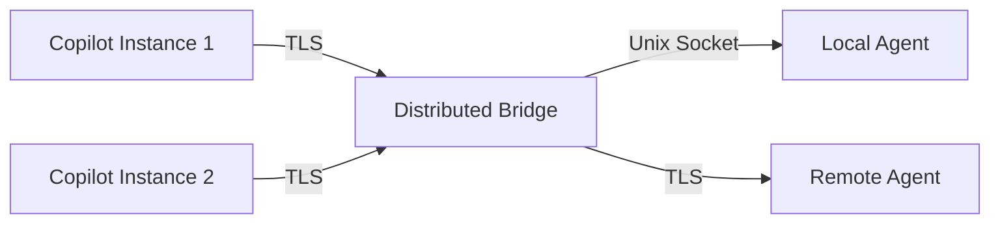
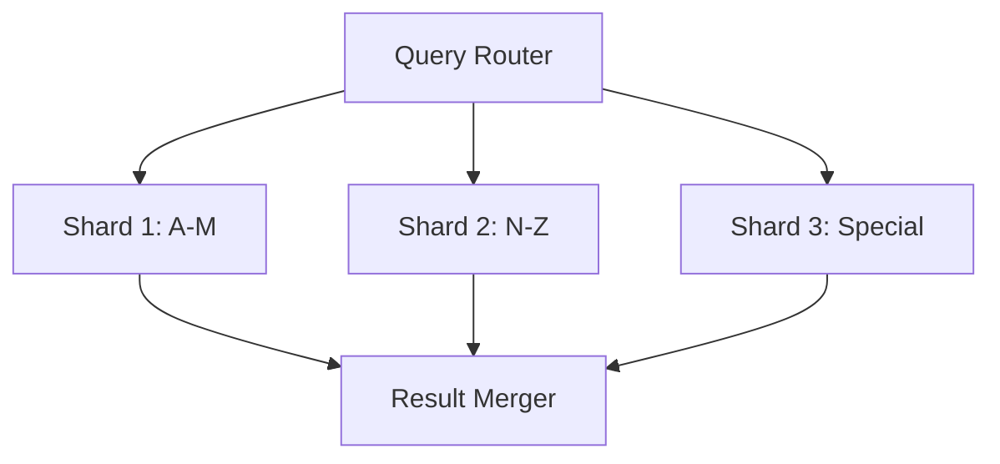

# Enhancement Research Plansets

**Version:** 1.0.0  
**Created:** 2026-01-09  
**Purpose:** Detailed research and implementation guidance for enhancement plansets  
**Branch:** copilot/review-next-planset-phases

---

## Overview

This document contains comprehensive research findings and implementation plans for enhancement plansets identified during the architectural remediation. These enhancements are designed to extend the capabilities of completed plansets.

---

## Enhancement Category 1: Bridge Protocol v2

**Base Planset:** PS-02 (IPC Bridge Hardening) ✅  
**Priority:** MEDIUM  
**Estimated Effort:** 4-6 pre-commit cycles

### 1.1 Message Compression for Large Payloads

**Problem:** Large payloads (>1MB) cause latency spikes in IPC communication.

**Solution:** Implement transparent compression using zlib/lz4.

**Implementation:**

```python
# src/bridge_manager.py enhancement
import zlib
from typing import Union

COMPRESSION_THRESHOLD = 1024 * 100  # 100KB

def compress_message(data: bytes) -> tuple[bytes, bool]:
    """Compress message if above threshold."""
    if len(data) > COMPRESSION_THRESHOLD:
        compressed = zlib.compress(data, level=6)
        if len(compressed) < len(data) * 0.9:  # Only if 10%+ savings
            return compressed, True
    return data, False

def decompress_message(data: bytes, is_compressed: bool) -> bytes:
    """Decompress message if needed."""
    if is_compressed:
        return zlib.decompress(data)
    return data
```

**Protocol Update:**
```
| Magic (4B) | Flags (1B) | Length (4B) | Payload |
                 ↑
         Bit 0: Compressed
         Bit 1-7: Reserved
```

**Validation:**
- [ ] Unit tests for compression/decompression
- [ ] Benchmark: 50%+ reduction for typical payloads
- [ ] No regression for small messages

### 1.2 Multi-Client Support

**Problem:** Only single Copilot instance can connect.

**Solution:** Implement client registry with round-robin or priority-based routing.

**Implementation:**

```python
# src/bridge_manager.py enhancement
from dataclasses import dataclass
from typing import Dict, Optional
import threading

@dataclass
class ClientInfo:
    client_id: str
    socket_path: str
    priority: int = 0
    connected_at: float = 0.0
    last_heartbeat: float = 0.0

class MultiClientBridge:
    def __init__(self, max_clients: int = 10):
        self.clients: Dict[str, ClientInfo] = {}
        self.max_clients = max_clients
        self._lock = threading.Lock()
    
    def register_client(self, client_id: str, socket_path: str) -> bool:
        with self._lock:
            if len(self.clients) >= self.max_clients:
                return False
            self.clients[client_id] = ClientInfo(
                client_id=client_id,
                socket_path=socket_path,
                connected_at=time.time()
            )
            return True
    
    def route_message(self, message: bytes) -> str:
        """Route message to appropriate client."""
        # Priority-based routing
        with self._lock:
            sorted_clients = sorted(
                self.clients.values(),
                key=lambda c: c.priority,
                reverse=True
            )
            if sorted_clients:
                return sorted_clients[0].socket_path
        raise NoClientAvailableError()
```

### 1.3 Distributed Bridge (TLS)

**Problem:** Bridge limited to single machine.

**Solution:** Extend to cross-machine communication with TLS.

**Research Findings:**
- Use Python `ssl` module for TLS 1.3
- Certificate management via `cryptography` library
- mTLS for mutual authentication

**Architecture:**



### 1.4 Bridge Analytics Dashboard

**Problem:** No visibility into bridge performance/security.

**Solution:** Prometheus metrics + Grafana dashboard.

**Metrics:**
- `bridge_messages_total` - Counter
- `bridge_latency_seconds` - Histogram
- `bridge_clients_connected` - Gauge
- `bridge_auth_failures_total` - Counter

---

## Enhancement Category 2: Token Security

**Base Planset:** PS-05 (Token Security Neutralization) ✅  
**Priority:** HIGH  
**Estimated Effort:** 3-4 pre-commit cycles

### 2.1 Token Rotation Automation

**Problem:** Manual token rotation creates security gaps.

**Solution:** Automated rotation on security events.

**Implementation:**

```python
# scripts/security/token_rotation.py
from dataclasses import dataclass
from datetime import datetime, timedelta
from typing import Optional
import secrets

@dataclass
class TokenRotationPolicy:
    max_age_days: int = 90
    rotation_on_exposure: bool = True
    rotation_on_compromise: bool = True
    grace_period_hours: int = 24

class TokenRotationManager:
    def __init__(self, policy: TokenRotationPolicy):
        self.policy = policy
    
    def should_rotate(self, token_created_at: datetime) -> bool:
        age = datetime.utcnow() - token_created_at
        return age > timedelta(days=self.policy.max_age_days)
    
    def rotate_token(self, old_token_id: str) -> str:
        """Rotate token and return new token ID."""
        new_token = secrets.token_urlsafe(32)
        # Store mapping for grace period
        self._store_rotation(old_token_id, new_token)
        return new_token
    
    def handle_security_event(self, event_type: str) -> bool:
        """Handle security event and determine if rotation needed."""
        if event_type == "exposure" and self.policy.rotation_on_exposure:
            return True
        if event_type == "compromise" and self.policy.rotation_on_compromise:
            return True
        return False
```

**Security Events Triggering Rotation:**
- Secret scanning alert
- Failed auth attempts > threshold
- Suspicious access pattern
- Manual security review

### 2.2 Scope Validation Library

**Problem:** Token scope checking duplicated across codebase.

**Solution:** Centralized scope validation library.

**Implementation:**

```python
# src/security/scope_validator.py
from enum import Flag, auto
from typing import Set

class TokenScope(Flag):
    READ_REPO = auto()
    WRITE_REPO = auto()
    READ_WORKFLOW = auto()
    WRITE_WORKFLOW = auto()
    ADMIN_REPO = auto()
    
    @classmethod
    def from_string(cls, scope: str) -> "TokenScope":
        mapping = {
            "repo:read": cls.READ_REPO,
            "repo:write": cls.WRITE_REPO,
            "workflow:read": cls.READ_WORKFLOW,
            "workflow:write": cls.WRITE_WORKFLOW,
            "admin:repo": cls.ADMIN_REPO,
        }
        return mapping.get(scope, cls(0))

class ScopeValidator:
    def __init__(self, token_scopes: Set[str]):
        self.scopes = TokenScope(0)
        for scope in token_scopes:
            self.scopes |= TokenScope.from_string(scope)
    
    def has_scope(self, required: TokenScope) -> bool:
        return bool(self.scopes & required)
    
    def require_scope(self, required: TokenScope) -> None:
        if not self.has_scope(required):
            raise InsufficientScopeError(f"Missing scope: {required}")
```

### 2.3 Multi-Provider Support

**Problem:** Only GitHub tokens supported.

**Solution:** Extend to GitLab, Bitbucket, Azure DevOps.

**Architecture:**

```python
# src/security/token_provider.py
from abc import ABC, abstractmethod

class TokenProvider(ABC):
    @abstractmethod
    def validate_token(self, token: str) -> bool:
        pass
    
    @abstractmethod
    def get_scopes(self, token: str) -> Set[str]:
        pass

class GitHubTokenProvider(TokenProvider):
    def validate_token(self, token: str) -> bool:
        # GitHub API validation
        pass

class GitLabTokenProvider(TokenProvider):
    def validate_token(self, token: str) -> bool:
        # GitLab API validation
        pass

class TokenProviderFactory:
    @staticmethod
    def get_provider(provider_type: str) -> TokenProvider:
        providers = {
            "github": GitHubTokenProvider(),
            "gitlab": GitLabTokenProvider(),
            # Add more providers
        }
        return providers.get(provider_type)
```

---

## Enhancement Category 3: Knowledge Crawler

**Base Planset:** PS-06 (Knowledge Crawler Service) ✅  
**Priority:** MEDIUM  
**Estimated Effort:** 6-8 pre-commit cycles

### 3.1 Multi-Locale Optimization

**Problem:** Sequential sync for each locale is slow.

**Solution:** Parallel sync with locale-aware scheduling.

**Implementation:**

```python
# src/services/crawler/parallel_sync.py
import asyncio
from typing import List, Dict
from concurrent.futures import ThreadPoolExecutor

class MultiLocaleSyncManager:
    def __init__(self, max_workers: int = 4):
        self.executor = ThreadPoolExecutor(max_workers=max_workers)
    
    async def sync_all_locales(
        self,
        locales: List[str],
        sync_func
    ) -> Dict[str, SyncResult]:
        tasks = [
            asyncio.get_event_loop().run_in_executor(
                self.executor,
                sync_func,
                locale
            )
            for locale in locales
        ]
        results = await asyncio.gather(*tasks, return_exceptions=True)
        return dict(zip(locales, results))
```

### 3.2 Change Webhooks

**Problem:** Polling-based sync has latency.

**Solution:** Real-time sync via Zendesk webhooks.

**Webhook Handler:**

```python
# src/services/crawler/webhook_handler.py
from flask import Flask, request, jsonify
import hmac
import hashlib

app = Flask(__name__)

@app.route('/webhook/zendesk', methods=['POST'])
def handle_zendesk_webhook():
    # Verify signature
    signature = request.headers.get('X-Zendesk-Webhook-Signature')
    if not verify_signature(request.data, signature):
        return jsonify({"error": "Invalid signature"}), 401
    
    event = request.json
    if event['type'] == 'article.updated':
        # Trigger incremental sync
        trigger_article_sync(event['article_id'])
    
    return jsonify({"status": "processed"})
```

### 3.3 Content Diffing

**Problem:** Full article re-sync even for minor changes.

**Solution:** Detect partial changes for micro-updates.

**Implementation:**

```python
# src/services/crawler/content_diff.py
import difflib
from typing import List, Tuple

class ContentDiffer:
    def __init__(self, min_change_ratio: float = 0.05):
        self.min_change_ratio = min_change_ratio
    
    def compute_diff(
        self,
        old_content: str,
        new_content: str
    ) -> Tuple[float, List[str]]:
        """Compute diff between versions."""
        matcher = difflib.SequenceMatcher(None, old_content, new_content)
        ratio = 1.0 - matcher.ratio()
        
        if ratio < self.min_change_ratio:
            return ratio, []
        
        diff = list(difflib.unified_diff(
            old_content.splitlines(),
            new_content.splitlines(),
            lineterm=''
        ))
        return ratio, diff
    
    def should_resync(self, change_ratio: float) -> bool:
        return change_ratio >= self.min_change_ratio
```

### 3.4 Index Sharding

**Problem:** Single index doesn't scale to 100k+ articles.

**Solution:** Distribute index across shards.

**Architecture:**



---

## CI/CD Agent Deployment Plan

### Production Deployment Checklist

#### Performance Regression Detector
- [ ] Review `.github/copilot/agents/performance-regression-detector.yml`
- [ ] Configure baseline metrics storage
- [ ] Set alerting thresholds
- [ ] Enable on main branch

#### Doc Freshness Checker
- [ ] Review `.github/copilot/agents/doc-freshness-checker.yml`
- [ ] Configure link checker rules
- [ ] Set staleness thresholds
- [ ] Enable on PR and weekly schedule

#### Dependency Vulnerability Scanner
- [ ] Review `.github/copilot/agents/dependency-vulnerability-scanner.yml`
- [ ] Configure severity thresholds
- [ ] Enable auto-PR for patches
- [ ] Enable on daily schedule

#### Integration Test Runner
- [ ] Review `.github/copilot/agents/integration-test-runner.yml`
- [ ] Configure test parallelism
- [ ] Set retry policies
- [ ] Enable on PR events

---

## Research Priority Matrix

| Enhancement | Impact | Effort | Priority | Dependencies |
|-------------|--------|--------|----------|--------------|
| Token Rotation | High | Medium | P1 | PS-05 ✅ |
| Multi-Client Bridge | High | High | P2 | PS-02 ✅ |
| Message Compression | Medium | Low | P3 | PS-02 ✅ |
| Multi-Locale Sync | Medium | Medium | P3 | PS-06 ✅ |
| Content Diffing | Medium | Low | P3 | PS-06 ✅ |
| Index Sharding | High | High | P2 | PS-06 ✅ |
| Distributed Bridge | High | Very High | P4 | Multi-Client |

---

## Next Steps

### Immediate (Next Session)
1. Complete PS-07, PS-08, PS-09, PS-10
2. Begin Token Rotation implementation (P1)
3. Deploy CI/CD agents in staging

### Short-term (Next Week)
1. Multi-Client Bridge design review
2. Content Diffing implementation
3. Agent monitoring dashboard

### Medium-term (Next Month)
1. Distributed Bridge research
2. Index Sharding for large knowledge bases
3. Full enhancement suite deployment

---

**Maintained By:** GitHub Copilot  
**Last Updated:** 2026-01-09
