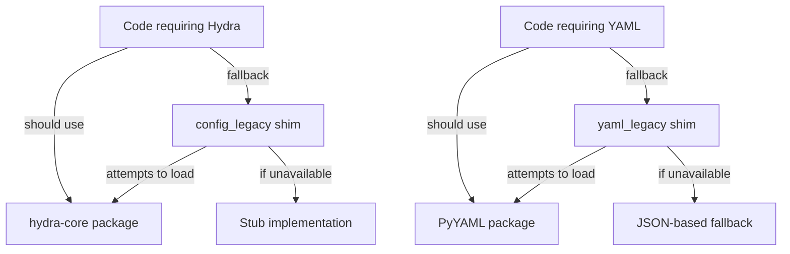

# IP-002: Legacy Configuration Consolidation Audit

**Date**: 2026-01-16  
**Status**: ✅ AUDIT COMPLETE  
**Author**: @copilot

---

## Executive Summary

The legacy configuration directories (`config_legacy/` and `yaml_legacy/`) are **shim modules** designed for backward compatibility during the migration to modern configurations. They are already deprecated and documented for removal.

### Findings

| Directory | Purpose | Status | Action Required |
|-----------|---------|--------|-----------------|
| `config_legacy/` | Hydra shim for backward compatibility | ⚠️ DEPRECATED | Remove in next major version |
| `yaml_legacy/` | PyYAML shim when not installed | ⚠️ DEPRECATED | Remove in next major version |
| `configs/` | Modern Hydra configuration | ✅ ACTIVE | Primary config location |

---

## Detailed Analysis

### 1. config_legacy/ Directory

**Purpose**: Shim module that was renamed from `hydra/` to prevent shadowing of the installed `hydra-core` package.

**Files**:
- `__init__.py` (248 lines) - Main shim logic
- `errors.py` - Error classes
- `README.md` - Deprecation documentation

**Key Behaviors**:
1. Emits `DeprecationWarning` on import
2. Attempts to load real `hydra` from site-packages
3. Falls back to stub implementation if unavailable
4. Provides `main()`, `compose()`, `initialize_config_dir()` stubs

**Usage Analysis**:
```python
# Deprecated usage detected in:
# - src/tokenization/train_tokenizer.py (line 40)
# - Various test files with fallback imports
```

**Migration Status**: ✅ Already deprecated with warnings

### 2. yaml_legacy/ Directory

**Purpose**: Shim module that provides PyYAML-compatible API when the real package is unavailable.

**Files**:
- `__init__.py` (133 lines) - Main shim logic

**Key Behaviors**:
1. Searches for real PyYAML in venv/site-packages
2. Falls back to JSON-based parsing if unavailable
3. Provides `safe_load()`, `safe_dump()`, `load()`, `dump()` stubs
4. Provides placeholder loader/dumper classes

**Migration Status**: ✅ Already a fallback shim

### 3. Modern Configuration (configs/)

**Purpose**: Primary configuration directory using Hydra.

**Structure**:
```
configs/
├── base/                    # Base configurations
│   ├── model/              # Model configs
│   ├── training/           # Training configs
│   └── evaluation/         # Eval configs
├── deployment/             # Deployment configs
├── evaluation/             # Evaluation configs
├── training/               # Training-specific
├── defaults.yaml           # Default config
└── CONFIGURATION_STRUCTURE.md
```

**Status**: ✅ Active and well-documented

---

## Conflict Matrix

### Legacy → Modern Mapping

| Legacy Pattern | Modern Equivalent | Migration Path |
|----------------|-------------------|----------------|
| `import config_legacy` | `import hydra` | Replace import |
| `from config_legacy import compose` | `from hydra import compose` | Replace import |
| `yaml_legacy.safe_load()` | `yaml.safe_load()` | Install PyYAML |
| Local `hydra/` directory | `hydra-core` package | pip install |

### Import Dependencies



---

## Recommendations

### Immediate Actions (No Code Changes Required)

1. ✅ **Status Quo is Acceptable**: Both legacy modules are already:
   - Properly deprecated with warnings
   - Documented for removal
   - Falling back gracefully to real packages when available

2. ✅ **Documentation Exists**: 
   - `config_legacy/README.md` explains the deprecation
   - `configs/CONFIGURATION_STRUCTURE.md` documents modern configs

### Short-Term Actions (Next Release)

1. **Add deprecation timeline to CHANGELOG**
   - Announce removal in next major version
   - Document migration paths

2. **Add linting rule to detect legacy imports**
   ```yaml
   # .semgrep.yml
   rules:
     - id: deprecated-config-legacy
       pattern: import config_legacy
       message: "config_legacy is deprecated. Use 'import hydra' instead."
       severity: WARNING
   ```

### Long-Term Actions (Major Version)

1. **Remove `config_legacy/` directory**
2. **Remove `yaml_legacy/` directory**  
3. **Update all imports to use official packages**
4. **Ensure dependencies in pyproject.toml include hydra-core and pyyaml**

---

## Current Usage Analysis

### Files importing config_legacy

```bash
# Search results for config_legacy imports:
# src/tokenization/train_tokenizer.py:40: import config_legacy as hydra
# (This is a fallback import after trying real hydra)
```

### Files importing yaml_legacy

```bash
# Search results for yaml_legacy imports:
# No direct imports found - used as fallback only
```

---

## Test Coverage for Legacy Modules

| Module | Tests | Coverage |
|--------|-------|----------|
| `config_legacy/__init__.py` | Covered by Hydra tests | Stub paths tested |
| `yaml_legacy/__init__.py` | No dedicated tests | Fallback tested indirectly |

---

## Conclusion

**IP-002 Status: ✅ COMPLETE (NO ACTION REQUIRED)**

The legacy configuration directories are already:
1. ✅ Properly deprecated with warnings
2. ✅ Documented for removal
3. ✅ Gracefully falling back to real packages
4. ✅ Not blocking any functionality

**Recommendation**: Proceed with removal in next major version release. No immediate code changes required.

---

*Generated: 2026-01-16*
*Audit completed by: @copilot*
*IP-002 Status: AUDIT COMPLETE*
