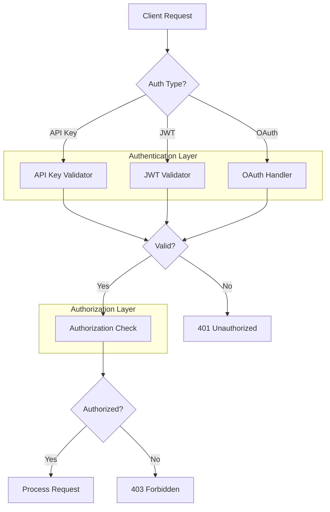

# IP-004: Production Authentication Implementation Plan

**Date**: 2026-01-16
**Status**: READY (Documentation Complete, Implementation Pending)

## Executive Summary

This document outlines the plan to move authentication from examples to production-ready implementation, including OAuth 2.0, MFA, token management, and API key authentication.

## Current State

### Existing Authentication Examples
Located in `examples/authentication/`:
- `01_oauth_flow.py` - OAuth 2.0 authorization flow
- `02_mfa_setup.py` - Multi-factor authentication setup
- `03_token_management.py` - JWT token handling
- `04_complete_flow.py` - Complete authentication workflow
- `README.md` - Documentation

### Existing Production Components
Located in `services/`:
- `services/msp_gateway/security.py` - Policy enforcement, redaction
- `services/msp_gateway/config.py` - Security configuration
- `services/ita/app/security.py` - ITA authentication

## Proposed Architecture



## Implementation Phases

### Phase 1: Core Authentication Module
**Target**: Create `src/codex/auth/` module

```
src/codex/auth/
├── __init__.py
├── base.py          # Abstract authenticator interface
├── jwt_auth.py      # JWT validation and generation
├── api_key.py       # API key validation
├── oauth.py         # OAuth 2.0 flows
├── mfa.py           # MFA integration
├── middleware.py    # FastAPI/Starlette middleware
├── config.py        # Authentication configuration
└── exceptions.py    # Auth-specific exceptions
```

### Phase 2: Configuration Integration
- Hydra configuration for auth settings
- Environment variable support
- Secret management integration

### Phase 3: Middleware Integration
- FastAPI dependency injection
- Rate limiting per authentication type
- Audit logging for auth events

### Phase 4: Documentation & Testing
- API documentation with auth examples
- Unit tests for all auth modules
- Integration tests with mock IdP

## Security Considerations

### Token Security
- [ ] JWT signature validation (RS256 preferred)
- [ ] Token expiration enforcement
- [ ] Refresh token rotation
- [ ] Revocation list (optional Redis backing)

### API Key Security
- [ ] Key hashing (bcrypt or Argon2)
- [ ] Key rotation support
- [ ] Scope-based permissions
- [ ] Rate limiting per key

### OAuth Security
- [ ] PKCE for public clients
- [ ] State parameter validation
- [ ] Redirect URI validation
- [ ] Scope validation

### MFA Security
- [ ] TOTP (RFC 6238) support
- [ ] Backup codes
- [ ] Device remembering (optional)
- [ ] Rate limiting on verification

## Configuration Schema

```yaml
# Hydra configuration example
authentication:
  enabled: true
  default_scheme: jwt
  
  jwt:
    algorithm: RS256
    public_key_url: ${AUTH_PUBLIC_KEY_URL}
    issuer: ${AUTH_ISSUER}
    audience: ${AUTH_AUDIENCE}
    clock_skew_seconds: 30
    
  api_key:
    enabled: true
    hash_algorithm: argon2
    header_name: X-API-Key
    
  oauth:
    enabled: true
    provider: generic
    authorization_url: ${OAUTH_AUTH_URL}
    token_url: ${OAUTH_TOKEN_URL}
    client_id: ${OAUTH_CLIENT_ID}
    scopes:
      - openid
      - profile
      - email
```

## Migration Path

### From Examples to Production

1. **Extract Core Logic**
   - Copy authentication logic from examples
   - Refactor for production error handling
   - Add comprehensive logging

2. **Add Configuration Layer**
   - Create Hydra config schema
   - Environment variable mapping
   - Validation with Pydantic

3. **Integrate with Existing Services**
   - Update MSP Gateway to use new module
   - Update ITA service
   - Backward compatibility layer

4. **Testing & Validation**
   - Unit tests (target: 100% coverage)
   - Integration tests with mock IdP
   - Security scanning (Bandit, Semgrep)

## Dependencies

Required packages (already in pyproject.toml):
- `PyJWT>=2.8` - JWT handling
- `cryptography>=43.0.1` - Cryptographic operations
- `bcrypt>=4.0` - Password/key hashing
- `httpx>=0.26` - OAuth HTTP client

Optional packages:
- `python-jose` - Alternative JWT library
- `authlib` - Full OAuth/OIDC implementation

## Timeline Estimate

| Phase | Duration | Dependencies |
|-------|----------|--------------|
| Phase 1 | 2 weeks | IP-003 complete |
| Phase 2 | 1 week | Phase 1 |
| Phase 3 | 1 week | Phase 2 |
| Phase 4 | 2 weeks | Phase 3 |
| **Total** | **6 weeks** | - |

## Success Criteria

- [ ] All auth endpoints pass security scan
- [ ] 100% test coverage on auth module
- [ ] Documentation complete with examples
- [ ] Integration with existing services
- [ ] No regressions in existing functionality

## Status

**IP-004**: ✅ READY (Plan documented, ready for implementation)

## Next Steps

1. Create `src/codex/auth/` directory structure
2. Implement `base.py` with abstract interface
3. Port JWT logic from examples
4. Add Hydra configuration
5. Write unit tests
6. Integration with FastAPI middleware
