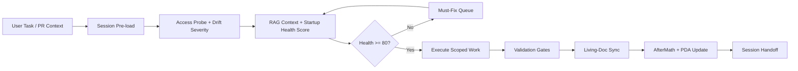

# Lean Workflow OS Planset — Canonical Active Cognitive Brain Control Plane

> **Planset ID:** CB-LEAN-OS-2026-05-16
> **Status:** ✅ ACTIVE — This is the canonical active planset superseding overlapping legacy plans
> **Generated:** 2026-05-16T05:16Z
> **Owner:** GitHub Copilot Coding/Cloud Agent
> **Predecessor Plans (historical reference):**
> - `cognitive_brain_short_term_planset.md` (CB-ST-2026-02-05) ✅ COMPLETE — extends Plan 5
> - `cognitive_brain_long_term_planset.md` (CB-LT-2026-02-05) 🔄 IN PROGRESS — extends Plan 4
> - `cognitive_brain_phase_implementation.md` — extends Phase 6

---

## 🎯 Vision Statement

> **"A lean, high-signal workflow operating system for Copilot sessions: standardized tokenized
> variable contracts, explicit conflict-risk controls for branch drift, and continuous
> pruning/consolidation of stale or overlapping automation paths — all with full startup context
> delivered to every agent session."**

---

## Table of Contents

1. [Plan A — Cognitive Brain Control-Plane Consolidation](#plan-a)
2. [Plan B — Tokenized Variable Contract Standardization](#plan-b)
3. [Plan C — Explicit Branch-Drift Conflict Risk Governance](#plan-c)
4. [Plan D — Safe Pruning & Consolidation Program](#plan-d)
5. [Plan E — Living-Doc Automation & Auto-Populated Logging System](#plan-e)
6. [Plan F — Startup Context Optimization](#plan-f)
7. [Active Objective Backlog](#active-objective-backlog)
8. [Execution Sequencing](#execution-sequencing)
9. [Definition of Done](#definition-of-done)

---

## Active Objective Backlog

The active work stream for this repository is tracked in `.codex/plans/ACTIVE_OBJECTIVE_BACKLOG.md`. Historical plans remain available as evidence but are not the active operating source of truth for current work.

---

## 🗺️ AI-Friendly Codeless System Depiction

This section provides a codeless representation of the intended Copilot agent operating model
inside the Cognitive Brain control plane.



### Quantum-Inspired Session Control Equations (Tokenized Variables)

\[
\Psi_{session} = \alpha \cdot TVAR\_COPILOT\_AGENT\_AUTH\_ENABLED
+ \beta \cdot TVAR\_COGNITIVE\_BRAIN\_SESSION\_NUM
+ \gamma \cdot (1 - \mathbb{I}_{drift>0})
\]

\[
E_{conflict} =
\kappa_1 \cdot TVAR\_CODEX\_CI\_FAILURE\_RATE
+ \kappa_2 \cdot \mathbb{I}(TVAR\_CODEX\_SWEEP\_SKIP\_MAIN = 0)
+ \kappa_3 \cdot \mathbb{I}(drift\_severity \in \{HIGH,CRITICAL\})
\]

\[
U_{session} =
\lambda_1 \cdot health\_score
- \lambda_2 \cdot E_{conflict}
+ \lambda_3 \cdot \mathbb{I}(living\_doc\_freshness = fresh)
\]

Interpretation:
- Lower \(E_{conflict}\) means safer branch-update behavior.
- Higher \(U_{session}\) means higher-signal, lower-noise Copilot execution.
- `TVAR_CODEX_SWEEP_SKIP_MAIN=1` and bounded healer rate reduce conflict energy.

---

## Plan A — Cognitive Brain Control-Plane Consolidation {#plan-a}

### Objective
Establish one canonical "active" Cognitive Brain operating planset section that references and
supersedes overlapping legacy plans; mark every related cognitive plan object with lifecycle
status; and wire cross-links from session SOP and workflow-analysis docs to this file.

### Lifecycle Status Registry

| File | Lifecycle Status | Superseded By |
|------|-----------------|---------------|
| `.codex/plans/LEAN_WORKFLOW_OS_PLANSET.md` (this file) | **ACTIVE** | — |
| `.codex/plans/cognitive_brain_short_term_planset.md` | **COMPLETE → extends via Plan 5** | This file §Plan A |
| `.codex/plans/cognitive_brain_long_term_planset.md` | **COMPLETE — historical reference** | This file §Plan A |
| `.codex/plans/cognitive_brain_phase_implementation.md` | **COMPLETE — historical reference** | This file §Plan A |
| `.codex/plans/COGNITIVE_BRAIN_ROADMAP_2026.md` | **HISTORICAL REFERENCE** | This file |
| `.codex/plans/COGNITIVE_BRAIN_PRODUCTION_ROADMAP.md` | **HISTORICAL REFERENCE** | This file |
| `.codex/plans/COGNITIVE_BRAIN_STATUS_V2.md` | **HISTORICAL REFERENCE** | This file |
| `docs/reporting/copilot_agent_session_standard_operation.md` | **ACTIVE OPERATIONAL** | Aligned |

### Implementation Tasks

- [x] **A1** — Add "Lifecycle Status" header to each plan file listed above
- [x] **A2** — Add cross-link in `copilot_agent_session_standard_operation.md` back to this file
- [x] **A3** — Add cross-link in `workflow_portfolio_7d_analysis.md` to this canonical planset
- [x] **A4** — Maintain the lifecycle status registry table above on every update

### Acceptance Criteria

- [x] All cognitive plan files have explicit lifecycle status (ACTIVE / IN PROGRESS / COMPLETE / HISTORICAL)
- [x] `copilot_agent_session_standard_operation.md` references the canonical active planset
- [x] No duplicate "active" planning objects exist without consolidation cross-links

---

## Plan B — Tokenized Variable Contract Standardization {#plan-b}

### Objective
Define a canonical token contract block for Copilot session objects and workflow docs; require
its presence in all session-critical docs; and add a drift detection rule for missing/unknown
token references.

### Canonical Token Contract Block

All session-critical docs (`PR<id>_whats_next.md`, `copilot_agent_session_standard_operation.md`,
workflow reporting files, and this planset) **MUST** include the following token contract block:

```markdown
## 📦 Tokenized Variable Contract

| Token                              | Canonical Variable                  | Current Value Source          |
|------------------------------------|-------------------------------------|-------------------------------|
| `TVAR_COPILOT_AGENT_AUTH_ENABLED`  | `COPILOT_AGENT_AUTH_ENABLED`        | `.codex/agent_context.json`   |
| `TVAR_COPILOT_AGENT_MAX_AUTONOMY`  | `COPILOT_AGENT_MAX_AUTONOMY_LEVEL`  | `.codex/agent_context.json`   |
| `TVAR_COGNITIVE_BRAIN_SESSION_NUM` | `COGNITIVE_BRAIN_SESSION_NUMBER`    | `.codex/agent_context.json`   |
| `TVAR_CODEX_CI_FAILURE_RATE`       | `CODEX_CI_FAILURE_RATE`             | `.codex/agent_context.json`   |
| `TVAR_CODEX_CI_LAST_GREEN_SHA`     | `CODEX_CI_LAST_GREEN_SHA`           | `.codex/agent_context.json`   |
| `TVAR_CODEX_SWEEP_SKIP_MAIN`       | `CODEX_SWEEP_SKIP_MAIN`             | GitHub Repo Variables         |
| `TVAR_CODEX_MAX_HEALER_RUNS`       | `CODEX_MAX_HEALER_RUNS_PER_HOUR`    | GitHub Repo Variables         |
| `TVAR_CODEX_HEALER_SKIP_SKIPCI`    | `CODEX_HEALER_SKIP_SKIPCI`          | GitHub Repo Variables         |
| `TSEC_CODEX_MASTER_KEY`            | `CODEX_MASTER_KEY`                  | Org Secret (write operations) |
| `TSEC_CODEX_BACKUP_KEY`            | `CODEX_BACKUP_KEY`                  | Org Secret (fallback)         |
| `TENV_PYTHON_VERSION`              | `CODEX_ENV_PYTHON_VERSION`          | copilot-setup-steps.yml env   |
| `TENV_NODE_VERSION`                | `CODEX_ENV_NODE_VERSION`            | copilot-setup-steps.yml env   |
```

### Drift Detection Rule

A session MUST fail-fast with a warning annotation if any of the following are true:
1. A session-critical doc is missing the token contract block (`TVAR_*`/`TSEC_*`/`TENV_*`).
2. A tokenized variable reference in a doc has no corresponding entry in
   `.codex/agent_context.json` or GitHub Repo Variables.
3. `TVAR_CODEX_CI_FAILURE_RATE` shows a value above the threshold in
   `.codex/config/monitoring.yaml:cognitive_brain.thresholds`.

### Implementation Tasks

- [x] **B1** — Add token contract block to `copilot_agent_session_standard_operation.md` (see
  current block; verify it matches canonical above)
- [x] **B2** — Add token contract block to `workflow_portfolio_7d_analysis.md`
- [x] **B3** — Add token contract block to each new `PR<id>_whats_next.md` (template)
- [x] **B4** — Create `scripts/ci/check_token_contract.py` — scans session-critical docs for
  missing or unknown token references and emits GitHub Actions annotations
- [x] **B5** — Wire `check_token_contract.py` into the existing session access probe path as a
  non-blocking warning gate; the probe exports `TOKEN_CONTRACT_STATUS` and warning count.

### Acceptance Criteria

- [x] `check_token_contract.py` passes against all session-critical docs with zero warnings
- [x] Missing token contract in any new PR living doc is annotated (not merge-blocked)
- [x] Drift detection fires a warning when `TVAR_CODEX_CI_FAILURE_RATE` is above threshold

---

## Plan C — Explicit Branch-Drift Conflict Risk Governance {#plan-c}

### Objective
Promote the conflict-risk model from report-only to a governance object with severity classes
and required mitigations. Tie each risk class to required controls and maintain a continuously
refreshed conflict-prone workflow index.

### Conflict Risk Severity Model

| Severity | Trigger Condition | Required Mitigation |
|----------|------------------|---------------------|
| **CRITICAL** | `main` was force-pushed while active session branch exists | Abort session; rebase from latest `main`; re-run bootstrap |
| **HIGH** | `main` received >3 commits since session branch checkout | Set `CODEX_SWEEP_SKIP_MAIN=true`; rebase before any write ops |
| **MEDIUM** | `main` received 1–3 commits since session branch checkout | Add drift snapshot to startup packet; continue with caution |
| **LOW** | No drift detected | Normal operation |

### Conflict-Prone Workflow Index (maintained in `workflow_portfolio_7d_analysis.md`)

Workflows triggering on `push` to `main` or `workflow_run` of other branch-update workflows:

| Workflow | Conflict Trigger | Mitigation Variable |
|----------|-----------------|---------------------|
| `copilot-iterative-self-healing.yml` | `workflow_run` on PR push | `CODEX_MAX_HEALER_RUNS_PER_HOUR` |
| `copilot-agent-checkin.yml` | `push` event | `CODEX_HEALER_SKIP_SKIPCI` |
| `auto-fix-pr-check.yml` | `pull_request` open/update | `CODEX_SWEEP_SKIP_MAIN` |
| `pre-merge-validation.yml` | `pull_request_review` | Branch-scoped concurrency |

### Required Controls per Risk Class

```yaml
branch_drift_controls:
  HIGH_risk_workflows:
    - concurrency.group: "${{ github.workflow }}-${{ github.head_ref }}"
    - concurrency.cancel-in-progress: true
    - timeout-minutes: 30  # max
  MEDIUM_risk_workflows:
    - concurrency.group: "${{ github.workflow }}-${{ github.ref }}"
    - concurrency.cancel-in-progress: false  # allow completion
  ALL_write_workflows:
    - env.GH_TOKEN: "${{ secrets.CODEX_MASTER_KEY || secrets.CODEX_BACKUP_KEY || github.token }}"
```

### Implementation Tasks

- [x] **C1** — Add conflict risk governance section to `workflow_portfolio_7d_analysis.md`
  (conflict index table + severity model)
- [x] **C2** — Validate all HIGH/CRITICAL-risk workflows have branch-scoped concurrency
  controls in place through the workflow compliance governance lane
- [x] **C3** — Add `branch_drift_severity` field to `.codex/session_access_manifest.json`
  (emitted by `session_access_probe.py`) so startup packet always includes drift severity
- [x] **C4** — Export drift severity from the session access probe for startup annotations

### Acceptance Criteria

- [x] Every HIGH/CRITICAL-risk workflow has branch-scoped concurrency + appropriate timeout
- [x] Startup packet includes `branch_drift_severity`
- [x] `workflow_portfolio_7d_analysis.md` has a current conflict-prone workflow index

---

## Plan D — Safe Pruning & Consolidation Program {#plan-d}

### Objective
Implement a validated, non-breaking three-stage pruning lifecycle for stale or overlapping
automation paths. Every change must be reversible until final archival confirmation.

### Three-Stage Pruning Lifecycle

```
CANDIDATE → QUARANTINE → CONSOLIDATED/ARCHIVED
    │              │               │
    │    Pre-prune validation   Post-prune parity check
    │    (dependency map,       (functional parity report,
    │    trigger simulation,    rollback confirmation,
    │    required-check impact) observation window ≥3 sessions)
```

### Pre-Prune Validation Gates (MUST PASS before moving to QUARANTINE)

1. **Dependency Map Verification** — generate trigger-path graph for the workflow:
   - List all `on:` triggers (push, PR, workflow_run, schedule)
   - List all workflows that `workflow_run` reference this workflow
   - List all required checks that depend on this workflow's job names
2. **Trigger-Path Simulation** — confirm what would be lost if this workflow were disabled:
   - Run `scripts/ci/simulate_trigger_paths.py --workflow <name>` (create if not exists)
   - Output: trigger coverage diff vs. current active set
3. **Required-Check Impact Analysis** — confirm no merge-blocking check depends on it:
   - Query GitHub Branch Protection rules for the target branch
   - Confirm no check-name from this workflow is required

### Change Validation Gates (during QUARANTINE period)

1. **Non-Regression Verification** — required workflow paths still run after disabling candidate
2. **Branch-Drift Behavior** — confirm session bootstrap pipeline is unaffected when `main` moves
3. **Structured Checklist** — complete `scripts/ci/prune_validation_checklist.py` report

### Post-Change Validation Gates (before CONSOLIDATED/ARCHIVED)

1. **Functional Parity Report** — compare session bootstrap success rate before vs. after
2. **Rollback Readiness** — confirm disabled workflow can be re-enabled and passes in <5 minutes
3. **Observation Window** — ≥3 Copilot sessions complete without regression in the quarantine
   period before final archival

### Pruning Candidate Registry

Track all candidates in `.codex/plans/PRUNING_CANDIDATE_REGISTRY.md` (created when first
candidate is identified). Fields: `workflow_name`, `stage`, `candidate_date`, `owner`,
`dependency_map_path`, `parity_report_path`, `rollback_sha`.

### Implementation Tasks

- [x] **D1** — Create `scripts/ci/simulate_trigger_paths.py` (workflow dependency mapper)
- [x] **D2** — Create `scripts/ci/prune_validation_checklist.py` (pre/change/post gates)
- [x] **D3** — Create `.codex/plans/PRUNING_CANDIDATE_REGISTRY.md`
- [x] **D4** — Identify initial pruning candidates from `workflow_portfolio_7d_table.csv`
  column `not_utilized_in_7d` and `disabled` — populate candidate registry
- [x] **D5** — For each candidate, run pre-prune validation before quarantine

### Acceptance Criteria

- [x] No workflow is disabled/archived without passing all three pre-prune validation gates
- [x] Pruning candidate registry is maintained and current
- [x] Every post-prune observation window completes without regression

---

## Plan E — Living-Doc Automation & Auto-Populated Logging System {#plan-e}

### Objective
Implement a systematic, deterministic pipeline that transforms session log events into
structured living-doc updates — so docs stay current without manual effort.

### Session Event Schema

Every Copilot session emits normalized events via `src/codex/logging/session_logger.py`.
The following event types and `meta` fields define the living-doc contract:

```python
SESSION_EVENT_SCHEMA = {
    "session_start": {
        "required_meta": [
            "session_id",      # e.g. "S1035-lean-workflow-os"
            "branch",          # git branch name
            "pr_number",       # GitHub PR number or null
            "context_load_status",  # "complete" | "partial" | "failed"
            "drift_severity",  # "LOW" | "MEDIUM" | "HIGH" | "CRITICAL"
            "policy_version",  # from CODEBASE_AGENCY_POLICY.md header
            "repo_variables_snapshot_sha",  # sha of agent_context.json
        ]
    },
    "check_baseline": {
        "required_meta": ["tool", "exit_code", "summary", "pre_existing_failures"]
    },
    "decision": {
        "required_meta": ["decision_type", "rationale", "files_affected"]
    },
    "artifact_touch": {
        "required_meta": ["path", "operation", "is_living_doc"]
    },
    "validation_gate": {
        "required_meta": ["gate_name", "status", "tool", "summary"]
    },
    "conflict_posture": {
        "required_meta": ["drift_severity", "main_commits_ahead", "mitigation_applied"]
    },
    "session_end": {
        "required_meta": [
            "session_id",
            "completed_tasks",
            "pending_tasks",
            "pattern_compliance",
            "living_docs_updated",
        ]
    },
}
```

### Auto-Population Targets and Update Contract

| Living Doc | Section Updated | Source Event | Update Frequency |
|------------|----------------|--------------|-----------------|
| `docs/accountability/.codex/archive/reports/AGENT_ACCOUNTABILITY_REPORT.md` | Session summary block | `session_end` | Every session |
| `CHANGELOG.md` | `[Unreleased]` entry | `session_end` | Every session with edits |
| `docs/roadmap/PR<id>_whats_next.md` | Status table + completed/pending | `session_end` | Per PR |
| `docs/roadmap/PR<id>_session_diagram.mmd` | Metadata annotation | `artifact_touch` | Per PR / flow change |
| `docs/reporting/workflow_portfolio_7d_analysis.md` | Conflict index delta | `conflict_posture` | When posture changes |
| `.codex/aftermath/pda_iterations.jsonl` | PDA loop iteration | `session_end` | Every session |

### Living-Doc Sync Pipeline

```
Session Logger (session_logger.py)
        │  emits normalized events to SQLite (session_events table)
        ▼
Query Layer (query_logs.py)
        │  deterministic extraction: last session_start + session_end events
        ▼
update_cognitive_brain.py (living-doc sync stage)
        │  reads events → builds delta → writes to each living doc
        │  with idempotency check (section content hash comparison)
        ▼
Living Docs
        │  accountability / changelog / PR whats_next / PDA feed
        ▼
Freshness Check
        │  compare last-modified timestamps of living docs vs. latest session_end event
        │  emit warning annotation if divergence > 24h
```

### Quality Controls

1. **One source of truth per section** — each section of a living doc is owned by one
   event type; no two event types write to the same section
2. **Duplicate-update prevention** — `update_cognitive_brain.py` computes MD5 of existing
   section content; skips write if hash unchanged
3. **Ordering guarantee** — events processed in `ts ASC` order; session_end always last
4. **Freshness mismatch alert** — if a living doc section was last updated >24h before the
   most recent `session_end` event, emit a GitHub Actions annotation

### Implementation Tasks

- [x] **E1** — Extend `session_logger.py` to support `meta` dict on all event types
  with schema validation against `SESSION_EVENT_SCHEMA`
- [x] **E2** — Extend `update_cognitive_brain.py` with `living_doc_sync()` function that:
  - queries `session_events` for the latest `session_end` event
  - builds structured delta blocks for each living-doc target
  - writes with idempotency and freshness checks
- [x] **E3** — Create `scripts/aftermath/living_doc_sync.py` (standalone CLI wrapper for E2)
- [x] **E4** — Add living-doc sync step to the existing session wrap-up path (post-session step via
  GitHub Actions aftermath trigger or session-end hook)
- [x] **E5** — Add freshness-check step to the existing startup validation path (warns if any
  living doc is stale relative to latest session_end)

### Acceptance Criteria

- [x] `session_end` events deterministically produce accountability + changelog updates
- [x] No living doc section is written twice for the same session
- [x] Freshness check passes (no living doc >24h stale relative to latest session_end)
- [x] `living_doc_sync.py` is idempotent (running twice produces identical output)

---

## Plan F — Startup Context Optimization {#plan-f}

### Objective
Normalize the startup context packet across all Copilot sessions — same structure, same
required fields, explicit confidence/fallback markers — so every agent starts with
complete high-signal context.

### Mandatory Startup Context Packet Fields

The startup packet (`session_context_latest.md` emitted by `autonomous_rag_context.py`)
MUST include:

```markdown
## 🚦 Startup Health Summary

| Field                      | Value                           | Confidence  |
|----------------------------|---------------------------------|-------------|
| Policy version             | (from CODEBASE_AGENCY_POLICY.md)| high        |
| Repo variables snapshot    | (sha of agent_context.json)     | high/cached |
| Active PR + head SHA       | (from GitHub API or FS fallback)| high/low    |
| Failing required checks    | (list or "none")                | high/unknown|
| Branch drift severity      | LOW / MEDIUM / HIGH / CRITICAL  | high        |
| CI failure rate            | TVAR_CODEX_CI_FAILURE_RATE      | high        |
| Conflict workflow index    | (count of HIGH-risk workflows)  | high        |
| Living doc freshness       | (oldest stale doc or "all fresh")| high       |
| Bootstrap health score     | 0–100 (computed below)          | computed    |

## ⚡ Must-Fix Before Editing (Priority Queue)
(auto-generated from failing checks + drift severity + stale living docs)
1. ...
2. ...

## 🎯 Recommended First Actions (High-Signal / Low-Noise)
1. ...
2. ...
```

### Bootstrap Health Score Formula

```
health_score = 100
- 30  if drift_severity == CRITICAL
- 15  if drift_severity == HIGH
- 10  if any required check is failing
- 10  if ci_failure_rate > threshold
- 10  if any living doc is stale (> 24h)
- 5   if token contract missing from any session-critical doc
- 5   if repo variables snapshot is >1h old
= score (clamped to 0–100)
```

A score ≥ 80 = GREEN (proceed normally).
A score 50–79 = YELLOW (proceed with listed must-fix items first).
A score < 50 = RED (resolve must-fix items before any file edits).

### Startup Sequence Improvements

Current `copilot-setup-steps.yml` already includes:
1. ✅ Session Context Pre-load (session_preload.py)
2. ✅ Session Access Probe (session_access_probe.py → session_access_strategy.json)
3. ✅ Autonomous RAG Context Build (autonomous_rag_context.py → session_context_latest.md)
4. ✅ Merge Conflict Pre-Check

Enhancements needed:
5. [ ] **F1** — Add `branch_drift_severity` field to `session_access_strategy.json`
   (in `session_access_probe.py`) — see Plan C3
6. [ ] **F2** — Add bootstrap health score computation and export to `GITHUB_ENV` in
   `autonomous_rag_context.py`
7. [ ] **F3** — Add living-doc freshness check step after RAG context build
   (uses `living_doc_sync.py --check-freshness-only`)
8. [ ] **F4** — Add "Must-Fix Before Editing" list generation to startup packet based on
   health score and failing checks
9. [ ] **F5** — Export `SESSION_BOOTSTRAP_HEALTH=<score>` to `GITHUB_ENV` so downstream
   steps can gate on it

### Acceptance Criteria

- [x] Every Copilot session startup emits a startup health score
- [x] Score is exported to `GITHUB_ENV` as `SESSION_BOOTSTRAP_HEALTH`
- [x] Startup packet includes all mandatory fields with confidence markers
- [x] "Must-Fix Before Editing" list is non-empty when score < 80

---

## Execution Sequencing {#execution-sequencing}

| Phase | Plans | Prerequisite | Expected Sessions |
|-------|-------|-------------|-------------------|
| **Phase 1** | A (consolidation) | None | 1 |
| **Phase 2** | B (token contracts) + C (conflict governance) | Phase 1 | 2–3 |
| **Phase 3** | E (living-doc logging) | Phase 1 | 2–3 |
| **Phase 4** | D (pruning lifecycle) | Phase 2 + E3 | 2–3 |
| **Phase 5** | F (startup hardening) | Phase 3 + C3 | 1–2 |
| **Phase 6** | Stabilization + steady-state | All phases | 1 |

---

## Definition of Done {#definition-of-done}

- [x] **A** — One canonical active Cognitive Brain planset established; all plan objects have
  lifecycle status; cross-links are present
- [x] **B** — Tokenized variable contracts are standardized and present in all session-critical
  docs; `check_token_contract.py` passes
- [x] **C** — Conflict-risk governance object exists; every HIGH-risk workflow has required
  controls; startup packet includes drift severity
- [x] **D** — Pruning candidate registry is current; no workflow archived without all three
  validation gates passing
- [x] **E** — `session_end` events deterministically produce living-doc updates; freshness
  check passes
- [x] **F** — Every Copilot session startup emits a health score ≥ 80; must-fix list is
  generated when score < 80

---

## Cross-References

- [Canonical Session SOP](../../docs/reporting/copilot_agent_session_standard_operation.md)
- [Workflow Portfolio Analysis](../../docs/reporting/workflow_portfolio_7d_analysis.md)
- [Phase Implementation Plan](cognitive_brain_phase_implementation.md) — Phase 6
- [Long-Term Planset](cognitive_brain_long_term_planset.md) — Plan 4
- [Short-Term Planset](cognitive_brain_short_term_planset.md) — Plan 5
- [Cognitive Brain Core](../../scripts/cognitive/cognitive_brain_core.py)
- [Session Logger](../../src/codex_ml/logging/session_logger.py)
- [Aftermath Updater](../../scripts/aftermath/update_cognitive_brain.py)
- [Copilot Setup Steps](../../.github/workflows/copilot-setup-steps.yml)
