# Master Planset: Production Readiness - Test Fix Suite
**Master Planset ID**: MPS-TEST-FIX-PROD-001  
**Created**: 2026-02-06T08:10:00Z  
**Time Budget**: 55 minutes (T+0 to T+55)  
**Current Time**: T+10 (45 minutes remaining)

---

## 🎯 Mission

Transform all test fix work into production-ready, documented, tested systems within 55-minute window.

---

## 📊 Planset Portfolio (5 Parallel Streams)

### PS-1: Test Signature Validation System ✅ 25% → 100%
**Time**: T+0 to T+20 (20 min allocated)  
**Status**: Core complete, testing in progress  
**Priority**: P0 (Foundation)  
**File**: `.codex/plans/PLANSET_TEST_SIGNATURE_VALIDATION_PRODUCTION.md`

**Quick Status**:
- [x] Phase 1: Core utility (5 min) ✅
- [x] Phase 2: Basic testing (2 min) ✅ VALIDATED
- [ ] Phase 3: CI/CD integration (5 min)
- [ ] Phase 4: Pre-commit hook (3 min)
- [ ] Phase 5: Documentation (5 min)

---

### PS-2: Automated Link Validation System
**Time**: T+10 to T+25 (15 min allocated)  
**Status**: 🔄 ACTIVE NOW  
**Priority**: P0 (CI Critical)  
**File**: `.codex/plans/PLANSET_LINK_VALIDATION_AUTOMATION.md`

**Objectives**:
1. Create automated link checker utility
2. Integrate into CI/CD pipeline
3. Add pre-commit hook for doc changes
4. Document patterns from 9-link fix

**Deliverables**:
- [ ] `scripts/validate_doc_links.py` (production utility)
- [ ] `.github/workflows/link-validation.yml`
- [ ] Pre-commit hook configuration
- [ ] Link fix pattern database

---

### PS-3: Config Schema Validation
**Time**: T+20 to T+35 (15 min allocated)  
**Status**: ⏳ QUEUED  
**Priority**: P1 (Quality)  
**File**: `.codex/plans/PLANSET_CONFIG_SCHEMA_VALIDATION.md`

**Objectives**:
1. Create Hydra config schema validator
2. Validate experiment configs (debug, fast, lambda)
3. CI integration for config changes
4. Schema evolution documentation

**Deliverables**:
- [ ] `scripts/validate_hydra_configs.py`
- [ ] Config schemas (JSON Schema or Pydantic)
- [ ] CI workflow for config validation
- [ ] Migration guide for schema changes

---

### PS-4: Custom Agent Enhancement Suite
**Time**: T+25 to T+40 (15 min allocated)  
**Status**: ⏳ QUEUED  
**Priority**: P1 (Agent Evolution)  
**File**: `.codex/plans/PLANSET_CUSTOM_AGENT_SUITE.md`

**Objectives**:
1. Formalize test-alignment-fixer-enhanced
2. Create agent testing framework
3. Document agent creation patterns
4. Build agent catalog automation

**Deliverables**:
- [ ] Agent testing framework
- [ ] Agent catalog auto-generator
- [ ] Agent best practices guide
- [ ] Agent performance metrics

---

### PS-5: Cognitive Brain Automation
**Time**: T+40 to T+55 (15 min allocated)  
**Status**: ⏳ QUEUED  
**Priority**: P2 (Knowledge Management)  
**File**: `.codex/plans/PLANSET_COGNITIVE_BRAIN_AUTOMATION.md`

**Objectives**:
1. Automate status file generation
2. Template-based follow-up prompts
3. Pattern learning automation
4. Knowledge graph visualization

**Deliverables**:
- [ ] `scripts/cognitive_brain_update.py`
- [ ] Status file templates
- [ ] Pattern extraction automation
- [ ] Knowledge graph generator

---

## 🔄 Execution Strategy

### Parallel Execution Pattern

```mermaid
gantt
    title 55-Minute Production Readiness
    dateFormat mm
    section PS-1: Signatures
    Core Dev      :done, 00, 05
    Testing       :active, 05, 10
    CI/CD         :10, 15
    Docs          :15, 20
    section PS-2: Links
    Planning      :active, 10, 12
    Development   :12, 18
    Testing       :18, 22
    Integration   :22, 25
    section PS-3: Config
    Planning      :20, 22
    Development   :22, 30
    Testing       :30, 33
    Integration   :33, 35
    section PS-4: Agents
    Planning      :25, 27
    Development   :27, 35
    Testing       :35, 38
    Docs          :38, 40
    section PS-5: Cognitive
    Auto-gen      :40, 48
    Testing       :48, 52
    Validation    :52, 55
```


### Time Checkpoints
- **T+10** (CURRENT): PS-1 testing complete ✅, PS-2 starting 🔄
- **T+20**: PS-1 complete ✅, PS-2 50% done, PS-3 starting
- **T+35**: PS-1-3 complete ✅, PS-4 starting
- **T+45**: PS-1-4 complete ✅, PS-5 70% done
- **T+55**: ALL COMPLETE ✅ + Final validation

---

## 🚀 Rapid Development Tactics

### Speed Multipliers
1. **Template Reuse**: Use signature validator as template
2. **Parallel Testing**: Test while developing next feature
3. **Automated Documentation**: Generate from code/tests
4. **CI/CD Cloning**: Reuse workflow patterns
5. **Agent Delegation**: Use custom agents for specialized tasks

### Quality Gates (Must Pass)
- ✅ Script runs without errors
- ✅ Basic test case passes
- ✅ Documentation exists
- ✅ CI integration planned/implemented
- ✅ Cognitive brain updated

### MVP Definition
Each planset delivers:
1. **Working script** (tested on 1 real case)
2. **Basic documentation** (README + examples)
3. **CI integration path** (workflow file or plan)
4. **Knowledge artifact** (pattern doc or agent update)

---

## 📊 Progress Dashboard

| Planset | Time | Status | Deliverables | Quality |
|---------|------|--------|--------------|---------|
| PS-1: Signatures | 20m | 🔄 50% | 2/5 ✅ | High |
| PS-2: Links | 15m | 🔄 10% | 0/4 | - |
| PS-3: Config | 15m | ⏳ 0% | 0/4 | - |
| PS-4: Agents | 15m | ⏳ 0% | 0/4 | - |
| PS-5: Cognitive | 15m | ⏳ 0% | 0/4 | - |

**Overall**: 10% complete (2/21 deliverables)  
**Time Used**: 10/55 minutes (18%)  
**On Track**: ✅ YES (ahead of schedule)

---

## 🎯 Success Criteria

### Minimum Success (MVP)
- [ ] All 5 plansets have working scripts
- [ ] All scripts tested on real cases
- [ ] Basic documentation for each
- [ ] CI integration plans documented
- [ ] Cognitive brain updated

### Target Success (Production)
- [ ] All scripts production-ready
- [ ] Comprehensive testing completed
- [ ] CI/CD fully integrated
- [ ] Pre-commit hooks configured
- [ ] Complete documentation

### Stretch Goals (Excellence)
- [ ] Auto-fix capabilities added
- [ ] Agent performance metrics
- [ ] Knowledge graph visualization
- [ ] Pattern learning automation
- [ ] Team training materials

---

## 🚨 Risk Mitigation

### Time Risks
- **Mitigation**: MVP first, enhance later
- **Fallback**: Document incomplete items for next session
- **Buffer**: 5-minute buffer at end for validation

### Quality Risks
- **Mitigation**: Required test case per script
- **Fallback**: Mark as "beta" if not fully tested
- **Buffer**: Quality gates must pass

### Integration Risks
- **Mitigation**: CI workflows can be added post-merge
- **Fallback**: Provide integration instructions
- **Buffer**: Pre-commit hooks optional

---

## 📝 Deliverables Tracking

### Scripts (Core)
- [x] test_signature_validator.py ✅
- [ ] validate_doc_links.py
- [ ] validate_hydra_configs.py
- [ ] test_agent_framework.py
- [ ] cognitive_brain_update.py

### Documentation
- [x] Planset: Test Signatures ✅
- [ ] Planset: Link Validation
- [ ] Planset: Config Schema
- [ ] Planset: Agent Suite
- [ ] Planset: Cognitive Brain

### CI/CD Integration
- [ ] test-signature-check.yml
- [ ] link-validation.yml
- [ ] config-validation.yml
- [ ] agent-quality-check.yml
- [ ] cognitive-brain-update.yml

### Knowledge Artifacts
- [x] Enhanced Agent: test-alignment-fixer ✅
- [x] Cognitive Status: PR Test Fixes ✅
- [x] Follow-up Prompt ✅
- [ ] Pattern Library: Link Fixes
- [ ] Agent Creation Guide

---

## ⏱️ Time Allocation Review

### Actual vs Planned
- **PS-1 Core Dev**: 5 min planned, 5 min actual ✅
- **PS-1 Testing**: 7 min planned, 2 min actual ✅ (faster!)
- **Current**: T+10, on schedule ✅

### Efficiency Gains
- AST testing faster than expected (+5 min saved)
- Template reuse will accelerate PS-2 (+3 min saved)
- Total buffer gained: 8 minutes

### Reallocation Plan
- Add 3 min to PS-4 (agent testing complexity)
- Add 2 min to PS-5 (pattern extraction)
- Keep 3 min as final buffer

---

## 🔗 Cross-Planset Dependencies

```
PS-1 (Signatures)
  ↓ Template for → PS-2 (Links)
  ↓ Template for → PS-3 (Config)

PS-2 (Links)
  ↓ Pattern for → PS-5 (Cognitive)

PS-4 (Agents)
  ↓ Uses → PS-1 validator
  ↓ Documents → All plansets

PS-5 (Cognitive)
  ↓ Aggregates → All plansets
```

---

## 🎓 Learning Integration

### Patterns to Document
1. **Rapid planset execution** (this session)
2. **AST-based validation** (PS-1)
3. **Link fixing patterns** (PS-2)
4. **Config schema evolution** (PS-3)
5. **Agent testing framework** (PS-4)

### Knowledge Store Updates
- [ ] Add to pattern_learning_store.json
- [ ] Update agent_integration_manifest.json
- [ ] Create planset_execution_patterns.md
- [ ] Update handoff_protocol_knowledge.md

---

**Next Action**: Execute PS-2 (Link Validation) NOW (T+10)  
**Time Remaining**: 45 minutes  
**Confidence**: 95% (ahead of schedule)  
**Status**: ✅ ON TRACK FOR 100% COMPLETION
