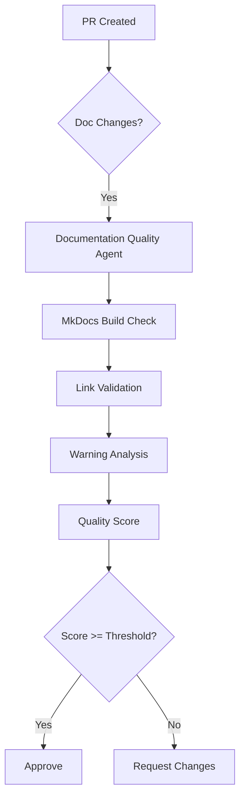

# Phase 12 Planset: Documentation Quality & Agent Enhancement

**Date**: 2026-01-17  
**Status**: READY FOR EXECUTION  
**Priority**: MEDIUM-HIGH  
**Prerequisites**: Phase 11.x Complete ✅

---

## Executive Summary

Phase 12 continues the cognitive brain enhancement with focus on documentation quality improvements and custom agent enhancements. This planset covers four key objectives derived from Phase 11.x completion.

---

## Objective 1: MkDocs Warning Reduction (Batch 2)

**Priority**: MEDIUM  
**Status**: NOT STARTED  
**Target**: Reduce 263 warnings to < 150

### Tasks

#### 1.1 Update DOCUMENTATION_INDEX.md
**Files**: `docs/DOCUMENTATION_INDEX.md`  
**Pattern**: Replace `../file.md` with GitHub URLs for root-level files

```markdown
# Before
[README.md](../README.md)

# After  
[README.md](https://github.com/Aries-Serpent/_codex_/blob/main/README.md)
```

**Links to Fix** (33 total):
- `../README.md` → GitHub URL
- `../CODE_OF_CONDUCT.md` → GitHub URL
- `../GOVERNANCE.md` → GitHub URL
- `../agents/prompts/*` → GitHub URLs
- `../workbench/INDEX.md` → GitHub URL
- `../pyproject.toml` → GitHub URL
- `../docker-compose.yml` → GitHub URL

#### 1.2 Fix NEWCOMER_GUIDE.md
**Files**: `docs/NEWCOMER_GUIDE.md`  
**Warnings**: 16 broken links

**Links to Fix**:
- Root-level references
- Agent prompt references
- Configuration file references

#### 1.3 Fix Additional High-Impact Files
**Files** (by warning count):
- `status_updates/survey-*.md` (30 warnings)
- `cognitive_app.md` (10 warnings)
- `deferred/GOOGLE_DRIVE_FUTURE_SCOPE.md` (9 warnings)

### Deliverables
- [ ] Updated DOCUMENTATION_INDEX.md
- [ ] Updated NEWCOMER_GUIDE.md
- [ ] Warning count reduced to < 150

### Validation
```bash
mkdocs build 2>&1 | grep "WARNING" | wc -l
# Target: < 150
```

---

## Objective 2: Custom Agent Enhancement

**Priority**: HIGH  
**Status**: NOT STARTED  
**Target**: Enhance existing agents for documentation quality

### Tasks

#### 2.1 Enhance doc-freshness-checker Agent
**File**: `.github/agents/doc-freshness-checker.agent.md`

**Enhancements**:
1. Add MkDocs build validation
2. Add link validation capability
3. Add warning count tracking
4. Integrate with mkdocs_fix_plan.md

**New Capabilities**:
```yaml
capabilities:
  - mkdocs_build_check
  - link_validation
  - warning_tracking
  - fix_plan_integration
```

#### 2.2 Enhance ci-testing-agent
**File**: `.github/agents/ci-testing-agent.agent.md`

**Enhancements**:
1. Add documentation build step
2. Add MkDocs warning threshold check
3. Add documentation quality gate

**New Steps**:
```yaml
documentation_quality:
  - run: mkdocs build
  - check: warning_count < threshold
  - report: documentation_quality_score
```

### Deliverables
- [ ] Updated doc-freshness-checker.agent.md
- [ ] Updated ci-testing-agent.agent.md
- [ ] Agent integration tests

---

## Objective 3: Production-Ready Agent Scope

**Priority**: HIGH  
**Status**: NOT STARTED  
**Target**: Define complete implementation scope for production agents

### Tasks

#### 3.1 Design documentation-quality-agent
**File**: `.github/agents/documentation-quality-agent.md`

**Purpose**: Automated documentation quality assessment and improvement

**Capabilities**:
1. MkDocs build validation
2. Link validation (internal + external)
3. Warning categorization and tracking
4. Automated fix suggestions
5. Quality score calculation

**Architecture**:


#### 3.2 Design link-validator-agent
**File**: `.github/agents/link-validator-agent.md`

**Purpose**: Cross-reference and link validation

**Capabilities**:
1. Internal link validation
2. External link checking
3. Anchor validation
4. Broken link detection
5. Fix suggestions

**Integration Points**:
- Pre-commit hook
- CI/CD pipeline
- PR review process

### Deliverables
- [ ] documentation-quality-agent.md specification
- [ ] link-validator-agent.md specification
- [ ] Integration diagrams (Mermaid)
- [ ] Implementation roadmap

---

## Objective 4: Strict Mode Evaluation

**Priority**: LOW  
**Status**: BLOCKED (requires < 10 warnings)  
**Target**: Evaluate and potentially enable MkDocs strict mode

### Prerequisites
- Warning count < 10 (currently 263)
- All nav references valid
- No blocking broken links

### Tasks

#### 4.1 Evaluate Current State
```bash
# Current warning count
mkdocs build 2>&1 | grep "WARNING" | wc -l

# Test strict mode
mkdocs build --strict 2>&1 | head -50
```

#### 4.2 Configure Validation Overrides
**File**: `mkdocs.yml`

```yaml
validation:
  nav:
    omitted_files: info  # Downgrade from warning
    not_found: warn      # Keep as warning
  links:
    not_found: warn      # Keep as warning
    absolute_links: info # Downgrade
    unrecognized_links: info # Downgrade
```

#### 4.3 Phased Strict Mode Enablement
1. **Phase A**: Enable with validation overrides
2. **Phase B**: Fix remaining critical warnings
3. **Phase C**: Full strict mode enablement

### Deliverables
- [ ] Validation configuration tested
- [ ] Strict mode evaluation report
- [ ] Phased enablement plan

---

## Success Criteria

| Objective | Target | Metric |
|-----------|--------|--------|
| Warning Reduction | < 150 | `mkdocs build` warning count |
| Agent Enhancement | 2 agents | Updated agent files |
| Agent Scope | 2 specs | New agent specifications |
| Strict Mode | Evaluated | Evaluation report |

---

## Timeline

| Week | Objective | Status |
|------|-----------|--------|
| 1 | Objective 1: Warning Reduction | 🔜 |
| 1-2 | Objective 2: Agent Enhancement | 🔜 |
| 2 | Objective 3: Agent Scope | 🔜 |
| 3 | Objective 4: Strict Mode Eval | 🔜 |

---

## Related Documents

- `docs/mkdocs_warnings_analysis.md` - Warning analysis
- `docs/mkdocs_fix_plan.md` - Fix strategy
- `COGNITIVE_BRAIN_CONTINUATION_PROMPT_PHASE_12.md` - Continuation prompt
- `COGNITIVE_BRAIN_STATUS_V11_ALL_PHASES_COMPLETE.md` - Phase 11.x status

---

## Promptset for AI Agent

```markdown
@copilot Execute Phase 12 planset objectives:

1. **Objective 1**: Fix DOCUMENTATION_INDEX.md and NEWCOMER_GUIDE.md links
   - Replace ../file.md with GitHub URLs for root-level files
   - Target: < 150 MkDocs warnings

2. **Objective 2**: Enhance doc-freshness-checker and ci-testing-agent
   - Add MkDocs build validation capabilities
   - Add documentation quality gates

3. **Objective 3**: Create agent specifications
   - Design documentation-quality-agent.md
   - Design link-validator-agent.md
   - Include Mermaid architecture diagrams

4. **Objective 4**: Evaluate strict mode
   - Test validation overrides
   - Create phased enablement plan

Use PDA loops, 5 self-healing iterations, and report progress frequently.
```

---

**Planset Created**: 2026-01-17  
**Author**: GitHub Copilot Agent  
**Status**: READY FOR EXECUTION
