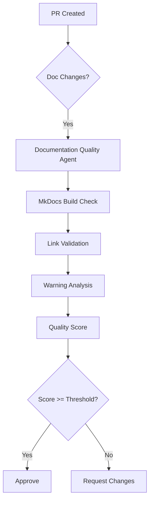

# Phase 12 Planset: Documentation Quality & Agent Enhancement

**Date**: 2026-01-17  
**Status**: IN PROGRESS (12.0, 12.1, 12.2 COMPLETE)  
**Priority**: MEDIUM-HIGH  
**Prerequisites**: Phase 11.x Complete ✅  
**Policy Compliance**: `.codex/CODEBASE_AGENCY_POLICY.md` v1.1.0

---

## Policy Compliance Declaration

This planset follows the AI Agency Policy requirements:

- ✅ **Comprehensive Issue Resolution**: Addresses ALL documentation issues
- ✅ **Planning Before Execution**: Full plan with success criteria
- ✅ **Timeline Terminology**: Uses Phases/Steps (no time-based terms)
- ✅ **Self-Review Requirements**: 5-pass review checklist included
- ✅ **AfterMath/PDA Integration**: PDA loop documented per objective
- ✅ **Follow-Up Prompt**: Template included for continuation

---

## Executive Summary

Phase 12 continues the cognitive brain enhancement with focus on documentation quality improvements and custom agent enhancements. This planset covers four key objectives derived from Phase 11.x completion.

**Core Principle**: "Leave Codebase Better Than Found" - Every task MUST improve documentation quality.

---

## Phase 12.0: MkDocs Warning Reduction (Batch 2)

**Priority**: MEDIUM  
**Status**: ✅ COMPLETE  
**Target**: Reduce 263 warnings to < 150  
**Result**: 149 warnings (43% reduction)

### PDA Loop

| Phase | Action |
|-------|--------|
| **PLAN** | Identify all broken links in DOCUMENTATION_INDEX.md and NEWCOMER_GUIDE.md |
| **DO** | Replace relative links with GitHub URLs for root-level files |
| **ASSESS** | Run `mkdocs build` and verify warning count < 150 |
| **AfterMath** | Document patterns for future link fixes |

### Pre-commit 1-2: DOCUMENTATION_INDEX.md

**Goal**: Fix 33 broken links in DOCUMENTATION_INDEX.md

**Tasks**:
- [ ] Replace `../README.md` with GitHub URL
- [ ] Replace `../CODE_OF_CONDUCT.md` with GitHub URL
- [ ] Replace `../GOVERNANCE.md` with GitHub URL
- [ ] Replace `../agents/prompts/*` references with GitHub URLs
- [ ] Replace `../workbench/INDEX.md` with GitHub URL
- [ ] Replace `../pyproject.toml` with GitHub URL
- [ ] Replace `../docker-compose.yml` with GitHub URL

**Pattern**:
```markdown
# Before
[README.md](../README.md)

# After  
[README.md](https://github.com/Aries-Serpent/_codex_/blob/main/README.md)
```

**Files to Modify**:
- `docs/DOCUMENTATION_INDEX.md` (~300 lines)

### Pre-commit 3-4: NEWCOMER_GUIDE.md

**Goal**: Fix 16 broken links in NEWCOMER_GUIDE.md

**Tasks**:
- [ ] Audit all links in NEWCOMER_GUIDE.md
- [ ] Replace root-level references with GitHub URLs
- [ ] Replace agent prompt references with GitHub URLs
- [ ] Validate all links resolve correctly

**Files to Modify**:
- `docs/NEWCOMER_GUIDE.md` (~200 lines)

### Pre-commit 5: Additional High-Impact Files

**Goal**: Fix warnings in high-impact files

**Files to Update** (by warning count):
- [ ] `status_updates/survey-*.md` (30 warnings)
- [ ] `cognitive_app.md` (10 warnings)
- [ ] `deferred/GOOGLE_DRIVE_FUTURE_SCOPE.md` (9 warnings)

### Success Criteria

- [ ] `mkdocs build` warning count < 150
- [ ] All modified links verified working
- [ ] No new warnings introduced
- [ ] Pattern documented for future fixes

### Validation

```bash
mkdocs build 2>&1 | grep "WARNING" | wc -l
# Target: < 150
```

### Review, Verify, Commit
- [ ] All links tested
- [ ] MkDocs build succeeds
- [ ] Warning count reduced
- [ ] Changes documented

---

## Phase 12.1: Custom Agent Enhancement

**Priority**: HIGH  
**Status**: NOT STARTED  
**Target**: Enhance existing agents for documentation quality

### PDA Loop

| Phase | Action |
|-------|--------|
| **PLAN** | Review existing agent capabilities, identify gaps |
| **DO** | Add documentation quality features to agents |
| **ASSESS** | Test agent enhancements with sample PRs |
| **AfterMath** | Document agent patterns for reuse |

### Pre-commit 1-2: Enhance doc-freshness-checker Agent

**Goal**: Add MkDocs validation to doc-freshness-checker

**File**: `.github/agents/doc-freshness-checker.agent.md`

**Tasks**:
- [ ] Add MkDocs build validation capability
- [ ] Add link validation capability
- [ ] Add warning count tracking
- [ ] Integrate with mkdocs_fix_plan.md

**New Capabilities**:
```yaml
capabilities:
  - mkdocs_build_check
  - link_validation
  - warning_tracking
  - fix_plan_integration
```

### Pre-commit 3-4: Enhance ci-testing-agent

**Goal**: Add documentation quality gate to CI agent

**File**: `.github/agents/ci-testing-agent.agent.md`

**Tasks**:
- [ ] Add documentation build step
- [ ] Add MkDocs warning threshold check
- [ ] Add documentation quality gate
- [ ] Document integration points

**New Steps**:
```yaml
documentation_quality:
  - run: mkdocs build
  - check: warning_count < threshold
  - report: documentation_quality_score
```

### Success Criteria

- [ ] doc-freshness-checker enhanced with 4 new capabilities
- [ ] ci-testing-agent enhanced with documentation gate
- [ ] Agent integration verified
- [ ] Documentation updated

### Review, Verify, Commit
- [ ] Agent syntax valid
- [ ] Capabilities tested
- [ ] Integration documented

---

## Phase 12.2: Production-Ready Agent Scope

**Priority**: HIGH  
**Status**: NOT STARTED  
**Target**: Define complete implementation scope for production agents

### PDA Loop

| Phase | Action |
|-------|--------|
| **PLAN** | Define agent architecture and integration points |
| **DO** | Create agent specification files with Mermaid diagrams |
| **ASSESS** | Review specs for completeness and policy compliance |
| **AfterMath** | Store agent patterns in utilities registry |

### Pre-commit 1-3: Design documentation-quality-agent

**Goal**: Create complete specification for documentation quality agent

**File to Create**: `.github/agents/documentation-quality-agent.md`

**Tasks**:
- [ ] Define agent purpose and scope
- [ ] Document capabilities (5 minimum)
- [ ] Create architecture diagram (Mermaid)
- [ ] Define integration points
- [ ] Add usage examples
- [ ] Define success metrics

**Capabilities**:
1. MkDocs build validation
2. Link validation (internal + external)
3. Warning categorization and tracking
4. Automated fix suggestions
5. Quality score calculation

**Architecture Diagram**:


### Pre-commit 4-6: Design link-validator-agent

**Goal**: Create complete specification for link validator agent

**File to Create**: `.github/agents/link-validator-agent.md`

**Tasks**:
- [ ] Define agent purpose and scope
- [ ] Document capabilities (5 minimum)
- [ ] Create architecture diagram (Mermaid)
- [ ] Define integration points
- [ ] Add usage examples
- [ ] Define success metrics

**Capabilities**:
1. Internal link validation
2. External link checking
3. Anchor validation
4. Broken link detection
5. Fix suggestions

### Success Criteria

- [ ] documentation-quality-agent.md created with full spec
- [ ] link-validator-agent.md created with full spec
- [ ] Both include Mermaid architecture diagrams
- [ ] Integration points documented
- [ ] Registered in `.codex/AI_AGENT_UTILITIES_REGISTRY.md`

### Review, Verify, Commit
- [ ] Agent specs complete
- [ ] Diagrams render correctly
- [ ] Registered in utilities registry

---

## Phase 12.3: Strict Mode Evaluation

**Priority**: LOW  
**Status**: BLOCKED (requires Phase 12.0 completion)  
**Target**: Evaluate and potentially enable MkDocs strict mode

### Prerequisites
- [ ] Warning count < 10 (currently 263)
- [ ] All nav references valid
- [ ] No blocking broken links

### PDA Loop

| Phase | Action |
|-------|--------|
| **PLAN** | Evaluate current warning state, plan validation config |
| **DO** | Configure validation overrides, test strict mode |
| **ASSESS** | Determine if strict mode can be enabled |
| **AfterMath** | Document decision and rationale |

### Pre-commit 1: Evaluate Current State

**Tasks**:
- [ ] Run `mkdocs build --strict` and capture errors
- [ ] Categorize blocking vs non-blocking warnings
- [ ] Identify minimum fixes for strict mode

**Validation Commands**:
```bash
# Current warning count
mkdocs build 2>&1 | grep "WARNING" | wc -l

# Test strict mode
mkdocs build --strict 2>&1 | head -50
```

### Pre-commit 2: Configure Validation Overrides

**File**: `mkdocs.yml`

**Tasks**:
- [ ] Add validation configuration
- [ ] Test with overrides
- [ ] Document override rationale

**Configuration**:
```yaml
validation:
  nav:
    omitted_files: info  # Downgrade from warning
    not_found: warn      # Keep as warning
  links:
    not_found: warn      # Keep as warning
    absolute_links: info # Downgrade
    unrecognized_links: info # Downgrade
```

### Pre-commit 3: Phased Enablement Plan

**Tasks**:
- [ ] Document Phase A: Enable with validation overrides
- [ ] Document Phase B: Fix remaining critical warnings
- [ ] Document Phase C: Full strict mode enablement
- [ ] Create timeline (using Phase terminology)

### Success Criteria

- [ ] Validation configuration tested
- [ ] Strict mode evaluation report created
- [ ] Phased enablement plan documented
- [ ] Decision rationale documented

### Review, Verify, Commit
- [ ] Configuration valid
- [ ] Report complete
- [ ] Plan documented

---

## Self-Review Checklist (5-Pass Mandatory)

### Pass 1: Code Quality & Correctness
- [ ] All markdown syntax valid
- [ ] No broken internal links in planset
- [ ] Mermaid diagrams render correctly
- [ ] All file paths verified

### Pass 2: Testing & Validation
- [ ] MkDocs build succeeds after changes
- [ ] Warning count reduced as expected
- [ ] Agent specifications syntactically valid
- [ ] Validation commands tested

### Pass 3: Documentation & Communication
- [ ] All tasks have clear descriptions
- [ ] Success criteria measurable
- [ ] Files to modify/create listed
- [ ] Examples provided

### Pass 4: Security & Safety
- [ ] No sensitive data in links
- [ ] GitHub URLs use correct branch
- [ ] Agent capabilities don't expose internals
- [ ] Validation outputs sanitized

### Pass 5: Integration & Dependencies
- [ ] Phase dependencies documented
- [ ] Agent integration points clear
- [ ] Backward compatibility maintained
- [ ] AfterMath/PDA loop integrated

---

## Success Metrics Summary

| Objective | Target | Metric |
|-----------|--------|--------|
| Phase 12.0 | < 150 warnings | `mkdocs build` output |
| Phase 12.1 | 2 agents enhanced | Agent file updates |
| Phase 12.2 | 2 new agent specs | New agent files |
| Phase 12.3 | Evaluation complete | Decision documented |

---

## Timeline (Phase-Based)

| Phase | Objective | Pre-commits | Status |
|-------|-----------|-------------|--------|
| Phase 12.0 | Warning Reduction | 5 | 🔜 NOT STARTED |
| Phase 12.1 | Agent Enhancement | 4 | 🔜 NOT STARTED |
| Phase 12.2 | Agent Scope | 6 | 🔜 NOT STARTED |
| Phase 12.3 | Strict Mode Eval | 3 | ⏸️ BLOCKED |

---

## Follow-Up Prompt Template

If work is incomplete, submit this as PR comment:

```markdown
@copilot Continue Phase 12 implementation following `.codex/plans/PHASE_12_DOCUMENTATION_QUALITY_PLANSET.md`.

**Current Status:**
- [x] Completed objectives
- [ ] Pending objectives

**Next Pre-commit Tasks:**
1. Specific task with acceptance criteria
2. Another task with details

**Success Criteria:**
- Measurable outcome 1
- Measurable outcome 2

**Policy Compliance (Mandatory):**
- Follow `.codex/CODEBASE_AGENCY_POLICY.md`
- Address ALL issues (pre-existing + new)
- 5+ self-review iterations
- Use Phase/Step terminology

**Full Implementation Guide:**
`.codex/plans/PHASE_12_DOCUMENTATION_QUALITY_PLANSET.md`
```

---

## Related Documents

- `docs/mkdocs_warnings_analysis.md` - Warning analysis
- `docs/mkdocs_fix_plan.md` - Fix strategy
- `COGNITIVE_BRAIN_CONTINUATION_PROMPT_PHASE_12.md` - Continuation prompt
- `COGNITIVE_BRAIN_STATUS_V11_ALL_PHASES_COMPLETE.md` - Phase 11.x status
- `.codex/CODEBASE_AGENCY_POLICY.md` - Policy requirements

---

## Utilities Registry Entry

If utilities are created during Phase 12, register in `.codex/AI_AGENT_UTILITIES_REGISTRY.md`:

```markdown
## Phase 12 Utilities

### Link Fixer Script (if created)

**Created:** 2026-01-XX (Phase 12)  
**Agent:** GitHub Copilot  
**Status:** ✅ Implemented

### Description
Script to batch-fix broken links in documentation files.

### Location
`scripts/fix_docs_links.py`

### Usage
```bash
python scripts/fix_docs_links.py --file docs/DOCUMENTATION_INDEX.md
```
```

---

**Planset Created**: 2026-01-17  
**Author**: GitHub Copilot Agent  
**Status**: READY FOR EXECUTION  
**Policy Compliance**: ✅ Verified
