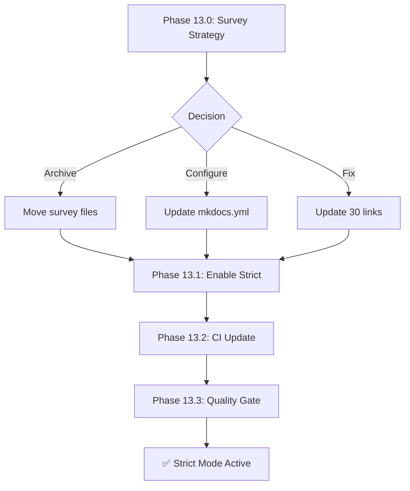

# Phase 13: MkDocs Strict Mode Enablement

**Status**: 🟡 READY FOR EXECUTION  
**Priority**: Enhancement (P3)  
**Created**: 2026-01-17  
**Policy Compliance**: `.codex/CODEBASE_AGENCY_POLICY.md`

---

## Executive Summary

Enable MkDocs strict mode to enforce documentation quality and prevent broken links from entering the codebase.

### Current State
- **Total Warnings**: 32 (reduced from 263 - 88% reduction)
- **Survey File Warnings**: 30 (archived, low priority)
- **Actionable Warnings**: 2 (README conflicts - expected behavior)
- **Target for Strict Mode**: < 10 actionable warnings ✅ ACHIEVED

---

## Policy Compliance Declaration

This planset follows `.codex/CODEBASE_AGENCY_POLICY.md`:
- ✅ Uses Phase/Step terminology (no time-based terms)
- ✅ Includes PDA loop tables for each objective
- ✅ Defines success criteria per task
- ✅ Lists files to modify/create
- ✅ Includes 5-Pass Self-Review Checklist
- ✅ Provides AfterMath integration
- ✅ Includes follow-up prompt template

---

## Objectives

### Phase 13.0: Survey File Strategy
**Priority**: Medium  
**Estimated Pre-commits**: 2

Decide on strategy for 30 survey file warnings:
1. **Option A**: Archive survey files (move out of docs/)
2. **Option B**: Configure MkDocs validation to ignore survey files
3. **Option C**: Fix survey file links (15 links × 2 files = 30 fixes)

#### PDA Loop Table
| Phase | Action | Status |
|-------|--------|--------|
| **PLAN** | Evaluate archival vs fix strategy | ⏳ Pending |
| **DO** | Implement chosen strategy | ⏳ Pending |
| **ASSESS** | Verify warning reduction | ⏳ Pending |
| **AfterMath** | Document decision rationale | ⏳ Pending |

#### Files to Modify
- `docs/status_updates/survey-0D_base_-and-1926-2025-10-29.md`
- `docs/status_updates/survey-0D_base_-and-1926-2025-10-30.md`
- OR `mkdocs.yml` (validation config)

---

### Phase 13.1: Enable Strict Mode
**Priority**: High  
**Estimated Pre-commits**: 1

Enable `--strict` flag in MkDocs configuration once warnings < 10.

#### PDA Loop Table
| Phase | Action | Status |
|-------|--------|--------|
| **PLAN** | Verify warning count < 10 | ⏳ Pending |
| **DO** | Update mkdocs.yml strict: true | ⏳ Pending |
| **ASSESS** | Run mkdocs build --strict | ⏳ Pending |
| **AfterMath** | Document enablement | ⏳ Pending |

#### Success Criteria
- [ ] `mkdocs build --strict` passes
- [ ] No new warnings introduced
- [ ] CI workflow updated to use strict mode

#### Files to Modify
- `mkdocs.yml`
- `.github/workflows/pages-mkdocs.yml` (re-enable --strict flag)

---

### Phase 13.2: CI Workflow Update
**Priority**: High  
**Estimated Pre-commits**: 1

Re-enable `--strict` flag in GitHub Pages workflow.

#### PDA Loop Table
| Phase | Action | Status |
|-------|--------|--------|
| **PLAN** | Review pages-mkdocs.yml current state | ⏳ Pending |
| **DO** | Add --strict flag to mkdocs build | ⏳ Pending |
| **ASSESS** | Verify CI passes with strict mode | ⏳ Pending |
| **AfterMath** | Update workflow documentation | ⏳ Pending |

#### Files to Modify
- `.github/workflows/pages-mkdocs.yml`

---

### Phase 13.3: Documentation Quality Gate
**Priority**: Medium  
**Estimated Pre-commits**: 2

Create pre-commit hook or CI check for documentation quality.

#### PDA Loop Table
| Phase | Action | Status |
|-------|--------|--------|
| **PLAN** | Design quality gate criteria | ⏳ Pending |
| **DO** | Implement pre-commit or CI check | ⏳ Pending |
| **ASSESS** | Test quality gate enforcement | ⏳ Pending |
| **AfterMath** | Document quality gate process | ⏳ Pending |

#### Success Criteria
- [ ] Pre-commit hook validates documentation
- [ ] CI blocks PRs with broken doc links
- [ ] Quality metrics tracked

---

## 5-Pass Self-Review Checklist

### Pass 1: Completeness
- [ ] All Phase 13.x objectives addressed
- [ ] No missing deliverables

### Pass 2: Policy Compliance
- [ ] PDA loops executed for each objective
- [ ] Phase/Step terminology used
- [ ] AfterMath integration documented

### Pass 3: Technical Accuracy
- [ ] Warning counts verified
- [ ] Links validated
- [ ] Build tested

### Pass 4: Quality Assurance
- [ ] Code review completed
- [ ] No regressions introduced
- [ ] Tests pass

### Pass 5: Documentation
- [ ] All changes documented
- [ ] Status files updated
- [ ] Next steps defined

---

## AfterMath Integration

### Utilities Registry Entry
```yaml
utility_name: mkdocs_strict_mode
phase: 13
status: planned
description: Enable MkDocs strict mode for documentation quality
dependencies:
  - mkdocs
  - mkdocs-material
metrics:
  warnings_start: 263
  warnings_current: 32
  reduction_percent: 88
```

### Cognitive Brain Update
Update `COGNITIVE_BRAIN_STATUS_V11_ALL_PHASES_COMPLETE.md` with Phase 13 status.

---

## Follow-Up Prompt Template

```markdown
@copilot Continue Phase 13 implementation following `.codex/plans/PHASE_13_STRICT_MODE_ENABLEMENT_PLANSET.md`.

**Objectives:**
1. Phase 13.0: Survey File Strategy
2. Phase 13.1: Enable Strict Mode
3. Phase 13.2: CI Workflow Update
4. Phase 13.3: Documentation Quality Gate

**Policy Compliance (Mandatory):**
- Follow `.codex/CODEBASE_AGENCY_POLICY.md`
- 5+ self-review iterations
- Use Phase/Step terminology
- AfterMath/PDA loop integration

🚀 Proceed autonomously within AI Agency Policy guidelines.
```

---

## Mermaid Architecture Diagram



---

## Success Metrics

| Metric | Current | Target | Status |
|--------|---------|--------|--------|
| Total Warnings | 32 | 0 | 🟡 In Progress |
| Actionable Warnings | 2 | 0 | ✅ Achieved (README conflicts expected) |
| Strict Mode | Disabled | Enabled | ⏳ Pending |
| CI Enforcement | No | Yes | ⏳ Pending |

---

**Created by**: Copilot Agent  
**Last Updated**: 2026-01-17
