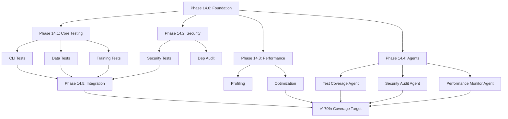

# Phase 14: Test Coverage Improvement & Repository Excellence

**Status**: 📋 READY FOR EXECUTION  
**Priority**: High (P1)  
**Created**: 2026-01-18  
**Policy Compliance**: `.codex/CODEBASE_AGENCY_POLICY.md`

---

## Executive Summary

Phase 14 focuses on improving test coverage from 27.5% to 70% target, security hardening, performance optimization, and agent ecosystem expansion. This builds on the successful completion of Phases 11-13 which achieved 100% MkDocs warning reduction and strict mode enablement.

### Current State
| Metric | Current | Target | Gap |
|--------|---------|--------|-----|
| Test Coverage | 27.5% | 70% | 42.5% |
| Untested Modules | 518 | <200 | 318 |
| High Priority Untested | 390 | 0 | 390 |
| Documentation Warnings | 0 | 0 | ✅ Achieved |
| Strict Mode | Enabled | Enabled | ✅ Achieved |

---

## Policy Compliance Declaration

This planset follows `.codex/CODEBASE_AGENCY_POLICY.md`:
- ✅ Uses Phase/Step terminology (no time-based terms)
- ✅ Includes PDA loop tables for each objective
- ✅ Defines success criteria per task
- ✅ Lists files to modify/create
- ✅ Includes 5-Pass Self-Review Checklist
- ✅ Provides AfterMath integration
- ✅ Includes follow-up prompt template

---

## Objectives Overview

| Phase | Description | Priority | Estimated Pre-commits |
|-------|-------------|----------|----------------------|
| 14.0 | Test Coverage Foundation | High | 8-10 |
| 14.1 | Core Module Testing | High | 10-15 |
| 14.2 | Security Hardening | High | 5-8 |
| 14.3 | Performance Optimization | Medium | 5-8 |
| 14.4 | Agent Ecosystem Expansion | Medium | 8-12 |
| 14.5 | Integration Testing | High | 6-10 |

---

## Phase 14.0: Test Coverage Foundation

**Priority**: High  
**Status**: 📋 READY  
**Goal**: Establish test infrastructure and identify high-priority modules

### Pre-commit 1-2: Test Infrastructure Audit

**Goal**: Analyze current test infrastructure and identify gaps

**Tasks**:
- [ ] Run `pytest --collect-only` to enumerate all existing tests
- [ ] Analyze `.codex/qa_walkthrough/coverage_analysis.json` for gaps
- [ ] Identify 390 high-priority untested modules
- [ ] Create test priority matrix based on:
  - Module size (larger = higher priority)
  - Module criticality (security, core = higher priority)
  - Dependency count (more deps = higher priority)

**Success Criteria**:
- [ ] Test inventory complete (count all existing tests)
- [ ] Priority matrix created
- [ ] Top 50 modules identified for immediate testing

**Files to Create**:
- `.codex/qa_walkthrough/test_priority_matrix.json`
- `docs/testing/TEST_COVERAGE_ROADMAP.md`

### Pre-commit 3-4: Test Template Creation

**Goal**: Create reusable test templates and fixtures

**Tasks**:
- [ ] Create base test class templates for each module type:
  - `tests/templates/test_cli_template.py`
  - `tests/templates/test_api_template.py`
  - `tests/templates/test_data_template.py`
  - `tests/templates/test_ml_template.py`
- [ ] Create shared fixtures for common patterns:
  - `tests/conftest_shared.py` (shared across all tests)
- [ ] Document test patterns in `docs/testing/TEST_PATTERNS.md`

**Success Criteria**:
- [ ] 4 test templates created
- [ ] Shared fixtures available
- [ ] Test patterns documented

### PDA Loop Table
| Phase | Action | Status |
|-------|--------|--------|
| **PLAN** | Audit current test infrastructure | 📋 Ready |
| **DO** | Create templates and fixtures | 📋 Ready |
| **ASSESS** | Verify infrastructure quality | 📋 Ready |
| **AfterMath** | Document patterns for future use | 📋 Ready |

---

## Phase 14.1: Core Module Testing

**Priority**: High  
**Status**: 📋 READY  
**Goal**: Add tests for high-priority untested modules

### Pre-commit 1-3: CLI Module Tests

**Goal**: Test CLI modules (~30 commands, highest usage)

**Target Modules** (from coverage analysis):
- `src/codex_ml/cli/main.py` (28.7 KB)
- `src/codex_ml/cli/train.py` (17.7 KB)
- `src/codex_ml/cli/metrics_cli.py` (19.7 KB)
- `src/codex_ml/cli/hydra_main.py` (14.1 KB)

**Tasks**:
- [ ] Create `tests/cli/test_main.py` (20+ tests)
- [ ] Create `tests/cli/test_train.py` (15+ tests)
- [ ] Create `tests/cli/test_metrics.py` (10+ tests)
- [ ] Create `tests/cli/test_hydra.py` (10+ tests)

**Success Criteria**:
- [ ] 55+ CLI tests created
- [ ] CLI coverage > 50%
- [ ] All tests passing

### Pre-commit 4-6: Data Module Tests

**Goal**: Test data loading and validation modules

**Target Modules**:
- `src/codex_ml/data/loader.py` (17.9 KB)
- `src/codex_ml/data/validation.py` (16.8 KB)
- `src/codex_ml/data/split.py` (7.2 KB)

**Tasks**:
- [ ] Create `tests/data/test_loader.py` (25+ tests)
- [ ] Create `tests/data/test_validation.py` (20+ tests)
- [ ] Create `tests/data/test_split.py` (15+ tests)

**Success Criteria**:
- [ ] 60+ data tests created
- [ ] Data module coverage > 60%
- [ ] All tests passing

### Pre-commit 7-10: Training Module Tests

**Goal**: Test training infrastructure

**Target Modules**:
- `src/codex_ml/training/unified_training.py` (22.0 KB)
- `src/codex_ml/training/legacy_api.py` (61.0 KB)
- `src/codex_ml/training/strategies.py` (18.1 KB)

**Tasks**:
- [ ] Create `tests/training/test_unified.py` (30+ tests)
- [ ] Create `tests/training/test_legacy.py` (20+ tests)
- [ ] Create `tests/training/test_strategies.py` (15+ tests)

**Success Criteria**:
- [ ] 65+ training tests created
- [ ] Training coverage > 40%
- [ ] All tests passing

### PDA Loop Table
| Phase | Action | Status |
|-------|--------|--------|
| **PLAN** | Identify high-priority modules | 📋 Ready |
| **DO** | Create comprehensive tests | 📋 Ready |
| **ASSESS** | Verify coverage improvement | 📋 Ready |
| **AfterMath** | Document test patterns discovered | 📋 Ready |

---

## Phase 14.2: Security Hardening

**Priority**: High  
**Status**: 📋 READY  
**Goal**: Strengthen security controls and add security tests

### Pre-commit 1-3: Security Module Tests

**Target Modules**:
- `src/codex_ml/security/cve_monitor.py` (6.4 KB)
- `src/codex_ml/security/denylist.py` (3.7 KB)
- `src/codex_ml/safety/sanitizers.py` (4.5 KB)
- `src/codex_ml/safety/moderation.py` (10.9 KB)

**Tasks**:
- [ ] Create `tests/security/test_cve_monitor.py` (15+ tests)
- [ ] Create `tests/security/test_denylist.py` (10+ tests)
- [ ] Create `tests/safety/test_sanitizers.py` (15+ tests)
- [ ] Create `tests/safety/test_moderation.py` (20+ tests)

**Success Criteria**:
- [ ] 60+ security tests created
- [ ] Security coverage > 70%
- [ ] All security tests passing

### Pre-commit 4-5: Dependency Audit

**Tasks**:
- [ ] Run `pip-audit` for Python vulnerabilities
- [ ] Update any vulnerable dependencies
- [ ] Create security advisory documentation

**Success Criteria**:
- [ ] Zero critical vulnerabilities
- [ ] All dependencies audited
- [ ] Security report generated

### PDA Loop Table
| Phase | Action | Status |
|-------|--------|--------|
| **PLAN** | Identify security gaps | 📋 Ready |
| **DO** | Add security tests and fixes | 📋 Ready |
| **ASSESS** | Verify security posture | 📋 Ready |
| **AfterMath** | Document security patterns | 📋 Ready |

---

## Phase 14.3: Performance Optimization

**Priority**: Medium  
**Status**: 📋 READY  
**Goal**: Optimize critical paths and add performance tests

### Pre-commit 1-3: Performance Profiling

**Target Areas**:
- RAG pipeline latency
- Model loading time
- Data processing throughput
- Checkpoint operations

**Tasks**:
- [ ] Create `tests/perf/test_rag_latency.py`
- [ ] Create `tests/perf/test_model_loading.py`
- [ ] Create `tests/perf/test_data_throughput.py`
- [ ] Profile and identify bottlenecks

**Success Criteria**:
- [ ] Baseline metrics established
- [ ] Performance tests added
- [ ] Bottlenecks identified

### Pre-commit 4-5: Optimization Implementation

**Tasks**:
- [ ] Implement identified optimizations
- [ ] Verify performance improvements
- [ ] Document optimization patterns

**Success Criteria**:
- [ ] 10-20% improvement in critical paths
- [ ] No regression in functionality
- [ ] Optimizations documented

### PDA Loop Table
| Phase | Action | Status |
|-------|--------|--------|
| **PLAN** | Identify performance bottlenecks | 📋 Ready |
| **DO** | Implement optimizations | 📋 Ready |
| **ASSESS** | Measure improvements | 📋 Ready |
| **AfterMath** | Document optimization patterns | 📋 Ready |

---

## Phase 14.4: Agent Ecosystem Expansion

**Priority**: Medium  
**Status**: 📋 READY  
**Goal**: Create new production-ready agents

### Pre-commit 1-4: Test Coverage Agent

**Tasks**:
- [ ] Create `.github/agents/test-coverage-agent.md` specification
- [ ] Implement coverage gap detection
- [ ] Add test generation suggestions
- [ ] Integrate with CI pipeline

**Success Criteria**:
- [ ] Agent spec complete with Mermaid diagram
- [ ] Integration tested
- [ ] Documentation complete

### Pre-commit 5-8: Security Audit Agent

**Tasks**:
- [ ] Create `.github/agents/security-audit-agent.md` specification
- [ ] Implement CVE detection
- [ ] Add dependency audit capabilities
- [ ] Create security report generation

**Success Criteria**:
- [ ] Agent spec complete
- [ ] Security scanning integrated
- [ ] Report generation working

### Pre-commit 9-12: Performance Monitor Agent

**Tasks**:
- [ ] Create `.github/agents/performance-monitor-agent.md` specification
- [ ] Implement metric collection
- [ ] Add regression detection
- [ ] Create performance dashboards

**Success Criteria**:
- [ ] Agent spec complete
- [ ] Monitoring integrated
- [ ] Dashboard created

### PDA Loop Table
| Phase | Action | Status |
|-------|--------|--------|
| **PLAN** | Design agent specifications | 📋 Ready |
| **DO** | Implement agents | 📋 Ready |
| **ASSESS** | Test agent functionality | 📋 Ready |
| **AfterMath** | Document agent patterns | 📋 Ready |

---

## Phase 14.5: Integration Testing

**Priority**: High  
**Status**: 📋 READY  
**Goal**: Add cross-module integration tests

### Pre-commit 1-4: Critical Path Testing

**Target Integrations**:
- RAG pipeline end-to-end
- Training pipeline complete flow
- CLI to API integration
- Security to data flow

**Tasks**:
- [ ] Create `tests/integration/test_rag_e2e.py`
- [ ] Create `tests/integration/test_training_e2e.py`
- [ ] Create `tests/integration/test_cli_api.py`
- [ ] Create `tests/integration/test_security_flow.py`

**Success Criteria**:
- [ ] 20+ integration tests
- [ ] Critical paths covered
- [ ] All tests passing

### Pre-commit 5-6: CI Integration

**Tasks**:
- [ ] Update CI to run integration tests
- [ ] Add coverage gates
- [ ] Configure test reports

**Success Criteria**:
- [ ] CI runs integration tests
- [ ] Coverage reported
- [ ] Quality gates enforced

### PDA Loop Table
| Phase | Action | Status |
|-------|--------|--------|
| **PLAN** | Identify critical integrations | 📋 Ready |
| **DO** | Create integration tests | 📋 Ready |
| **ASSESS** | Verify end-to-end functionality | 📋 Ready |
| **AfterMath** | Document integration patterns | 📋 Ready |

---

## 5-Pass Self-Review Checklist

### Pass 1: Completeness
- [ ] All Phase 14.x objectives defined
- [ ] No missing deliverables
- [ ] Clear success criteria

### Pass 2: Policy Compliance
- [ ] PDA loops defined for each objective
- [ ] Phase/Step terminology used
- [ ] AfterMath integration planned

### Pass 3: Technical Accuracy
- [ ] Module priorities correctly assessed
- [ ] Test counts realistic
- [ ] Coverage targets achievable

### Pass 4: Quality Assurance
- [ ] Test templates follow patterns
- [ ] No duplicate efforts
- [ ] Incremental progress measurable

### Pass 5: Documentation
- [ ] All deliverables documented
- [ ] Status files planned
- [ ] Next steps clear

---

## AfterMath Integration

### Utilities Registry Entry Template
```yaml
utility_name: test_coverage_improvement
phase: 14
status: ready
description: Improve test coverage from 27.5% to 70%
dependencies:
  - pytest
  - pytest-cov
  - hypothesis
metrics:
  coverage_start: 27.5
  coverage_target: 70
  untested_modules_start: 518
  untested_modules_target: 200
```

### Cognitive Brain Update
Update `COGNITIVE_BRAIN_STATUS_V14_TEST_COVERAGE.md` with Phase 14 progress.

---

## Follow-Up Prompt Template

```markdown
@copilot Continue Phase 14 implementation following `.codex/plans/PHASE_14_TEST_COVERAGE_IMPROVEMENT_PLANSET.md`.

**Objectives:**
1. Phase 14.0: Test Coverage Foundation (infrastructure, templates)
2. Phase 14.1: Core Module Testing (CLI, Data, Training)
3. Phase 14.2: Security Hardening (security tests, audit)
4. Phase 14.3: Performance Optimization (profiling, optimization)
5. Phase 14.4: Agent Ecosystem Expansion (3 new agents)
6. Phase 14.5: Integration Testing (e2e tests)

**Current Status:**
- Test Coverage: 27.5% → Target 70%
- Untested Modules: 518 → Target < 200
- High Priority: 390 modules

**Policy Compliance (Mandatory):**
- Follow `.codex/CODEBASE_AGENCY_POLICY.md`
- 5+ self-review iterations
- Use Phase/Step terminology
- AfterMath/PDA loop integration

🚀 Proceed autonomously within AI Agency Policy guidelines.
```

---

## Mermaid Architecture Diagram



---

## Success Metrics

| Metric | Initial | Target | Checkpoint |
|--------|---------|--------|------------|
| Test Coverage | 27.5% | 70% | 50% at Phase 14.1 |
| Untested Modules | 518 | <200 | <350 at Phase 14.1 |
| CLI Tests | ~10 | 55+ | 55+ at Phase 14.1 |
| Data Tests | ~5 | 60+ | 60+ at Phase 14.1 |
| Training Tests | ~5 | 65+ | 65+ at Phase 14.1 |
| Security Tests | ~10 | 60+ | 60+ at Phase 14.2 |
| Integration Tests | ~5 | 20+ | 20+ at Phase 14.5 |
| New Agents | 0 | 3 | 3 at Phase 14.4 |

---

## Risk Mitigation

| Risk | Impact | Mitigation |
|------|--------|------------|
| Test complexity | Medium | Use templates and fixtures |
| Coverage plateau | Medium | Focus on high-priority modules |
| CI slowdown | Medium | Parallelize tests |
| Flaky tests | High | Use retry mechanisms |
| Dependency issues | Medium | Mock external services |

---

## Dependencies

### Required Tools
- `pytest` - Test framework
- `pytest-cov` - Coverage reporting
- `pytest-xdist` - Parallel execution
- `pytest-rerunfailures` - Flaky test handling
- `hypothesis` - Property-based testing

### Pre-requisites
- ✅ MkDocs strict mode enabled (Phase 13)
- ✅ Documentation quality verified
- ✅ CI workflows functional (Phase 11)

---

**Created by**: Copilot Agent  
**Last Updated**: 2026-01-18  
**Status**: 📋 READY FOR EXECUTION
