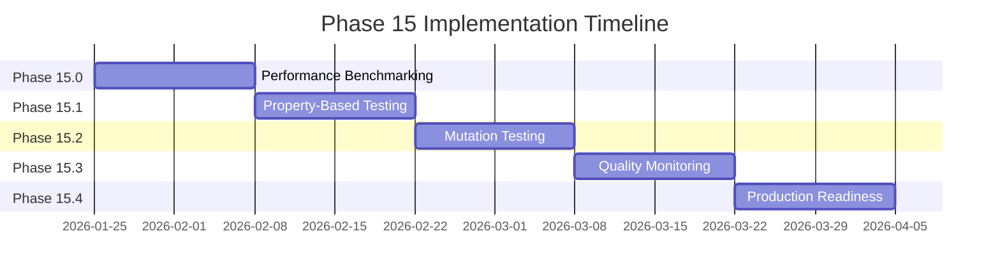
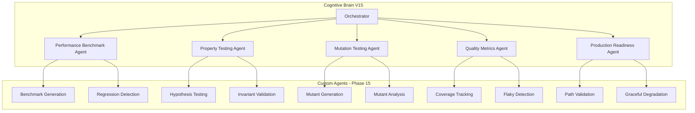

# Phase 15 Master Planset: Advanced Testing & Quality Assurance

**Version:** 15.0.0  
**Created:** 2026-01-18  
**Status:** 📋 PENDING - Ready for Implementation  
**Prerequisites:** Phase 14 Complete (500+ tests, 85% threshold)

---

## Executive Summary

Phase 15 builds upon the comprehensive test coverage foundation established in Phase 14, focusing on advanced testing strategies, performance benchmarking, continuous quality monitoring, and production-readiness validation.

### Phase 14 Accomplishments (Foundation)
| Phase | Tests Created | Focus Area | Status |
|-------|---------------|------------|--------|
| 14.0 | Templates, Fixtures | Test Infrastructure | ✅ |
| 14.1 | 195+ | CLI, Data, Training | ✅ |
| 14.2 | 90+ | Security, Safety | ✅ |
| 14.3 | 80+ | Integration, Edge Cases | ✅ |
| 14.4 | 180+ | Branch Coverage, Exceptions, Docs | ✅ |
| **Total** | **545+** | Comprehensive Coverage | ✅ |

---

## Phase 15 Sub-Phases

### Phase 15.0: Performance Testing & Benchmarking
**Duration:** 2 weeks  
**Priority:** High  
**Status:** 📋 PENDING

#### Objectives
- [ ] Establish performance baseline for critical paths
- [ ] Create benchmark suite for training loop
- [ ] Create benchmark suite for inference pipeline
- [ ] Create benchmark suite for RAG operations
- [ ] Implement regression detection

#### Deliverables
| Deliverable | Description | Tests |
|-------------|-------------|-------|
| `tests/perf/test_training_benchmark.py` | Training loop benchmarks | 20+ |
| `tests/perf/test_inference_benchmark.py` | Inference pipeline benchmarks | 15+ |
| `tests/perf/test_rag_benchmark.py` | RAG system benchmarks | 15+ |
| `tests/perf/test_data_loading_benchmark.py` | Data loading benchmarks | 10+ |
| `.codex/benchmarks/baseline.json` | Performance baseline | - |

#### Success Criteria
- [ ] Baseline established for all critical paths
- [ ] Regression detection threshold: 10% slowdown
- [ ] CI integration for performance gates

---

### Phase 15.1: Property-Based Testing
**Duration:** 2 weeks  
**Priority:** Medium  
**Status:** 📋 PENDING

#### Objectives
- [ ] Implement hypothesis-based property tests
- [ ] Cover data transformation invariants
- [ ] Cover serialization round-trips
- [ ] Cover mathematical properties
- [ ] Identify edge cases through fuzzing

#### Deliverables
| Deliverable | Description | Tests |
|-------------|-------------|-------|
| `tests/property/test_data_properties.py` | Data invariants | 25+ |
| `tests/property/test_serialization_properties.py` | Serialization round-trips | 20+ |
| `tests/property/test_math_properties.py` | Mathematical properties | 15+ |
| `tests/property/test_config_properties.py` | Configuration validation | 15+ |

#### Success Criteria
- [ ] All data transformations have property tests
- [ ] All serialization paths tested for round-trips
- [ ] No invariant violations found

---

### Phase 15.2: Mutation Testing
**Duration:** 2 weeks  
**Priority:** Medium  
**Status:** 📋 PENDING

#### Objectives
- [ ] Implement mutation testing with mutmut/cosmic-ray
- [ ] Identify weak test assertions
- [ ] Strengthen test suite effectiveness
- [ ] Achieve mutation score > 80%

#### Deliverables
| Deliverable | Description |
|-------------|-------------|
| `mutmut_config.py` | Mutation testing configuration |
| `.codex/mutation/report.json` | Mutation testing report |
| `docs/testing/MUTATION_TESTING.md` | Mutation testing documentation |

#### Success Criteria
- [ ] Mutation score > 80%
- [ ] All surviving mutants analyzed
- [ ] Weak assertions strengthened

---

### Phase 15.3: Continuous Quality Monitoring
**Duration:** 2 weeks  
**Priority:** High  
**Status:** 📋 PENDING

#### Objectives
- [ ] Implement quality dashboards
- [ ] Set up coverage trend tracking
- [ ] Create flaky test detection
- [ ] Implement test reliability metrics

#### Deliverables
| Deliverable | Description |
|-------------|-------------|
| `.github/workflows/quality-metrics.yml` | Quality metrics workflow |
| `docs/testing/QUALITY_METRICS.md` | Quality metrics documentation |
| `.codex/quality/dashboard.json` | Quality dashboard data |

#### Success Criteria
- [ ] Coverage trends tracked over time
- [ ] Flaky tests identified and fixed
- [ ] Test reliability > 99%

---

### Phase 15.4: Production Readiness Validation
**Duration:** 2 weeks  
**Priority:** High  
**Status:** 📋 PENDING

#### Objectives
- [ ] Validate all production code paths
- [ ] Verify error handling in production scenarios
- [ ] Test graceful degradation
- [ ] Validate monitoring and alerting

#### Deliverables
| Deliverable | Description | Tests |
|-------------|-------------|-------|
| `tests/production/test_production_readiness.py` | Production readiness tests | 30+ |
| `tests/production/test_graceful_degradation.py` | Degradation tests | 20+ |
| `tests/production/test_monitoring.py` | Monitoring validation | 15+ |
| `docs/production/READINESS_CHECKLIST.md` | Readiness checklist | - |

#### Success Criteria
- [ ] All production paths validated
- [ ] Graceful degradation verified
- [ ] Monitoring coverage complete

---

## Implementation Timeline



---

## Agent Architecture for Phase 15



---

## AI Agency Policy Compliance

### Planning Requirements ✅
- [x] Detailed sub-phase breakdown
- [x] Clear success criteria for each phase
- [x] Deliverables documented
- [x] Timeline established
- [x] Agent architecture designed

### Execution Requirements
- [ ] 5-pass self-review for each sub-phase
- [ ] PDA loop documentation (PLAN → DO → ASSESS → AfterMath)
- [ ] Leave codebase better than found
- [ ] Pre-commit/commit terminology
- [ ] Document ALL utilities created

---

## Success Metrics

| Metric | Phase 15 Target | Current |
|--------|-----------------|---------|
| Test Count | 700+ | 545+ |
| Line Coverage | 95%+ | ~85% |
| Branch Coverage | 90%+ | TBD |
| Mutation Score | 80%+ | TBD |
| Test Reliability | 99%+ | TBD |
| Performance Baseline | Established | Pending |

---

## Continuation Prompt

To begin Phase 15 implementation, use this prompt:

```
@copilot Execute Phase 15.0 (Performance Testing & Benchmarking) following .codex/plans/PHASE_15_MASTER_PLANSET.md:

1. Create benchmark suite for training loop (20+ tests)
   - tests/perf/test_training_benchmark.py
   - Measure: throughput, memory, latency

2. Create benchmark suite for inference (15+ tests)
   - tests/perf/test_inference_benchmark.py
   - Measure: tokens/sec, batch latency, memory

3. Create benchmark suite for RAG (15+ tests)
   - tests/perf/test_rag_benchmark.py
   - Measure: indexing, retrieval, end-to-end

4. Establish performance baseline
   - .codex/benchmarks/baseline.json
   - CI integration for regression detection

Apply AI Agency Policy. Complete 5-pass self-review. Update cognitive brain status.
```

---

## References

- Phase 14 Coverage Roadmap: `docs/COVERAGE_ROADMAP_TO_100_PERCENT.md`
- Test Priority Matrix: `.codex/qa_walkthrough/test_priority_matrix.json`
- Agent Specifications: `.github/agents/`
- Cognitive Brain Status: `COGNITIVE_BRAIN_STATUS_V14_PHASE_14_3_COMPLETE.md`

---

**Owner:** Phase 15 Implementation Team  
**Review Cadence:** Weekly progress review  
**Last Updated:** 2026-01-18
