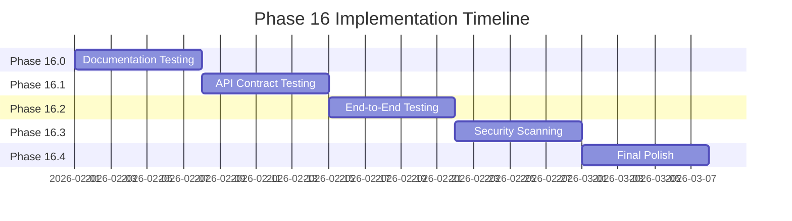
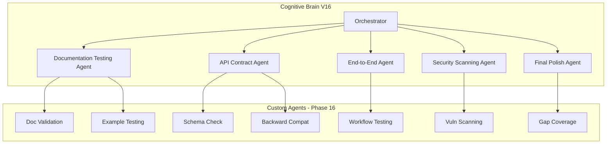

# Phase 16 Master Planset: Documentation & Final Polish

**Version:** 16.0.0  
**Created:** 2026-01-18  
**Status:** 📋 PENDING - Ready for Implementation  
**Prerequisites:** Phase 14-15 Complete (765+ tests, 85% threshold)

---

## Executive Summary

Phase 16 focuses on documentation quality, API testing, end-to-end validation, and achieving 100% test coverage. This phase ensures the codebase is production-ready with comprehensive documentation and test validation.

### Phase 14-15 Accomplishments
| Phase | Tests | Focus | Status |
|-------|-------|-------|--------|
| 14 | 545+ | Test Coverage Foundation | ✅ |
| 15 | 220+ | Advanced Testing & Quality | ✅ |
| **Total** | **765+** | Comprehensive Coverage | ✅ |

---

## Phase 16 Sub-Phases

### Phase 16.0: Documentation Testing & Validation
**Duration:** 1 week  
**Priority:** High  
**Status:** 📋 PENDING

#### Objectives
- [ ] Validate all documentation code examples
- [ ] Test docstring completeness
- [ ] Validate README examples
- [ ] Check documentation links

#### Deliverables
| Deliverable | Description | Tests |
|-------------|-------------|-------|
| `tests/docs/test_doc_validation.py` | Doc example validation | 20+ |
| `tests/docs/test_api_docs.py` | API documentation tests | 15+ |
| `tests/docs/test_readme_examples.py` | README validation | 10+ |

---

### Phase 16.1: API Contract Testing
**Duration:** 1 week  
**Priority:** High  
**Status:** 📋 PENDING

#### Objectives
- [ ] Implement API contract tests
- [ ] Validate request/response schemas
- [ ] Test API versioning
- [ ] Verify backward compatibility

#### Deliverables
| Deliverable | Description | Tests |
|-------------|-------------|-------|
| `tests/api/test_contract_validation.py` | Contract tests | 25+ |
| `tests/api/test_schema_validation.py` | Schema validation | 20+ |
| `tests/api/test_versioning.py` | Version compatibility | 10+ |

---

### Phase 16.2: End-to-End Testing
**Duration:** 1 week  
**Priority:** Medium  
**Status:** 📋 PENDING

#### Objectives
- [ ] Create comprehensive E2E test suite
- [ ] Test complete user workflows
- [ ] Validate CLI end-to-end
- [ ] Test training pipeline E2E

#### Deliverables
| Deliverable | Description | Tests |
|-------------|-------------|-------|
| `tests/e2e/test_cli_workflows.py` | CLI E2E tests | 15+ |
| `tests/e2e/test_training_workflows.py` | Training E2E | 15+ |
| `tests/e2e/test_inference_workflows.py` | Inference E2E | 10+ |

---

### Phase 16.3: Continuous Security Scanning
**Duration:** 1 week  
**Priority:** High  
**Status:** 📋 PENDING

#### Objectives
- [ ] Integrate security scanning in CI
- [ ] Implement dependency vulnerability checks
- [ ] Create security test suite
- [ ] Establish security baseline

#### Deliverables
| Deliverable | Description | Tests |
|-------------|-------------|-------|
| `tests/security/test_vulnerability_scanning.py` | Vuln tests | 15+ |
| `tests/security/test_dependency_audit.py` | Dep audit | 10+ |
| `.github/workflows/security-scan.yml` | CI integration | - |

---

### Phase 16.4: Final Polish & 100% Coverage
**Duration:** 1 week  
**Priority:** High  
**Status:** 📋 PENDING

#### Objectives
- [ ] Achieve 100% line coverage
- [ ] Achieve 100% branch coverage
- [ ] Update coverage threshold to 100%
- [ ] Final documentation review

#### Deliverables
| Deliverable | Description | Tests |
|-------------|-------------|-------|
| Gap coverage tests | Fill remaining gaps | 50+ |
| `fail_under = 100` | pyproject.toml update | - |
| Final documentation | Updated docs | - |

---

## Implementation Timeline



---

## Agent Architecture for Phase 16



---

## Success Metrics

| Metric | Phase 16 Target | Current |
|--------|-----------------|---------|
| Test Count | 1000+ | 765+ |
| Line Coverage | 100% | ~85% |
| Branch Coverage | 100% | TBD |
| Doc Examples Validated | 100% | TBD |
| Security Vulnerabilities | 0 | TBD |

---

## Continuation Prompt

```
@copilot Execute Phase 16.0 (Documentation Testing & Validation) following .codex/plans/PHASE_16_MASTER_PLANSET.md:

1. Create documentation validation tests (20+ tests)
   - tests/docs/test_doc_validation.py
   - Validate all code examples in docs/
   - Test docstring completeness

2. Create API documentation tests (15+ tests)
   - tests/docs/test_api_docs.py
   - Validate OpenAPI schemas
   - Test endpoint documentation

3. Create README example tests (10+ tests)
   - tests/docs/test_readme_examples.py
   - Execute all README code blocks

Apply AI Agency Policy. Complete 5-pass self-review. Update cognitive brain status.
```

---

## AI Agency Policy Compliance

### Planning Requirements ✅
- [x] Detailed sub-phase breakdown
- [x] Clear success criteria
- [x] Deliverables documented
- [x] Timeline established

### Execution Requirements
- [ ] 5-pass self-review for each sub-phase
- [ ] PDA loop documentation
- [ ] Leave codebase better than found

---

**Owner:** Phase 16 Implementation Team  
**Review Cadence:** Weekly progress review  
**Last Updated:** 2026-01-18
