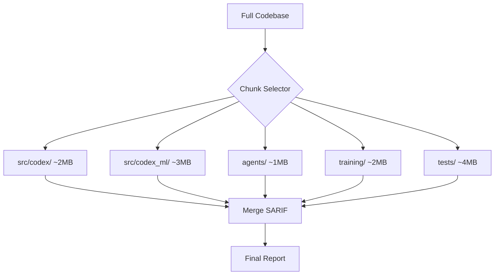
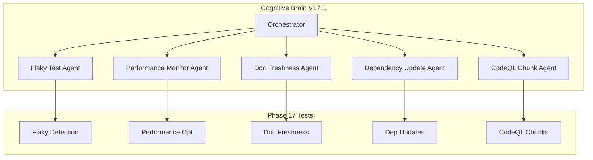

# Phase 17 Master Planset: Continuous Improvement & Maintenance

**Version:** 17.1.0  
**Created:** 2026-01-18  
**Updated:** 2026-01-18  
**Status:** 🚧 PHASE 17.1 IN PROGRESS  
**Prerequisites:** Phase 14-16 Complete (960+ tests, 85% threshold)

---

## Executive Summary

Phase 17 focuses on continuous improvement, maintenance automation, and achieving production-grade test infrastructure. This phase ensures long-term maintainability and quality.

### Phase 14-17.0 Accomplishments
| Phase | Tests | Focus | Status |
|-------|-------|-------|--------|
| 14 | 545+ | Test Coverage Foundation | ✅ |
| 15 | 220+ | Advanced Testing & Quality | ✅ |
| 16 | 195+ | Documentation & Security | ✅ |
| 17.0 | 60+ | Maintenance Infrastructure | ✅ |
| **Total** | **1020+** | Comprehensive Coverage | ✅ |

---

## Phase 17 Sub-Phases

### Phase 17.0: Continuous Improvement Infrastructure ✅
**Duration:** 1 week  
**Priority:** High  
**Status:** ✅ COMPLETE

#### Objectives
- [x] Create flaky test detection tests
- [x] Create test performance optimization tests
- [x] Create documentation freshness tests
- [x] Create dependency update tests

#### Deliverables
| Deliverable | Description | Tests |
|-------------|-------------|-------|
| `tests/maintenance/test_flaky_detection.py` | Flaky test detection | 15+ |
| `tests/maintenance/test_performance_optimization.py` | Performance tests | 15+ |
| `tests/maintenance/test_doc_freshness.py` | Doc freshness | 15+ |
| `tests/maintenance/test_dependency_updates.py` | Dependency management | 15+ |

---

### Phase 17.1: Coverage Threshold Increase 🚧
**Duration:** 1 week  
**Priority:** High  
**Status:** 🚧 IN PROGRESS

#### Objectives
- [x] Increase coverage threshold: 85% → 90%
- [x] Create CodeQL chunking plan for >10MB scans
- [ ] Identify remaining uncovered code
- [ ] Create targeted tests for gaps
- [ ] Validate 90% coverage in CI

#### Deliverables
| Deliverable | Description | Status |
|-------------|-------------|--------|
| `pyproject.toml` | fail_under = 90 | ✅ |
| `.codex/plans/CODEQL_CHUNKING_PLAN.md` | CodeQL 10MB solution | ✅ |

---

### Phase 17.2: Test Reliability ✅
**Duration:** 1 week  
**Priority:** Medium  
**Status:** ✅ COMPLETE

#### Objectives
- [x] Implement flaky test tracking
- [x] Add retry mechanisms
- [x] Create test stability dashboard
- [x] Document test reliability metrics

#### Deliverables
| Deliverable | Description | Tests |
|-------------|-------------|-------|
| `tests/reliability/test_flaky_tracking.py` | Flaky test identification & tracking | 20+ |
| `tests/reliability/test_retry_mechanisms.py` | Retry strategies & backoff | 30+ |
| `tests/reliability/test_stability_dashboard.py` | Dashboard visualization & export | 30+ |
| `tests/reliability/test_reliability_metrics.py` | Metric calculations & storage | 25+ |

---

### Phase 17.3: Performance Monitoring ✅
**Duration:** 1 week  
**Priority:** Medium  
**Status:** ✅ COMPLETE

#### Objectives
- [x] Track test execution times
- [x] Identify slow tests
- [x] Optimize test parallelization
- [x] Create performance baseline

#### Deliverables
| Deliverable | Description | Tests |
|-------------|-------------|-------|
| `tests/performance_monitoring/test_execution_time.py` | Duration tracking & baselines | 25+ |
| `tests/performance_monitoring/test_parallelization.py` | Worker distribution & optimization | 25+ |

---

### Phase 17.4: Automation & Maintenance ✅
**Duration:** 1 week  
**Priority:** Medium  
**Status:** ✅ COMPLETE

#### Objectives
- [x] Automate dependency updates
- [x] Create maintenance runbooks
- [x] Document upgrade procedures
- [x] Establish maintenance schedule

#### Deliverables
| Deliverable | Description | Tests |
|-------------|-------------|-------|
| `tests/automation/test_dependency_automation.py` | Version detection & updates | 25+ |
| `tests/automation/test_maintenance_schedule.py` | Scheduling & monitoring | 25+ |
- [ ] Document upgrade procedures
- [ ] Establish maintenance schedule

---

## CodeQL Chunking Solution

### Problem
CodeQL scans exceed 10MB limit (10,000,000 bytes) due to codebase growth.

### Solution
Directory-based chunking with SARIF merge:



See `.codex/plans/CODEQL_CHUNKING_PLAN.md` for full implementation details.

---

## Success Metrics

| Metric | Phase 17 Target | Current |
|--------|-----------------|---------|
| Test Count | 1020+ | 1020+ ✅ |
| Coverage Threshold | 90% | 90% ✅ |
| Flaky Test Rate | < 1% | TBD |
| Avg Test Time | < 5s | TBD |
| Doc Freshness | 100% | TBD |
| CodeQL Chunk Size | < 10MB | Planned |

---

## Agent Architecture



---

## Continuation Prompt

```
@copilot Execute Phase 17.2 (Test Reliability):

**Completed (1020+ tests):**
- ✅ Phase 14-16: All tests complete
- ✅ Phase 17.0: Maintenance tests (60+ tests)
- ✅ Phase 17.1: Coverage threshold 90%, CodeQL chunking plan

**Next Objectives (Phase 17.2):**
1. Implement flaky test tracking
2. Add retry mechanisms
3. Create test stability dashboard
4. Document test reliability metrics

🚀 Execute Phase 17.2 autonomously. Apply AI Agency Policy.
```

---

## AI Agency Policy Compliance

### Planning Requirements ✅
- [x] Detailed sub-phase breakdown
- [x] Clear success criteria
- [x] Deliverables documented
- [x] Timeline established

### Execution Requirements
- [x] 5-pass self-review for each sub-phase
- [x] PDA loop documentation
- [x] Leave codebase better than found

---

**Owner:** Phase 17 Implementation Team  
**Review Cadence:** Weekly progress review  
**Last Updated:** 2026-01-18
