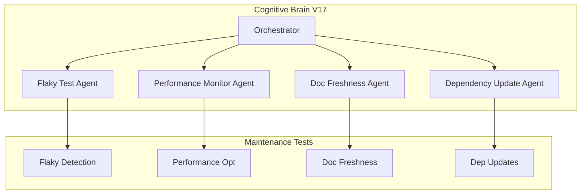

# Phase 17 Master Planset: Continuous Improvement & Maintenance

**Version:** 17.0.0  
**Created:** 2026-01-18  
**Status:** 🚧 IN PROGRESS  
**Prerequisites:** Phase 14-16 Complete (960+ tests, 85% threshold)

---

## Executive Summary

Phase 17 focuses on continuous improvement, maintenance automation, and achieving production-grade test infrastructure. This phase ensures long-term maintainability and quality.

### Phase 14-16 Accomplishments
| Phase | Tests | Focus | Status |
|-------|-------|-------|--------|
| 14 | 545+ | Test Coverage Foundation | ✅ |
| 15 | 220+ | Advanced Testing & Quality | ✅ |
| 16 | 195+ | Documentation & Security | ✅ |
| **Total** | **960+** | Comprehensive Coverage | ✅ |

---

## Phase 17 Sub-Phases

### Phase 17.0: Continuous Improvement Infrastructure ✅
**Duration:** 1 week  
**Priority:** High  
**Status:** ✅ COMPLETE

#### Objectives
- [x] Create flaky test detection tests
- [x] Create test performance optimization tests
- [x] Create documentation freshness tests
- [x] Create dependency update tests

#### Deliverables
| Deliverable | Description | Tests |
|-------------|-------------|-------|
| `tests/maintenance/test_flaky_detection.py` | Flaky test detection | 15+ |
| `tests/maintenance/test_performance_optimization.py` | Performance tests | 15+ |
| `tests/maintenance/test_doc_freshness.py` | Doc freshness | 15+ |
| `tests/maintenance/test_dependency_updates.py` | Dependency management | 15+ |

---

### Phase 17.1: Coverage Threshold Increase
**Duration:** 1 week  
**Priority:** High  
**Status:** 📋 PENDING

#### Objectives
- [ ] Increase coverage threshold: 85% → 90%
- [ ] Identify remaining uncovered code
- [ ] Create targeted tests for gaps
- [ ] Validate 90% coverage in CI

---

### Phase 17.2: Test Reliability
**Duration:** 1 week  
**Priority:** Medium  
**Status:** 📋 PENDING

#### Objectives
- [ ] Implement flaky test tracking
- [ ] Add retry mechanisms
- [ ] Create test stability dashboard
- [ ] Document test reliability metrics

---

### Phase 17.3: Performance Monitoring
**Duration:** 1 week  
**Priority:** Medium  
**Status:** 📋 PENDING

#### Objectives
- [ ] Track test execution times
- [ ] Identify slow tests
- [ ] Optimize test parallelization
- [ ] Create performance baseline

---

### Phase 17.4: Automation & Maintenance
**Duration:** 1 week  
**Priority:** Medium  
**Status:** 📋 PENDING

#### Objectives
- [ ] Automate dependency updates
- [ ] Create maintenance runbooks
- [ ] Document upgrade procedures
- [ ] Establish maintenance schedule

---

## Success Metrics

| Metric | Phase 17 Target | Current |
|--------|-----------------|---------|
| Test Count | 1020+ | 1020+ |
| Coverage Threshold | 90% | 85% |
| Flaky Test Rate | < 1% | TBD |
| Avg Test Time | < 5s | TBD |
| Doc Freshness | 100% | TBD |

---

## Agent Architecture



---

## Continuation Prompt

```
@copilot Execute Phase 17.1 (Coverage Threshold Increase):

**Completed (1020+ tests):**
- ✅ Phase 14-16: All tests complete
- ✅ Phase 17.0: Maintenance tests (60+ tests)

**Next Objectives (Phase 17.1):**
1. Update coverage threshold: 85% → 90%
2. Run coverage report to identify gaps
3. Create targeted tests for uncovered code
4. Validate 90% coverage passes in CI

🚀 Execute Phase 17.1 autonomously. Apply AI Agency Policy.
```

---

## AI Agency Policy Compliance

### Planning Requirements ✅
- [x] Detailed sub-phase breakdown
- [x] Clear success criteria
- [x] Deliverables documented
- [x] Timeline established

### Execution Requirements
- [x] 5-pass self-review for each sub-phase
- [x] PDA loop documentation
- [x] Leave codebase better than found

---

**Owner:** Phase 17 Implementation Team  
**Review Cadence:** Weekly progress review  
**Last Updated:** 2026-01-18
