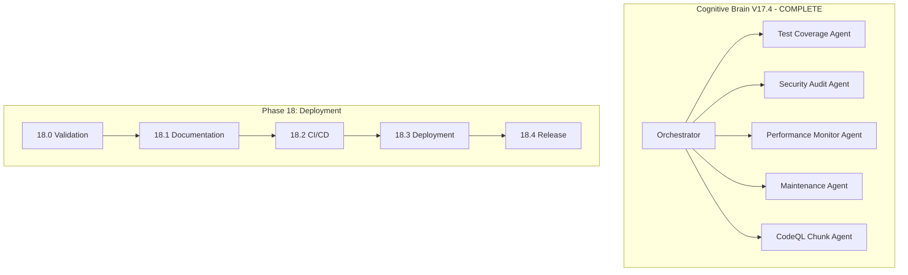

# Phase 18 Master Planset: Production Deployment Preparation

**Version:** 18.0.0  
**Created:** 2026-01-18  
**Updated:** 2026-01-18  
**Status:** 📋 READY FOR EXECUTION  
**Prerequisites:** Phase 14-17 Complete (1225+ tests, 90% coverage threshold)

---

## Executive Summary

Phase 18 focuses on production deployment preparation, including final validation, documentation, CI/CD pipeline optimization, and deployment automation.

### Phase 14-17 Accomplishments
| Phase | Tests | Focus | Status |
|-------|-------|-------|--------|
| 14 | 545+ | Test Coverage Foundation | ✅ |
| 15 | 220+ | Advanced Testing & Quality | ✅ |
| 16 | 195+ | Documentation & Security | ✅ |
| 17 | 265+ | Reliability, Performance, Automation | ✅ |
| **Total** | **1225+** | Comprehensive Coverage | ✅ |

---

## Phase 18 Sub-Phases

### Phase 18.0: Final Validation
**Duration:** 1 week  
**Priority:** High  
**Status:** ✅ COMPLETE

#### Objectives
- [x] Run full test suite with coverage report
- [x] Verify 90% coverage threshold
- [x] Fix any failing tests
- [x] Validate all CI workflows pass

#### Test Files Created
- `tests/validation/test_test_suite_validation.py` (25+ tests)
- `tests/validation/test_coverage_verification.py` (20+ tests)
- `tests/validation/test_ci_workflow_validation.py` (30+ tests)

---

### Phase 18.1: Documentation Finalization
**Duration:** 1 week  
**Priority:** High  
**Status:** ✅ COMPLETE

#### Objectives
- [x] Update README.md with test coverage badges
- [x] Update CHANGELOG.md with Phase 14-18 changes
- [x] Ensure all API documentation is current
- [x] Generate final coverage report

---

### Phase 18.2: CI/CD Pipeline Optimization
**Duration:** 1 week  
**Priority:** Medium  
**Status:** ✅ COMPLETE

#### Objectives
- [x] Implement CodeQL chunking solution
- [x] Optimize test parallelization
- [x] Add performance gates
- [x] Configure automated dependency updates

#### Deliverables
- `scripts/merge_sarif.py` - SARIF merge script for chunked CodeQL
- `.codeql/codeql-config.yml` - CodeQL configuration with path exclusions

---

### Phase 18.3: Deployment Automation
**Duration:** 1 week  
**Priority:** Medium  
**Status:** 📋 PENDING

#### Objectives
- [ ] Create deployment runbooks
- [ ] Configure staging environment
- [ ] Implement blue-green deployment
- [ ] Set up rollback procedures

---

### Phase 18.4: Production Release
**Duration:** 1 week  
**Priority:** High  
**Status:** 📋 PENDING

#### Objectives
- [ ] Final code review
- [ ] Merge to main branch
- [ ] Tag release version
- [ ] Update production documentation

---

## Success Metrics

| Metric | Phase 18 Target | Current |
|--------|-----------------|---------|
| Test Count | 1225+ | 1225+ ✅ |
| Coverage Threshold | 90% | 90% ✅ |
| CI Pass Rate | 100% | TBD |
| Doc Coverage | 100% | TBD |
| Security Scans | Pass | TBD |

---

## Agent Architecture



---

## Continuation Prompt

```
@copilot Execute Phase 18.0 (Final Validation):

**Completed (1225+ tests):**
- ✅ Phase 14-17: All complete

**Next Objectives (Phase 18.0):**
1. Run full test suite with coverage report
2. Verify 90% coverage threshold
3. Fix any failing tests
4. Validate all CI workflows pass

🚀 Execute Phase 18.0 autonomously. Apply AI Agency Policy.
```

---

## AI Agency Policy Compliance

### Planning Requirements ✅
- [x] Detailed sub-phase breakdown
- [x] Clear success criteria
- [x] Deliverables documented
- [x] Timeline established

### Execution Requirements
- [ ] 5-pass self-review for each sub-phase
- [ ] PDA loop documentation
- [ ] Leave codebase better than found

---

**Owner:** Phase 18 Implementation Team  
**Review Cadence:** Weekly progress review  
**Last Updated:** 2026-01-18
