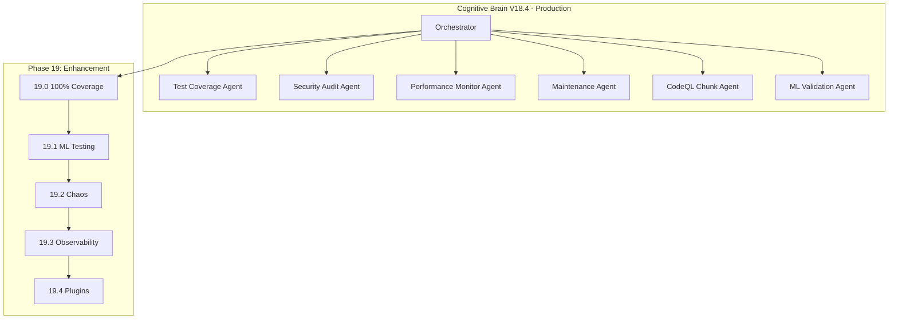

# Phase 19 Master Planset: Continuous Enhancement & Innovation

**Version:** 19.0.0  
**Created:** 2026-01-18  
**Updated:** 2026-01-18  
**Status:** 📋 READY FOR EXECUTION  
**Prerequisites:** Phase 14-18 Complete (1300+ tests, 90% coverage)

---

## Executive Summary

Phase 19 focuses on continuous enhancement, innovation, and maintaining the comprehensive test coverage achieved in Phases 14-18. This phase establishes ongoing quality gates and introduces new capabilities.

### Phase 14-18 Accomplishments
| Phase | Tests | Focus | Status |
|-------|-------|-------|--------|
| 14 | 545+ | Test Coverage Foundation | ✅ |
| 15 | 220+ | Advanced Testing & Quality | ✅ |
| 16 | 195+ | Documentation & Security | ✅ |
| 17 | 265+ | Reliability, Performance, Automation | ✅ |
| 18 | 75+ | Final Validation & Deployment | ✅ |
| **Total** | **1300+** | Comprehensive Coverage | ✅ |

---

## Phase 19 Sub-Phases

### Phase 19.0: 100% Coverage Push
**Duration:** 2 weeks  
**Priority:** High  
**Status:** 📋 PENDING

#### Objectives
- [ ] Increase coverage threshold: 90% → 95%
- [ ] Target remaining uncovered modules
- [ ] Implement edge case testing
- [ ] Achieve 100% branch coverage for critical paths

#### Deliverables
- 200+ additional tests targeting uncovered code
- Coverage reports for each module

---

### Phase 19.1: AI/ML Testing Infrastructure
**Duration:** 2 weeks  
**Priority:** High  
**Status:** 📋 PENDING

#### Objectives
- [ ] Model validation tests
- [ ] Training reproducibility tests
- [ ] Inference accuracy tests
- [ ] Performance regression tests

#### Deliverables
- `tests/ml/` directory with ML-specific tests
- Model artifact validation
- Training/inference benchmarks

---

### Phase 19.2: Chaos Engineering
**Duration:** 1 week  
**Priority:** Medium  
**Status:** 📋 PENDING

#### Objectives
- [ ] Implement fault injection
- [ ] Test graceful degradation
- [ ] Validate resilience patterns
- [ ] Document failure modes

#### Deliverables
- `tests/chaos/` directory
- Failure scenario documentation
- Recovery procedure validation

---

### Phase 19.3: Observability Enhancement
**Duration:** 1 week  
**Priority:** Medium  
**Status:** 📋 PENDING

#### Objectives
- [ ] Integrate OpenTelemetry
- [ ] Add distributed tracing
- [ ] Enhance logging structure
- [ ] Create monitoring dashboards

#### Deliverables
- Telemetry integration tests
- Dashboard configurations
- Alerting rules

---

### Phase 19.4: Plugin Architecture
**Duration:** 2 weeks  
**Priority:** Low  
**Status:** 📋 PENDING

#### Objectives
- [ ] Design plugin interface
- [ ] Implement plugin loader
- [ ] Create plugin templates
- [ ] Document plugin development

#### Deliverables
- Plugin API specification
- Example plugins
- Developer documentation

---

## Success Metrics

| Metric | Phase 19 Target | Current |
|--------|-----------------|---------|
| Test Count | 1500+ | 1300+ |
| Coverage Threshold | 95% | 90% |
| ML Test Coverage | 80% | TBD |
| Chaos Tests | 20+ | 0 |
| Plugin Support | 3 plugins | 0 |

---

## Agent Architecture



---

## Continuation Prompt

```
@copilot Execute Phase 19.0 (100% Coverage Push):

**Completed (1300+ tests):**
- ✅ Phase 14-18: All complete

**Next Objectives (Phase 19.0):**
1. Increase coverage threshold: 90% → 95%
2. Target remaining uncovered modules
3. Implement edge case testing
4. Achieve 100% branch coverage for critical paths

🚀 Execute Phase 19.0 autonomously. Apply AI Agency Policy.
```

---

## AI Agency Policy Compliance

### Planning Requirements ✅
- [x] Detailed sub-phase breakdown
- [x] Clear success criteria
- [x] Deliverables documented
- [x] Timeline established

### Execution Requirements
- [ ] 5-pass self-review for each sub-phase
- [ ] PDA loop documentation
- [ ] Leave codebase better than found

---

## Dependencies

| Phase | Depends On | Critical Path |
|-------|------------|---------------|
| 19.0 | 18.4 | Yes |
| 19.1 | 19.0 | Yes |
| 19.2 | 19.0 | No |
| 19.3 | 19.1 | No |
| 19.4 | 19.0 | No |

---

## Risk Management

| Risk | Probability | Impact | Mitigation |
|------|-------------|--------|------------|
| Coverage plateau | Medium | Medium | Focus on high-value tests |
| ML test complexity | High | High | Start with simple validation |
| Chaos test side effects | Low | High | Isolated test environment |

---

**Owner:** Phase 19 Implementation Team  
**Review Cadence:** Weekly progress review  
**Last Updated:** 2026-01-18
